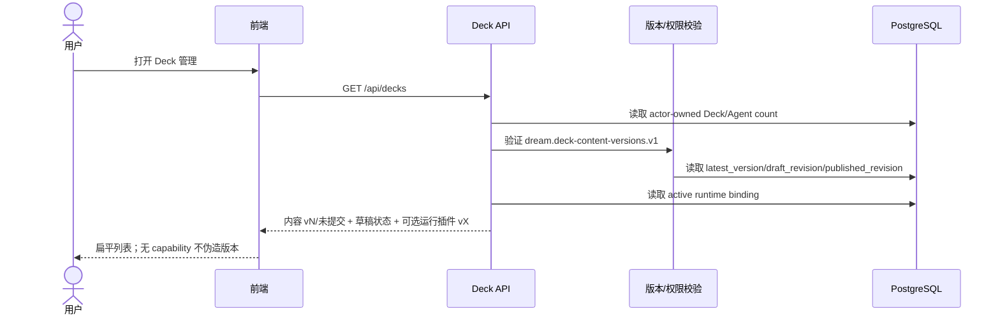
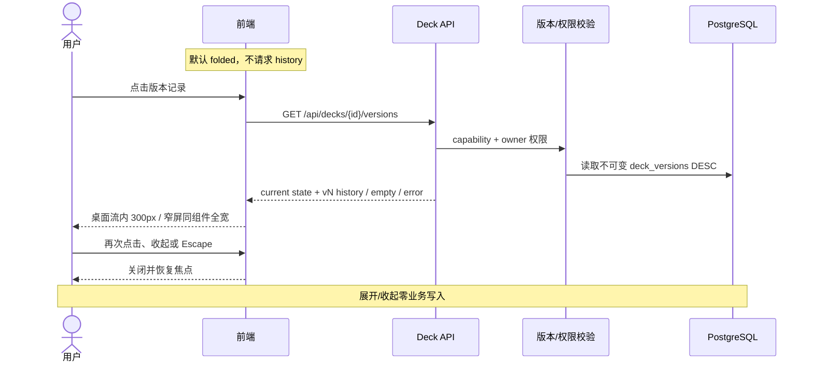
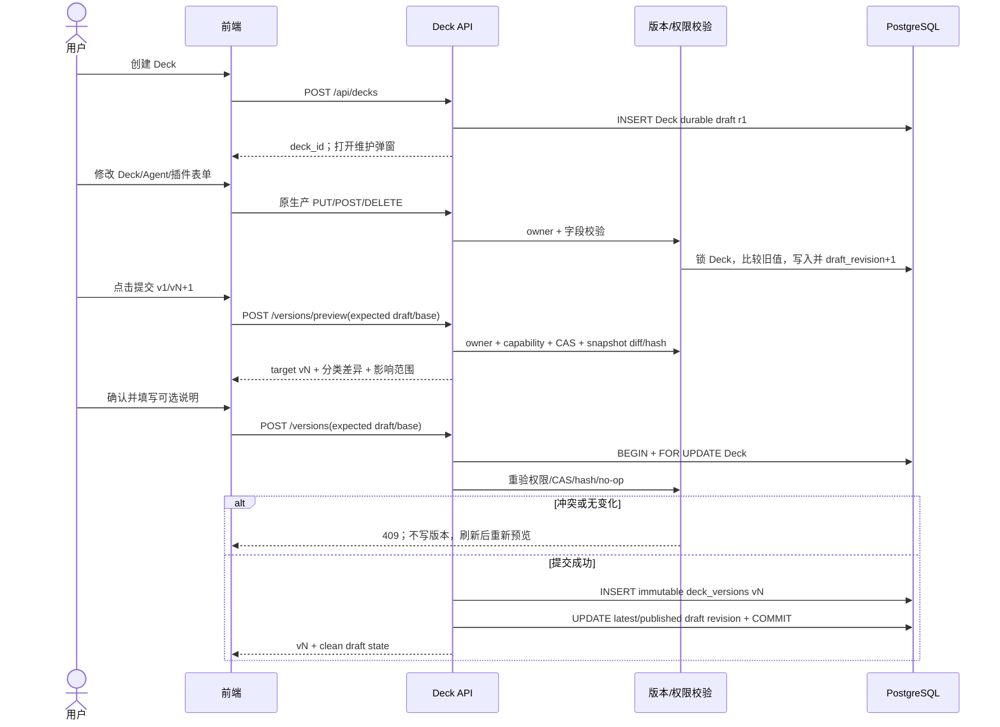
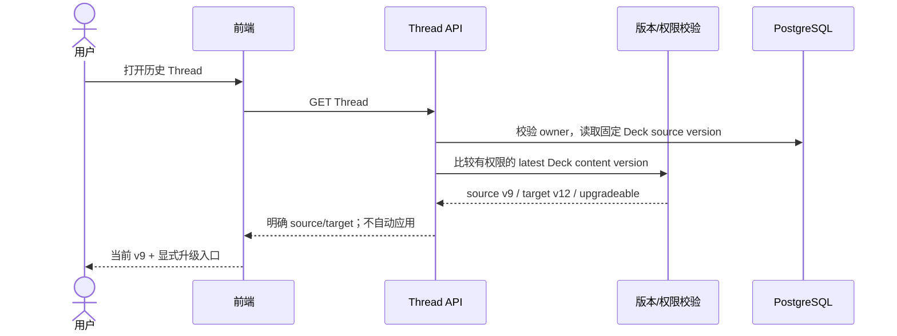
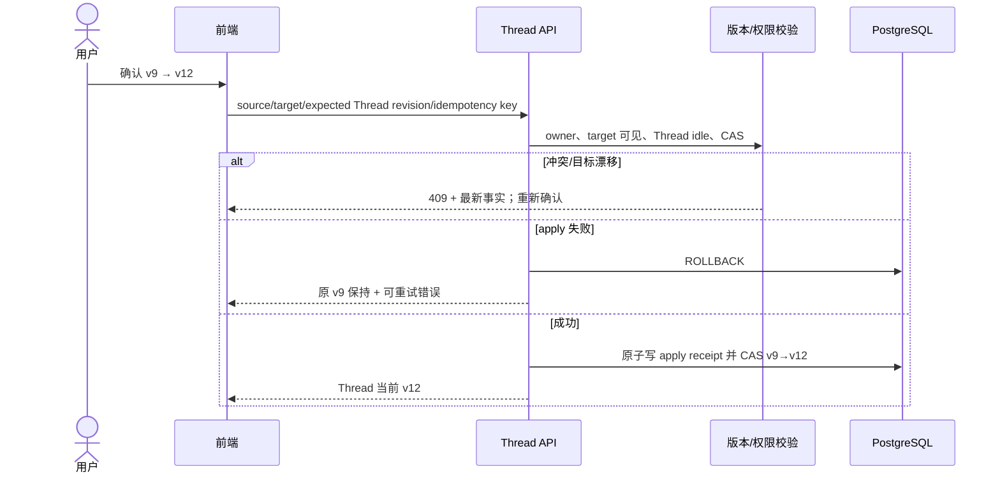
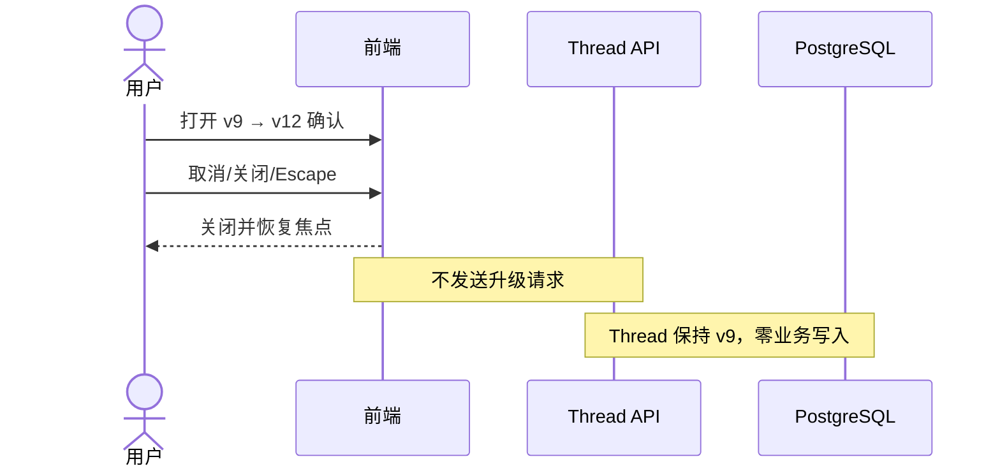
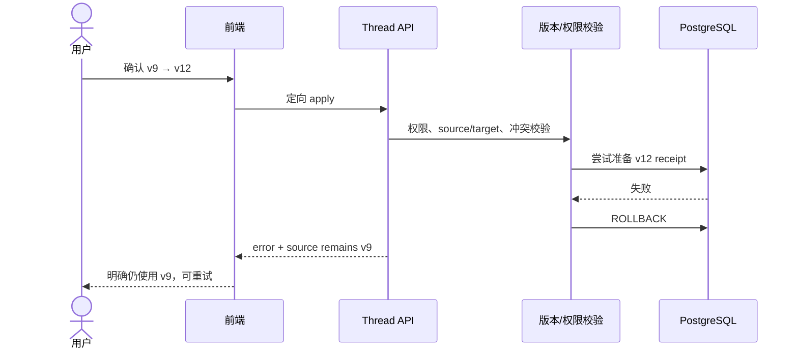
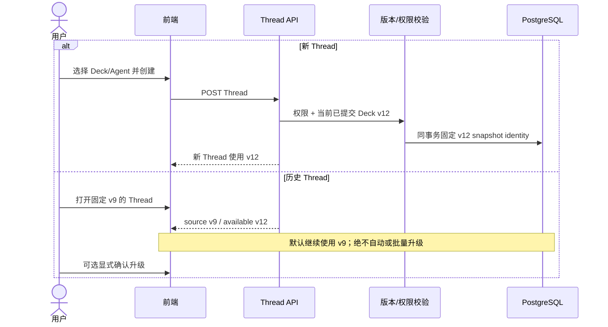
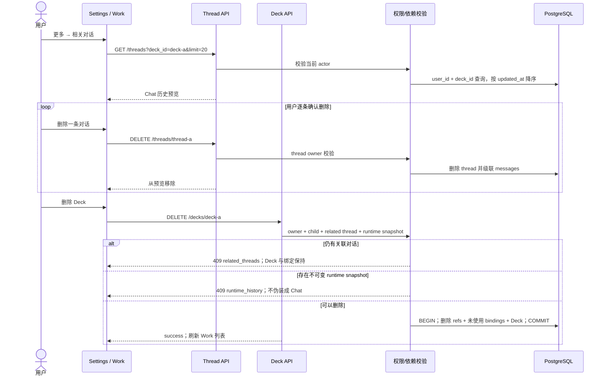

<!-- [Input] Deck CRUD, content-version capability, binding CAS, and deferred Thread apply receipt. -->
<!-- [Output] Nine end-to-end Mermaid business sequences. -->
<!-- [Pos] Deck management/version sequence source of truth. -->
<!-- [Sync] 2026-08-16: implement durable draft/explicit commit and retain explicit-only Thread upgrades. -->
<!-- [Sync] 2026-08-17: add related Chat cleanup before owned Deck deletion. -->

# Deck 业务时序

## 1. 打开管理列表并加载内容版本

## 2. 展开和收起版本记录

## 3. 创建、保存草稿并提交新版本

## 4. 历史 Thread 检测可升级版本（后续 capability）

## 5. 用户确认升级历史 Thread（后续 capability）

## 6. 用户取消升级

## 7. 升级失败并保留原版本

## 8. 新 Thread 与历史 Thread 选择版本差异

## 9. 查看并删除相关对话后删除 Deck

