<!-- [Input] Deck CRUD, content-version capability, binding CAS, and deferred Thread apply receipt. -->
<!-- [Output] Eleven end-to-end Mermaid business sequences. -->
<!-- [Pos] Deck management/version sequence source of truth. -->
<!-- [Sync] 2026-09-15: route content history/preview/commit through Admin and distinguish unknown transport results. -->
<!-- [Sync] 2026-08-16: implement durable draft/explicit commit and retain explicit-only Thread upgrades. -->
<!-- [Sync] 2026-08-17: add typed Deck-preview Demo dispatch to Chat or the dedicated Dream workbench. -->
<!-- [Sync] 2026-08-17: add same-Thread, same-Deck next-turn Agent selection with validation and CAS. -->

# Deck 业务时序

## 背景与问题

草稿/内容版本与运行binding是不同状态。Dream旧版本路由直接连接PG；公开five content操作现由Admin领域事务提供，网络结果不明需与已确认失败区分。

## 目标与边界

保持现有十一条可见业务流程。图2与图3的版本段通过Admin；创建/表单CRUD、其它Deck/Runtime图仍列为待迁移领域依赖，不将旧SQL作为迁移目标。共享FS/CLI仍Dream所有，不以metadata技术fixture代替实际验证。

## 概念与规则

current OAuth→Admin principal/owner/four exact physicalcapability→strict DTO/Service/Repository/Drizzle。preview无业务写，commit在同TX锁/CAS/hash/append/latest revision/receipt；safe409仅两revision。网络unknown保留原UUID、不重发、不把absent解释为rollback。正常/失败与影响范围见[内容版本交互](deck-detail-version-history.md)，本轮验收为actual HTTP/DTO DB-fenced技术合同。

## 1. 打开管理列表并加载内容版本

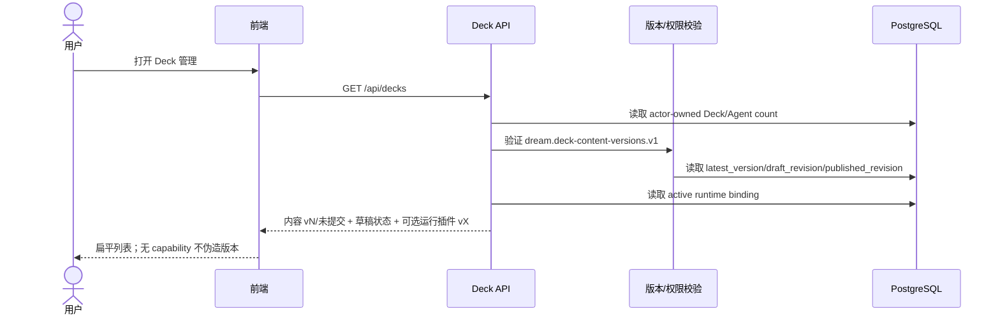

## 2. 展开和收起版本记录

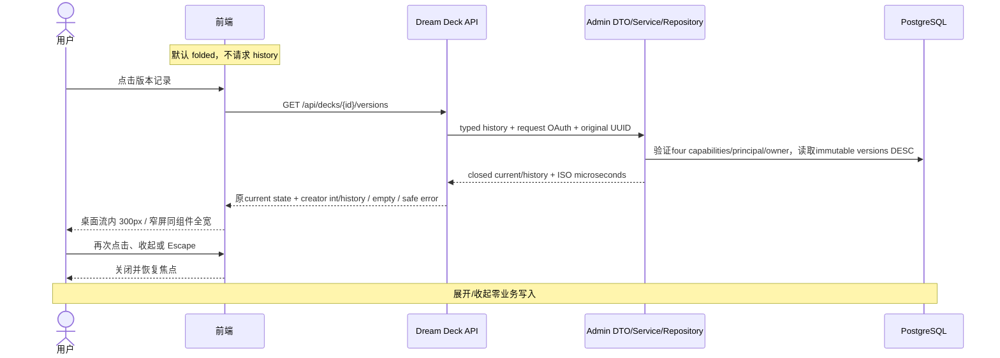

## 3. 创建、保存草稿并提交新版本

创建/表单保存保留原公开入口；该前半段的数据库消费者继续待Admin迁移。版本preview/commit段已经由Admin执行，Dream不生成snapshot/hash或执行版本事务。

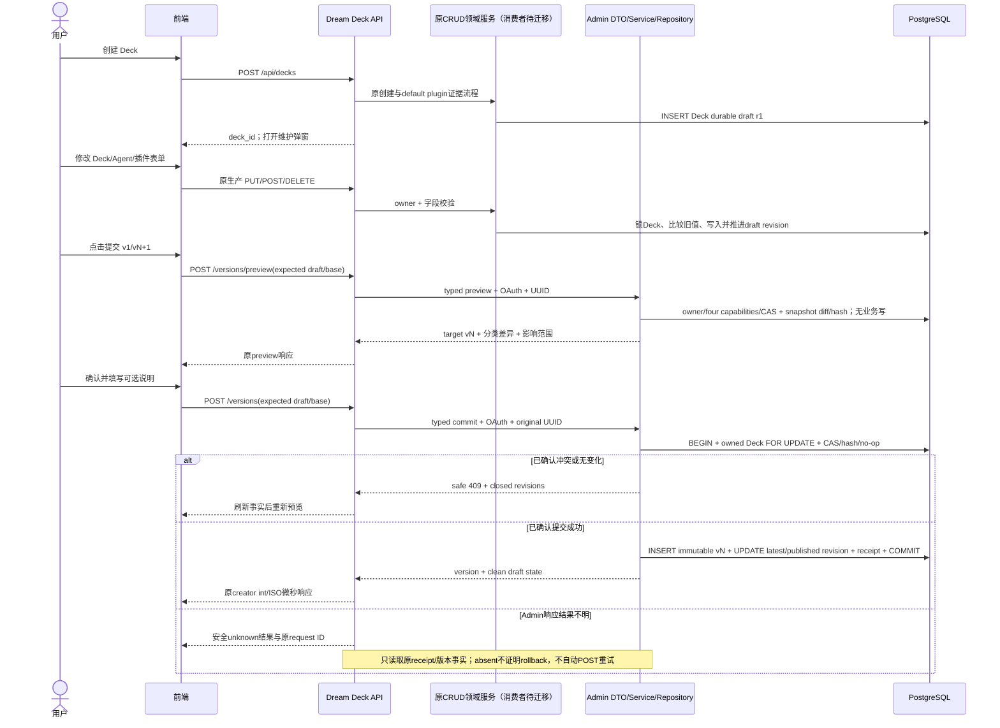

## 4. 历史 Thread 检测可升级版本（后续 capability）

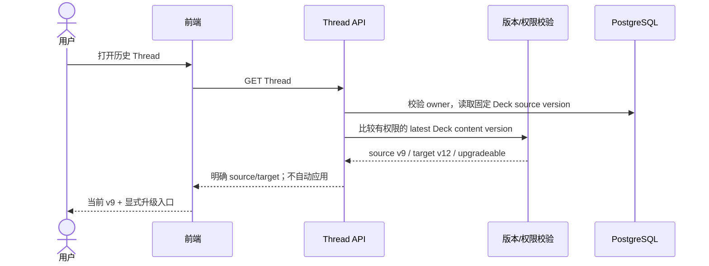

## 5. 用户确认升级历史 Thread（后续 capability）

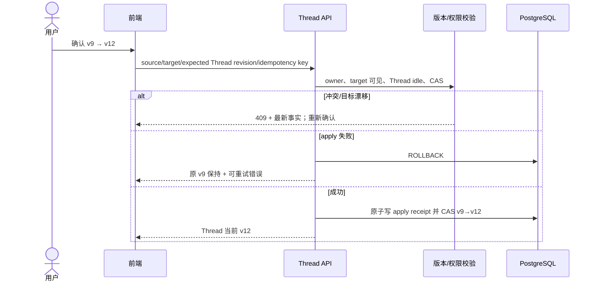

## 6. 用户取消升级

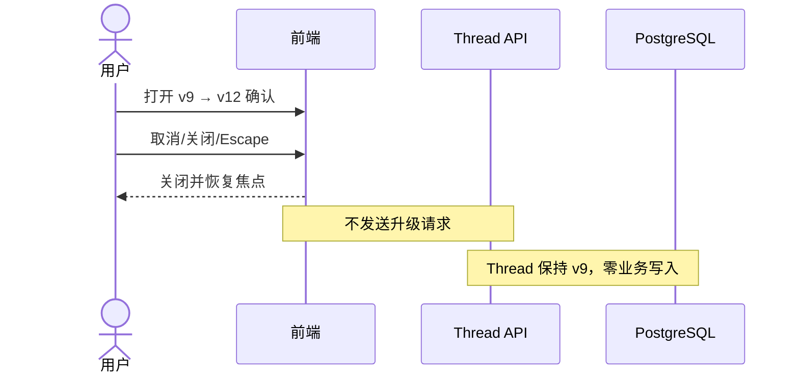

## 7. 升级失败并保留原版本

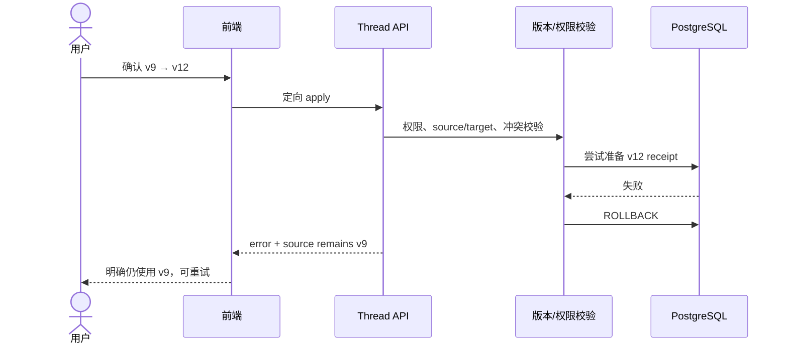

## 8. 新 Thread 与历史 Thread 选择版本差异

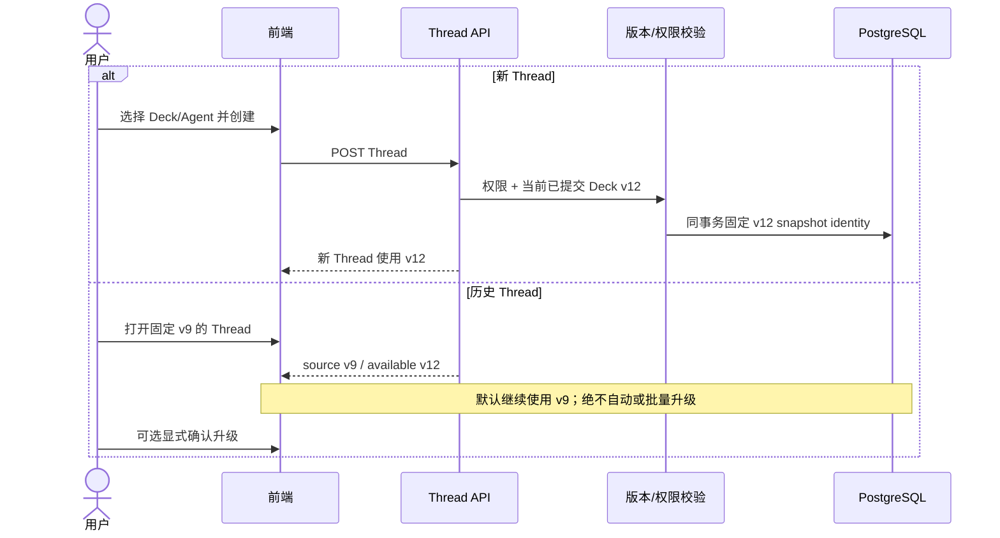

## 9. 查看并删除相关对话后删除 Deck

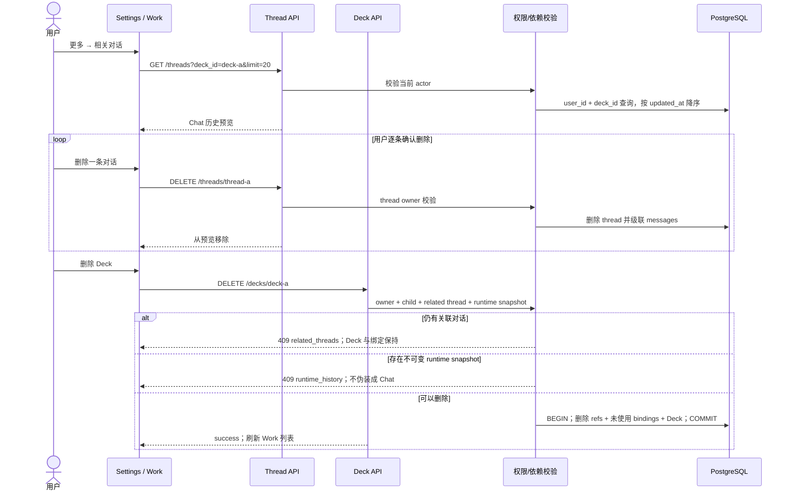

## 10. 同一 Chat 对话切换当前 Deck 内 Agent

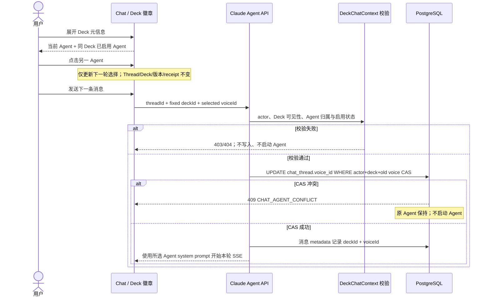

## 11. Deck 预览 Demo 按 Agent 类型分流

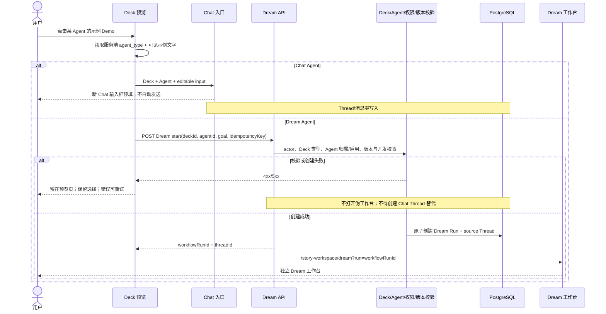
