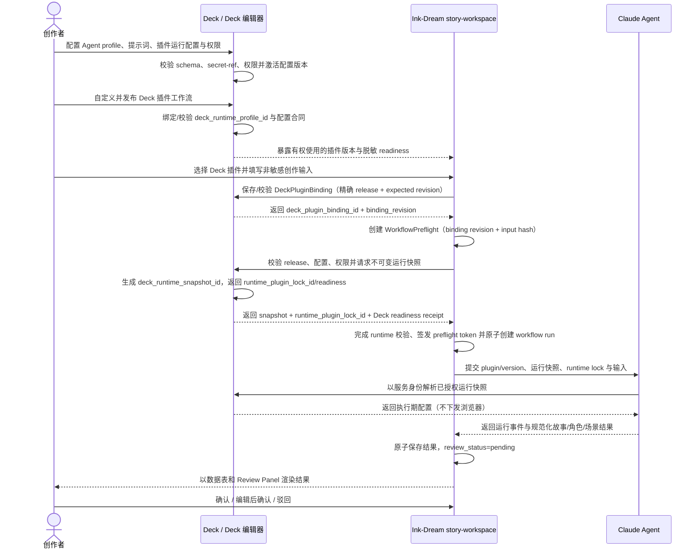
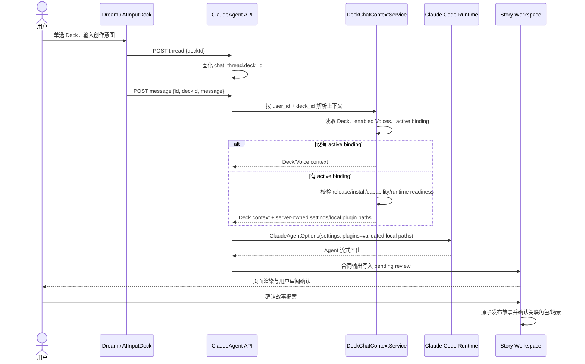

# Deck Integration Canonical 设计 Delta

> **Design ID**: `design_001_deck-integration-delta`
> **关联 Issue**: `SUO-215`、`SUO-236`、`SUO-250`
> **父级裁决**: `SUO-235`
> **基线**: `docs/design/story-workspace/story-workspace-prd.md`、`docs/design/story-workspace/story-workspace-layout-design.md`
> **最后更新**: 2026-08-02
> **设计阶段**: `design → issue → task → stage`
> **当前 canonical 真相源**: `docs/design/deck/deck-integration-delta.md`

本文是 Deck integration 的唯一当前设计真相源。设计稿已从原 story-workspace 子目录迁移至 Deck canonical 目录；原位置不保留副本或重定向，下游必须只读消费本路径。Git 历史与对应 Issue 线程保留迁移追溯。

---

## 0. 2026-08-02 架构纠偏：Claude Code 插件安装与装配（当前真相）

> 本节覆盖此前关于 `settings_json`、`local_plugin_paths`、SDK `plugins` 参数以及交互式 `/plugin install` 的错误设计。凡与本节冲突的旧口径（包括本文其余章节中"Deck Chat 动态生成 `enabledPlugins`、从 `~/.claude/plugins/cache` 直读插件路径"的描述）一律以本节为准。

### 0.1 必须遵循的技术事实（已用真实 CLI 验证，Claude Code 2.1.220）

- Claude Code Plugin 的 shell 可执行安装方式是 `claude plugin install <plugin>@<marketplace>`（argv 数组，禁止 `shell=True` / `os.system` / 字符串命令行）。交互式 `/plugin install ...` 是 slash command，不能当作 shell 命令。
- 官方文档：`https://code.claude.com/docs/zh-CN/plugins`、`/discover-plugins`、`/plugins-reference`、`/cli-reference`。
- 插件装配后，Claude Code 通过工作空间中的不可变插件包启动：`claude --plugin-dir ./<package>@<marketplace>@sha256-<digest>`。多个插件生成多个独立 `--plugin-dir` 参数（SDK `SubprocessCLITransport` 对每个 local plugin 追加一个字面 `--plugin-dir <path>` argv，已白盒验证）。
- 真实 CLI 行为（隔离 `CLAUDE_CONFIG_DIR` 实测）：
  - 市场注册表：`<config>/plugins/known_marketplaces.json`；安装注册表：`<config>/plugins/installed_plugins.json`（含 `installPath`、`version`、`gitCommitSha`）。
  - 插件缓存布局：`<config>/plugins/cache/<marketplace>/<name>/<resolved_version>/`，插件根含 `.claude-plugin/plugin.json`、`skills/`、`commands/`、`agents/`、`hooks/`、`.mcp.json`、`.lsp.json`、`monitors/`、`bin/`、`settings.json`。
  - `.in_use/`（PID 标记）与 `.git/` 为易变运行状态，不计入 digest。
  - 树内相对符号链接被保留（如 `AGENTS.md -> CLAUDE.md`）；逃逸链接拒绝。
  - CLI 在安装时向作用域 settings.json 写入 `enabledPlugins` 是 CLI 自己的行为（发生在受管配置目录内），不是 Deck 动态生成。
- 检测与验收通道：`claude plugin list --json`、`claude plugin details <name>`、`claude plugin validate <path>`、`claude --debug-file <log> --plugin-dir <dir> --init-only`（加载记录含 `Loaded N session-only plugins from --plugin-dir`、`Total plugin skills loaded: N`、SessionStart hook 成功行）。

### 0.2 正确分层

```text
Settings / Plugin Admin
    ↓  (仅提交 package spec；禁止路径/settings JSON/--plugin-dir)
公共插件安装工作空间（服务端受管，隔离 CLAUDE_CONFIG_DIR，与开发者真实 ~/.claude 隔离）
    ↓  真实 claude plugin install <package-spec>（argv 数组、cwd、超时、退出码）
公共不可变插件制品仓库（<package>@<marketplace>@sha256-<digest>，只读，digest 复验）
    ↓  Deck 只保存安装引用（deck_claude_plugin_refs）
创建 Deck Chat（thread 锁定 Deck）
    ↓  Workspace bootstrap：把插件包复制到当前 Agent workspace 并写 launch manifest
claude --plugin-dir ./.ink/plugins/<immutable-plugin-dir>（CLI launcher 边界注入）
```

| 模块 | 职责 |
|---|---|
| Plugin Admin（Settings → Claude 插件） | 输入 package spec、发起安装、查看真实 operation 进度与结果 |
| 公共插件工作空间 | 使用真实 Claude CLI 安装插件（`INK_CLAUDE_PLUGIN_RUNTIME_ROOT`：`install-workspace/`、`config/`、`artifacts/`、`operations/`） |
| 公共插件制品仓库 | 保存精确版本、manifest、组件清单、文件和 digest；写入即只读 |
| Deck | 只保存安装引用；**不拥有 Workflow、Workflow Preflight、Workflow Run**（仍属 story-workspace），不保存本地路径、`settings_json`、`local_plugin_paths`、SDK plugin options |
| Dream | 选择 Deck、发起对话、处理 Agent 产出和审阅 |
| Agent Workspace Builder（packer） | 把 Deck 插件包复制到当前 Agent workspace（`.ink/plugins/<immutable>`），写 `.ink/launch-manifest.json`；已启动 workspace 冻结，不被静默修改 |
| Claude CLI Launcher | 从 workspace launch manifest 读取（digest 复验，fail-closed），在 CLI 进程启动边界追加字面 `--plugin-dir` |
| `AgentRunOptions` | 只保存真正的单次 Agent 参数（model/max_turns/cwd/permission_mode/tool_choice/system_prompt/attachments/resume）；**不支持** `settings_json`、`claude_settings_json`、`local_plugin_paths`、`enabled_plugins`、plugin package spec、plugin installation/artifact path |

### 0.3 安装流程（真实执行，禁止伪造）

1. 校验 package spec（`<plugin>@<marketplace>[@<version>]`；拒绝 shell 元字符、路径分隔符、空白）。
2. 验证 Claude CLI 路径（`shutil.which("claude")` 或 `INK_CLAUDE_CLI_PATH` 覆盖，必须真实可执行）。
3. 记录 `claude --version`。
4. 必要时用真实 CLI 注册市场（`claude plugin marketplace add anthropics/claude-plugins-official`）。
5. 在受管 install-workspace 执行 `claude plugin install <spec>`（argv 数组、隔离 `CLAUDE_CONFIG_DIR`、300s 超时、记录 exit code、脱敏 stdout/stderr、安装前后文件快照 delta）。
6. 读取 CLI 自己的注册表，校验 `installPath` 位于受管 cache 内。
7. 读取 `.claude-plugin/plugin.json`（缺失时记录为无 manifest，版本取自注册表）。
8. 枚举官方组件（skills/commands/agents/hooks/MCP/LSP/monitors/bin/settings）。
9. 计算确定性 SHA-256（排除 `.git/`、`.in_use/`；symlink 按链接目标字符串哈希）。
10. 复制到不可变 artifact 目录 `<package>@<marketplace>@sha256-<digest>` 并只读化；staging→rename→chmod 顺序。
11. 保存数据库安装记录并标记 `ready`；**安装失败只留 operation 证据，不生成 ready 记录**。
12. 同一 package、解析版本、digest 重试返回原安装结果（幂等）；跨进程安装经 flock 去重。
13. 兼容性使用真实 SemVer 比较（`>=1.0.0 <3.0.0` 区间 vs 当前 CLI 版本），不用环境布尔值代替。
14. 平台内置插件（`plugins/ink-dream-story`，声明于服务端 `builtin_sources.py`）走同一 digest→artifact→pack 管线，真实 CLI 证据为 `claude plugin validate`。

### 0.4 Deck 配置与对话装配

- `deck_claude_plugin_refs`：`deck_id, plugin_installation_id, package_spec, resolved_version, artifact_digest, enabled, order_index`。Deck Editor 只能选择：已真实安装、状态 ready、digest 校验通过、与当前 CLI 兼容的插件。
- 发起 Deck 对话时：`DeckChatContextResolver → WorkspacePluginPacker → WorkspaceLaunchManifestWriter → ClaudeCliLauncher → Agent Session`。thread 锁定的 Deck 决定 pack 内容；已有 manifest 的 workspace 被冻结（复验+修复，不换版本）；禁用插件只影响之后创建的 workspace。
- 插件加载 receipt 写入 `.ink/plugin-pack-receipt.json` 并经 `GET /api/claude-agent/threads/{id}/plugin-load-receipt` 返回；页面展示插件包名、版本和 digest。
- 禁止客户端提交 `--plugin-dir`，禁止客户端控制 launch manifest；Deck Chat request 显式拒绝 plugin path / settings JSON / enabledPlugins / package installation path 字段。

### 0.5 迁移表（既有错误设计 → 新归属）

| 现有字段/实现 | 问题 | 新归属 | 修改方式 |
|---|---|---|---|
| `AgentRunOptions.settings_json` | 把 workspace 配置错误放入 run options | Workspace initializer | 已删除字段；settings 走 per-thread `.claude-home`（CLAUDE_CONFIG_DIR） |
| `AgentRunOptions.local_plugin_paths` | 把运行制品路径暴露给 Agent options | Workspace packer | 已删除字段 |
| `AgentRunOptions.claude_settings_json`（service 请求模型） | 请求链路携带 settings | — | 已删除字段 |
| `ClaudeAgentRunRequest.claude_plugin_paths` | 请求链路携带插件路径 | — | 已删除字段 |
| SDK `plugins=[{"type":"local",...}]`（runner 从 opts 装配） | 绕过 CLI workspace 装配 | CLI launcher | 改为 launcher 读 `.ink/launch-manifest.json`，SDK local-plugin 通道发字面 `--plugin-dir` |
| `enabledPlugins`（chat_context 动态生成） | Deck 动态生成 settings | 公共 workspace/CLI 安装 | 已移除 Deck 动态生成；enabledPlugins 只由真实 CLI 在受管配置内写入 |
| 内置本地目录直载（`resolve_builtin_source` → chat 直读 repo 目录） | 没有真实 CLI 安装证据 | 公共 artifact store | 经 install（`claude plugin validate` 证据）、digest、pack |
| `~/.claude/plugins/installed_plugins.json` 直读（admin_gateway） | 读开发者真实注册表 | 受管注册表 | 改读 `INK_CLAUDE_PLUGIN_RUNTIME_ROOT/config/plugins/installed_plugins.json` |

迁移保持旧 thread 可读：旧 `deck_plugin_bindings`/runtime lock/materialization 表与 workflow 运行路径原样保留（属 story-workspace 工作流系统，与 Deck Chat 插件加载解耦）；存量绑定内置插件的 Deck 由 `backfill_builtin_deck_plugin_refs` 幂等回填新引用。

### 0.6 真实执行测试（完成条件，BLOCKED 必须显式报告）

- **CLI 安装测试**：隔离临时目录真实执行 `claude --version` / `claude plugin marketplace add` / `claude plugin install superpowers@claude-plugins-official`，记录 executable、argv、cwd、CLI version、exit code、安装前后文件列表、registry 变化、manifest、artifact path、digest（证据：`output/plugin-verify/`）。网络/认证/CLI 不可用时报告 `BLOCKED`，fake CLI 不算成功。
- **Workspace Pack 测试**：workspace-a（配置 superpowers 的 Deck）与 workspace-b（无插件 Deck）：a 有不可变插件目录+digest 正确+manifest 正确+argv 含 `--plugin-dir`；b 无插件无参数；禁用后新 workspace 不 pack；已启动 workspace 冻结。
- **实际加载测试**：真实 CLI 从 workspace-a 以 `--plugin-dir` 启动，经 `--debug-file` 记录验证 skills（14 个）与 SessionStart hook 可见；安装成功、pack 成功、CLI 参数正确、Claude 真正识别插件是**四个独立事实**，不合并为一个伪造 ready。
- **静态契约测试**：`AgentRunOptions`/`ClaudeAgentRunRequest`/`DeckChatContext` 不含 settings/plugin path 字段；Deck Chat request 拒绝 plugin path、settings JSON、`--plugin-dir`、package installation path。
- **浏览器 E2E**：Install Plugin 输入 spec → 真实 operation ID 进度 → Deck Editor 选择 → Dream 选择 Deck → 发起 Chat → thread 锁定 Deck → 页面显示包名/版本/digest → 后端返回 load receipt → 禁用后新对话不加载。

---

## 1. 背景与目标

Story Workspace 的稳定基线把核心流程定义为“Claude Agent 产出 → 页面渲染 → 用户审阅确认”，并已引入可选择、可追溯的 Deck 工作流。父级裁决进一步统一了领域边界：**Deck 是唯一业务模块和设计元语**；Deck 编辑器、Deck 插件、Agent 运行配置均属于 Deck 内部能力，不再拆成独立产品、服务、API owner、配置域或 Agent profile 域。

本 delta 在不丢失既有安全与追溯合同的前提下，统一以下真相：

1. Deck 保存并发布版本化工作流定义，也拥有 Agent 提示词、模型/工具策略、插件运行配置、secret-ref 和权限策略。
2. Deck 在执行前生成不可变的 `deck_runtime_snapshot_id`，供本次运行审计、重试和回滚复用。
3. Ink-Dream 选择 Deck 插件并发起权威 preflight，只保存 Deck 版本、快照引用、非敏感摘要和运行结果。
4. Claude Agent 以服务身份解析已授权的 Deck 运行快照并执行，不成为配置或业务结果的真相源。
5. 执行结果进入 `story-workspace`，继续沿用数据表渲染和审阅确认流程。

### 1.1 Delta 优先级

- 本文覆盖此前将运行配置错误拆为独立领域的口径；被覆盖内容不得继续作为当前设计真相。
- 两份基线中的桌面三栏、审阅、视觉、数据表展示及范围排除继续有效。
- “Chat 直接触发 Agent”收敛为：Chat 可以表达创作意图，但执行前必须存在有效的 Deck 插件选择、Deck 运行配置和通过的 preflight。
- Deck 编辑器仍是工作流与运行配置的创作/发布界面；当前实现覆盖 Dream Chat 的 Deck 上下文解析与已物化 Claude Code Plugin 加载，完整第三方 worker/marketplace runtime 仍不在本轮范围。

### 1.2 裁决与冲突处理

- `SUO-235` 的 Deck-only 裁决优先于本文早期的双域默认假设。
- 早期设计中的配置版本、不可变快照、secret-ref、权限、preflight、审计和回滚合同全部保留，但归属 Deck，并采用本文件定义的类型、字段与错误码。
- `DEC-009`～`DEC-011` 按当前语义修订；`DEC-019` 记录统一 Deck-only 裁决，`DEC-026` 记录 canonical 真相源迁移。
- 下游只能消费本文件及两份已同步基线，不得拼接被覆盖的旧所有权模型。

## 2. 范围界定

### 2.1 范围内

- 定义 Deck、Deck 编辑器、Deck 插件、Deck 运行配置、Ink-Dream story-workspace、Claude Agent 的职责与所有权。
- 定义提示词/插件配置、插件选择、工作流绑定、preflight、Agent 执行和结果审阅的端到端合同。
- 定义最小数据引用、状态、错误、权限、不可变快照与版本固定原则。
- 识别对既有 issue/task/stage/exec 与实现的增量影响。

### 2.2 范围外

- 不改写 `docs/issue/`、`docs/task/`、`docs/stage/`、`docs/exec/` 的历史执行记录。
- 不以本地 development evidence 代替 production rollout approval。
- 不新增完整插件市场、通用依赖解析器或第三方 worker 沙箱；运行时仅消费已发布 lock 与已物化、可加载的插件证据。
- 不增加复杂故事板/时间线画布、平台视频能力或移动端适配。
- 不改变“用户审阅 Agent 产出，而非手动从零创建故事/角色/场景”的既有边界。

## 3. 方案摘要

采用“Deck 定义与配置 → Ink-Dream 选择与 preflight → Agent 执行 → story-workspace 审阅”的四层协作：

1. **Deck**通过 Deck 编辑器编辑并发布 Deck 插件，同时版本化管理 Agent 提示词、模型/工具策略、插件运行配置、secret-ref 与权限策略。
2. **Ink-Dream story-workspace**展示可用 Deck 插件、通过 Deck API 更新权威 binding，执行 WorkflowPreflight 并记录不可变运行来源。
3. **Claude Agent**按锁定的 Deck 插件、Deck 运行快照和能力交集执行。
4. **story-workspace 审阅层**把规范化结果渲染为故事/角色/场景数据表，供用户确认、编辑或驳回。

Ink-Dream 不复制 Deck 中的提示词正文、secret 或高敏配置，只持有可审计的版本化引用和脱敏摘要；Claude Agent 只在执行期按授权读取快照。

## 4. 术语、职责与所有权

### 4.1 术语表

| 概念 | 职责 | 权威拥有内容 | 消费内容 | 明确不负责 |
|---|---|---|---|---|
| `Deck` | 唯一业务模块与配置控制面 | Deck、插件发布版本、`DeckPluginBinding`、工作流定义、Agent profile、提示词、模型/工具策略、插件运行配置、secret-ref、权限、不可变运行快照、审计元数据 | 平台能力目录、用户/workspace 授权 | story-workspace 业务结果、Claude Agent 运行日志 |
| `Deck 编辑器` | Deck 内部的创作、校验、版本化、发布和运行配置界面 | Deck 草稿与发布操作 | Deck 数据与能力目录 | 独立业务模块或独立配置 owner |
| `Deck 插件` | 可选择、版本化的剧本工作流定义产物；不是执行主体 | `deck_plugin_id`、版本、工作流、输入/输出 schema、能力声明、运行配置合同 | Deck 运行配置与用户输入 | 自行保存剧本、绕过权限调用 Agent |
| `Deck 运行配置` | Deck 内部的 Agent 执行合同 | 提示词模板、模型/工具策略、插件配置、secret-ref、权限策略、启停状态、配置版本 | Deck 插件要求、用户/workspace 授权 | 独立服务、独立 API owner 或独立 Agent profile 域 |
| `Ink-Dream story-workspace` | 工作流使用入口和结果审阅工作区 | 用户选择交互、preflight/run、非敏感输入、结果及审阅状态 | Deck 目录、`deck_plugin_binding_id`/revision、release/lock、运行快照引用、Agent 事件与结果 | 保存提示词/secret、权威保存 Deck binding、编辑 Deck、执行 Agent |
| `Claude Agent` | 按工作流合同生成规范化结果 | 单次执行上下文、短期状态、执行日志/事件 | Deck 工作流、运行快照、用户输入、workspace 上下文 | 成为配置权威源、替用户选择工作流、决定审阅结果 |

### 4.2 所有权边界

- Deck 拥有“工作流是什么、有哪些能力、输入输出长什么样，以及 Agent 用什么提示词和运行策略执行”。
- Deck 权威保存“当前 Deck 为下一次运行选择哪个发布版本”的 `DeckPluginBinding`；Ink-Dream 提供选择交互，并在 preflight/run 中保存精确 binding/revision 引用。
- Ink-Dream 拥有“发起哪次运行、非敏感输入、结果如何持久化和审阅”。
- Claude Agent 拥有“这次运行如何执行及产生哪些运行事件”，但不成为 Deck 配置或剧本结果的真相源。
- Deck 运行配置是 Deck 内部子对象，不形成新的产品、服务、API namespace 或独立权限域。

### 4.3 规范命名

| 语义 | 规范名称 |
|---|---|
| Deck 内部 Agent 配置模板 | `DeckAgentProfile` |
| Deck 插件运行配置 | `DeckPluginRuntimeConfig` |
| 运行配置 profile 标识 | `deck_runtime_profile_id` |
| 单次不可变配置快照 | `deck_runtime_snapshot_id` |
| 快照合同版本 | `deck_runtime_snapshot_contract` |
| 快照能力策略 | `deck_runtime_snapshot_policy` |

跨域 API、事件、数据模型和 UI 状态必须使用上述名称。旧字段不得与新字段并存形成双写；迁移映射由下游 Task 定义，历史记录通过只读兼容读取，不改变其原始审计内容。

## 5. 端到端交互设计

### 5.1 主序列



### 5.2 详细规则

1. **配置与发布**
   - 有权限的用户在 Deck 编辑器中保存 Agent profile、提示词、模型/工具策略和插件运行配置。
   - Deck 校验必填项、schema、secret-ref 和权限；通过后激活不可变配置版本。
   - 浏览器不获得 secret 明文；提示词正文可见性由 Deck 权限控制。

2. **Deck 插件发布**
   - 创作者定义工作流名称、用途、输入、输出和能力声明。
   - 插件引用 Deck 内有效的 runtime profile/version 或兼容范围，不复制提示词正文和 secret。
   - 发布时必须校验输出可映射为 story-workspace 的故事、角色和场景数据。

3. **选择与 preflight**
   - Ink-Dream 只展示当前 workspace、当前用户有权使用且可执行的 Deck 插件版本。
   - Chat 可承载用户输入，但必须解析到同一 `deck_plugin_binding_id` 与 `binding_revision`，不能绕过 Deck 选择。
   - story-workspace 拥有 `WorkflowPreflight`；它调用 Deck 校验 release、配置、权限和 schema、生成 `deck_runtime_snapshot_id`，再校验 `runtime_plugin_lock_id` 对应的物化状态并签发短期 preflight token。

4. **执行、重试与审阅**
   - 单次 `workflow_run` 固定 `deck_plugin_id + deck_plugin_version + deck_runtime_snapshot_id + runtime_plugin_lock_id`。
   - 前端不得提交提示词正文、secret 或高敏配置；Claude Agent 使用服务身份解析快照。
   - 默认重试沿用原 release、运行快照和 runtime lock，但创建新的 run 与 Agent session。
   - 用户修改输入、改选插件、升级配置或要求刷新快照时创建新运行，不覆盖原来源。
   - 结果经合同校验后原子写入并进入 `pending_review`；不允许部分结果伪装为完整业务产出。

## 6. 最小数据与配置边界

### 6.1 最小对象

| 对象 | 权威存储 | 最小字段 | Ink-Dream 处理方式 |
|---|---|---|---|
| `DeckPluginManifestV1` | Deck | `deck_plugin_id`, `deck_plugin_version`, `display_name`, `workflow_definition_ref`, input/output schema、capabilities、status | 读取公开字段；保存版本化引用 |
| `DeckAgentProfile` | Deck | `deck_runtime_profile_id`, `prompt_version`, `prompt_template`, `model_policy`, `tool_policy`, `permission_policy`, `status`, `owner_id` | 仅保存 ID、版本、状态/摘要；不复制正文 |
| `DeckPluginRuntimeConfig` | Deck | `deck_runtime_profile_id`, `deck_plugin_id`, `config_version`, `config`, `secret_refs`, `schema_version`, `status` | 仅引用；只提交非敏感可覆盖参数 |
| `DeckRuntimeSnapshot` | Deck | `deck_runtime_snapshot_id`, profile/config versions、policy hash、secret refs、created_at | 保存受控 ID 与脱敏摘要；不复制敏感值 |
| `DeckPluginBinding` | Deck | `deck_plugin_binding_id`, `deck_id`, `workspace_id`, plugin id/version、`binding_revision`, `updated_by`, `updated_at` | 通过 Deck API 选择/读取；run 中只保存精确 ID/revision |
| `DeckRuntimePluginLock` | Deck | `runtime_plugin_lock_id`, plugin id/version、manifest hash、精确 runtime plugin versions/digests、capability bindings | preflight/run 只保存锁引用与脱敏摘要 |
| `StoryWorkflowRun` | Ink-Dream | `workflow_run_id`, `deck_plugin_binding_id`, `binding_revision`, `deck_runtime_snapshot_id`, `runtime_plugin_lock_id`, `idempotency_key`, `input_hash`, `status`, `agent_session_id`, `error_code`, timestamps | 权威保存运行来源、状态与结果关联 |
| 故事/角色/场景结果 | Ink-Dream | 既有 story-workspace 字段 + `workflow_run_id` | 沿用既有表格渲染与审阅模型 |

### 6.2 存储与消费矩阵

| 信息 | Deck | Ink-Dream | Claude Agent |
|---|---|---|---|
| Agent 提示词正文/模板 | 权威存储、版本化 | 仅引用；默认不可读正文 | 执行时按授权读取 |
| 插件运行配置 | 权威存储、校验、版本化 | 读取脱敏摘要；保存快照引用 | 执行时按授权读取 |
| secret/令牌 | 保存 secret-ref 或安全存储句柄 | 不保存、不下发浏览器 | 执行期注入，不回传结果 |
| Deck 插件 manifest | 权威存储与发布 | 读取目录并保存版本引用 | 读取执行所需声明 |
| 用户非敏感输入 | 不作为业务真相源 | 权威保存于 workflow run | 单次执行消费 |
| 插件/配置选择 | 权威保存 `DeckPluginBinding` 并提供可选版本/readiness | 提供选择交互；run 保存 binding ID/revision | 按 run 消费 |
| 生成结果与审阅状态 | 不保存 | 权威保存 | 生成后返回，不替代业务存储 |

### 6.3 版本与一致性

- 已发布的插件版本、prompt version、config version 和运行快照不得原地改写。
- 每次 run 固定版本组合并记录配置摘要 hash，保证可复现和可审计。
- Deck profile/config 停用后禁止新 run；已开始 run 默认使用已锁快照完成，安全撤销策略可以强制终止并审计。
- preflight、快照生成和 run 创建必须支持 `idempotency_key`，防止重复点击或网络重试产生重复剧本。

## 7. 状态设计

### 7.1 Deck 配置与插件状态

| 对象 | 状态 | 允许流转/含义 |
|---|---|---|
| Deck runtime profile/config | `draft` | 可编辑，不可执行 |
| Deck runtime profile/config | `active` | 已校验，可供授权插件执行 |
| Deck runtime profile/config | `disabled` | 禁止新执行，历史引用保留 |
| Deck plugin version | `draft` | 可编辑，不进入 Ink-Dream 目录 |
| Deck plugin version | `published` | 只读版本，可被授权用户选择 |
| Deck plugin version | `deprecated` | 不推荐新选择；历史 run 可追溯 |
| Deck plugin version | `disabled` | 禁止新 run |

### 7.2 Preflight readiness 与工作流运行状态

```text
WorkflowPreflight: configuring → ready / failed / expired

StoryWorkflowRun:
preflight → queued → running → output_validating → pending_review → confirmed
                │              │                 │              ├→ continuing → completed
                │              │                 │              └→ completed
                │              │                 └→ rejected（重试创建新 run）
                ├──────────────┴────────────────────────────────→ failed
                └───────────────────────────────────────────────→ cancelled
```

- `configuring` / `ready` 是 `WorkflowPreflight` readiness，不写入 `StoryWorkflowRun.status`。
- `pending_review` 是唯一 API 审阅态；`awaiting review` 仅可作为 UI 文案，不得形成第二枚举。
- `rejected`、`failed`、`cancelled` 是当前 run 的终态；重试创建新 run 并保留原记录。

## 8. 错误、恢复与可观测性

| 错误码 | 场景 | 用户可见处理 | 恢复规则 |
|---|---|---|---|
| `WORKFLOW_SELECTION_REQUIRED` | 未选择 Deck 插件 | 阻止执行并引导选择工作流 | 选择有效插件后重试 |
| `DECK_PLUGIN_UNAVAILABLE` | 插件未发布、停用、无权限或版本不存在 | 显示不可用原因，不静默升级 | 用户确认新版本后创建新 binding/run |
| `DECK_RUNTIME_CONFIG_INVALID` | Deck 运行配置缺失、未激活或过期 | 展示非敏感类别及配置入口 | Deck owner 修复并重新 preflight |
| `DECK_RUNTIME_CONFIG_INCOMPATIBLE` | 运行快照合同或 schema 不兼容 | 阻止执行并显示兼容建议 | 选择兼容 profile/release |
| `DECK_RUNTIME_CONFIG_UNAVAILABLE` | Deck 配置解析暂时不可用 | 保留输入，显示可重试错误 | 以同一 idempotency key 重试 |
| `WORKFLOW_PERMISSION_DENIED` | 用户或服务身份权限不足 | 不泄露配置细节 | 申请授权或选择其他插件 |
| `AGENT_EXECUTION_FAILED` | Claude Agent 超时、工具失败或停止 | 展示失败步骤与安全摘要 | 按同来源创建新 attempt |
| `OUTPUT_CONTRACT_INVALID` | 输出不符合 schema/contract，无法映射为业务数据 | 不写入部分业务结果 | 修复插件/配置后新 run |
| `CONFIG_VERSION_DRIFT` | 选择后执行前引用变化 | 阻止隐式切换 | 使用已固定版本或显式升级 |

最小可观测字段：`workflow_run_id`、`deck_plugin_binding_id`、`binding_revision`、plugin id/version、`deck_runtime_profile_id`、`deck_runtime_snapshot_id`、`runtime_plugin_lock_id`、`agent_session_id`、`status`、`error_code`、时间戳和配置摘要 hash。日志和 UI 不得记录提示词、secret、令牌或敏感配置值。

## 9. 权限与安全

| 动作 | 默认角色/身份 | 服务端最小校验 |
|---|---|---|
| 编辑/发布 Deck 插件 | workspace creator/editor 或 plugin owner | workspace 隔离、owner、发布权限、schema 校验 |
| 编辑/激活 Deck 运行配置 | workspace admin 或 Deck config owner | 高敏字段写权限、版本审计、secret 不回显 |
| 查看可用插件目录 | workspace member | 只返回被授权且可用的版本 |
| 选择并执行插件 | creator/editor | 对 Deck、release、runtime profile、workspace 的授权交集 |
| 读取完整运行快照 | Claude Agent 服务身份 | 短期授权、最小权限、服务端访问 |
| 审阅结果 | creator/editor/reviewer | story/workspace 审阅权限 |

安全规则：

- 所有对象必须带 `workspace_id` 或可验证的租户归属。
- 前端只获得脱敏摘要与公开 manifest；secret 与提示词运行态注入只发生在服务端。
- 有效能力为 manifest 请求、安装审批、Deck 运行快照策略、用户/workspace grant 和 runtime 支持的交集。
- 插件能力声明、manifest 或 prompt 均不能自我授权；未知能力默认拒绝。

## 10. 对下游的增量影响

> 本节只声明影响。本 Issue 不修改任何下游产物。

| 层级/产物 | 影响 | 传播要求 |
|---|---|---|
| `docs/issue/ISSUES_story-workspace.md` | 统一为 Deck 目录、运行配置、binding/run、preflight 与权限 | 下游按本设计增量修订，不保留双 owner |
| Story Workspace schema/API tasks | 增加运行快照、runtime lock、来源、错误码和幂等字段 | 采用 additive migration/兼容读取，不破坏既有故事与审阅模型 |
| Agent integration/shared types tasks | Agent 输入改为锁定的 Deck release + runtime snapshot + runtime lock | 类型源先行；前后端镜像一致 |
| Frontend/E2E tasks | 覆盖 Deck 配置 → 发布/选择 → preflight → Agent → 渲染/审阅 | 只增加组件与状态，不推翻三栏和 Review Panel |
| Stage/Exec | 需验证 Deck-only 一致性和迁移顺序 | 当前不修改；由下游负责 gate 与实现回滚 |

## 11. 验收标准

- [ ] Deck 是唯一业务模块和设计元语；不存在独立配置模块、服务、API owner 或 Agent profile 域。
- [ ] Deck 编辑器、Deck 插件、Deck 运行配置、story-workspace 与 Claude Agent 的职责无重叠歧义。
- [ ] 配置/提示词/secret-ref/权限 → 发布/选择 → preflight → Agent → 渲染/审阅的端到端流程完整。
- [ ] Ink-Dream 不存储提示词、secret 或完整高敏配置，只保存 Deck 版本、运行快照引用和脱敏摘要。
- [ ] 每次运行固定 release、Deck 运行快照和 runtime lock，支持幂等、审计、失败重试和回滚追溯。
- [ ] 类型名、字段名、错误码、participant、文件引用和决策项在相关设计稿中一致。
- [ ] 下游影响仅通过设计稿传播；本 Issue 不修改 issue/task/stage/exec 或代码。

## 12. 风险与依赖

| 风险/依赖 | 影响 | 缓解/准入条件 |
|---|---|---|
| Deck catalog、运行配置与 secret provider 的物理实现边界未冻结 | API 可能重复或循环依赖 | 对外保持单一 Deck owner/API namespace；内部拆分不外泄为新业务元语 |
| Deck Plugin manifest/schema 未稳定 | 插件无法可靠映射到结果 | 类型合同先行，发布时校验输入/输出及 runtime snapshot contract |
| 既有实现按 Chat 直触发推进 | 可能绕过工作流选择与 preflight | 使用兼容适配与 additive migration；完成迁移前保留显式 gate |
| 配置版本漂移 | 同一输入不可复现 | run 固定不可变快照与 hash；禁止静默升级 |
| secret 或提示词复制到 story-workspace | 安全与所有权越界 | 仅保存引用/脱敏状态，执行期服务端解析 |
| 紧急安全撤销策略未冻结 | 已运行任务可能继续使用旧快照 | 安全 owner 定义强制终止等级、审计与恢复动作 |

关键依赖：Deck 插件目录/发布合同、Deck 运行配置与 secret provider、Claude Agent 服务身份与 runtime load receipt、story-workspace 运行/结果 API、身份与 capability grant。

## 13. 关键决策记录

| 决策 ID | 日期 | 决策 | 影响 |
|---|---|---|---|
| `DEC-009`（修订） | 2026-08-01 | Deck 是唯一业务模块；Deck Editor、Deck Plugin、Deck 运行配置与 `DeckPluginBinding` 是 Deck 内部职责，story-workspace 消费公开合同并独立保存运行/结果 | 取消双域/双 owner 假设 |
| `DEC-010`（修订） | 2026-08-01 | 单次运行锁定 Deck 插件版本、`deck_runtime_snapshot_id` 与 `runtime_plugin_lock_id` | 切换只影响新运行，历史来源不可改写 |
| `DEC-011`（修订） | 2026-08-01 | Deck release、运行配置、权限或 runtime preflight 任一失败时禁止启动 Claude Agent | 统一失败边界与恢复动作 |
| `DEC-012`（修订） | 2026-08-01 | Deck 是提示词、插件运行配置、secret-ref、权限策略和不可变运行快照的权威源 | Ink-Dream 只保存引用与脱敏摘要 |
| `DEC-013`（修订） | 2026-08-01 | 选择 Deck 插件即更新 Deck 权威 `DeckPluginBinding`；每次执行在 run 中冻结 `deck_plugin_binding_id + binding_revision` | 消除 Deck/Ink-Dream 双 binding owner，并将选择与运行显式关联 |
| `DEC-014` | 2026-08-01 | 重试默认沿用固定来源并新建 run；改选、升级或刷新快照属于新运行 | 保证复现与审计 |
| `DEC-015` | 2026-08-01 | 既有下游产物只接受后续增量传播，不在本 design delta 中改写 | 保护流水线边界 |
| `DEC-016` | 2026-08-01 | 保持数据表、无平台视频、桌面端、无完整第三方插件运行时 | 控制范围 |
| `DEC-019` | 2026-08-01 | 按 `SUO-235` 裁决统一 Deck 术语，并将既有配置/快照/权限/审计合同归入 Deck | 本文件、PRD、layout 与 Deck Plugin 主设计同步修订 |
| `DEC-026` | 2026-08-01 | `docs/design/deck/deck-integration-delta.md` 是 Deck integration 的唯一当前 canonical 真相源；原 story-workspace 子目录不再承载该设计 | 下游引用统一到 Deck 路径，禁止并行主文档与静默回退 |

## 14. 增量变更说明

- **Delta 1 / SUO-215（2026-08-01）**：首次补充工作流选择、Agent 配置、binding/run、权限、错误和下游影响。
- **Delta 2 / SUO-236（2026-08-01）**：执行 `SUO-235` 的 Deck-only 裁决；重写所有权、时序、数据模型、状态、错误码、权限、依赖和决策记录。
- **Delta 3 / SUO-250（2026-08-01）**：将本文迁移至 Deck canonical 目录，并同步标题、Design ID、当前真相源声明与 design 内引用；原位置删除，不保留并行副本。
- 运行配置、不可变快照、secret-ref、preflight、权限交集、审计、重试和回滚合同均保留，统一改为 Deck ownership 和规范字段。
- canonical 文件与 Design ID 统一为 `docs/design/deck/deck-integration-delta.md` / `design_001_deck-integration-delta`；所有下游只能消费这一当前真相源。
- 本次迁移只改变设计稿定位和引用，不改变 Deck-only 的运行配置、不可变快照、secret-ref、权限、preflight、审计或回滚语义，也不引入独立业务域。

## 15. 阻塞或澄清说明

当前设计无阻塞。以下实现级未决项不改变 Deck-only 边界：

| 未决项 | 默认假设 | 风险 | Owner / action |
|---|---|---|---|
| **[CLARIFICATION_NEEDED] Deck catalog、运行配置与 secret provider 的内部部署拆分** | 对外保持单一 Deck API/owner，内部可按安全边界拆组件 | 内部拓扑泄漏为重复业务域 | Deck/平台 owner 冻结内部路由与鉴权，不新增业务元语 |
| **[CLARIFICATION_NEEDED] 插件选择主入口** | story-workspace 提供选择器并写入 Deck 权威 binding；Chat 复用同一 `deck_plugin_binding_id` | 旧路径绕过选择或产生双 binding | 产品 owner 确认主入口；后端强制同一 gate |
| **[CLARIFICATION_NEEDED] 自定义插件发布审核** | 编辑与发布权限分离，能力扩张需审批 | 未审核插件获得高敏能力 | 安全/平台 owner 定义白名单、审批和撤销策略 |
| **[CLARIFICATION_NEEDED] 安全撤销是否强制终止活动 run** | 普通禁用不终止；安全撤销可强制终止并审计 | 可用性与安全策略冲突 | 安全 owner 定义撤销等级和终止动作 |

## 16. Dream Chat 交互与实现收口（2026-08-02）

### 16.1 交互稿

Dream 的 canonical 地址是 `/story-workspace/dream`，主区默认直接展示 Chat，不再使用 Dashboard 占位页。全局导航增加 `Dream` 入口；进入 Dream 后仍沿用 Story Workspace 左侧业务导航，故事、角色、场景及审阅状态继续使用原有页面。

输入区控制栏增加一个紧凑的 `Deck` 单选器：

1. 仅展示当前用户拥有且 `enabled=true` 的 Deck。
2. `不使用 Deck` 是合法选项，保持普通 Chat 能力。
3. 用户在 Dream 首页选择 Deck 并首次发送时，前端把唯一的 `deckId` 与新建 thread 一起提交。
4. thread 创建后选择器变为只读来源标签；同一 thread 不允许切换 Deck，避免上下文与插件来源漂移。
5. 恢复历史 thread 时以后端持久化的 `chat_thread.deck_id` 为准，而不是浏览器缓存。
6. Deck 加载失败不阻断无 Deck Chat，但必须显式显示错误状态；Deck 已禁用、无权访问或绑定插件不可运行时，由后端返回结构化错误并阻止 Agent 启动。



### 16.2 服务端加载规则

- 客户端只能提交 `deckId`，不能提交插件 ID、版本、settings JSON、能力集合或 Deck prompt。
- 服务端按 `owner_id` 校验 Deck，并读取 enabled Voice prompt；有绑定时，再读取精确 `deck_plugin_id + version + binding_revision`。
- 可选择性由 `SelectionValidationService` 统一裁决，运行兼容事实由 `services/deck/runtime_context.py` 从 release、installation、runtime lock 和 materialization 表解析。
- compatibility 默认拒绝。只有显式设置 `INK_ENVIRONMENT=development|dev|test|testing` 时才采用本地兼容值；生产或未声明环境均为 fail-closed，必须通过 `INK_DECK_HOST_COMPATIBLE`、`INK_CLAUDE_AGENT_CONTRACT_COMPATIBLE`、`INK_STORY_SCHEMA_COMPATIBLE` 与 `INK_DECK_RUNTIME_CONFIG_COMPATIBLE` 提供真实兼容信号。
- 只有 `materialization_status=materialized` 且 `activation_status in (loadable, loaded)`、版本与 artifact digest 精确匹配的插件，才会加载。Claude 管理的 registry 插件进入服务端生成的 `enabledPlugins`；仓库内置或服务端缓存的本地插件通过 SDK `plugins=[{type: "local", path}]` 加载，客户端不能提交路径。
- 本地路径必须重新计算目录 digest；内置插件必须精确位于仓库受控目录，其他本地插件必须位于服务端 Claude cache 根目录。路径越界、制品变化或摘要不一致全部 fail closed。
- active binding 任一 gate 失败时返回 409，不允许静默忽略插件后退化为普通 Chat。
- 无 active binding 时只加载 Deck/Voice 上下文；这允许 Deck 作为提示词集合使用，但不会伪造插件来源。

### 16.3 Paperclip 架构取舍

本实现借鉴 Paperclip 的分层边界，而不是复制其数据模型：

| Paperclip 方案 | 本项目对应 | 取舍 |
|---|---|---|
| `PluginManager` / `PluginSettings` 管理安装与启停 | Settings `PluginAdminPage` + Deck Editor binding | 管理面与业务选择面分离 |
| loader/lifecycle manager 管理插件加载状态 | runtime materialization + reconcile/load receipt | readiness 由服务端证据决定，不信任 UI 状态 |
| worker manager 与 tool registry 只向活跃 worker 路由 | Claude Code `enabledPlugins` 只包含精确可加载项 | 当前不复制通用 worker RPC；由 Claude Code Plugin runtime 执行 |
| capability validator 在 host bridge 再校验 | manifest/installation/policy/grant/runtime 五方能力交集 | 声明不等于授权，未知能力默认拒绝 |
| 插件停用时撤销注册和执行入口 | active binding 在运行前重新校验 | 不依赖历史 UI 缓存，下一轮执行即时 fail closed |

### 16.4 代码落点

| 层 | 代码 | 责任 |
|---|---|---|
| Dream composition | `frontend/src/App.tsx`、`frontend/src/router/story-workspace.tsx` | Dream 导航、canonical 页面与 Chat 组合 |
| Deck interaction | `frontend/src/components/deck/DeckChatSelector.tsx` | 首页单选及 thread 锁定来源展示 |
| Chat contract | `frontend/src/components/chat/ChatView.tsx`、`ChatPanel.tsx`、`frontend/src/lib/chat-schema.ts` | `deckId` 创建/发送/恢复链路 |
| Persistence/API | `backend/database.py`、`backend/routers/claude_agent.py` | `chat_thread.deck_id`、不可切换与权属校验 |
| Plugin control plane | `backend/services/deck/admin_gateway.py`、`backend/routers/deck_plugins.py`、`frontend/src/components/plugin-admin/PluginAdminPage.tsx` | 安装、启停、升级、回滚、卸载、审批、readiness 与来源约束 |
| Built-in runtime plugin | `backend/services/deck/builtin_plugin.py`、`plugins/ink-dream-story/` | 发布并校验内置故事工作流插件与不可变 runtime lock |
| Deck domain | `backend/services/deck/chat_context.py`、`runtime_context.py`、`story_workflow_gateway.py` | Deck/Voice/Binding 解析、preflight/run、不可变快照、readiness 与 SDK 设置生成 |
| Claude runtime | `backend/claude_agent/service.py`、`backend/libs/claude_agent_kit/types.py`、`agent_runner.py` | 把服务端 settings 与已验证本地 plugin path 传入 Claude Agent SDK |
| Review persistence | `backend/claude_agent/service.py`、`backend/services/story_workspace/agent_integration.py`、`backend/routers/story_workspace.py` | 合同输出原子写入待审阅资源；确认故事后原子发布故事并确认关联角色/场景 |
| Review UI | `frontend/src/lib/story-workspace-events.ts`、`StoryWorkspaceReviewDetail.tsx`、`frontend/src/api/storyWorkspaceReviewApi.ts` | 接收 Agent receipt、自动打开审阅栏、编辑/驳回/确认及发布完成反馈 |

### 16.5 Development/Test 验收证据

- 后端全量：`646 passed, 1 skipped, 229 subtests passed`；覆盖 Deck manifest/lock/install/binding、runtime reconcile/session、preflight/run、Claude SDK plugin options、Story Workspace 合同/持久化/审阅发布与 API 路由。
- 前端：`tsc --noEmit` 与 production build 通过；定向 ESLint 为 `0 errors`。`App.tsx` 仍报告 17 条既有 Hook dependency warnings，本次新增的 Deck、Chat、Plugin Admin、Story Workspace 与 E2E 文件没有 lint 告警。
- Chromium E2E：真实注册/鉴权和 thread API，验证 Dream Deck 单选、`deckId` 请求合同、thread 来源锁定、Agent `story-workspace-output` 事件、右栏渲染、关联角色/场景以及“确认提案并执行发布”的完成状态。
- 格式与差异：`git diff --check` 通过。

浏览器用例对 Claude Agent SSE 使用确定性合同桩，以验证前端业务交互；它不等价于真实 Claude provider、真实 broker 或生产 runtime 的全链路证明。

### 16.6 当前 Gate

本节实现完成的是可运行的 development/test 业务闭环，不改变 production Gate：真实 broker/SSE/WebSocket、多节点 runtime、WORM/retention、生产隔离、独立安全 reviewer 与 rollout approval 仍须按生产计划单独验收。不得以本地单测、前端 build 或开发环境 materialization 记录替代生产证据。
