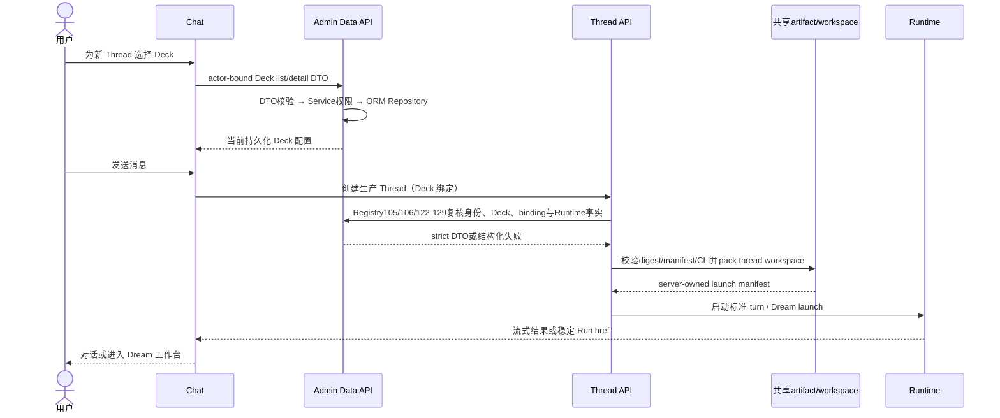

<!-- [Input] Current Admin Registry105/106/122-129 Deck DTO contracts and Dream Runtime boundaries. -->
<!-- [Output] Dream/Chat Deck consumption, failure and ownership behavior. -->
<!-- [Pos] Current Deck consumption design; Admin owns data access, Dream owns product/Runtime/files. -->
<!-- [Sync] 2026-09-16: retire duplicate Dream binding SQL services and make DTO/ORM ownership explicit. -->
# Dream / Chat 的 Deck 消费边界

> 状态：有效；更新于 2026-09-16。Deck 管理与版本设计：
> [`README.md`](./README.md)。

## 1. 目标

Dream 首页负责恢复已有 Dream，Chat 是选择 Deck 并开始新工作的生产入口。Deck 管理只负责
轻量元数据与启用状态，不把运行时 Agent、Prompt、Memory、插件或市场能力搬进详情页。

## 2. 页面层级

### Chat

- 保留现有 Thread history、输入、停止、重连和错误恢复。
- 新 Thread 可在发送前选择当前有权限且启用的 Deck。
- 历史 Thread 继续使用创建时绑定的 Deck 事实；版本 capability 发布后才显示版本号和显式升级。
- URL 中的 Deck ID 只是选择意图，服务端仍需复核权限和可用性。

### Dream 首页

1. **进行中的 Dream**：来自 actor-scoped re-entry API，默认显示三条，可展开/收起。
2. **我的 Dream**：只显示业务存在的初始/进行中状态，整行使用服务端 `run.href` 重入。

社区 Deck、公开列表、安装、发布和市场状态已从本页移除；相关需求延期至
[`../deck-register/`](../deck-register/)。页面不再维护独立 goal/agent 创建表单。

## 3. 状态

| 状态 | 行为 |
|---|---|
| 进行中加载 | 显示恢复状态，不伪造固定卡片 |
| 进行中为空 | 引导用户前往 Chat 选择 Deck |
| 我的 Dream 为空 | 显示诚实空状态，不恢复旧创建表单 |
| 加载失败 | 保留重试入口，不能用空数组掩盖失败 |
| Run 无权限/不存在 | 不泄露内容，返回可访问的 Dream 首页 |
| 历史 Thread Deck 版本未知 | 不显示版本或升级入口，不用 `agent_type_revision` 代替 Deck revision |
| 市场暂缓 | 无社区、发布、安装、市场占位和网络请求 |

## 4. 生产流程

历史 Thread 的版本检测和显式升级完整流程见
[`thread-version-upgrade.md`](./thread-version-upgrade.md)。在 Admin Drizzle 发布
aggregate revision、immutable snapshot、Thread 绑定和原子升级 capability 之前，该流程必须
fail closed。

## 5. 服务端职责与失败边界

- Admin Registry105/106/122-129 接收经验证的 OAuth 用户委托，执行 DTO 校验、业务 Service、权限过滤、typed ORM Repository 与 CAS/UOW；Dream 不提交任意用户 ID，也不持有 PostgreSQL 回退。
- Dream `DeckChatContextAssembler` 只应用 enabled/ready、selected Voice、prompt、截断和 provenance 规则。Agent-type 本地验证只检查 Admin 选定的共享 artifact、manifest 与当前 Claude CLI。
- 插件文件由 Dream 按服务器共享根配置打包进既有 Thread workspace，Runtime 从 server-owned launch manifest 使用 `--plugin-dir`；本次边界不改变 SSE、turn/resume/cancel 或共享文件权限。
- capability 缺失、Admin 不可用、身份/Deck/Workspace 不匹配、revision 冲突、selection 拒绝或本地制品验证失败时，在 Runtime 启动前返回既有结构化错误；禁止转为 Dream SQL 查询或静默退化。
- 旧 `BindingService`、`SelectionValidationService`、`CompatibilityService` 与 `services/deck/runtime_context.py` 已不属于生产实现。纯 capability 交集算法继续由 Dream 复用，数据库状态和兼容性事实由 Admin 提供。

## 6. 响应式与无障碍

- `StoryWorkspaceLayout` 主内容区是唯一纵向滚动 owner。
- 进行中列表不建立第二个纵向滚动容器；窄屏保持相同数据和顺序。
- “查看更多/收起”使用 `aria-expanded` 和 `aria-controls`。
- 整行重入链接可由键盘激活并保留可见焦点。
- 加载与错误状态使用可读文字和 live/alert 语义，不只依赖颜色。

## 7. 验收

1. Dream 首页只有“进行中的 Dream”和“我的 Dream”，无社区 Deck 或安装入口。
2. 进行中默认最多三条，展开/收起不改变数据顺序。
3. Run 使用真实稳定标识和 `run.href` 重入，同一 Thread 继续原上下文。
4. 新 Thread 在 Chat 选择 Deck；历史 Thread 不自动切换版本。
5. 桌面、窄屏、低高度视口均可滚动到最后一条记录且无页面级横向溢出。
6. 权限、删除、加载和运行失败均 fail closed。
7. 生产路由不导入旧 binding/selection/compatibility SQL 服务；Admin 失败不会回退 Dream 数据库。

## 8. 对应实现

- `frontend/app/_dream/views/story-workspace/StoryWorkspaceDreamLaunch.tsx`
- `frontend/app/_dream/views/story-workspace/StoryWorkspaceDreamPage.css`
- `frontend/app/_dream/views/story-workspace/__tests__/StoryWorkspaceDreamLaunchLayout.test.ts`
- `frontend/app/_dream/views/story-workspace/__tests__/StoryWorkspaceDreamReentryLayout.test.ts`
- `frontend/e2e/chat-dream-agent-refactor.spec.ts`
- `backend/services/admin_data/deck_chat_context_data.py`
- `backend/services/admin_data/deck_plugin_binding_data.py`
- `backend/services/deck/chat_context.py`
- `backend/services/deck/agent_type_runtime.py`
