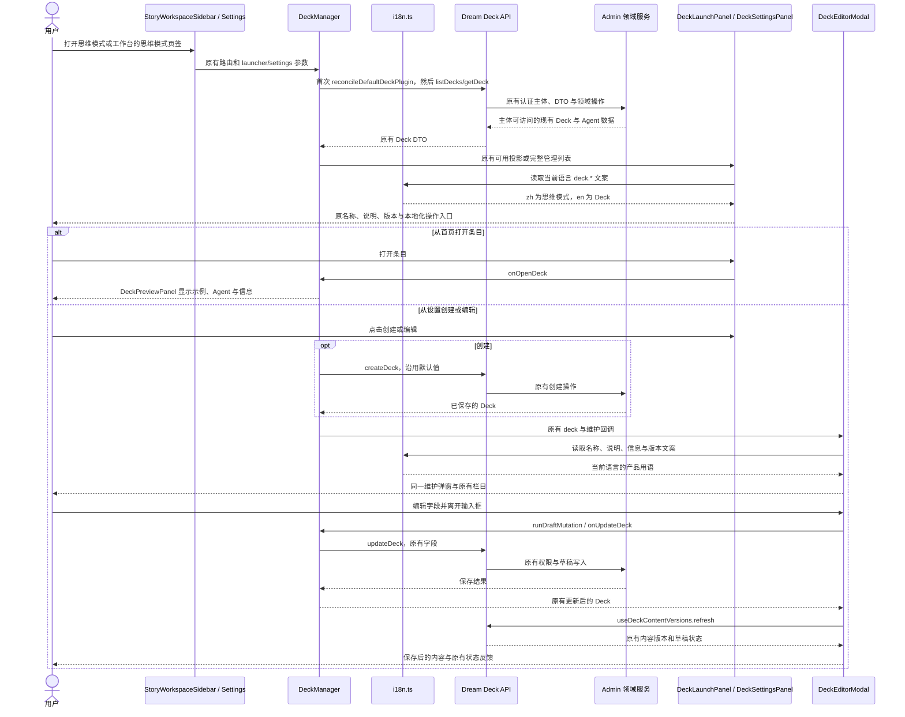
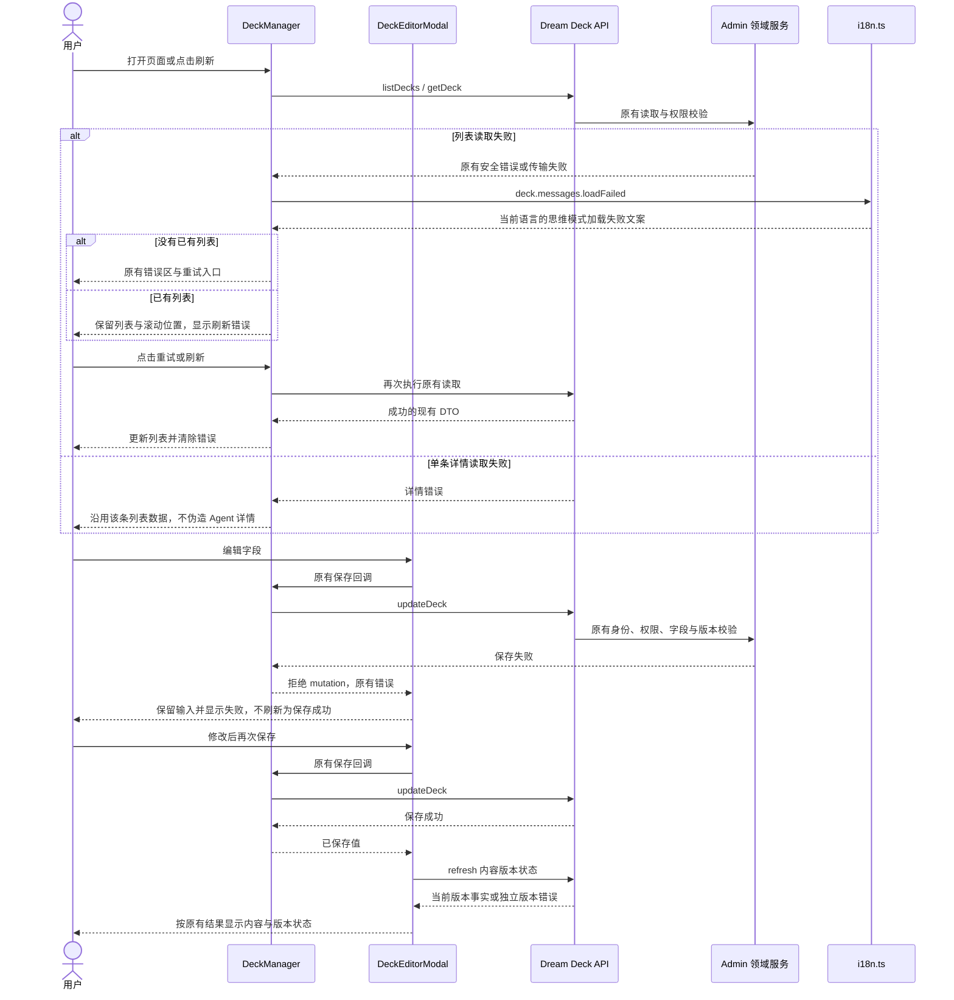
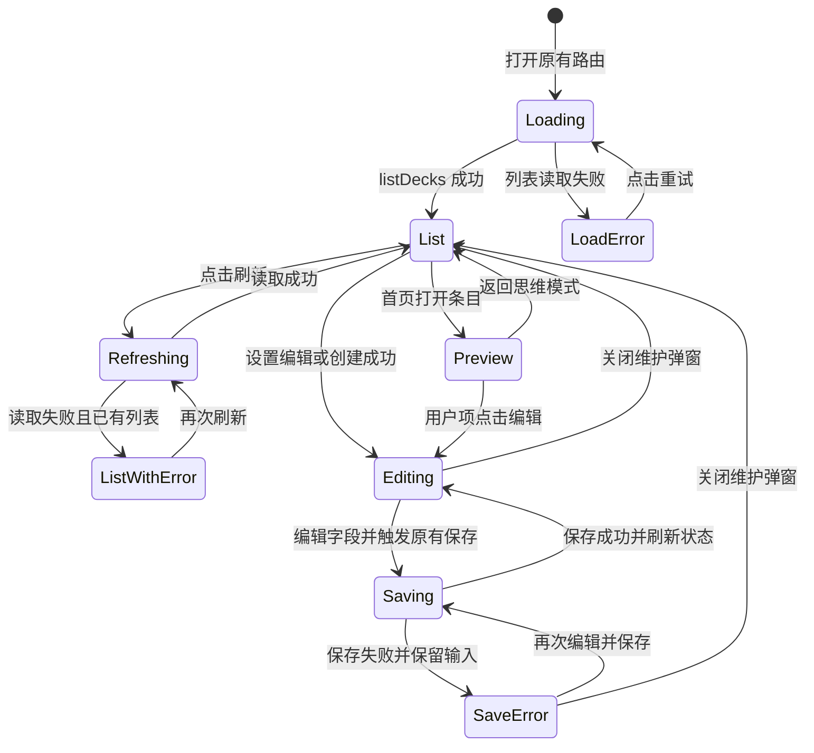

<!-- [Input] 思维模式 PRD、DeckManager 和现行 CRUD/version/i18n 生产实现。 -->
<!-- [Output] 中文用语映射、正常与失败恢复时序、页面状态和实现范围。 -->
<!-- [Pos] 思维模式命名的正式交互设计。 -->
<!-- [Sync] 2026-10-09: 定义思维模式产品名称，不改变 Deck 数据与业务行为。 -->
# 思维模式命名与交互设计

## 背景与问题

产品定位是个人思维模式的整理，Deck 是其承载形式。此前导航称“卡组”，列表和设置称 Deck，维护表单又称 Deck Name，中文用语缺少一致含义。概念与页面骨架由[现行 PRD](../../prd/deck/thinking-modes.md)所有。

## 目标与边界

本次仅更改中文产品名称、相关说明及可访问名称，并补齐直接写入组件的用语。已有 DTO、路由、翻译键、组件、样式、授权、状态计算、草稿保存和版本提交保留。英文产品名称沿用 Deck，既有业务名称与说明不做替换。

本次没有新的接口，也没有 Skills/MCP 自动组合、多智能体协作或思维模式推荐能力。

## 概念与规则

- 思维模式：用户针对某类需求整理的思考方向、解决路径与执行方式。
- Deck：现有配置记录与关联结构；实际维护栏目是概览、Agents、Claude 插件。
- Agent、插件引用、内容版本和运行插件版本分别表示角色配置、能力引用、配置历史和运行选择，不混为同一状态。
- 中文统一用“思维模式”，英文使用 Deck。文案集中在 `i18n.ts`；维护、版本、插件和 Dream 信息组件复用现有翻译机制。
- 中文相关说明强调用途，例如“管理在 Chat 和 Dream 中使用的思维模式”“请描述这个思维模式的用途和解决问题的方式”。不将未来设想写成已实现能力。
- 插件栏目说明已安装且可用的插件会在开始对话时加载，空状态引导到工作台的插件页；不在说明中展示 CLI 参数或要求用户理解 ready、digest 等检查字段。现有兼容性校验和插件引用保存保持原样。

## 正常业务时序

以下为当前代码中的入口、读取和维护流程；名称调整只作用于 UI 渲染。

## 异常与恢复时序

首次列表读取失败、已有列表刷新失败和单条详情读取失败按当前 `DeckManager` 的不同分支处理，不能因为用语统一而折叠成同一种业务结果。

服务端明确返回的业务消息按原接口保留；客户端默认失败文案使用当前语言。本次不通过全局替换服务端消息或用户正文来改名。

## 页面状态转换

图中状态名仅用于说明既有组件状态，不新增程序枚举。创建、启停、内容提交、版本冲突与删除仍执行[入口与工作台](./deck-management-list.md)、[版本合同](./deck-detail-version-history.md)和[历史业务时序](./deck-business-sequences.md)中的既有规则。历史图示原文保留；其中 Deck 对应本稿的产品名称。

## 所有权、响应式与验收

Admin 仍拥有持久化、身份主体与访问权限、schema capability 和版本事务；Dream 仍拥有公开 API 消费与前端投影。中文名称变化不改动幂等请求、并发 revision、服务端配置、Runtime 或已有 Thread 绑定。

布局沿用当前 CSS。正文、按钮、输入标签、标题、ARIA label 和 tooltip 使用一致名称；中文变长后需验证 390px 窄屏没有页面级横向溢出。历史记录保持默认折叠，提交版本和相关对话保留现有弹窗关系。

验收矩阵见[PRD](../../prd/deck/thinking-modes.md#正式设计与验收)，处理判断、优化提示词及实际验证证据见[任务记录](./thinking-mode-terminology-review.md)。文档语法通过只代表文档检查，浏览器 mock 通过只代表技术验证。
