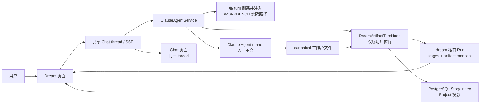

# Dream Agent 当前设计

> 状态：**已实现并通过本机真实业务验收（2026-08-13）**。

当前 Dream Agent 解决两个直接业务：Chat 输入 `/` 时建议当前 Deck/thread 实际安装的
Skill；主 Agent 在当前 thread 工作区构建创作产物后，宿主在根 turn 成功边界把实际
文件同步到当前 Run 的 `.dream` 私有目录，供 Dream 页面读取人物、场景和分镜。

## 1. 当前架构

Dream 与 Chat 共用 thread、消息、Claude session、SSE、工具确认、Stop、历史和重连。
Dream 没有第二套 Agent runtime、SSE、parser 或 reducer。

## 2. 当前业务范围

- Dream 发起时创建经权限校验的 Workflow Run，并绑定同一 actor-owned Chat thread。
- 服务端给首轮 Agent 明确的项目 ID；Agent 只构建工作台产物，不写 `.dream`。
- Chat 输入 `/` 时只读取启用且安装就绪、摘要和版本匹配的 Skill；选择建议只填入输入框。
- 除首次 `/drama-init` 默认引导外，Skill 可以任意、重复执行，不由代码推导下一步。
- 根 turn 成功后，Hook 校验人物、场景、分镜和 Project/Episode allowlist 产物。
- Hook 原子同步当前 Run 的页面 stage 和 `artifact/manifest.json`。
- 可索引 Episode 存在时，Hook 幂等刷新 PostgreSQL Story Project 投影；Execution 顶部显示 Project 标题，Episode 区保留独立标题。
- Dream 工作空间标题在 Execution、Dream 回访和 Admin 列表中统一读取 Project 投影；Project 尚未构建时才显示 launch 创作目标前 80 字符。
- Dream 页面通过既有 actor-scoped `dream-files` GET 展示，不新增页面协议。
- 刷新、Dream→Chat→Dream 都继续使用同一 thread，不重新发起首轮消息。
- Agent failed/cancelled/Stop 时不发布本轮半成品；同步异常不制造第二个 Chat 终态。

不属于当前范围：固定 `/drama-*` 命令顺序、next action、checkpoint、文件 watcher、
Observer 主动同步、MCP 作为同步前置条件，以及 Admin sealed Artifact 发布。

## 3. 当前文档

| 文档 | 用途 |
|---|---|
| [全业务交互](./business-interaction-design.md) | 当前可用业务及逐项时序 |
| [Skill 与工作台同步](../story-workspace/skill-commands-and-workbench-sync.md) | 十三个 Skill、Slash 建议与 Hook 自动发布 |
| [工作台自动同步](./deck-output-sync-design.md) | 文件发现、投影、幂等和失败边界 |
| [工作台上下文初始化与逐轮注入](./workbench-context-injection-design.md) | 静态合同部署、每 turn 实际路径 Read 与安全边界 |
| [Agent 资产协作](./asset-collaboration-design.md) | 人物、场景、分镜自然语言 CRUD、引用完整性与 Hook 同步 |
| [Project / Episode 合同](./project-episode-artifact-contract.md) | 当前 Run preview 与 Admin 权威 Artifact 的区别 |
| [工具与自动同步边界](./dreamflow-tool-boundaries.md) | Agent、Hook、Observer、MCP 的职责 |
| [设计审查](./design-review.md) | 当前架构接受结论与证据 |
| [Prompt 轮次记录](./prompt-rounds.md) | 可追溯执行记录，不是业务规范 |

目录中其他历史迁移文档只用于 Git/架构追溯；与上述当前文档冲突时，以上述当前文档
和可执行代码为准。

## 4. 真实验收

真实账号使用 `deepseek-v4-pro` 完成 Run
`run_604125a31ad9478990622b675a996863`：

- canonical 工作台：2 个人物、1 个场景、`project.yaml`、`EP01/storyboard.yaml`；
- `.dream`：3 个 stage、2 个 Artifact 文件副本和最终 manifest；
- canonical 文件与私有副本 SHA-256 一致；
- Dream 页面刷新、可见 Chat 按钮、同 thread 历史和返回 Dream 均通过；
- `--headed --workers=1`：`1 passed (1.2m)`；
- 后端聚焦回归：131 passed、2 skipped、59 subtests；
- 共享 Chat/layout：24 passed；TypeScript、ESLint、生产构建和 diff gate 通过。

该证据证明本机真实业务闭环，不代表 staging、生产发布或负载验收。

工作台逐轮上下文及 Project 页面投影补充验收使用原始 Run
`run_8956be79389b4bd3aa40b5107a5bb233`：真实 `deepseek-v4-pro` 完成两轮正常人类对话，
保持同一 Claude session 并逐轮读取绝对 `.dream/WORKBENCH.md`。canonical、私有副本和
manifest SHA 一致；PostgreSQL/API 为 `indexed`；Execution 页 Project 标题显示“隔壁的病友”，
EP01 标题独立显示“凌晨五点的敲墙声”。最终有头 Playwright 为 `1 passed (32.4s)`；用户要求
关闭后浏览器已退出，后续未再启动有头模式。
