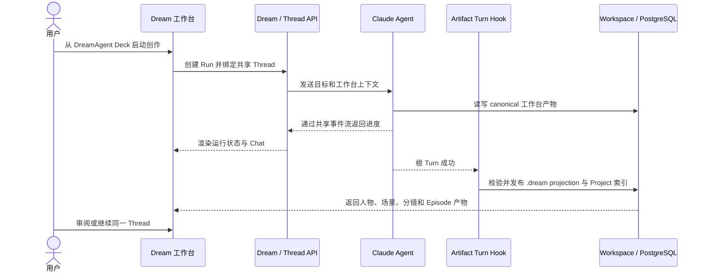
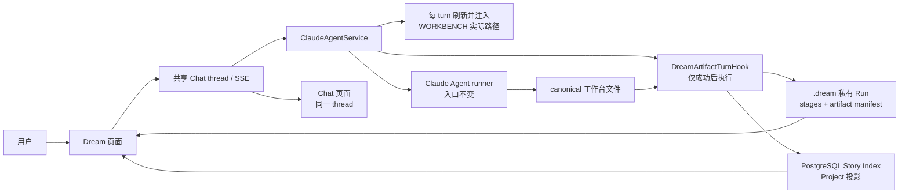

# Dream Agent 当前设计

> 状态：当前已实现业务设计。

当前 Dream Agent 解决两个直接业务：Chat 输入 `/` 时建议当前 Deck/thread 实际安装的
Skill；主 Agent 在当前 thread 工作区构建创作产物后，宿主在根 turn 成功边界把实际
文件同步到当前 Run 的 `.dream` 私有目录，供 Dream 页面读取人物、场景和分镜。

## 核心概念定义

| 概念 | 定义 |
|---|---|
| Dream Run | 一次具备独立状态、产物与审阅结果的创作执行 |
| DreamAgent Deck | 通过 Dream 启动入口消费的 Deck 类型，不跳转普通 Chat 页面 |
| Shared Thread | Dream 与 Chat 共用的消息、SSE、Stop 和重连载体 |
| Canonical workspace | Agent 实际读写的项目工作台文件集合 |
| `.dream` projection | Hook 在成功 Turn 后发布的 Run 私有页面投影 |
| Project / Episode | 可索引的故事项目及其分集业务对象 |
| Artifact manifest | 当前 Run 可阅读产物及 revision 的权威清单 |
| Review gate | 阻止未审阅产物继续进入受保护动作的业务门槛 |

## 核心业务时序图

## 1. 当前架构

Dream 与 Chat 共用 thread、消息、Claude session、SSE、工具确认、Stop、历史和重连。
Dream 没有第二套 Agent runtime、SSE、parser 或 reducer。

## 2. 当前业务范围

- Dream 发起时创建经权限校验的 Workflow Run，并绑定同一 actor-owned Chat thread。
- 服务端给首轮 Agent 明确的项目 ID；Agent 只构建工作台产物，不写 `.dream`。
- Chat 输入 `/` 时只读取启用且安装就绪、摘要和版本匹配的 Skill；选择建议只填入输入框。
- 除首次 `/drama-init` 默认引导外，Skill 可以任意、重复执行，不由代码推导下一步。
- 根 turn 成功后，Hook 校验人物、场景、分镜和 Project/Episode allowlist 产物。
- Hook 原子同步当前 Run 的页面 stage 和 `artifact/manifest.json`。
- 可索引 Episode 存在时，Hook 幂等刷新 PostgreSQL Story Project 投影；Execution 顶部显示 Project 标题，Episode 区保留独立标题。
- Dream 工作空间标题在 Execution、Dream 回访和 Admin 列表中统一读取 Project 投影；Project 尚未构建时才显示 launch 创作目标前 80 字符。
- Dream 页面通过既有 actor-scoped `dream-files` GET 展示，不新增页面协议。
- Execution 剧本创作台只展示当前人物、场景、分镜和 Episode 产物，不展示“工作空间更新流”、
  stage revision 时间线或来源文件计数；revision 仅作为服务端幂等与读取一致性事实存在。
- Execution 默认直接显示人物、场景和分镜“初稿”工作台，不保留初稿折叠层；Dream Agent
  标题栏在 Chat 旁提供“初稿 / 同步”切换，“同步”按需显示 Episode Artifact、文件 reader、
  Story Index、审阅和辅助产物。切换是非持久化页面状态，不触发 Hook 或 Agent turn。
- 刷新、Dream→Chat→Dream 都继续使用同一 thread，不重新发起首轮消息。
- Agent failed/cancelled/Stop 时不发布本轮半成品；同步异常不制造第二个 Chat 终态。

不属于当前范围：固定 `/drama-*` 命令顺序、next action、checkpoint、文件 watcher、
Observer 主动同步、MCP 作为同步前置条件，以及 Admin sealed Artifact 发布。

## 3. 当前文档

| 文档 | 用途 |
|---|---|
| [全业务交互](./business-interaction-design.md) | 当前可用业务及逐项时序 |
| [Skill 与工作台同步](../story-workspace/skill-commands-and-workbench-sync.md) | 十三个 Skill、Slash 建议与 Hook 自动发布 |
| [工作台自动同步](./deck-output-sync-design.md) | 文件发现、投影、幂等和失败边界 |
| [工作台上下文初始化与逐轮注入](./workbench-context-injection-design.md) | 静态合同部署、每 turn 实际路径 Read 与安全边界 |
| [Agent 资产协作](./asset-collaboration-design.md) | 人物、场景、分镜自然语言 CRUD、引用完整性与 Hook 同步 |
| [Project / Episode 合同](./project-episode-artifact-contract.md) | 当前 Run preview 与 Admin 权威 Artifact 的区别 |
| [工具与自动同步边界](./dreamflow-tool-boundaries.md) | Agent、Hook、Observer、MCP 的职责 |

目录中其他历史路径仅为兼容既有引用而保留；与上述当前文档冲突时，以上述当前文档
和可执行代码为准。
