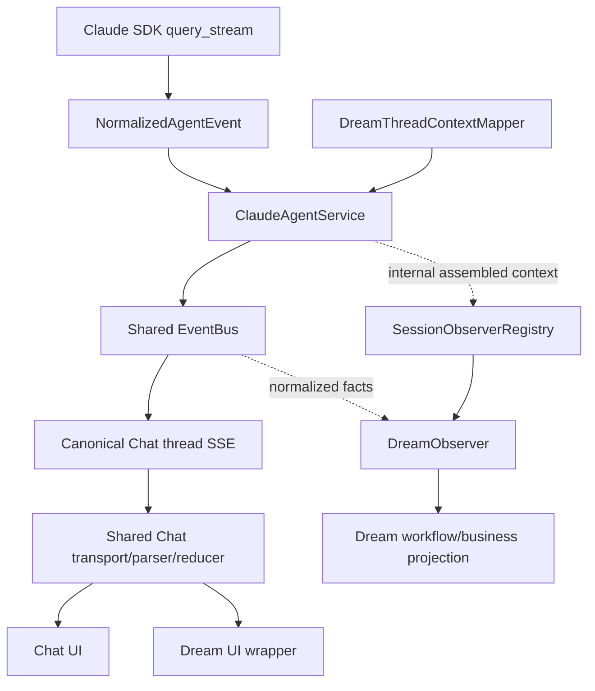
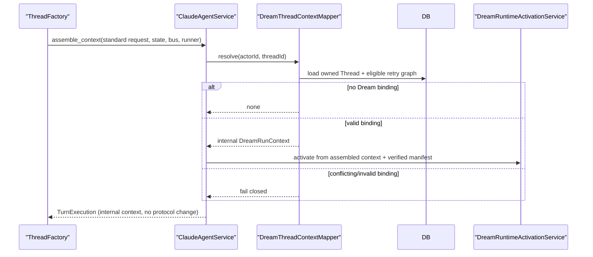

# Dream Agent architecture

## Decision

Dream is a business feature over the canonical Claude Agent Thread runtime. It
does not own another conversation protocol, request schema, stream, parser,
reducer, confirmation store or lifecycle truth.

The two planes are one-way coupled:

- Conversation plane owns messages, live output, runtime tool confirmation,
  AskUserQuestion, subagents, Stop, reconnect, history and Chat terminal.
- Business plane owns Workflow Run, Project/Episode Artifact, Story Index,
  revision and business commands.
- Business observation derives from internal conversation/tool facts. It cannot
  control the conversation plane or redefine its terminal.

## Protected boundaries

The refactor must not change:

- Claude Agent HTTP request/response or SSE frames;
- `ClaudeAgentRunRequest` by adding a Dream-specific public/internal field;
- the entry function called by ThreadFactory for Phase 3 execution;
- `backend/libs/claude_agent_kit/server/agent_runner.py` classification,
  permission, cancellation or `run_streaming` behavior;
- existing Chat transport/parser/reducer contracts.

Dream↔Chat switching passes the same canonical `threadId`. Dream business
context is discovered separately from server-owned database relationships.

## Context assembly

`ClaudeAgentService.assemble_context` is the only integration point that joins
one Thread turn with Dream business authority:

1. Load the actor-owned Chat Thread.
2. Ask `DreamThreadContextMapper` for an eligible Dream retry leaf by
   `(actor_id, thread_id)`.
3. For no eligible Dream binding, return `None` and assemble an ordinary Chat
   turn without Dream policy.
4. For one binding, validate Workspace, source message, retry graph, Deck,
   plugin lock and Thread identity.
5. Build the user context and trusted Dream tool environment from that internal
   object.
6. Activate required Dream business runtime receipts before Session Execution,
   using named service methods and verified workspace/plugin facts.
7. Return `_TurnExecution.dream_context` for internal consumers and Observer
   registration. Never mutate the incoming request with Dream data.

The runtime activator is a class dependency. `AgentStreamingCallbacks` has no
Dream initialization callback and no closure waits for an SDK message.

## Session Observer integration

ThreadFactory registers one `DreamObserver` instance with
`SessionObserverRegistry`. It does not import or directly call a Dream
coordinator.

After context assembly the registry supplies only internal metadata references
needed to attach a normalized EventBus subscriber: thread, turn, actor, resolved
context and bus. `DreamObserver` ignores ordinary Chat turns. It delegates event
classification and bounded off-path processing to private helper classes, and
closes the turn on the post-session hook and all Phase 4 paths.

Observer hook failure is swallowed/logged by the registry (except task
cancellation), so it cannot fail Agent SSE. Observer writes still require an
idempotency key, event/turn/thread identity, monotonic sequence and the owning
domain service's authorization/integrity checks.

## Request and DTO boundaries

The Chat POST body contains only the existing Chat fields. Dream launch,
confirmation, guidance and action services persist a private standard Chat
message with server metadata, then dispatch by actor and Thread. The service
re-resolves the business context from the Thread at assembly time.

Router response projection uses named DTO/projector classes:

- `PublicChatThreadDto`
- `PublicChatMessageDto`
- `PublicChatMetadataDto`
- typed tool-choice enum/value parsing

These classes define validation and serialization. Module-level tuples or sets
such as `_CLIENT_THREAD_FIELDS`, `_CLIENT_MESSAGE_FIELDS` and
`_PUBLIC_TOOL_CHOICES` are not DTO definitions and must not be used.

Typed public projection does not widen visibility: private system command rows,
server-only correlation, filesystem locators and unapproved metadata remain
absent. A zero-visible-part row produces no blank bubble.

## Conversation contract

Dream composes `ChatPanel`, which remains the only `useChat`/live reducer owner.
Both pages use:

- thread history and status;
- canonical SSE replay/live stream;
- normalized text/reasoning/tool/subagent events;
- canonical tool confirmation and AskUserQuestion;
- canonical Stop and single terminal behavior;
- the same refresh, disconnect and reconnect hydration;
- the same input availability rules.

No Dream `EventSource`, redaction adapter, run cursor or lifecycle reducer may be
introduced.

## Business ownership

| Fact | Authoritative owner | Forbidden substitute |
|---|---|---|
| Agent running/confirmation/terminal | ClaudeAgentService + ThreadFactory/EventBus | Workflow status, page state, Observer |
| Chat messages/session/reconnect | Chat persistence and thread API | Dream snapshots/transcripts |
| Workflow Run transitions | Workflow domain service | Chat `finish`, Observer activity |
| Artifact bytes/revisions | Dream Artifact services/tools | assistant prose, Admin |
| Story identity/index | Dream materializer/repository | directory scan, Admin upsert |
| review fields | Admin revision-bound command | Dream Agent inference |
| Observer resources | `DreamObserver` via registry | ThreadFactory Dream branch |

## Application service boundaries

Dream business HTTP commands no longer pass through one broad workflow gateway:

| Service | Owns | Does not own |
|---|---|---|
| `DreamLaunchEndpointService` | request DB scope and launch task-registry lifecycle | Agent execution or workflow projection |
| `DreamLaunchApplicationService` | launch authorization, idempotency, preflight/run creation orchestration | SSE parsing or post-turn observation |
| `StoryWorkflowRunApplicationService` | preflight/run/retry/cancel/guidance commands | Artifact and Episode commands |
| `DreamArtifactApplicationService` | Dream files, Episode Artifact surface, Story Index and run re-entry queries | Agent lifecycle |
| `EpisodeApplicationService` | Episode recovery/continue commands and durable internal-command dispatch | Artifact truth or Chat terminal |
| `DreamConfirmationApplicationService` | business confirmation persistence and dispatch | Chat tool confirmation |

Infrastructure is named by what it does: `DreamLaunchSourceRepository`,
`DreamLaunchWorkflowOperationsAdapter`, `DreamRuntimeProvisioningService`,
`DreamAgentTurnDispatcher` and the durable `DreamLaunchEnvelopeDispatcher`. There is
no `StoryWorkspaceDreamLaunchGateway` or `StoryWorkflowApplicationGateway`.

`ClaudeAgentThreadFactory.run_streaming()` is the only public method that starts
an Agent turn. It returns the canonical Chat SSE iterator plus the completion
handle for that same turn. `_run_streaming_frames()`, `_run_turn_task()` and
`_subscribe_events()` are private implementation/supervision methods;
`subscribe_stream()` only attaches to an already-running turn. Server-owned
Dream drains therefore do not have a second normalized-event execution API.

The full Project/Episode contract is in
[Project / Episode Artifact contract](./project-episode-artifact-contract.md),
and tool boundaries in [Dreamflow tool boundaries](./dreamflow-tool-boundaries.md).

## Authorization

Protocol reuse never removes business authorization. Every Dream write proves:

- authenticated actor and Thread ownership;
- Workflow Run and Workspace permission;
- legal retry leaf and frozen source message;
- Deck/plugin binding revision;
- expected Project/Episode/Artifact revision;
- idempotency/claim identity;
- path containment and data integrity.

The browser cannot select a Dream Run through Chat fields. A conflict fails
closed with a bounded safe code.

## Resource cleanup

One owner closes every per-turn Observer subscription, queue, worker task and
lease on normal terminal, failed setup, cancellation, Stop, EventBus failure,
session eviction, explicit close and factory shutdown. Late events after a
business terminal are ignored. Detached tasks remain bounded and are awaited or
reported on factory close.

## Rejected over-design

- A Dream-specific event store or public business SSE.
- A second frontend provider/controller/reducer.
- Observer-driven Agent cancellation or Workflow inference from Chat terminal.
- Adding Dream fields to Chat message/SSE/request DTOs.
- SDK-init closures installed in streaming callbacks.
- Exact global migration-head checks in Dream runtime.
- A permanent dual protocol or dual write for compatibility.
