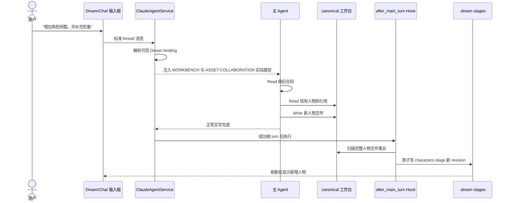
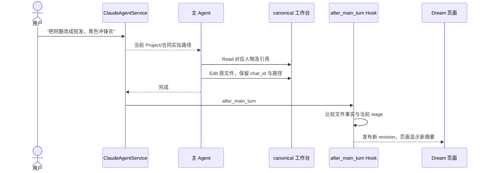
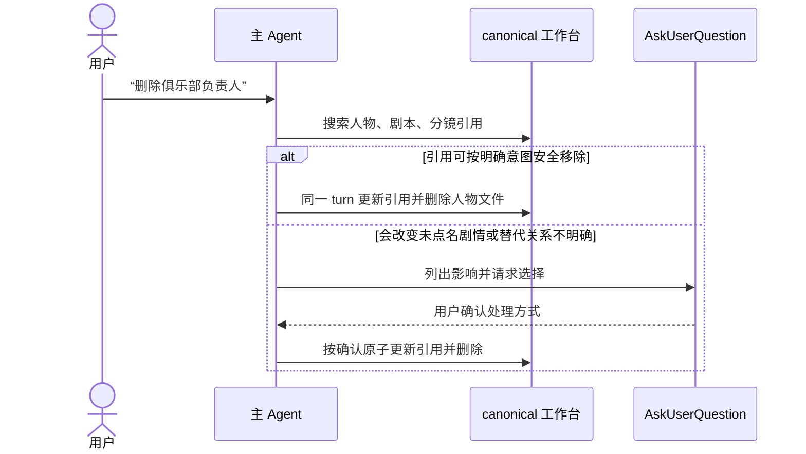
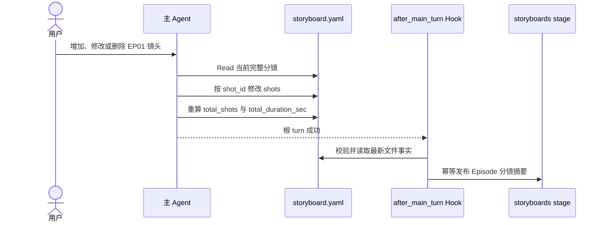
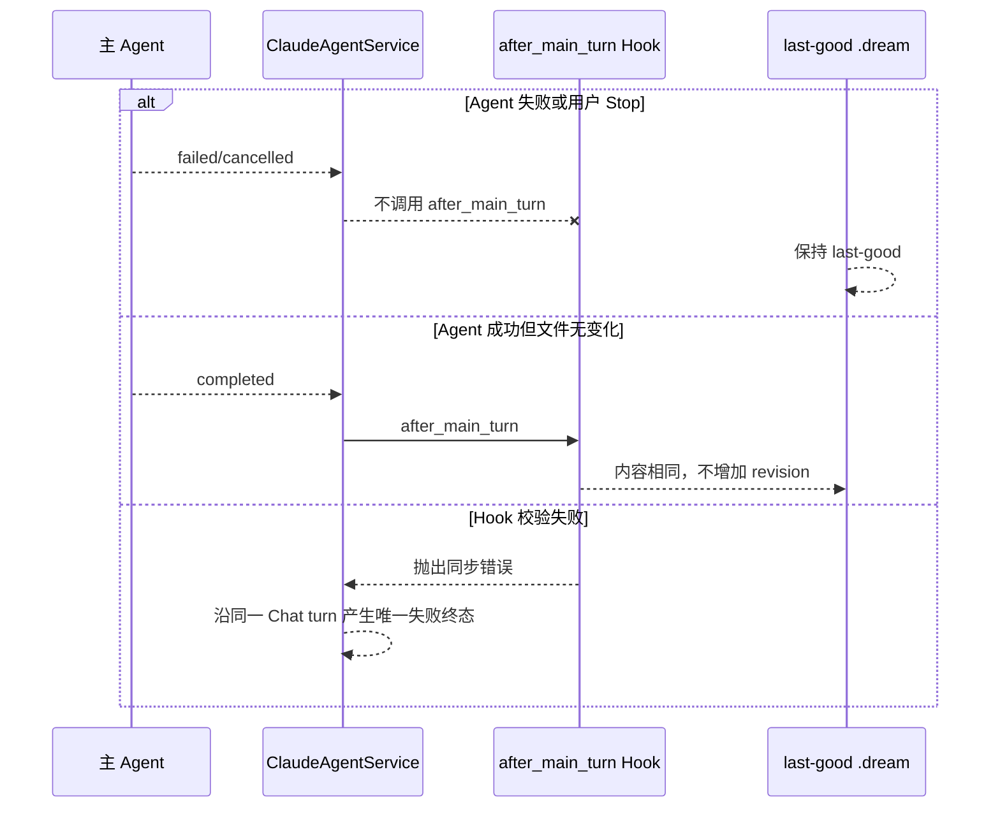
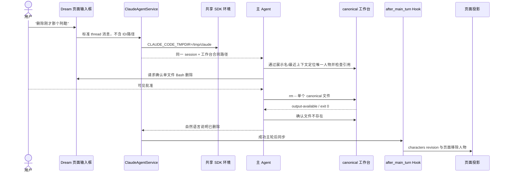

# Dream Agent 资产协作设计

> 状态：**修改后接受，允许实施**。本设计只补足自然语言资产变更的 Agent 合同与成功后
> Hook 同步，不增加状态机、专用 API、消息协议或 Observer 控制。

## 1. 问题与真实业务证据

用户在 Dream 工作台中会直接用自然语言要求 Agent 新增、修改或删除人物、场景、道具和分镜。
这些请求不是“生成待确认提案”，而是对当前 thread canonical 工作台文件的协作编辑。

真实 Run `run_ddb53a9a261d497c98ad9a6c1ec3a1c2` 已证明旧链路存在三项缺口：

1. 每轮 `.dream/WORKBENCH.md` 只说明了目录与宿主同步边界，没有定义资产 CRUD、稳定 ID、
   文件格式和引用完整性；
2. 公共 Chat 入口解析 Deck context 时未选择已有 `dream_mode`，导致 Dream turn 仍收到
   “只返回一个 JSON proposal”的旧 Chat 合同。Agent 因而两次只输出 JSON，没有调用
   Read、Write 或 Edit，canonical 文件和页面都没有变化；
3. Claude Code 2.1.220 使用 `CLAUDE_CODE_TMPDIR` 决定 per-uid `cwd-*` shell 文件根目录，
   现有实现却只猜测 `/tmp/claude-$UID` 并把 `/tmp`、某个动态 `cwd-*` 写进 sandbox。
   `rm` 可能先删除文件，随后 zsh hook 报 `operation not permitted`，导致工具持久化为
   `output-error`、Agent 向用户报告失败，而 Hook 后读取到的文件事实已经变化。

Claude session 在该 Run 中持续存在且同一 thread 历史完整，因此本问题不是 resume/session
丢失，也不应通过重建 session 或重复首轮指令修复。

## 2. 业务概念与影响范围

| 概念 | 业务定义 | 本次影响 |
|---|---|---|
| 用户资产变更请求 | 当前 Dream thread 中对人物、场景、分镜的自然语言增删改 | 必须转成真实 canonical 文件操作 |
| canonical 人物 | `assets/characters/*.{md,yaml,yml}` | 新增、更新、删除 |
| canonical 场景 | `assets/scenes/*.{md,yaml,yml}` | 新增、更新、删除 |
| canonical 道具 | `assets/props/*.{md,yaml,yml}` | 新增、更新、删除；当前不新增页面 stage |
| canonical 分镜 | `stories/<project>/episodes/<EPxx>/storyboard.yaml` 中的文件与 shot 项 | 新增、更新、删除 |
| 工作台合同 | `.dream/WORKBENCH.md` 与 `.dream/ASSET-COLLABORATION.md` | 每轮先读取，Agent 只读 |
| Hook | `DreamArtifactTurnHook.after_main_turn` | 成功根 turn 后按完整文件事实刷新 stage |
| 私有页面投影 | `.dream/runtime/runs/<run-id>/stages/*.json` | Hook 生成，Agent 不直接写 |
| Chat/Claude session | 共享 thread、history、SSE、确认、Stop、resume | 保持不变 |
| Claude Code 临时根 | 服务端 `CLAUDE_CODE_TMPDIR` 与 sandbox 精确 allowWrite | 统一为 `/tmp/claude` |

不属于本次范围：把资产编辑建模为 workflow 状态机、为每种 CRUD 增加 REST 命令、解析
assistant JSON 代替文件写入、让 Observer 或 MCP 成为同步 owner、修改 Claude runner 的
公开 turn/SDK 执行入口。

## 3. 目标交互合同

### 3.1 每轮前置读取

`ClaudeAgentService.assemble_context` 在确认 actor/thread/Run 后刷新两个宿主文件，并把两者
经过校验的绝对路径注入本轮内部消息：

- `WORKBENCH.md`：当前 run、thread、workspace、唯一 Project 和 Episode；
- `ASSET-COLLABORATION.md`：人物、场景、道具、分镜的增删改、格式、ID 和引用规则。

Agent 必须先 Read 两个文件，再检查与本次请求有关的 canonical 文件。Deck voice 或普通 Chat
提案格式只能约束最终文字表达，不能替代 Dream 文件操作。

用户消息不要求包含任何内部身份。Agent 应从展示名称、当前 Episode、同一 thread 最近上下文
和现存文件事实解析“阿酷”“俱乐部负责人”“刚才那个雨棚”“第一集最后一个镜头”。只有多个
目标确实会产生不同业务结果时才 AskUserQuestion；不得把 `char_id`、绝对路径或 exact `rm`
命令变成用户必须知道的协议。

### 3.2 人物、场景和道具

- 新增：选择当前目录未使用的稳定 ASCII ID，创建一个文件；不得覆盖同名文件。
- 更新：保留既有 ID 和路径，使用 Edit/Write 修改用户点名的事实，不重建其他资产。
- 删除：仅在用户明确要求时删除对应 canonical 文件；删除前检查剧本、分镜和其他资产引用。
- Claude Code 无内建 Delete 时，人物/场景/道具只允许通过一次精确、单文件、非递归、无通配符的
  `rm -- <canonical asset>` 删除，并走共享 Chat 的可见 Bash 确认；`.dream` 和工作区越界
  仍硬拒绝。分镜 shot 删除继续使用 Edit，不删除 storyboard 文件。
- 名称是展示属性，ID 是引用身份；改名默认不改 ID。

人物最小 frontmatter 为 `char_id`、`char_name`；场景最小 frontmatter 为 `scene_id`、
`scene_name`；道具以 `prop_id`、`name` 标识。正文承载描述、动机、空间、氛围、外观和叙事
用途等可读内容。`_index.md`、`_lock.md`、`_audit-report.md` 是集合元数据，不可当单资产删除。

### 3.2.1 Sandbox 文件边界

`_workspace_sandbox_config` 以整个 thread workspace 作为唯一业务写根，因此 `assets/**` 与
`stories/**` 都在 canonical 写边界内；`.dream/**` 在 sandbox `denyWrite` 中，Agent 只读。

共享 `sdk_env.apply_project_sdk_runtime_options()` 为所有 Chat/Dream turn 注入服务端
`CLAUDE_CODE_TMPDIR`。配置默认 `/tmp/claude`，注入前解析系统路径别名（macOS 上为
`/private/tmp/claude`）；`_workspace_sandbox_config` 通过同一解析函数只把该规范化精确根
加入 `allowWrite`；Claude Code 自己可在其下创建 per-uid 与 `cwd-*` 子项。不得持久化整个
`/tmp`、旧 `/tmp/claude-$UID` 或某一轮生成的动态 `cwd-*` 路径。

PreToolUse 仍只让明确的单资产 `rm --` 进入共享可见确认；目录、多文件、通配符、符号链接与
越界删除继续拒绝。成功删除后由主轮 Hook 根据现存文件事实刷新投影。
只有 Bash 工具得到成功回执且目标文件确认不存在，Agent 才能回复“已删除”；非零退出或
`operation not permitted` 必须维持失败语义，不能因文件可能已先被 `rm` 移除而改判成功。

这里不在 sandbox 中逐项硬编码“人物/场景/道具”的业务目录 allowlist：`allowWrite` 的对象是
当前 thread 的完整 canonical 工作区能力，未来已安装 Skill 产生的其他合法 `assets/**` 文件
也应可写；Dream 资产种类、格式和引用完整性由本合同约束。只有破坏性单文件 `rm` 需要在
PreToolUse 按 `characters/scenes/props` 做额外窄化，因为它无法由内建 Edit/Write 工具表达。

### 3.3 分镜

- 分镜文件属于一个明确 EPxx；自然语言“增加/修改/删除镜头”操作 `shots` 项，不创建第二份
  storyboard 文件。
- `shot_id` 是 Episode 内稳定的带引号 ASCII 字符串；更新不改 ID，新增不得复用，删除只移除
  用户点名的 shot。
- 修改 `shots` 后必须同步 `total_shots`，并按现存镜头 `timing.duration_sec` 重新计算
  `total_duration_sec`。
- 已存在的 richer shot 字段应保留；不能为了改一个字段把八层分镜降级成最小结构。

### 3.4 引用完整性

Agent 在删除或重命名身份前必须搜索 `character_refs`、`scene_refs`、shot `characters`、
`scene_ref` 以及正文中的明确引用：

- 用户意图明确且可以局部安全修改时，同一 turn 原子更新引用与资产；
- 会改变未点名剧情事实、存在多个合理替代或无法判定时，使用 AskUserQuestion；
- 不允许留下已知悬空引用，也不允许静默删除引用该资产的整段剧本或镜头。

## 4. 业务时序

### 4.1 新增人物或场景

### 4.2 更新资产

### 4.3 删除仍被引用的资产

### 4.4 分镜镜头增删改

### 4.5 失败、取消与无变化

### 4.6 模糊页面术语与成功删除

## 5. 设计审查

结论：**修改后接受**。

必须先做两项修改再实施：

1. Dream turn 的 Deck context 必须在 `ClaudeAgentService.assemble_context` 已解析可信
   Dream binding 后选择 `dream_mode`，不能让公共路由或浏览器声明 Dream 身份；
2. 资产协作正文只维护在 `backend/story_workspace` 的一个 Markdown 源文件，工作区部署和
   每轮路径注入复用现有 `DreamWorkbenchContext`，不能在 Python prompt 中复制第二份规则。
3. Claude Code 临时根必须在共享 SDK env 层和 workspace sandbox 通过同一 resolver 定义；
   删除 broad `/tmp` 与动态 `cwd-*`，不能形成 Dream 专用环境分支。

通过审查的理由：

- 不修改 Claude Agent runner 的公开 turn/SDK 执行入口、公开请求 DTO、SSE、session/resume
  或消息可见性；只在既有 PreToolUse 权限分类器内增加单文件删除窄化规则；
- 不新增 CRUD API、数据库表、队列、Watcher、Observer 控制或状态机；
- Hook 继续只在成功根 turn 后读取文件事实，不解析 assistant JSON；
- MCP 仍是可选辅助，不承担最终一致性；
- 使用现有 Chat transport 和同一 thread，Dream↔Chat 行为一致。

明确拒绝：通过正则识别用户意图、前端解析 JSON 后替 Agent 写文件、为三类资产复制三个
同步器、把引用关系持久化成新的 workflow 状态，以及用模型输出内容判断 turn 是否完成。

## 6. 验收标准

- 目标真实 Run 的同一 thread/session 中，Agent 每轮读取两份合同；
- 人物、场景、道具、分镜分别完成新增、更新、删除，并在每轮后验证 canonical 文件；
- 删除引用资产不会留下已知悬空引用；
- 成功后 Hook 更新对应 `.dream` stage，页面刷新可见；
- 失败/Stop 不发布，重复无变化不增加 revision；
- 普通 Chat 保留既有 proposal 行为，Dream turn 不再收到 legacy standalone JSON 合同；
- 不调用真实业务的克隆数据或替代服务；真实浏览器测试使用原始本机数据和无头模式。
- 真实用户消息只使用页面展示名称、“当前/刚才/第一集”等术语，不向 Agent提供内部 ID、路径、
  文件名、合同读取步骤或 exact shell 命令；测试在操作后发现内部身份用于断言。
- 删除 Bash 必须持久化为 `output-available` 且目标文件、Hook、API、页面一致消失；任何
  `cwd-* operation not permitted` 都使验收失败。
