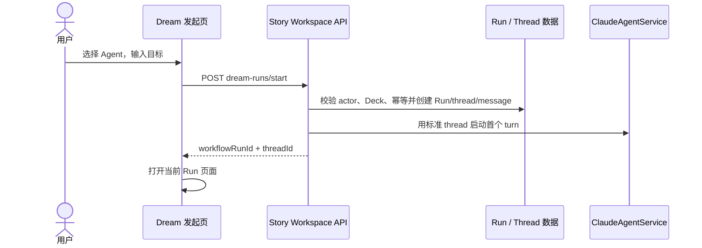
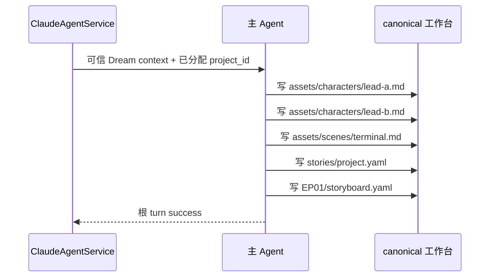
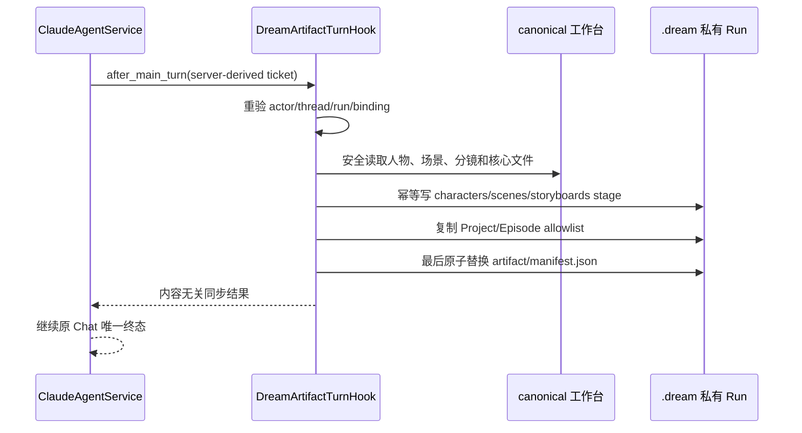
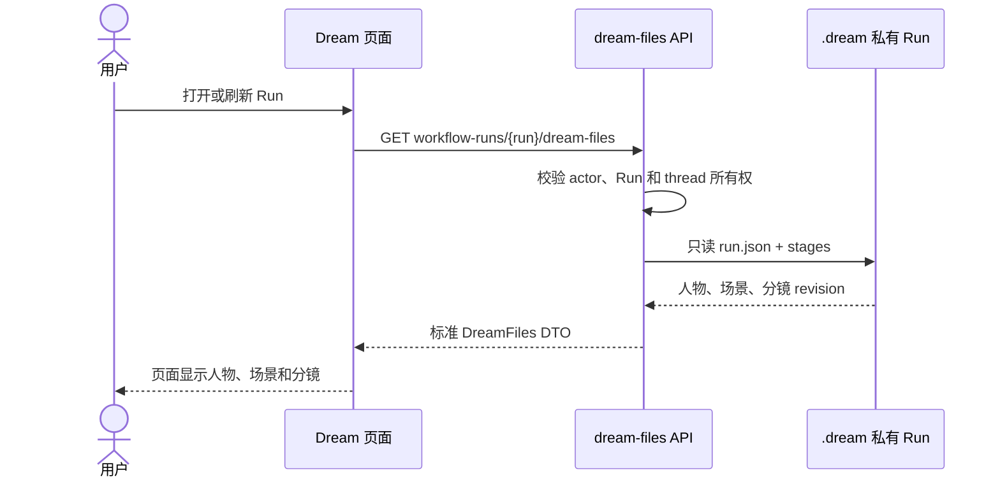
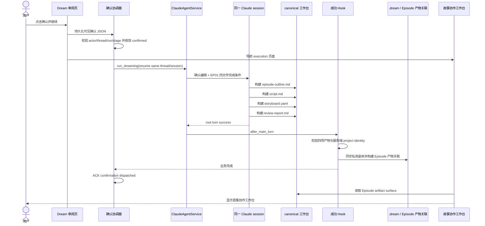
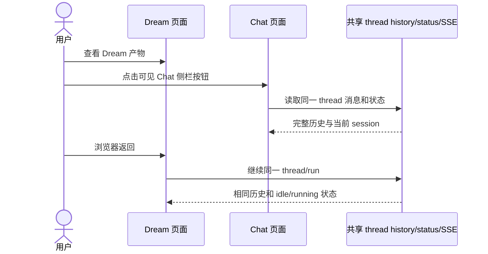
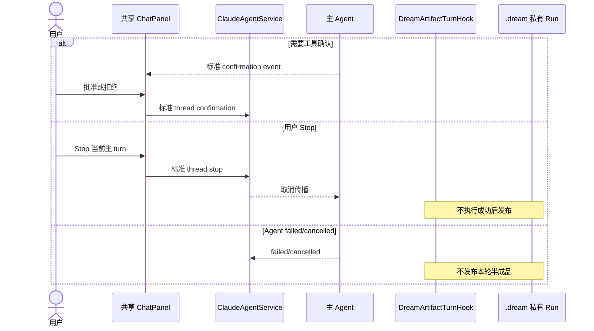

# Dream Agent 全业务交互设计

本文只描述当前产品实际需要并已实现的业务。历史命令编排、推荐动作、checkpoint、
通用 action 状态机和 MCP 主动同步不属于当前 Dream 业务。

## 1. 发起 Dream

用户选择 Deck/Agent、输入创作目标并发起 Dream。后端校验身份、Deck、Workspace 和
幂等键，创建可信 Run、source message 和同一 Chat thread。浏览器不能提交可信工作区
路径或 thread 所有权。

## 2. 主 Agent 构建工作台产物

服务端给出唯一项目 ID。主 Agent使用受控普通文件工具写当前 thread 工作区；它不写
`.dream`，也不需要读取插件源码、联网或调用 Dream MCP 才能完成首次最小产出。

用户后续可以随机提出任何创作要求；同步器只检查本轮结束时的文件事实，不推断用户
执行了哪个 `/drama-*` 命令。

## 3. 成功后自动同步 `.dream`

`DreamArtifactTurnHook` 在 `ClaudeAgentService` 的根 turn 成功边界执行。Hook 重新读取
数据库 authority，验证 actor/thread/Run/冻结 Deck binding，再安全读取 allowlist。

相同输入为 no-op；stage 只在内容变化时增加 revision。manifest 是私有发布的提交标记。

## 4. Dream 页面显示

页面只通过 actor-scoped `dream-files` GET 读取当前 Run 投影。GET 没有恢复、调度或启动
SDK turn 的副作用。

页面可编辑允许字段；业务“确认并继续”仍使用 Workflow 领域权限，不以 Agent finish
代替业务确认。

## 5. 确认后构建首集产物工作台

确认消息是同一 thread 中一条可见的用户消息，完整 JSON 正文不脱敏、不在前端过滤。
服务端在调度模型前先把已持久化的确认事实幂等收敛到 `confirmed`，避免 Agent 成功后
才因 lifecycle 错误重复执行。Agent 必须真实构建 EP01 大纲、剧本、分镜和审阅报告；
只输出聊天正文不算完成。

`episode-workflow.json` 不伪造空完成记录；执行页在其缺失时投影 revision 0，并在第一
次真实 Episode action completion 时懒创建。确认 Hook 的四项产物或产物关联后置条件失败时，
本次确认 turn 失败且不 ACK，不能显示为“已完成但无产物”。

确认成功的 Run 以后从 Dream 重入列表直接进入 execution 页面；未确认 Run 仍进入审阅页。

## 6. Dream 与 Chat 切换

Dream 页面从 `dream-files.threadId` 获取已授权 thread，并直接组合共享 `ChatPanel`。

页面切换不创建新 thread、不重发首轮消息，也不改变原始 `claude_session_id` 或
`resume_existing_session` 语义。

## 7. 工具确认、Stop 与失败

工具确认、AskUserQuestion、network/reject-only 和 Stop 全部由共享 Chat runtime 负责；
Dream 不定义专用确认 DTO 或 reducer。

普通投影修复异常只记录服务端日志，不能改写 Chat SSE；但“确认并继续”的四文件和
Episode 产物关联是该业务 turn 的成功后置条件，失败必须沿共享 Chat turn 的唯一失败
终态返回。两种情况都不得产生第二个 completed/failed/cancelled 终态。

## 8. 消息原文与元数据边界

- Dream 不做正文脱敏：launch、guidance、confirmation、episode action、普通用户消息
  和 Agent 输出的 `parts` 在 Dream/Chat 两侧一致。
- Dream 不做前端消息过滤；旧 `system-hidden` 标记不再控制正文显示，内部 JSON 可以
  直接呈现，避免用户无法判断 Agent 收到了什么。
- 取消正文过滤不等于公开持久化元数据。客户端 DTO 仍只投影 kind、visibility、
  dispatch status、usage、model、tool settlement 等允许字段；actor、claim ID、租约、
  指纹和 session 内部字段不因本改动暴露。
- 损坏、无法解码或判别字段冲突的持久化行继续 fail closed。

## 9. 权限与数据边界

- 对话统一不等于取消业务授权；所有 Workflow 写操作继续检查用户、thread、Run、
  Workspace、Deck binding 和 revision。
- 私有目标路径只由服务端根据可信 thread/run/project 派生。
- 文件必须在当前 workspace 内、不是符号链接、符合 UTF-8、数量和大小限制。
- Observer 只做派生提示，不同步文件、不控制 Agent、不推进 Workflow。
- 当前 `.dream/artifact/manifest.json` 是 Run preview，不是 Admin sealed Artifact。
