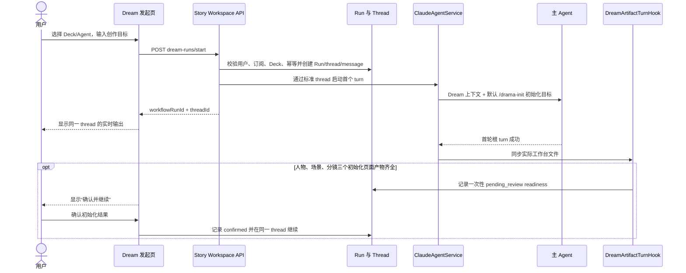
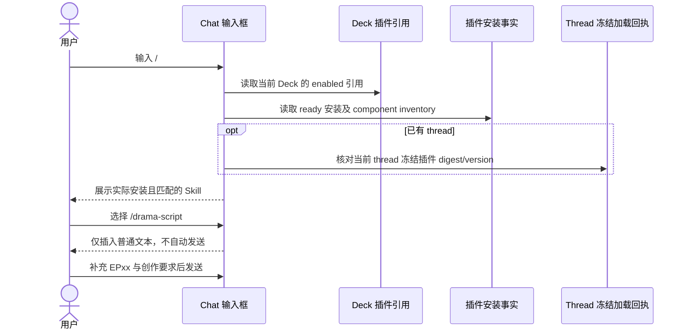
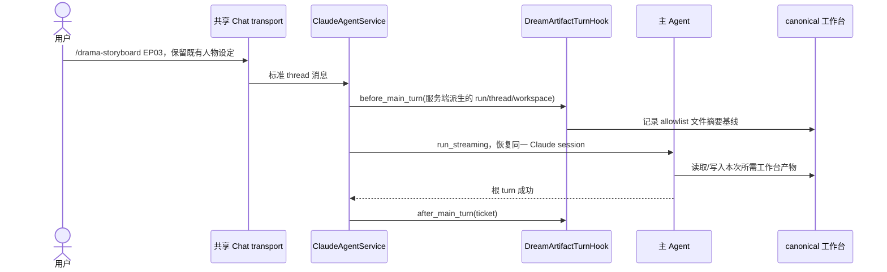
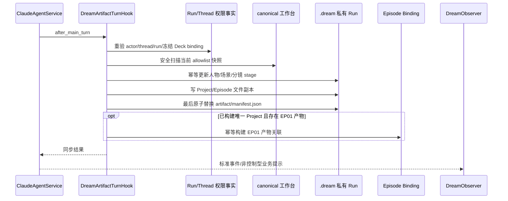
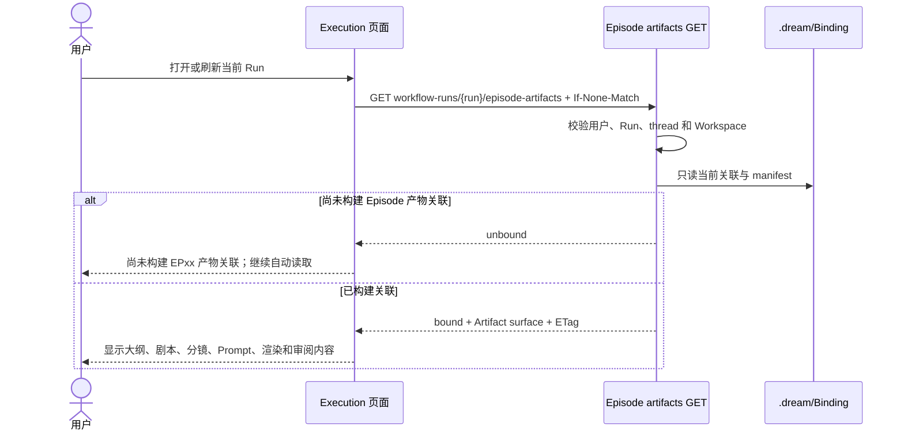
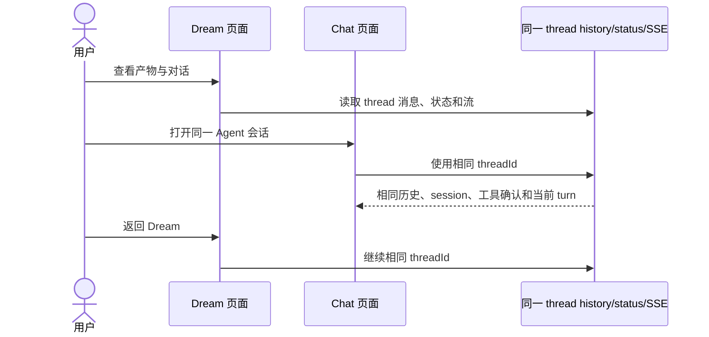
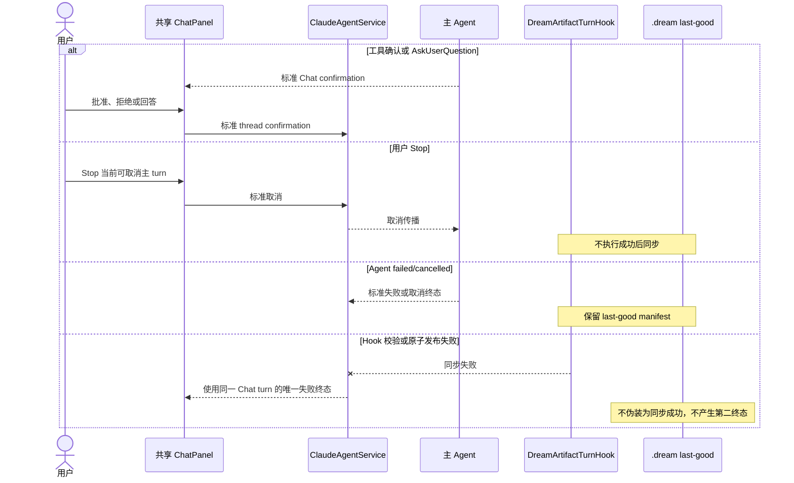
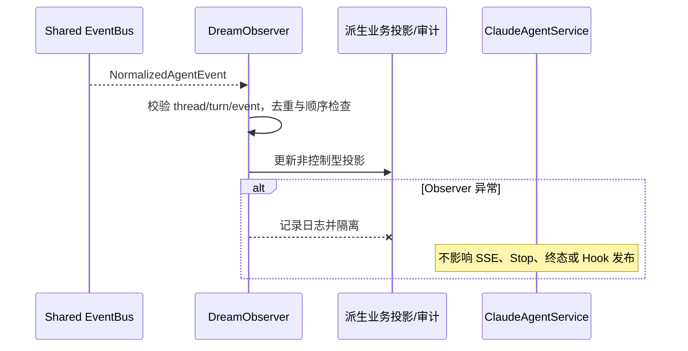

# Dream Agent 全业务交互设计

> 本文描述当前业务目标。Dream 是共享 Chat thread 上的创作工作台，不是第二套 Agent
> runtime，也不是按固定步骤推进的剧本生产状态机。

## 1. 业务边界

Dream 包含以下能力：

1. 用户发起一个有权限、可审计的 Dream Run，并复用一个 Chat thread；
2. 首次初始化默认引导 `/drama-init`；
3. 此后用户可以任意、重复执行当前 Deck 实际安装的 Skill；
4. 主 Agent turn 前后由宿主 Hook 检查 canonical 工作台并自动同步 `.dream`；
5. Dream 和 Execution 页面只读展示已经构建的 Project/Episode 产物；
6. 对话、工具确认、Stop、历史恢复和 Claude session 全部沿用 Chat。

不包含：阶段推荐按钮、next action、completion fact、Skill DAG、Episode action POST、
“只允许当前步骤”的服务端校验，以及由 Observer 推进的文件同步。

## 2. 发起 Dream 与首次初始化

浏览器不能提交工作区绝对路径、thread 所有权或 Claude session ID。首次初始化是默认产品
行为，不代表后续 Skill 必须按表格顺序执行。`pending_review → confirmed` 只服务首次
初始化确认；它不推导 Episode 下一步，也不在后续 Skill 之间流转。

## 3. Chat 输入 `/` 与 Skill 推荐

Slash 菜单不读取 Episode 阶段，不排序“下一步”，不隐藏可随机执行的 Skill。查询失败时
退化为普通文本输入，不阻塞 Chat。

## 4. 十三个业务 Skill

| 指令 | 业务用途 | 典型产物 |
|---|---|---|
| `/drama-init` | 项目初始化 | `project.yaml`、核心角色弧光、弧光台账、题材包 |
| `/drama-plan` | 分集规划 | 分集大纲、`character_beats`、节奏曲线、伏笔地图 |
| `/drama-script` | 剧本创作 | `script.md` |
| `/drama-asset` | 视觉资产设定 | 角色卡、场景卡、道具卡 |
| `/drama-storyboard` | 分镜设计 | `storyboard.yaml` |
| `/drama-prompt` | Prompt 生成 | Prompt package |
| `/drama-render` | 渲染指引 | 渲染参数与拼接方案 |
| `/drama-voice` | 配音 | 配音脚本与声线路由 |
| `/drama-edit` | 后期整合 | 剪辑、字幕、音效、转场清单 |
| `/drama-promote` | 宣发 | 封面、投放文案、数据策略 |
| `/drama-query` | 状态查询 | Project/Episode 事实摘要 |
| `/drama-doctor` | 项目体检 | 一致性检查与修复建议 |
| `/drama-payoff` | 爽点规划与审查 | 爽点蓝图、证据审查、债务审计 |

除首次 `/drama-init` 外，表格顺序不表达依赖、阶段或推荐关系。

## 5. 任意 Skill 的主 Agent turn

主 Agent 可以不调用 Story Workspace MCP。MCP 只辅助 Agent 主动预览或写受控 stage，
不能承担自动同步正确性。

## 6. Hook 自动同步与 Project/Episode 关联

Hook 比较 turn 前后摘要用于审计“本轮改了什么”，但发布的是 turn 成功后的完整当前
快照，因此用户随机调用 Skill 或重复修改同一文件都能收敛。相同字节是 no-op。

## 7. 页面读取与自动刷新

GET 不启动 Agent、不恢复任务、不写绑定，也没有“手动构建关联”按钮。页面只通过轮询和
精确 Run 输出失效信号读取最新事实。

## 8. Dream 与 Chat 切换

切换页面不重发首轮消息，不创建新 thread，不修改 `claude_session_id` 或
`resume_existing_session` 语义。用户消息和内部 JSON 正文均按 Chat 既有可见性显示，
Dream 不做正文脱敏或额外过滤。

## 9. 工具确认、Stop、失败与取消

## 10. Observer 边界

Observer 不扫描文件、不重试发布、不创建 binding、不派发 Skill、不改变 thread 或 Workflow
生命周期。业务正确性所需的同步留在成功边界 Hook。

## 11. 权限与数据完整性

- 每次写操作重验用户身份、thread 所有权、Run、Workspace、Deck binding 和 revision；
- workspace、Run-private 和 Project/Episode 路径只由服务端派生；
- 文件读取拒绝 traversal、符号链接、非法编码、超限数量和大小；
- 内容文件先写，`manifest.json` 最后原子提交；
- 统一 Chat 协议不降低 Workflow 和 Artifact 业务权限；
- `.dream` 是当前 Run preview，不替代 Admin sealed Artifact 合同。
