# DreamAgent 全业务交互设计

> Status: **current-worktree business interaction specification**. 本文以
> 2026-08-12 当前生产代码、测试和 DreamAgent 收敛设计为事实来源。每一项纳入
> DreamAgent 范围的业务能力都有独立 `sequenceDiagram`；尚无页面调用方或仍需
> 产品判断的能力会显式标为“后端已实现 / UI 未接入”或“待业务确认”，不会画成
> 已交付事实。

## 1. 本文解决什么问题

[Interaction design](./interaction-design.md) 证明 canonical thread runtime 的
发送、增量、确认、Stop、失败和重连行为；[Lifecycle](./lifecycle.md) 证明状态转换。
本文回答另一组问题：

- 用户在 Dream 里要完成哪些业务任务？
- 每个操作会调用哪个 API、写哪份数据、由谁授权？
- ClaudeAgentService、Dream workflow、文件系统、Episode 和 Story Index 如何协作？
- 页面上的提示、轮询和 Observer 哪些只是展示，哪些才是业务真值？
- 当前代码已经实现什么，哪些只有后端能力，哪些仍需产品方确认？

本文不恢复 Dream Event/SSE，不把 workflow 命令误称为对话协议，也不让
Observer、页面草稿或 Agent transcript 成为业务真值。

## 2. 我对 DreamAgent 业务的总体理解

Dream 是“一次创作提案 → 人物/场景/分镜草稿 → 用户整体验收一次 → 同一 Agent
执行 Episode 生产”的工作空间，不是普通聊天换皮，也不是逐项审批系统。

业务分为四个互不替代的层：

| 层 | 业务职责 | 权威 owner | 禁止替代它的来源 |
|---|---|---|---|
| 对话层 | 用户消息、增量文本、工具确认、AskUser、Stop、历史、重连 | canonical Chat thread + `ClaudeAgentService` | WorkflowRun、Observer、页面局部状态 |
| Dream 内容层 | `characters`、`scenes`、`storyboards` 及 revision | canonical workspace files + `.dream/runtime` writer/reader | Agent 文本、Observer hint、浏览器缓存 |
| Workflow 层 | preflight/queued/running/output_validating/pending_review/confirmed/rejected/completed/failed/cancelled | `WorkflowRunService` 和领域 owner 证明的 transition | thread `finish`、文件存在、spinner |
| 下游执行层 | Episode binding、artifact、下一步 action、Story Index | Episode/Story Index services + ETag/revision facts | Dream stage、Chat transcript、local selection |

主业务链是：

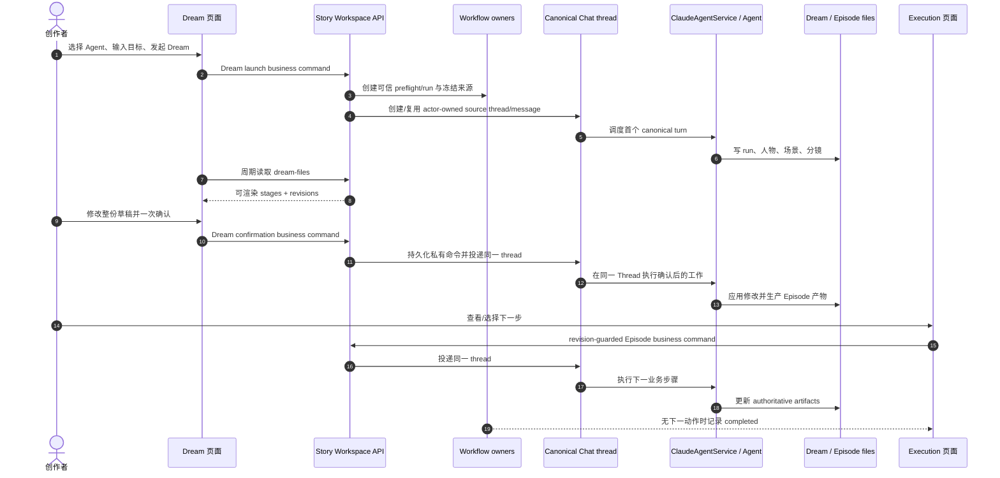

## 3. 全业务能力覆盖矩阵

| ID | 业务能力 | 当前入口 | 权威数据/写入 | 当前实现状态 | 时序图 |
|---|---|---|---|---|---|
| B01 | Dream 入口与可恢复列表 | `/story-workspace/dream` | actor-scoped WorkflowRun 查询 | UI + API 已实现 | §4 |
| B02 | 发起一次 Dream | Dream launch form | source thread/message + preflight + WorkflowRun | UI + API 已实现 | §5 |
| B03 | runtime 激活与首轮 Agent | context assembly / verified workspace manifest | runtime receipt + Agent session + WorkflowRun | 目标实现 | §6 |
| B04 | 人物/场景/分镜产出 | Dream MCP writer | canonical files + `.dream` revisions | 已实现 | §7 |
| B05 | Dream 文件读取、轮询与页面渲染 | Dream page | actor-scoped read-only projection | 已实现 | §8 |
| B06 | 本地修改与一次业务确认 | Dream footer | 唯一私有 confirmation message + WorkflowRun facts | 已实现 | §9 |
| B07 | Dream 内对话与 Dream↔Chat 切换 | shared `ChatPanel` | canonical thread | 已实现 | §10 |
| B08 | 工具确认、AskUser、network/reject-only | shared confirmation dock | per-turn server policy/Future | 已实现 | §11 |
| B09 | Observer 业务活动提示 | EventBus → dream-files | bounded process-local display hint | 已实现；非真值 | §12 |
| B10 | 可恢复私有业务命令投递 | confirmation/episode coordinators | private message + claim/lease | 已实现；不包含通用 Guidance | §13 |
| B11 | 已确认/失败 Run 的通用 Guidance | `POST /runs/{run}/guidance` | private guidance message + best-effort immediate dispatch | API + hook 已实现；页面未接入且无自动恢复证明 | §14 |
| B12 | Chat Stop 与 Workflow Cancel | Chat Stop / workflow cancel API | thread terminal / WorkflowRun status | Chat Stop UI 已实现；Cancel API/hook 无 Dream 页面调用；联动语义待确认 | §15 |
| B13 | 失败后的 Workflow Retry | workflow retry API | 新 attempt、`retry_of_run_id`、同 source thread | API + hook 已实现；Dream 页面未接入 | §16 |
| B14 | 确认后进入 Execution | Dream “查看后续执行” | durable confirmation facts | 已实现 | §17 |
| B15 | 首个 Episode binding 恢复 | Execution action | server-owned binding fact | 已实现 | §18 |
| B16 | Episode 下一步选择与继续 | Execution Agent actions | action projection + ETag + private command | 已实现 | §19 |
| B17 | Episode artifact 读取与渐进降级 | Execution reader | bound artifacts + last-good/revision | 已实现 | §20 |
| B18 | Story Index 检查与 reconcile | Execution Story Index | PostgreSQL materialization + ETag | 已实现 | §21 |
| B19 | Workflow 最终完成 | Episode owner / Dream MCP | no-next-action fact + WorkflowRun transition | 服务端已实现 | §22 |
| B20 | 权限、幂等、并发与冲突恢复 | 所有写 API | actor/thread/run/revision/lease | 已实现 | §23 |
| B21 | 通用结构化故事输出边界 | 非 Dream canonical Chat turn | Story Workspace story tables | 已实现但 Dream context 明确跳过 | §24 |

## 4. B01 — Dream 入口与可恢复列表

**业务意图**：用户打开 Dream 时，同时看到可用 Agent 发起表单和自己可恢复的
Dream；浏览器本地缓存不能决定有哪些 run。

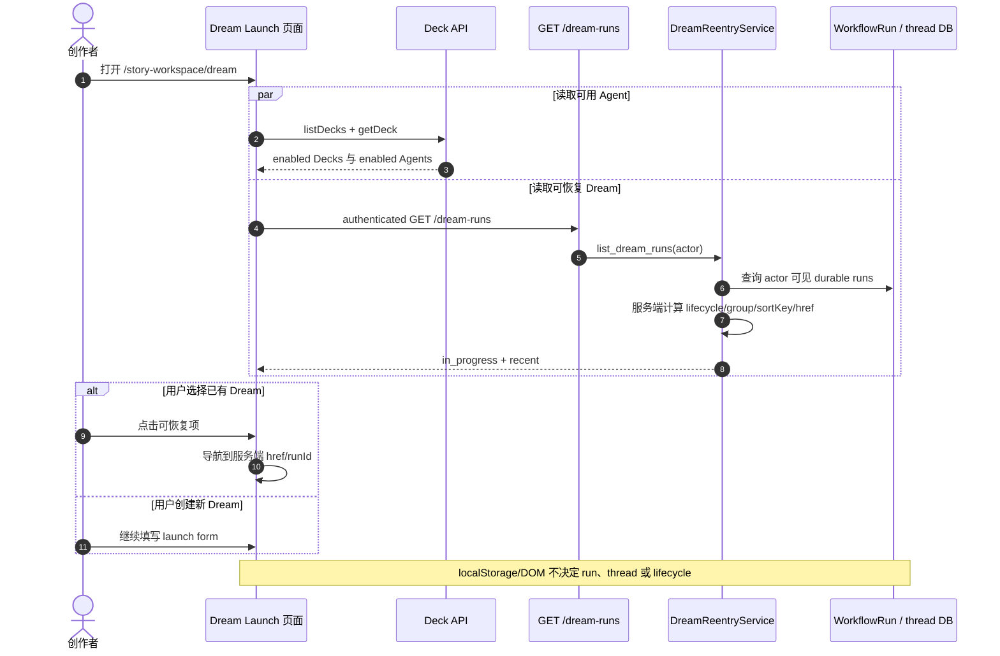

**规则**：列表读取失败不阻止新建；跨 actor run 不出现；live-turn lookup 只帮助
服务端排序/文案，不成为 terminal truth。

**证据**：`StoryWorkspaceDreamLaunch.tsx`、`useStoryWorkspaceDreamRuns.ts`、
`dream_reentry_service.py`、`test_story_workspace_dream_reentry.py`。

## 5. B02 — 发起一次 Dream

**业务意图**：用户只选择 enabled Deck/Agent 并输入目标；thread、message、run、
workspace、binding、snapshot 和 plugin lock 全由服务端建立。

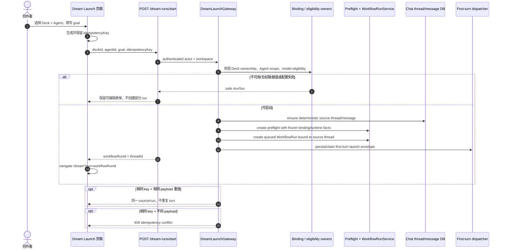

**权限边界**：浏览器不得提交 provenance、adapter spec、runtime snapshot 或
plugin lock；跨 actor Deck 在 source 创建前拒绝。

**证据**：`dream_launch_service.py`、`dream_launch_gateway.py`、
`test_story_workspace_dream_launch_api.py`。

## 6. B03 — runtime 激活与首轮 Agent

**业务意图**：收到 201 只表示可信 run 已创建并排队；服务端必须在 context
assembly 中完成 Thread 映射、workspace/plugin 验证与 runtime receipt，之后
WorkflowRun 才能进入 running。

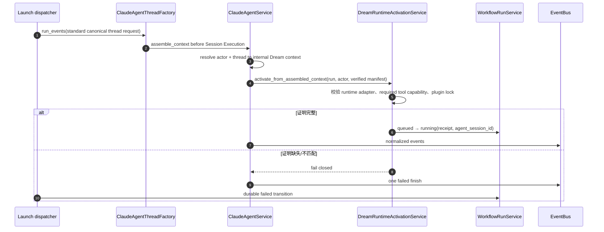

**规则**：201、task accepted、SDK assistant text 都不是 running/completed 的充分
证据；运行激活失败必须先于可信 Dream output。

**证据**：`dream_runtime_activation_service.py`、`claude_agent/service.py`、
`test_story_workspace_dream_runtime_activation.py`。

## 7. B04 — 人物、场景、分镜产出与 revision

**业务意图**：Agent 通过受控 Story Workspace 工具逐步写三类内容；前端消费的是
可验证的 stage projection，不消费 Agent 自述“已完成”。

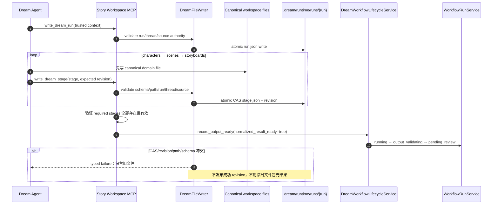

**规则**：`.dream/workspace.json` 是静态启动层，Agent 不得修改；普通文件工具不得
写 `.dream/**`；canonical 内容与 stage index 各有 owner。

**证据**：`story_workspace_tool.py`、`dream_file_service.py`、
`test_story_workspace_dream_files.py`。

## 8. B05 — Dream 文件读取、轮询与页面渲染

**业务意图**：页面可逐步展示已完成 stage，并保留 last successful snapshot；GET
不得启动、恢复或调度 Agent。

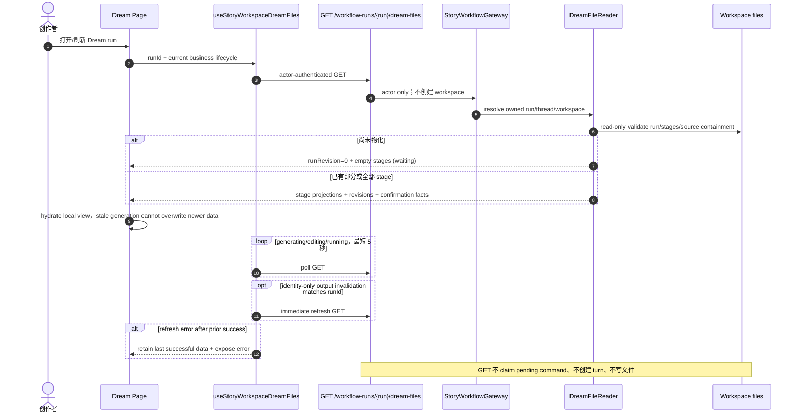

**规则**：GET 始终只读；轮询频率只由页面展示生命周期决定，网络失败时保留旧快照，
任何 GET、刷新或 Observer invalidation 都不得恢复 pending command 或创建 SDK turn。

**证据**：`useStoryWorkspaceDreamFiles.ts`、`dream_file_service.py`、
`test_story_workspace_dream_api.py`、S14 acceptance。

## 9. B06 — 本地修改与一次业务确认

**业务意图**：人物、场景、分镜允许字段先作为本地草稿统一修改；required stages
齐全后只提交一次业务确认，之后 Workflow 保持 `confirmed`，实际 Agent 执行状态由
shared Thread lifecycle 展示，而不是引入新的业务阶段或逐项审批。

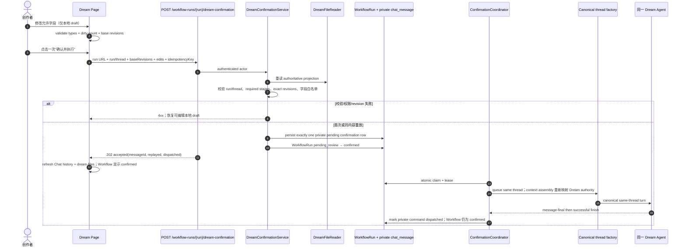

**关键边界**：这是 run-scoped **业务写命令**，不是 run-scoped 对话 transport。
它不产生 Dream SSE；真正的 Agent turn 仍走同一 canonical thread。

**证据**：`StoryWorkspaceDreamPage.tsx`、`dream_confirmation_service.py`、
`test_story_workspace_dream_confirmation.py`。

## 10. B07 — Dream 内对话与 Dream↔Chat 切换

**业务意图**：Dream 的 Agent 面板是同一 Chat thread 的另一种布局；页面切换不
重新发送首轮消息，也不产生第二历史。

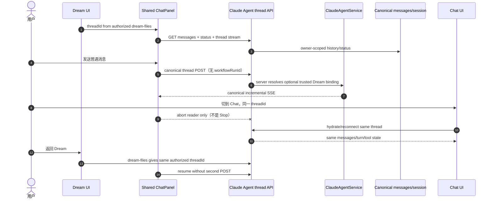

**规则**：普通对话 send/history/status/stream/confirm/stop 不携带 workflowRunId；页面
切换只释放当前 reader，只有用户显式 Stop 才取消主 turn。

**证据**：`StoryWorkspaceDreamThreadChat.tsx`、`ChatPanel.tsx`、S01–S03/S09–S10。

## 11. B08 — 工具确认、AskUser、network 与 reject-only

**业务意图**：Dream 与 Chat 对同一 tool call 展示完全相同的确认；业务页面不能
自行批准服务端标记为 reject-only 的行为。

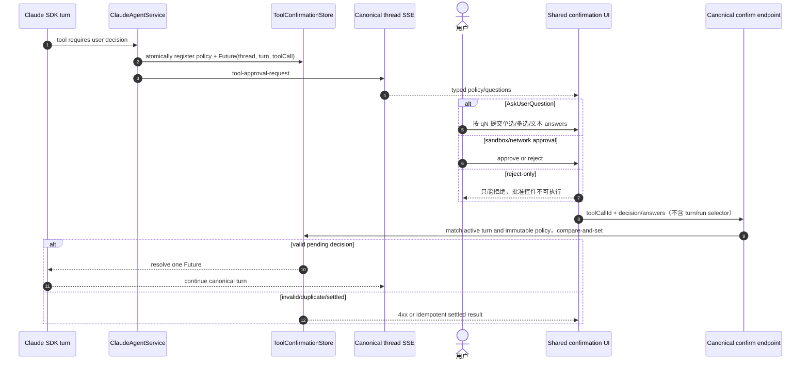

**规则**：浏览器只能回答服务端已登记的精确 tool call；确认策略、active turn 和
reject-only 限制均由服务端决定，Dream 页面不得维护独立 confirmation reducer。

**证据**：`tool_confirmation_store.py`、`ChatPanel.tsx`、S04。

## 12. B09 — Observer 业务活动提示

**业务意图**：业务页面可以显示“正在生成内容/执行 workflow/需要重新读取”，但
不能用 Observer 的 terminal、tool 或 subagent hint 改写 Chat 或 Workflow 状态。

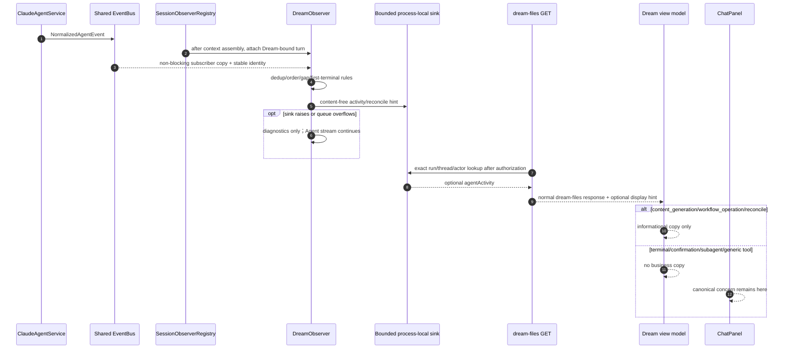

**关键边界**：Observer 是有界、可丢弃的展示投影；它不持久化 Agent transcript，
不迁移 WorkflowRun，不完成 thread，也不反向调用 `ClaudeAgentService`。

**证据**：`dream_lifecycle_observer.py`、`dreamViewModel.ts`、S11–S12。

## 13. B10 — 私有业务命令投递与启动恢复

**业务意图**：Dream confirmation 和 Episode action 即使在提交后进程退出，也
不能丢失或重复执行；恢复发生在 coordinator startup/reconcile，不发生在业务
GET。通用 Guidance 当前不走这套 claim/lease，必须单独审查。

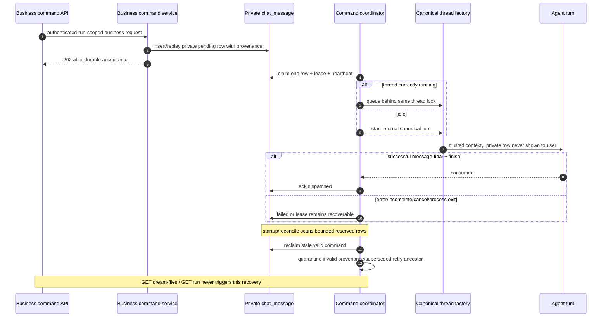

**规则**：202 只在私有命令持久化后返回；执行权通过原子 claim/lease 获取，只有同一
canonical turn 成功结束后才能 ack。通用 Guidance 明确不在这条恢复链内。

**证据**：`dream_internal_command_service.py`、confirmation coordinator、
`test_story_workspace_dream_internal_commands.py`、
`test_story_workspace_dream_internal_recovery.py`。

## 14. B11 — 已确认/失败 Run 的通用 Guidance

**业务意图**：拥有权限的 confirmed 或 failed run 可以向同一 Agent thread 注入一次
free-text 或 retry-step 指导；它不是公开 Chat 消息。

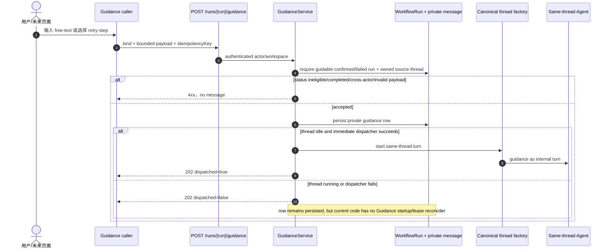

**当前事实**：API、service、hook 和测试存在，但生产 Dream/Execution 页面没有
调用 `submitStoryWorkspaceGuidance`。Execution 的“补充创作要求”属于 Episode
Action `userGuidance`，不是该 API。Guidance 的 202 durable acceptance 也不等于
最终已交付；当 thread 正在运行时会返回 `dispatched=false`，当前源码不能证明它会
像 confirmation/Episode command 一样自动恢复。

**待业务确认**：是否需要一个独立“指导 Agent”入口；若需要，是把它迁到 B10 的
durable claim/lease coordinator，还是明确提供用户重试/待处理状态？若不需要，应
删除未使用的 frontend hook/API 暴露，而不是同时保留两个相似 UX。

**证据**：`guidance_service.py`、`useStoryWorkspaceGuidance.ts`、
`test_story_workspace_guidance.py`。

## 15. B12 — Chat Stop 与 Workflow Cancel

**业务意图**：Stop 结束当前主 turn；Cancel 结束 WorkflowRun。它们的身份、owner
和终态不同，不能靠页面按钮文字假设自动联动。

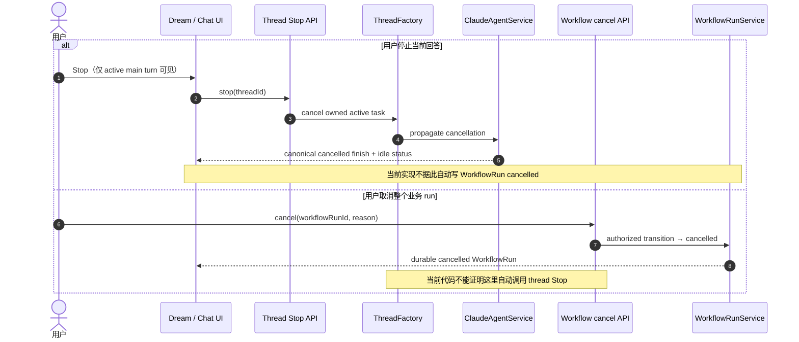

**待业务确认**：产品是否需要“取消整个 Dream”按钮同时执行 Stop + Workflow
Cancel？若需要，必须由一个服务端 orchestration command 定义顺序和部分失败补偿，
不能让前端并发调用两个 endpoint 猜结果。

**证据**：`thread_factory.py`、Story Workspace workflow run routes、
`test_claude_agent_thread_factory.py`、`test_server_claude_agent.py`、
`test_workflow_run.py`、`StoryWorkspaceDreamAgentLayout.test.ts`。

## 16. B13 — 失败后的 Workflow Retry

**业务意图**：失败、拒绝或取消的 attempt 不能改回 queued；retry 创建新 attempt，
冻结原来源并保留同一 source thread，binding resolver 只选择合法 retry leaf。

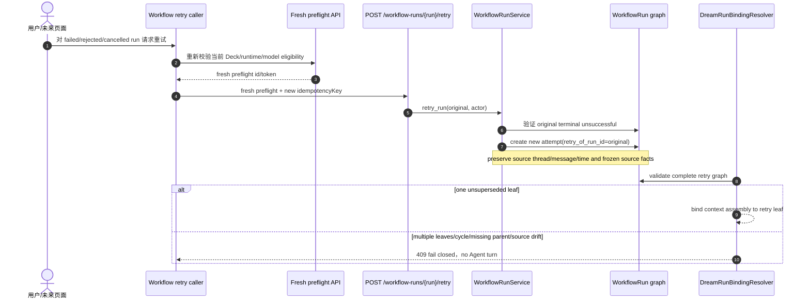

**当前事实**：backend API 和 `useWorkflowRun.retryRun` 存在，但 Dream 页面没有
调用；retry API 本身创建新 queued attempt，本文不把后续 dispatch 画成同步副作用。

**待业务确认**：Dream UI 是否需要失败详情与 retry 入口，及新 attempt 创建后由谁
显式激活/导航。

**证据**：WorkflowRun service/routes、`useWorkflowRun.ts`、
`test_workflow_run.py`、`test_claude_agent_dream_binding_resolver.py`。

## 17. B14 — 确认后进入 Execution

**业务意图**：durable `confirmationAccepted` 是 Execution route 的权限门槛；
`confirmationDispatched` 决定 Dream 页面是否主动展示“查看后续执行”以及 Agent 接续
文案。local “已确认”状态或 Chat finish 都不能代替这两个事实。

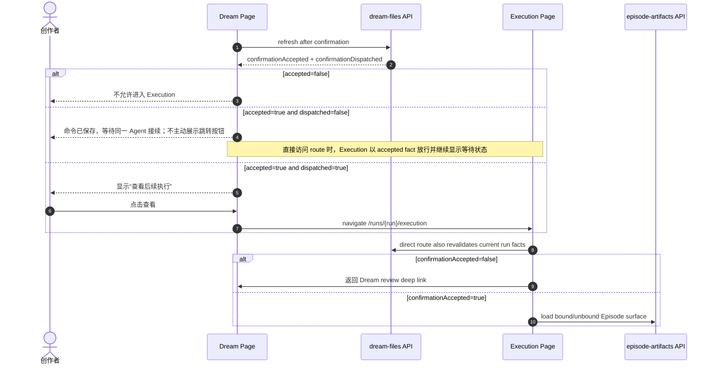

**规则**：Execution route 以 `confirmationAccepted` 放行；
`confirmationDispatched` 只控制 Dream 主动跳转入口和等待文案，不能升级为第二个权限
条件或 workflow terminal。

**证据**：`StoryWorkspaceDreamPage.tsx`、`StoryWorkspaceExecutionPage.tsx`、
`dreamViewModel.ts`。

## 18. B15 — 首个 Episode binding 恢复

**业务意图**：Execution 发现 binding unproven 时，用户只能提交一个不带路径的
“恢复可信第一集关联”意图；具体 story/episode/path 必须由服务端证明。

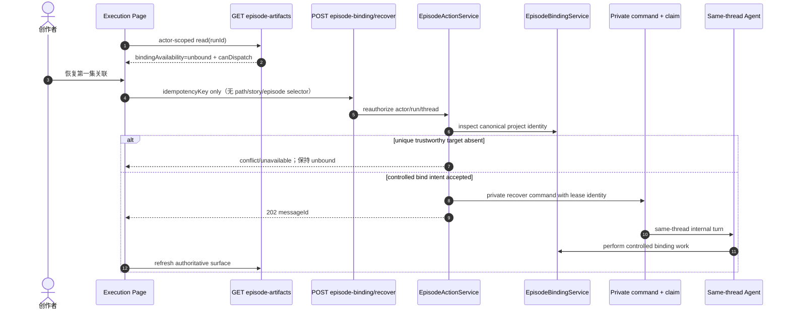

**权限边界**：浏览器只表达“恢复关联”的意图，不能选择 story、episode 或文件路径；
服务端无法唯一证明目标时必须 fail closed。

**证据**：`episode_action_service.py`、`episode_binding_service.py`、
`test_story_workspace_episode_actions.py`。

## 19. B16 — Episode 下一步选择与继续

**业务意图**：页面不自行推断下一步。服务端根据 artifact/review/completion facts
给出有序 action options；用户可选择可执行项并附加自然语言偏好。

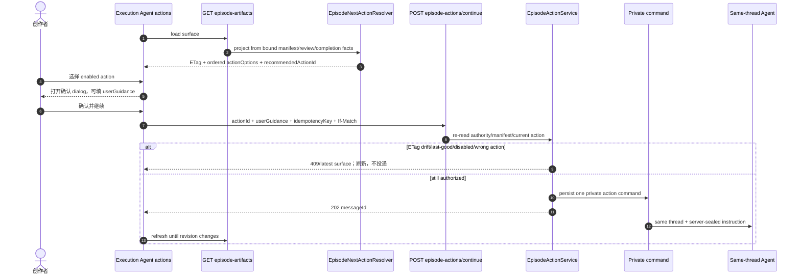

**规则**：`userGuidance` 是当前 action 的偏好，不得包含命令、secret 或敏感路径；
server private workflow mapping 决定实际步骤。

**证据**：`episode_action_service.py`、current Episode action resolver、
`test_story_workspace_current_episode_action_projection.py`、
`test_story_workspace_episode_actions.py`、
`StoryWorkspaceExecutionEpisodeIntegration.test.ts`。

## 20. B17 — Episode artifact 读取与渐进降级

**业务意图**：一个 artifact 损坏不能让整个工作台白屏；页面可显示 last-good，但
last-good/diagnostic 状态下不能派发新的 action。

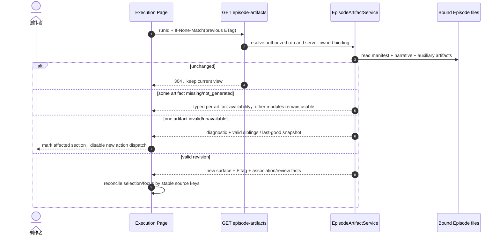

**规则**：artifact GET 不修复 binding、不写文件；last-good 只维持可读性，不能成为
新的 action authority 或允许写命令的依据。

**证据**：`episode_artifact_service.py`、`useStoryWorkspaceEpisodeArtifacts.ts`、
`design_010` 与对应 component/service tests。

## 21. B18 — Story Index 检查与 reconcile

**业务意图**：Story Index 把 authoritative artifacts materialize 到 PostgreSQL 供
列表/Admin 使用；普通 GET 只比较，不写数据库，显式 reconcile 才写一个 revision。

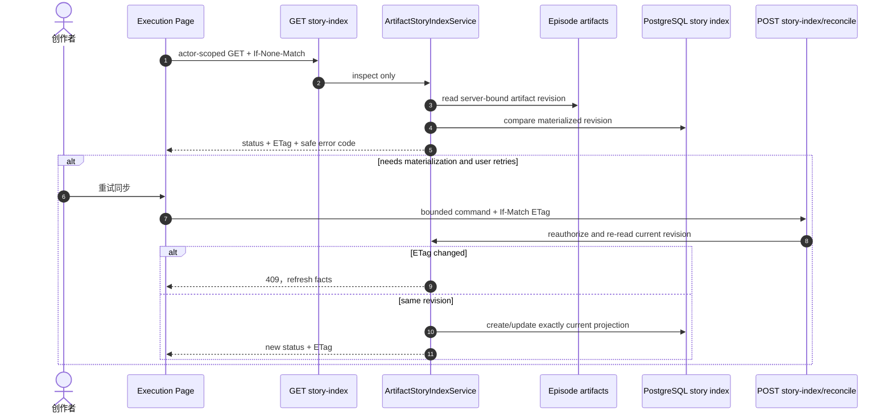

**规则**：普通 GET 只比较；只有用户触发、重新授权且 revision/ETag 仍匹配的
reconcile 才能 materialize 当前投影。

**证据**：`artifact_story_index_service.py`、
`artifact_story_index_reconcile.py`、`useStoryWorkspaceStoryIndex.ts`。

## 22. B19 — Workflow 最终完成

**业务意图**：Agent thread 正常 finish 不等于 Dream workflow completed。只有
Episode owner 证明当前无下一 action，才能完成 run。

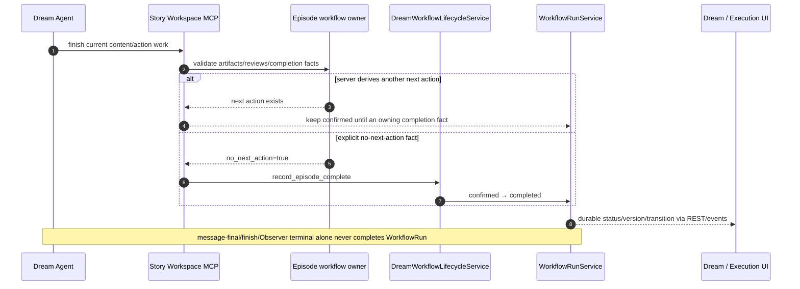

**关键边界**：只有 Episode/workflow owner 提供的显式 no-next-action fact 能完成 run；
thread finish、Observer terminal、文件存在或页面进度均不能代替该证明。

**证据**：`dream_workflow_lifecycle_service.py`、`story_workspace_tool.py`、
`test_story_workspace_dream_runtime_activation.py`。

## 23. B20 — 权限、幂等、并发与冲突恢复

**业务意图**：所有业务写都先授权和重读权威 revision；超时后先 GET，不允许用户
靠重复点击创建第二 run、confirmation 或 Episode action。

```mermaid
sequenceDiagram
    autonumber
    actor User as 用户
    participant UI as Dream/Execution UI
    participant API as Business API
    participant Auth as Actor/run/thread/binding guard
    participant Owner as Domain owner
    participant Store as DB/files/lease

    User->>UI: 发起写操作
    UI->>API: idempotencyKey and/or If-Match/baseRevision
    API->>Auth: authenticate actor + owned workspace/run/thread
    alt unauthorized or identity mismatch
        Auth-->>UI: 403/404-safe response，no existence leak，no write
    else authorized
        API->>Owner: re-read authoritative current facts
        Owner->>Store: atomic insert/CAS/claim
        alt same key + same fingerprint
            Store-->>UI: replay original identity/result
        else same key + changed payload or stale revision
            Store-->>UI: 409，no overwrite
        else concurrent identical requests
            Store-->>UI: exactly one winner，others replay/busy/conflict
        end
    end
    opt network timeout leaves result unknown
        UI->>API: GET authoritative state first
        API-->>UI: decide replay vs new command from durable fact
    end
```

**规则**：workflow run ID 可以出现在 workflow business API；不得出现在 Chat
send/history/status/stream/confirm/stop。文件路径、actor、turn 和 lease owner 不由
浏览器选择。

**证据**：`dream_confirmation_service.py`、`dream_internal_command_service.py`、
`episode_action_service.py`、`artifact_story_index_reconcile.py` 及各自的
permission/idempotency/concurrency tests。

## 24. B21 — 通用结构化故事输出与 Dream 边界

**业务意图**：普通 canonical Chat 如果最终输出完整结构化 story bundle，可以
投影到 Story Workspace 数据表供列表/Admin 消费；Dream-bound turn 则以文件和
workflow owner 为真值，明确跳过该通用投影。

```mermaid
sequenceDiagram
    autonumber
    participant Service as ClaudeAgentService
    participant Turn as Completed canonical turn
    participant Parser as Agent story bundle parser
    participant StoryDB as Story Workspace tables
    participant DreamFiles as Dream authoritative files
    participant UI as Story/Admin consumers

    Turn-->>Service: full assistant text + canonical finish
    alt assembled turn has internal Dream context
        Service->>DreamFiles: no generic story-table write
        Note over Service,DreamFiles: Dream content remains MCP/files/workflow-owned
    else ordinary Chat and full text is valid story JSON bundle
        Service->>Parser: parse complete bundle
        Parser->>StoryDB: transactional idempotent story/character/scene upsert
        StoryDB-->>UI: generated story available to normal consumers
        opt store fails
            Service->>Service: log safely，do not change Chat terminal
        end
    else ordinary prose or invalid candidate
        Service->>Service: skip projection
    end
```

**关键判断**：真实 `hy3-preview` generic-thread proof 验证的是 shared Chat/Gateway/
model/accounting path，不应被写成 Dream terminal workspace binding 或 Dream 文件产出
证明。

**证据**：`claude_agent/service.py`、`agent_integration.py`、
`test_story_workspace_agent_integration.py`。

## 25. API 与业务副作用总表

| API | 类型 | 允许的业务副作用 | 不允许的副作用 |
|---|---|---|---|
| `GET /dream-runs` | 只读 | 无；服务端排序/projection | 创建 run/thread、恢复 pending command |
| `POST /dream-runs/start` | 业务写 | source thread/message、preflight、run、first-turn pending dispatch | 接受浏览器 provenance |
| `GET /workflow-runs/{run}/dream-files` | 只读 | 无；可读取 optional Observer hint | 写文件、调度 turn、transition workflow |
| canonical thread POST/stream/status | 对话 | 一次 canonical turn 和消息/session 状态 | 接受 workflowRunId、写 Workflow 状态 |
| canonical tool confirm | 对话控制 | resolve exact pending server policy/Future | 接受 run/turn selector、创建业务 confirmation |
| `POST .../dream-confirmation` | 业务写 | 唯一私有 confirmation、confirmed transition、同 thread dispatch | 新 Dream SSE、公开 confirmation bubble |
| `POST /runs/{run}/guidance` | 业务写 | 私有 guidance message、同 thread turn | 允许非 confirmed/failed run 或 duplicate drift |
| `POST .../episode-binding/recover` | 业务写 | path-free controlled recovery command | 接受 story/episode/path selector |
| `POST .../episode-actions/continue` | 业务写 | current ETag/action 的私有命令 | 使用 stale/last-good action |
| `GET .../episode-artifacts` | 只读 | 无；304/typed degradation | 修复 binding、写 artifacts |
| `GET .../story-index` | 只读 | 无；比较 artifacts 与 DB | materialize |
| `POST .../story-index/reconcile` | 业务写 | revision-guarded materialization | 覆盖更新后的 revision |
| `POST .../cancel` | Workflow 控制 | durable cancelled transition | 隐式声称 Chat Stop 已成功 |
| `POST .../retry` | Workflow 控制 | fresh retry attempt preserving frozen source | 复活原 attempt、自动声称已 dispatch |

## 26. 需要业务方确认的判断

以下不是实现猜测，而是当前源码与历史 PRD 之间仍需明确的产品选择：

1. **取消语义**：需要一个“一键取消整个 Dream”服务端 orchestration，还是继续让
   Chat Stop 与 Workflow Cancel 分开？当前分开。
2. **失败/重试 UI**：早期 PRD 明确“不做失败、重试业务分支”，但 backend/hook 已
   支持。Dream 页面是否应该正式提供失败详情和 retry？当前没有。
3. **通用 Guidance**：是否保留独立 Guidance UX？当前只有 API/hook，无页面调用；
   Episode dialog 已有另一套 `userGuidance`。
4. **确认后的编辑权**：当前 confirmation accepted 后 Dream 内容进入 read-only，
   不支持第二次确认。这是否仍是最终产品规则？
5. **Episode action 选择**：当前允许选择服务端投影的多个 enabled options，而不仅
   是 recommended action；这是否符合业务期望？
6. **最终完成展示**：Workflow completed 由 no-next-action fact 决定。产品是否还
   需要“完成后导出/发布”动作？当前不属于 DreamAgent。
7. **Observer 文案**：当前只展示 content/workflow/reconcile。是否需要展示 subagent
   进度？若需要，应由 `ChatPanel` 展示，不能扩张 business projection truth。
8. **generic story projection**：Dream-bound turn 明确跳过通用 story bundle 持久化；
   Dream 成果进入 Story/Admin 应通过 Story Index/明确导出，而不是 assistant JSON。

## 27. 业务验收提问与我的当前答案

| # | 业务方应审查的问题 | 本设计当前答案 |
|---|---|---|
| 1 | 用户发起 Dream 时可以提交哪些字段，哪些身份由服务端决定？ | 用户提交 enabled `deckId`、`agentId`、goal 和 idempotency key；actor、workspace、source thread/message、provenance、runtime snapshot、binding 和 plugin lock 均由服务端决定。 |
| 2 | Agent 文本、Observer hint、Dream stage 与 WorkflowRun 分别证明什么？ | Agent 文本证明对话输出；Observer hint 只证明近期展示活动；Dream stage/revision 证明 canonical 内容；WorkflowRun transition 证明业务生命周期。四者不可互相覆盖。 |
| 3 | 为什么 `dream-confirmation` 可以携带 run ID，却不构成旧 run-scoped 对话协议？ | 它是一次有权限和 revision 约束的 workflow 业务写命令，只持久化私有控制行；后续 Agent turn 仍通过同一 canonical thread transport/history/SSE 执行。 |
| 4 | 用户修改内容何时真正写入 canonical workspace？ | 编辑时只在浏览器 local draft；一次确认被服务端接受后，私有命令交给同一 Agent，由受控 Story Workspace 工具按 revision/CAS 写 canonical 文件。 |
| 5 | 确认 202、Agent finish 和 Workflow completed 有什么区别？ | 202 只证明命令 durable accepted；Agent finish 只结束当前 thread turn；只有 Episode/workflow owner 的 no-next-action 事实才能把 WorkflowRun 置为 completed。 |
| 6 | Stop、Cancel、Retry 当前是否自动联动？ | 不自动联动。Stop 取消 active main turn，Cancel 终止当前 WorkflowRun，Retry 创建新 attempt；一键编排是否需要属于 §26 的产品选择。 |
| 7 | 页面为什么可以显示 last-good，却不能基于 last-good 派发 Episode action？ | last-good 用于局部 artifact 损坏时保持可读性，但它不是当前 revision/ETag authority；基于它写入会把旧决策应用到新状态。 |
| 8 | Episode action 的下一步是谁计算的，浏览器能否指定任意命令？ | 服务端 resolver 从当前 binding/artifact/review/completion facts 投影允许项；浏览器只能回传当前 option 的 actionId、ETag、idempotency key 和可选偏好，不能指定任意命令或路径。 |
| 9 | GET dream-files 是否会恢复 pending Agent？ | 不会。GET 只做 actor-scoped 文件/projection 读取；pending command 只能由明确的 startup/reconcile coordinator 恢复。 |
| 10 | Dream 输出为什么不会进入 generic assistant-JSON story persistence？ | Dream-bound turn 以 MCP/files/workflow owner 为真值，并在 generic story-bundle projection 前显式跳过；需要进入 Story/Admin 时走 Story Index 或未来明确导出。 |

若任何答案与业务意图不一致，应先修改 §26 的产品裁决，再修改对应时序图和实现；
不得只改页面文案掩盖 owner 或副作用差异。

## 28. 源码与测试索引

| 领域 | 核心源码 | 主要测试 |
|---|---|---|
| Launch/reentry | `dream_launch_service.py`, `dream_launch_gateway.py`, `dream_reentry_service.py` | `test_story_workspace_dream_launch_api.py`, reentry tests |
| Dream files | `dream_file_service.py`, `story_workspace_tool.py` | `test_story_workspace_dream_files.py`, `test_story_workspace_dream_api.py` |
| Confirmation/internal command | `dream_confirmation_service.py`, `dream_internal_command_service.py` | confirmation/internal/recovery tests |
| Shared conversation | `claude_agent/service.py`, `thread_factory.py`, `ChatPanel.tsx` | S01–S10, Chat component tests |
| Observer | `dream_lifecycle_observer.py`, `dreamViewModel.ts` | S11–S12, Observer/view-model tests |
| Workflow lifecycle | `dream_workflow_lifecycle_service.py`, `WorkflowRunService` | runtime activation/workflow tests |
| Episode | `episode_action_service.py`, `episode_binding_service.py`, `episode_artifact_service.py` | Episode action/artifact/UI tests |
| Story Index | `artifact_story_index_service.py`, `artifact_story_index_reconcile.py` | Story Index backend/frontend tests |
| Generic story boundary | `agent_integration.py`, `claude_agent/service.py` | `test_story_workspace_agent_integration.py` |
