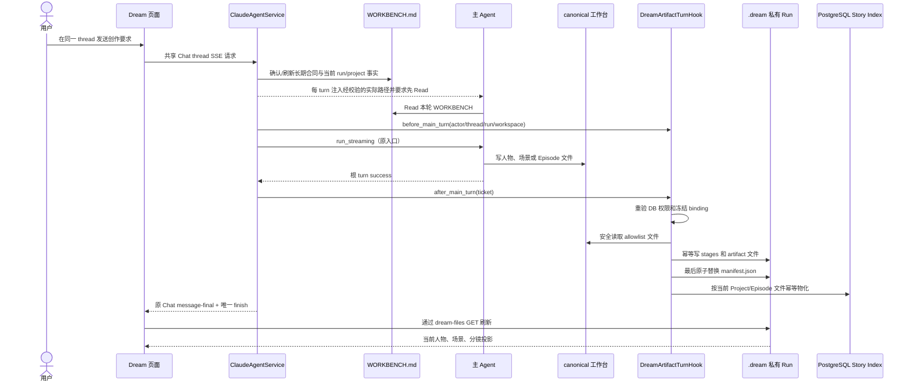
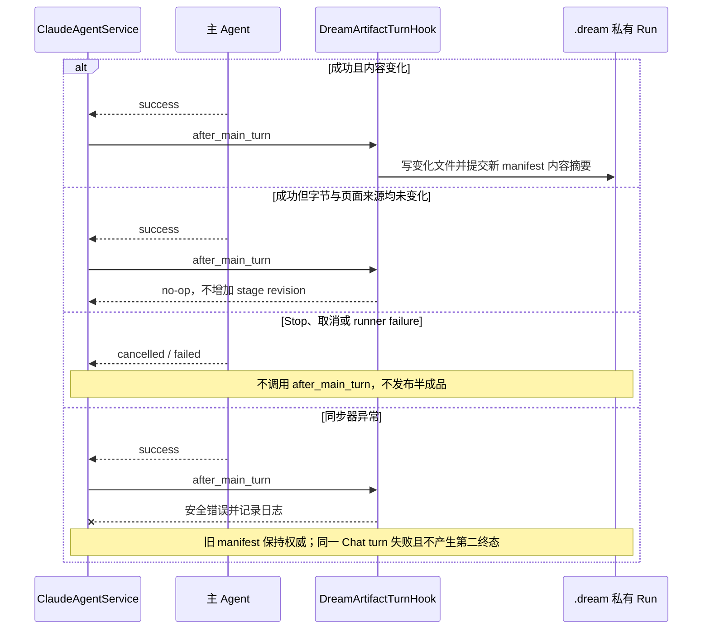
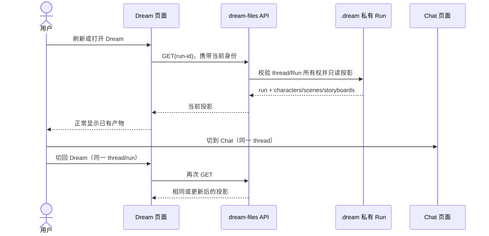
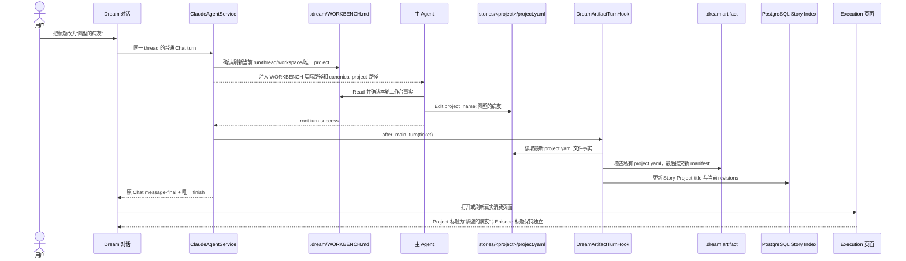

# Dream 工作台文件自动同步

> 状态：已实现最小闭环。本文只定义“主 Agent 写工作台文件、服务端同步到当前 Run 的 `.dream`、Dream 页面读取并展示”。命令编排、next action、checkpoint、通用 revision 工作流和 MCP 重同步不属于本方案。

## 1. 业务目标

Dream 用户在共享 Chat thread 中与主 Agent 对话。Agent 使用普通工作台文件保存创作结果；根 turn 正常结束后，服务端自动把可展示内容和 Project/Episode 核心文件同步到当前 Run 的私有 `.dream` 目录。刷新 Dream 页面后仍能看到同一 Run 的人物、场景和分镜。

两个历史任务只用于确认真实产物范围：

| 对照任务 | 真实产物 | 本方案采用部分 |
|---|---|---|
| `019fcb01-c61c-7f22-9d56-fb38660f042a` | 首次空间产出人物卡、场景卡、分镜并在 Dream 页面逐步展示 | 人物、场景、分镜页面投影 |
| `019fd74e-e06f-7073-a714-fe86cdada2ce` | Project/Episode 文件及后续动作、审查产物 | `project.yaml`、`episode-outline.md`、`script.md`、`storyboard.yaml`、`review-report.md` 文件合同 |

不采用历史任务中的固定阶段、推荐动作、checkpoint 或动作完成状态机。

## 2. 工作台与私有目录

### 2.1 Agent 可写的 canonical 工作台

```text
<shared-root>/<server-derived-thread-key>/
  .dream/WORKBENCH.md  # 服务端维护，Agent 只读
  assets/
    characters/*.{md,yaml,yml}
    scenes/*.{md,yaml,yml}
  stories/<project-slug>/
    project.yaml
    episodes/<EPxx>/
      episode-outline.md
      script.md
      storyboard.yaml
      review-report.md
```

源资产兼容真实历史内容：文件名可以是 Unicode；内容可以是标准 frontmatter、plain YAML，或带一级标题及顶层 `id/name` 字段的 Markdown。所有文件必须位于当前 server-derived thread workspace 内，不能是符号链接，必须为 UTF-8 且受大小和数量上限约束。

### 2.2 服务端拥有的 `.dream`

```text
<shared-root>/<server-derived-thread-key>/.dream/runtime/runs/<run-id>/
  run.json
  stages/
    characters.json
    scenes.json
    storyboards.json
  artifact/
    manifest.json
    stories/<project-slug>/
      project.yaml
      episodes/<EPxx>/
        episode-outline.md
        script.md
        storyboard.yaml
        review-report.md
```

Agent 不使用普通文件工具写 `.dream/**`。`DreamArtifactTurnHook` 使用数据库中的 actor、thread、Run 和冻结 Deck binding 验证当前权限，再由服务端文件服务写入。

`.dream/WORKBENCH.md` 不是页面协议或状态源。静态 Agent 合同由
`backend/story_workspace/dream_workbench_context.md` 唯一维护，首次 Dream surface 初始化时
与 `README.md`、`workspace.json` 一起原子部署。`ClaudeAgentService.assemble_context` 在每个
Dream turn 的插件 pack 后确认或刷新当前 actor-owned thread 反解得到的 run、workspace、唯一
Project 和 Episode 文件事实，再把同步后 `WORKBENCH.md` 的服务端校验实际路径注入本轮消息，
明确要求 Agent 先调用 `Read`。用户后续说“修改标题”时，Agent 因此能够定位唯一
`stories/<project-slug>/project.yaml` 并修改 `project_name`，而不是只依赖历史、返回故事 JSON
或修改 Chat 标题。

## 3. 唯一同步链路

```text
ClaudeAgentService.assemble_context
  → 激活当前 Dream Run
  → Deck workspace 首次初始化原子部署静态 .dream/WORKBENCH.md
  → 每 turn 确认/刷新动态 run/thread/workspace/project/Episode 事实
  → 注入同步后 WORKBENCH 的实际路径并要求 Agent 先 Read
  → DreamArtifactTurnHook.before_main_turn
  → ClaudeAgentRunner.run_streaming（入口不变）
  → 根 turn success
  → DreamArtifactTurnHook.after_main_turn
      → 更新页面 stages
      → 复制 Project/Episode allowlist
      → 最后提交 artifact/manifest.json
      → 幂等物化 PostgreSQL Story Project 投影
  → 原 Chat message-final / finish
```

`DreamArtifactTurnHook` 是标准类，不是闭包；它不调用 Agent、不产生 SSE、不改变 Claude session、不推进 Workflow 状态，也不通过 Observer 反向控制 `ClaudeAgentService`。

只有根 turn `success` 执行 after hook。Stop、取消和 runner failure 不发布本轮文件。
Hook 若无法完成权限校验或原子发布，同一 Chat turn 使用既有失败路径结束并保留 last-good；
不得记录成功后继续发出 `finish`，也不得另造第二个终态。下一次成功根 turn 会重新读取
工作台并可自然修复投影。

## 4. 页面投影规则

| 工作台事实 | `.dream` 页面投影 | Dream 页面 |
|---|---|---|
| `assets/characters/*` | `stages/characters.json` | 人物区显示名称、摘要、关系和源文件 |
| `assets/scenes/*` | `stages/scenes.json` | 场景区显示名称、摘要、关系和源文件 |
| `stories/*/episodes/EPxx/storyboard.yaml` | `stages/storyboards.json` | 分镜区显示 Episode、镜头数和时长 |
| Project/Episode 核心文件 | `artifact/stories/**` + `manifest.json` | 当前不另建第二套页面协议；文件作为同一 Run 的私有发布副本 |
| `project.yaml.project_name` | PostgreSQL `story_workspace_stories.title` | Execution、Dream 回访和 Admin 列表的统一 Project 标题；不覆盖 Episode 标题 |

三个 stage 都采用完整集合对账，不是追加：

- 当前存在源文件：以全部当前文件重建或幂等保持 stage；
- Skill 删除某类全部源文件：Hook 删除对应旧 stage，页面回到等待新产物；
- 同一或后续 turn 生成新源文件：Hook 从新文件重建 stage；
- launch seed 没有特殊保留权，不能覆盖 `/drama-init` 或其他 Skill 的新文件事实。

Dream 页面继续使用现有 actor-scoped `GET .../dream-files`。该 GET 只读 `run.json` 和 stage 文件，无调度、恢复或启动 Agent 的副作用。页面运行中轮询，根 turn 结束后立即刷新；刷新浏览器或从 Chat 切回 Dream 时仍由同一 thread/run 恢复。

Dream 回访查询和 Admin 只读查询不扫描工作台文件。它们优先读取 Hook 已物化的
`story_workspace_stories.title`；仅在当前 Run 尚无 Project 投影时，读取原始 launch
source message 的 `goal` 前 80 个字符。该兜底只用于识别 Run，不建立第二套标题事实。

## 5. 正常业务时序



## 6. 重复、失败与取消



私有发布在 Run 目录锁内进行。源文件按 allowlist 复制，`manifest.json` 最后写入，是已发布快照的提交标记。中途失败不会让 manifest 宣称半成品存在。旧但未被新 manifest 引用的物理文件不再属于当前发布集合。

## 7. 页面恢复时序



## 8. 自然语言修改项目属性



这条链路不修改 Claude session ID，也不把 run/project 字段加入公开 Claude Agent 报文。上下文始终由服务端根据当前 actor-owned thread 反解。

## 9. Project/Episode 发布限制

- 一个 Run 最多解析一个 canonical project；`project.yaml` 中的 Project ID 必须与目录 slug 一致。
- Episode 目录必须是 `EP` 加两位数字。
- 只复制本文列出的五种核心文件，不接受 Agent 提交任意目标路径。
- 私有目标路径只由服务端根据 thread/run/project/episode 派生。
- 不执行数据库 DDL，不削弱 workflow 权限，不更改 Story current source。

## 10. 明确不实现

- 不由页面维护 `/drama-*` 固定清单；Slash 建议只读取实际安装 inventory。
- 不按 `/drama-*` 建立服务端顺序、禁用规则或推荐状态。
- 不使用 next action、recommended action 或 checkpoint 决定同步。
- 不要求 Agent 调用 MCP 才同步，也不增加专用 resync MCP。
- 不使用文件 watcher、PostToolUse 或子 Agent 回调提前发布。
- 不让 `DreamObserver` 读取工作台或成为同步 owner。
- 不增加 Dream SSE、Dream reducer、第二套 session 或第二终态。
- 不修改 `ClaudeAgentRunner.run_streaming` 或原始 `claude_session_id` 语义。

## 11. 验收

- 真实主 Agent 能在 canonical 工作台产生人物、场景、分镜及 Project/Episode 文件。
- 根 turn success 后，对应 stages 和 private artifact 自动出现；Agent 没调用 Dream MCP 也成立。
- 重复内容同步为 no-op；修改文件后 manifest 内容摘要变化。
- `/drama-init` 或任意 Skill 删除旧源后旧 stage 消失；新源出现后页面仅显示新文件事实。
- 后续自然语言“修改标题”会更新 canonical `project.yaml.project_name`，并在成功 turn 后同步到 `.dream` 私有副本、PostgreSQL Story 投影和 Execution 页 Project 标题。
- Project 标题和 Episode 标题分别来自 `project.yaml` 与 Episode 文件；两者不得相互覆盖。
- 新 workspace 初始化时即存在静态 `WORKBENCH.md`；后续每个 Dream turn 都刷新动态事实，
  持久化 tool parts 能证明真实 Agent 读取了本轮注入的实际路径。
- Stop、取消、输出失败不发布本轮半成品。
- 页面无需新协议即可显示人物、场景和分镜；刷新和 Chat↔Dream 切换后仍一致。
- Chat 输入 `/` 时只推荐当前 Deck/thread 实际安装的 Skill，并只插入普通文本。
- Admin 服务端日志包含同步结果或明确异常，日志不进入 SSE 正文。
