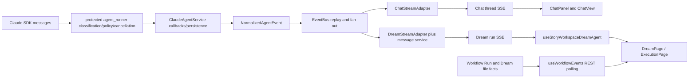

# Dream Agent architecture diagnosis

> Status: **pinned historical diagnosis only** at
> `platform@a506c83d5fa9a07d37afa10b2fb947c05c9c7408`. “Current” in quoted or
> historical material below means that pinned pre-migration baseline, not the
> 2026-08-11 migration worktree. Implementation status belongs to the other
> documents in this directory.

## Conclusion

At the pinned baseline, the repository has one agent runtime and two browser
conversation protocols.
The split is not a Git branch fork: `story-workspace@eedde94` is the exact merge
base and an ancestor of `platform@a506c83`. The product-level split began in
commit `61f70fc` when Dream added run-scoped message, event and confirmation
routes. Commit `b5b986c` later removed an internal string-protocol dependency by
introducing `NormalizedAgentEvent` and separate Chat/Dream adapters, but it
preserved the two public protocols.

The duplicate public protocol now causes duplicate history, parsing, reconnect,
confirmation and terminal-state logic. The new decision is therefore not to
merge the two adapters into a third abstraction. It is to remove the Dream
conversation adapter and let Dream use the Chat thread protocol directly. A
separate, process-local Observer is justified only to derive Workflow Run and
business projection through existing owning services.

## Git evidence

Commands were run from the repository root on 2026-08-11.

```text
$ git rev-parse platform story-workspace develop
a506c83d5fa9a07d37afa10b2fb947c05c9c7408
eedde940a3af1695aee7cf6ca5a63efab7c15a11
e3523db9f07400736123d2361111f428e60db0e4

$ git merge-base platform story-workspace
eedde940a3af1695aee7cf6ca5a63efab7c15a11
```

`git diff --name-status story-workspace..platform -- docs` contains only eight
added documents and no modified story-workspace document. Architectural
divergence happened in the linear commit history, not between the current branch
tips.

| Commit | Verified change | Diagnostic meaning |
|---|---|---|
| `bb30325` (2026-05-24) | Introduced the custom Chat SSE transport | Original public conversation protocol |
| `f2774b9` (2026-06-09) | Added Chat reconnect and EventBus carrying encoded frames | Shared runtime was coupled to Chat wire text |
| `e3f8fd0` (2026-08-02) | Added `EventEnvelope`/audit services without live production SSE wiring | Separate audit plane; not the Chat/Dream live bus |
| `d5ab609` (2026-08-04) | Defined agent-driven Dream workflow and one business confirmation | Business semantics began to differ |
| `61f70fc52ee6c557bd7294d65969a7f672851e4d` (2026-08-05) | Added `/dream-agent/messages`, `/dream-agent/events` and `/dream-agent/tool-confirm` | Public conversation protocol split |
| `29671ee` (2026-08-06) | Removed probing of a nonexistent generic Workflow Run SSE route | Workflow status remained REST polling |
| `b5b986c6f1cb89b73b139b07eef18a2ec80937e6` (2026-08-11) | Added normalized events plus `ChatStreamAdapter` and `DreamStreamAdapter` | Internal event model reconverged; public protocols stayed split |
| `a506c83d5fa9a07d37afa10b2fb947c05c9c7408` (2026-08-11) | Added Dream failed/cancelled public terminal frames | Pinned pre-migration baseline |

The endpoint search is unambiguous:

```text
$ git log --all -S'/dream-agent/events' -- backend/routers/story_workspace.py \
    frontend/src/hooks/story-workspace/useStoryWorkspaceDreamAgent.ts
61f70fc52ee6c557bd7294d65969a7f672851e4d feat: Implement Dream Agent functionality in Story Workspace
```

## Verified pre-migration architecture

The paths in this section are evidence from baseline `a506c83`. The legacy
Dream adapter, public service sections and frontend hook were removed by this
migration; recover their exact contents with `git show a506c83:<path>`.



### Server call chains

**Chat live turn — current canonical path**

1. `POST /api/claude-agent` authorizes thread ownership in
   `backend/routers/claude_agent.py:258-295`.
2. It builds `ClaudeAgentRunRequest` and calls the factory in
   `backend/routers/claude_agent.py:466-494`.
3. `ClaudeAgentThreadFactory.run_streaming` is the only public turn-start API;
   its private implementation creates one normalized EventBus and one
   `_run_turn_task` supervisor.
4. The same stream encodes each event with `ChatStreamAdapter` and exposes a
   completion handle for that exact turn; there is no public `run_events` path.
5. Reconnect uses the same adapter through the thread endpoint at
   `backend/routers/claude_agent.py:716-739`.

**Dream live turn — verified at the pre-migration baseline**

1. The run route authenticates an actor at
   `backend/routers/story_workspace.py:1635-1725`.
2. The gateway derives immutable run/thread/Deck context and proves actor,
   workspace, thread and Deck ownership in
   `backend/services/deck/story_workflow_application.py:1266-1329`.
3. The service takes normalized events and creates a filtered Dream stream in
   baseline `backend/services/story_workspace/dream_agent_message_service.py:1411-1496`.
4. `DreamStreamAdapter` converts only selected text and terminal events in
   baseline `backend/services/story_workspace/dream_stream_adapter.py:37-208`.
5. The browser separately parses, reduces and reconnects this stream in
   baseline `frontend/src/hooks/story-workspace/useStoryWorkspaceDreamAgent.ts:760-1205`.

The Dream adapter also has three non-browser consumers that drain its internal
iterator and therefore block simple deletion:

- first launch at `backend/services/story_workspace/dream_launch_infrastructure.py:813`;
- business-confirmation post-confirmation dispatch at
  `backend/services/story_workspace/dream_confirmation_service.py:889`;
- persisted message/episode dispatch at baseline
  `backend/services/story_workspace/dream_agent_message_service.py:1891`; its
  retained owner is now
  `backend/services/story_workspace/dream_internal_command_service.py`.

They have different durable claim/heartbeat/ack behavior. All now use the
canonical `thread_factory.run_streaming` path. Callers that only settle durable
claims use its same-turn completion handle; launch failure classification uses
the shared Chat decoder only for the required error events. No Dream stream
adapter or second execution API remains.

### GET side-effect finding

The pinned Dream snapshot GET was not a pure read. At `a506c83`,
`StoryWorkflowGateway.get_dream_agent_messages` first read a snapshot and then
awaited `_recover_dream_agent_messages`; that recovery reclaimed pending/expired
persisted commands and called
`_dream_agent_message_coordinator.schedule(item)` (`git show
a506c83:backend/services/deck/story_workflow_application.py`, baseline lines
`1000-1120`). Therefore an authenticated
`GET .../dream-agent/messages` could schedule an SDK turn. The baseline
`GET .../dream-agent/events` attached to an already authenticated thread
EventBus, but did not itself synthesize a new command.

The migration deletes both public Dream GET routes. Current Dream re-entry uses
the actor-scoped `GET .../dream-files` read at
`backend/routers/story_workspace.py:1419-1437`; its gateway method only projects
authorized files (`backend/services/deck/story_workflow_application.py:933-945`).
`backend/tests/test_story_workspace_dream_api.py:606-626` proves the read does
not create runtime files, while internal pending-command recovery is invoked
only by the application startup owner
(`backend/tests/test_server_claude_agent.py:1601-1612`). Thus current Dream GET
requests neither schedule nor start an Agent turn.

### Shared runtime evidence

- `NormalizedAgentEvent` is protocol-neutral and its wire serialization is
  explicitly not browser SSE: `backend/agent_stream_events.py:23-69`.
- Legacy Chat frame decoding is rolling-upgrade compatibility only:
  `backend/agent_stream_events.py:85-120`.
- EventBus publishes normalized events and replays them per subscriber:
  `backend/claude_agent/event_bus.py:62-98` and `:106-169`.
- Chat intentionally performs no projection:
  `backend/claude_agent/chat_stream_adapter.py:10-27`.
- Dream intentionally projected a smaller public contract at baseline
  `backend/services/story_workspace/dream_stream_adapter.py:1-5`; that file is
  now deleted and has no production replacement protocol.
- `backend/libs/claude_agent_kit/server/agent_runner.py` owns Claude SDK message
  classification, permission/tool hooks, subagent behavior and cancellation;
  `ClaudeAgentService` converts those callbacks into normalized events,
  persistence and terminal ordering at `backend/claude_agent/service.py:1636-1722`.

## Event planes that must not be conflated

| Plane | Verified source | Consumer | Durability |
|---|---|---|---|
| Agent conversation | `NormalizedAgentEvent` and per-turn EventBus | Chat and baseline Dream adapters | Replay for the active bus; history becomes authoritative after persistence |
| Workflow Run/business | `workflow_runs`, transitions, Dream file and confirmation facts | Story Workspace REST views | PostgreSQL authoritative |
| Legacy audit envelope | `backend/models/events.py` and `backend/services/events/**` | Tests/audit experiments | Append-only storage, but not the live Dream SSE path |

The frontend explicitly documents that generic Workflow Run SSE is unavailable
and polls REST every five seconds in `frontend/src/hooks/useWorkflowEvents.ts:1-4`
and `:43-71`.

## Public-contract difference matrix

| Dimension | Chat at pinned baseline | Dream at pinned baseline | Consequence |
|---|---|---|---|
| Identity | Browser supplies an owned `thread_id`; server checks thread owner | Browser supplies `workflow_run_id`; server derives thread and checks run/workspace/Deck | Two ingress and authorization shapes |
| History | Full thread messages | Filtered run/actor/source messages | Two history reducers and different visibility |
| Live route | `/api/claude-agent/threads/{threadId}/stream` | `/api/story-workspace/workflow-runs/{runId}/dream-agent/events` | Duplicate stream clients |
| Wire events | Full Chat event object in `data:` | Named SSE events with redacted payload and cursor | Incompatible parsers and reconnect semantics |
| Text | Incremental Chat text parts | Bounded/redacted `assistant_text_delta` | Different terminal reconciliation |
| Tools | Full tool input/output and approval metadata | Activity category plus allowlisted confirmation | Duplicate confirmation UI/state |
| Cursor | EventBus replay, then authoritative history | Explicit `turnId:ordinal` cursor and tombstones | Two de-duplication models |
| Terminal | `finish`/`error`, then history/status recovery | committed/failed/cancelled Dream events | Terminal semantics can drift |
| Stop | Thread stop endpoint exists | Dream composer has no action-level stop transport at the baseline | Unequal interaction capability |
| Business state | `story-workspace-output` side-frame exists, but Chat does not own Workflow Run | Dream hook refreshes files/run after settlement | Conversation and workflow concerns leak across both paths |

## Baseline browser callers and duplicated logic

### Chat callers

- Initial transport and event conversion:
  `frontend/src/lib/claude-agent-transport.ts:252-458` and `:471-529`.
- Shared framing/parser:
  `frontend/src/lib/claude-agent-sse-utils.ts:22-67`.
- Reconnect fetch and reducer dispatch:
  `frontend/src/components/chat/ChatPanel.tsx:484-568`.
- History → status → reconnect and post-EOF recovery:
  `frontend/src/components/chat/ChatView.tsx:711-796`.
- Tool confirmation:
  `frontend/src/components/chat/ToolConfirmationDock.tsx:68-108`.
- `ChatPanel` is already the live owner: it constructs `useChat` and canonical
  transport at `frontend/src/components/chat/ChatPanel.tsx:285-335`; reconnect is
  at `:484-568`. `ChatView.tsx:711-796` owns surrounding history/status/recovery.

### Dream callers

- Endpoint construction and run-scoped payloads:
  `frontend/src/hooks/story-workspace/useStoryWorkspaceDreamAgent.ts:220-280`.
- Independent parser/fetch reader:
  `frontend/src/hooks/story-workspace/useStoryWorkspaceDreamAgent.ts:371-417`
  and `:760-828`.
- Independent polling, cursor, reducer and reconnect loop:
  `frontend/src/hooks/story-workspace/useStoryWorkspaceDreamAgent.ts:859-1205`.
- Product consumers:
  `frontend/src/pages/story-workspace/StoryWorkspaceDreamPage.tsx:145-164`
  and `frontend/src/pages/story-workspace/StoryWorkspaceExecutionPage.tsx:532-562`.
- Re-entry files binding already exists: actor-scoped Dream-files parsing returns
  `threadId` at
  `frontend/src/hooks/story-workspace/useStoryWorkspaceDreamFiles.ts:178-193`.

### Existing bridge in the opposite direction

At the pinned baseline, Chat calls the Dream snapshot solely to recover Dream tool
confirmations in `frontend/src/components/chat/ChatView.tsx:355-388` and routes
those confirmations back to the Dream endpoint in
`frontend/src/components/chat/ToolConfirmationDock.tsx:68-108`. This is direct
evidence that the two public protocols do not form clean product boundaries.

## Concrete defects and migration hazards

1. **Reconnect reducer drift at the baseline.** Initial Chat conversion reuses cached tool input
   when an approval event omits `input`
   (`frontend/src/lib/claude-agent-transport.ts:369-390`), but reconnect replaces
   the input with `{}` (`frontend/src/lib/claude-agent-sse-utils.ts:177-210`). A
   the canonical ChatPanel reducer path had to fix this before Dream cutover.
2. **Dream context is not derived by generic Chat ingress at the baseline.** Dream dispatchers
   attach a server-authored `StoryWorkspaceDreamRunContext`; generic Chat POST
   does not. The context controls workspace/plugin mode, MCP environment and
   trusted source metadata in `backend/claude_agent/service.py:935-970`,
   `:1295-1304` and `:1495-1600`. Direct Dream follow-up through Chat is unsafe
   until a server-side binding resolver supplies equivalent context.
3. **Confirmation policy differs and has no canonical policy record at the
   baseline.** The baseline `ToolConfirmationStore` holds only
   `tool_call_id -> Future` (`git show
   a506c83:backend/claude_agent/tool_confirmation_store.py`). Generic Chat confirmation forwards
   the browser's decision after thread ownership validation
   (`backend/routers/claude_agent.py:965-997`). Dream has typed, bounded and
   `reject_only` policy in its service/contracts. Policy must move behind the
   canonical confirmation port before the Dream endpoint is removed.
4. **Visibility changes have an existing shared filter and an empty-row gap at
   the baseline.**
   `frontend/src/lib/story-workspace-guidance.ts:47-66` already removes guidance,
   Dream business-confirmation and server episode-action envelope rows at Chat
   seams. Direct Chat adopts richer owner-visible reasoning/tool/error parts, but
   must retain that filter for history/live/reconnect/export. Baseline history
   hydration synthesizes `{type: "text", text: ""}` when parts are empty at
   `frontend/src/components/chat/ChatView.tsx:401-404`, which can create a blank
   bubble unless zero-visible-part rows are skipped.
5. **Workflow refresh coupling at the baseline.** Dream pages refresh run/files when the custom
   hook's `settledRevision` changes. Replacing the hook without an Observer-backed
   invalidation or polling path can leave business state stale.
6. **No run-bound business Observer exists at the baseline.** The existing
   `SessionLifecycleObserver` only offers session phase callbacks and swallows
   individual observer failures (`backend/claude_agent/observer.py:47-148`). It
   is not a run-bound business projector. The target does not require a new
   durable event log: it needs bounded in-memory sequencing/deduplication and an
   injectable sink that calls the existing durable owning services.
7. **Thread-to-run lookup is a retry graph, not a unique-row lookup.**
   `WorkflowRunService.retry_run` permits only unsuccessful terminals, creates a
   new attempt, and deliberately reuses the original source thread while setting
   `retry_of_run_id` (`backend/services/workflow/run_service.py:171-209`). A
   resolver must select the unique unsuperseded leaf of a valid linear chain;
   rejecting every multi-row thread would reject legal retries.
8. **Stop unlocks optimistically at the baseline.** `ChatPanel.tsx:588-612` aborts the
   local reader and calls local `stop()` before POST, then ignores both
   `response.ok` and the backend `running` body. The backend may legitimately
   return `running=true` after its bounded wait
   (`backend/claude_agent/thread_factory.py:559-612`). Non-2xx/timeout/running
   therefore needs an authoritative status+reconnect path that keeps input
   locked. Unmount cleanup at `ChatPanel.tsx:559-567` aborts only the reader and
   must remain non-Stop behavior.

## Document diagnosis

| Document class | Files | Treatment |
|---|---|---|
| Former two-protocol specification | Deleted legacy paths `docs/chat-dream-agent-interaction-design.md`, `docs/design/sse-streaming-interaction-design.md` | Unique diagnosis/Git facts extracted here; recover either file from `a506c83` |
| Durable business owner | `docs/design/story-workspace/workflow-execution.md` | Keep; reconcile terminology |
| Unique UX/safety owner | `docs/design/story-workspace/dream-workspace-and-reentry.md` | Extract unique requirements, then update transport sections |
| Business/file owners | design006 and design007 under `docs/design/story-workspace/` | Keep business semantics; mark old lifecycle guidance superseded |
| Historical implementation records | dated task/rework/audit documents under `docs/design/story-workspace/` | Archive or delete only after canonical extraction |
| Stale Chat EventBus description | `docs/design/claude-agent/sse-reconnect-and-event-bus.md` | Update normalized-event internals; retain due to inbound links |

Unique requirements that must survive document cleanup are: one Dream business
confirmation; actor/run/thread/turn/tool-call provenance; FIFO confirmation;
stable AskUser question IDs; server-enforced reject-only policy; snapshot/live
reconciliation; keyboard/focus/accessibility behavior; durable run/file truth;
and retry without mutating a prior attempt.

## Cross-repository transport evidence

The sibling `ink-admin-memory` gateway fixes chunk buffering and streaming
headers in `app/lib/gateway/sse.ts:23-69` and
`app/lib/gateway/proxy-handler.ts:38-49,279-345` at commits `c6a7c88` and
`1b8f890`. It transports upstream SSE but does not select Chat versus Dream
schemas. It is therefore a shared deployment dependency, not an architectural
reason to keep a second Dream conversation protocol.

## Diagnostic decision

The replacement must converge at the browser-visible Chat thread protocol while
preserving server-derived Dream context and business truth. Deleting only
`DreamStreamAdapter`, or merely pointing the Dream parser at Chat frames, would
be incomplete: it would leave duplicate history/confirmation logic and could run
follow-up turns without the trusted Dream context.
