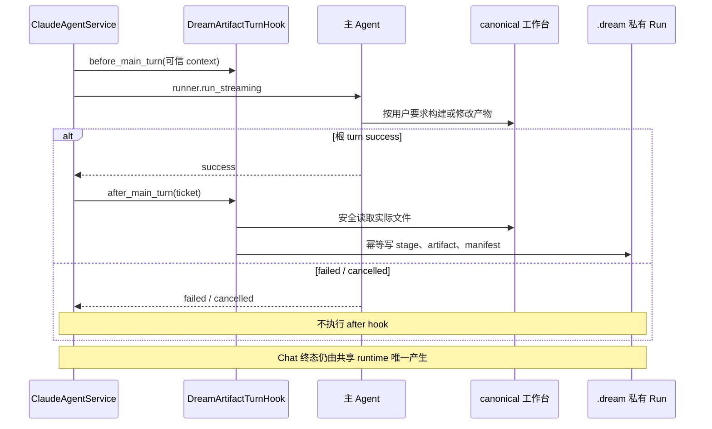

# Dream 工具与自动同步边界

## 1. 当前业务边界

Dream 不维护命令状态机。用户在共享 Chat thread 中用自然语言或 Deck skill 与主 Agent 交互；Agent 把业务结果写到 canonical 工作台。服务端只在根 turn 成功后收集实际存在的文件，不推断用户执行了哪个命令。

完整文件合同见[Dream 工作台文件自动同步](./deck-output-sync-design.md)和 [Project/Episode Artifact 合同](./project-episode-artifact-contract.md)。

## 2. 职责

| 参与者 | 负责 | 不负责 |
|---|---|---|
| 主 Agent / Deck skill | 理解用户意图；读取上下文；写 canonical 工作台文件 | 写 `.dream/**`；声明服务端同步已成功 |
| `ClaudeAgentService` | 组装 Dream 上下文；调用原 `run_streaming`；成功后调用 Hook；保持 Chat 单终态 | 解析业务文件；建立第二套 Agent runtime |
| `DreamArtifactTurnHook` | 重验 actor/thread/run；校验页面产物；同步私有 artifact | 调用模型；推进 Workflow；发送 SSE |
| `DreamObserver` | 监听标准 Agent 事件并维护派生业务提示 | 文件同步；控制 Agent；改变 thread terminal |
| Dream 页面 | 用共享 Chat runtime 对话；用 `dream-files` GET 展示业务投影 | 从 transcript 猜文件；用页面状态覆盖 thread 生命周期 |

## 3. 文件工具规则

- canonical 工作台产物由 Agent 使用其正常受控写工具构建。
- `.dream/**` 是服务端私有面；普通 file/shell mutation 必须拒绝。
- 既有 Story Workspace MCP writers 可以用于兼容或调试，但不是正常自动同步的前提。
- 不增加 `inspect_dream_artifacts`、`sync_dream_artifacts`、stage checkpoint 或 action completion 工具。
- Project/Episode 目标路径由服务端派生，不接受浏览器或模型提供绝对路径。

## 4. 根 turn 时序

SDK 内部子 Agent 不单独触发 Hook；根 turn 完成时只结算一次。确认等待还不是根 turn success，因此不会提前同步半成品。

## 5. 与 Workflow 的关系

文件同步只形成当前 Run 的业务投影，不能把 Workflow 标记 completed/failed/cancelled。Workflow 权限、Run 绑定和 Story current source 仍由各自领域服务控制。

`DreamObserver` 可以观察“Agent 已结束”或“工具活动”供页面业务提示使用，但不能检查文件、重试发布或把 projection 反向写成 thread lifecycle。

## 6. 被删除的设计前提

- 固定或随机 `/drama-*` 命令注册表；
- `next_action/no_next_action` 作为文件同步或 Workflow 完成条件；
- Agent 必须主动调用 MCP 才能让页面看到产物；
- Observer 负责后置同步；
- 文件 watcher 或每个 PostToolUse 都尝试发布；
- 为 Dream 增加第二套 transport/parser/reducer。
