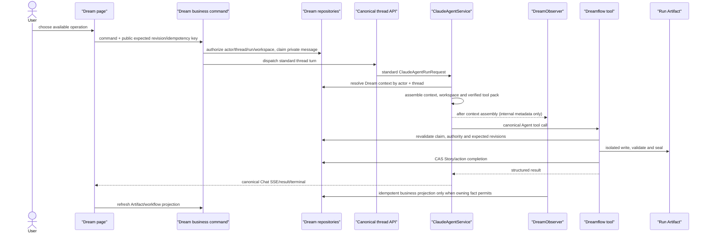
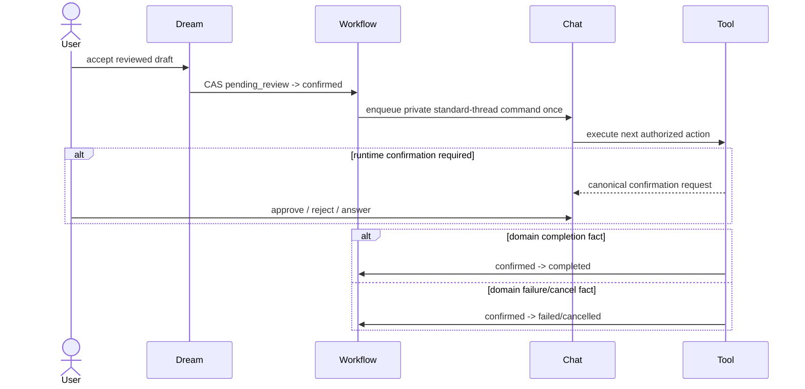

# Dreamflow tool and Agent interaction boundaries

## Purpose

Dreamflow is the business workflow above the shared Claude Agent runtime. It
decides which authorized Project/Episode operation is available and validates
its input/output facts. It does not own message streaming, tool confirmation,
Stop, reconnect, thread history or terminal delivery.

## Ownership

| Concern | Owner |
|---|---|
| message, delta, tool invocation, confirmation, Stop, terminal | `ClaudeAgentService` + canonical Chat thread |
| Dream context lookup | server-side Thread mapping during `assemble_context` |
| safe business event classification | `DreamObserver` through `SessionObserverRegistry` |
| Workflow Run transition | Workflow owning service using explicit business facts |
| Project/Episode Artifact write and revision | Dreamflow tool/domain service |
| action availability | Dream artifact/workflow projection service |
| page rendering | Dream wrapper plus shared `ChatPanel` |

`DreamObserver` may observe that a tool started, settled or emitted a safe
result class. It cannot approve tools, cancel the Agent, create a Chat terminal
or make a Workflow Run successful merely because the Agent turn ended.

## Tool categories

1. **Runtime tools**: standard Claude tools governed by canonical Chat
   confirmation. Sandbox, network, reject-only and AskUserQuestion use the same
   thread-scoped policy in Chat and Dream.
2. **Dream Artifact tools**: server-installed tools that read/write only the
   authorized Run staging root. They revalidate Run/Thread/Workspace/Deck and
   expected revisions at execution time.
3. **Dream business commands**: REST/internal commands for launch, one business
   confirmation, guidance, retry/cancel and reconcile. They persist a private
   canonical user message and dispatch the same Thread; they do not call a
   Dream-specific stream.
4. **Display actions**: page recommendations derived from Artifact and workflow
   facts. A disabled or stale action never becomes a tool request.

## Action boundary

| Action | Required input | Success fact | May change Story source |
|---|---|---|---|
| `plan_episode` | sealed predecessor, target next Episode | outline/plan completion | yes, after full snapshot CAS |
| `write_script` | registered Episode + plan revision | available script + completion | yes |
| `review_script` | expected script revision | review report completion | yes |
| `build_assets` | reviewed script revision | storyboard/assets completion | yes |
| `regenerate_storyboard` | current script + storyboard revision | new storyboard revision | yes |
| `review_full_chain` | all required files/revisions | full-chain report completion | yes |
| `commit_episode` | complete valid Episode | committed completion | yes |
| `prepare_render_guide` | committed Episode revision | render guide completion | yes |

Every operation claims an idempotency key and expected input revision before it
enters the Agent queue. The tool re-reads the private message, context mapping
and Artifact facts before writing. Settlement marks the claim dispatched or
failed; it never trusts the browser's action, run, revision or path.

## End-to-end interaction

## Confirmation boundary

Dream business confirmation and runtime tool confirmation are intentionally
different:

- Business confirmation accepts the reviewed Dream draft once and persists the
  Workflow Run's `confirmed` fact.
- A later runtime tool may still require canonical Chat confirmation.
- After business confirmation, the Workflow Run remains `confirmed` until a
  domain completion, failure or cancellation fact arrives. There is no
  intermediate business lifecycle stage for “continue”. The current Agent turn
  is represented by the shared Thread status (`running`, confirmation wait,
  cancelled, failed or completed).

## Failure and retry

- Invalid/stale input fails before dispatch and does not create an Agent turn.
- A claimed private message is dispatchable once; retry creates or reclaims only
  according to the command's explicit idempotency policy.
- Agent output without a domain completion fact leaves the Workflow state
  unchanged and exposes a retryable diagnostic.
- Tool failure after partial output produces the canonical Chat failure terminal
  and an owning-service failure fact where one is available.
- Observer failure is logged/isolated and never changes Chat delivery.
- Stop cancels only a genuinely running main turn. Business cancellation is a
  separate authorized command and cannot be inferred from a disconnected page.

## Page switching

Dream → Chat and Chat → Dream carry only `threadId`. Both pages hydrate the same
history/status and reconnect to the same stream. Dream independently calls its
actor-scoped business APIs to map that Thread to Workspace/Run/Artifact panels.
No Dream field is added to the Chat request or SSE frame.
