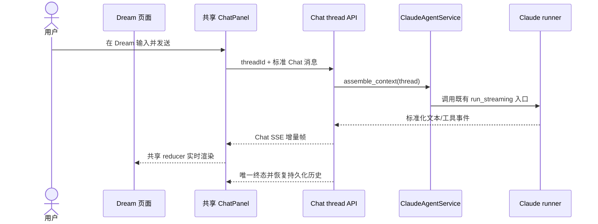
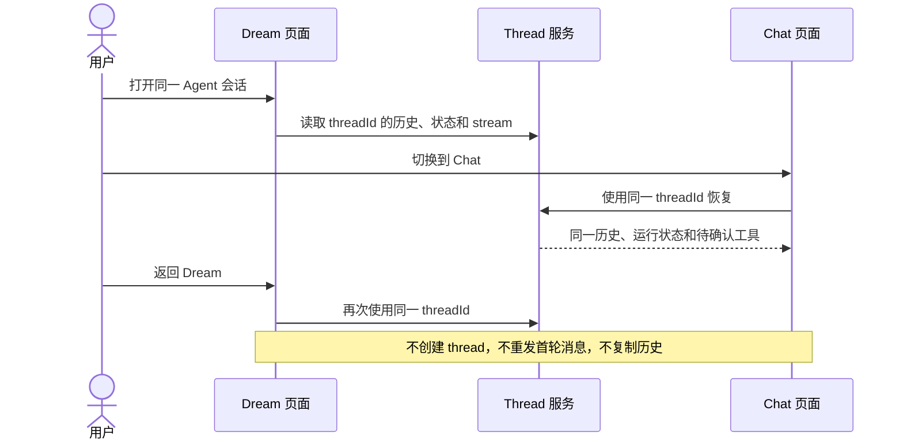
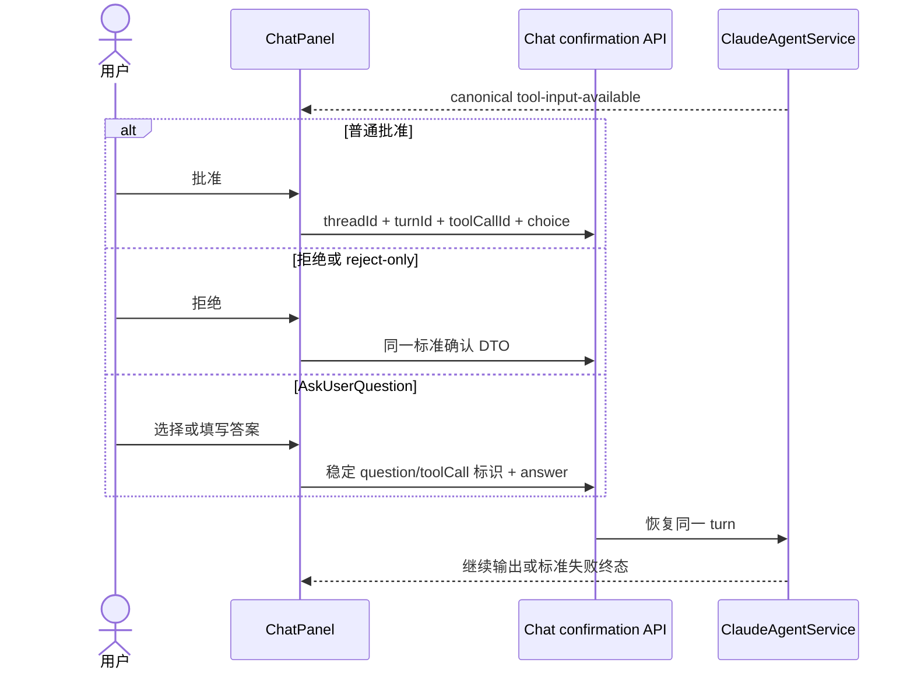
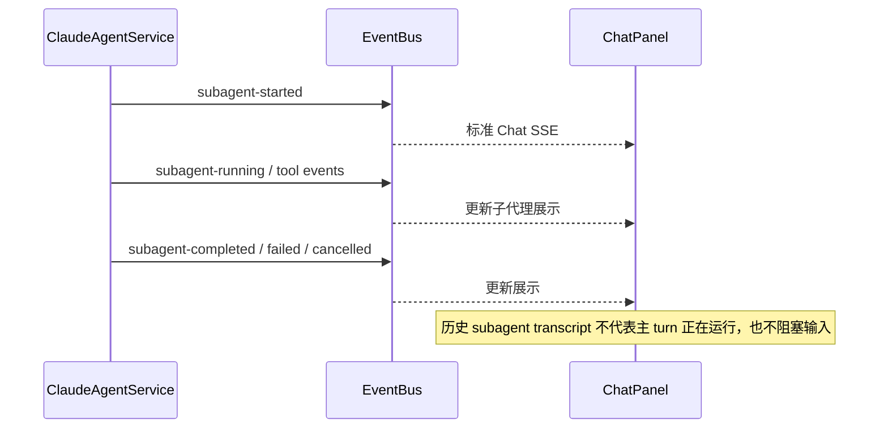
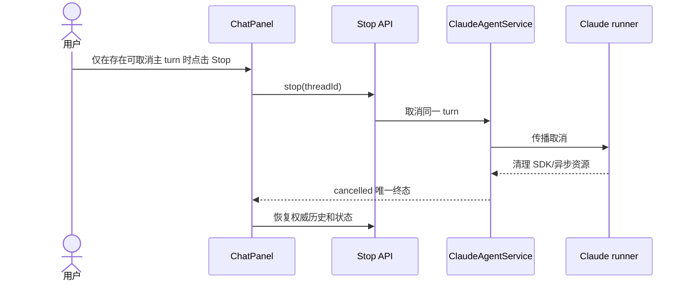
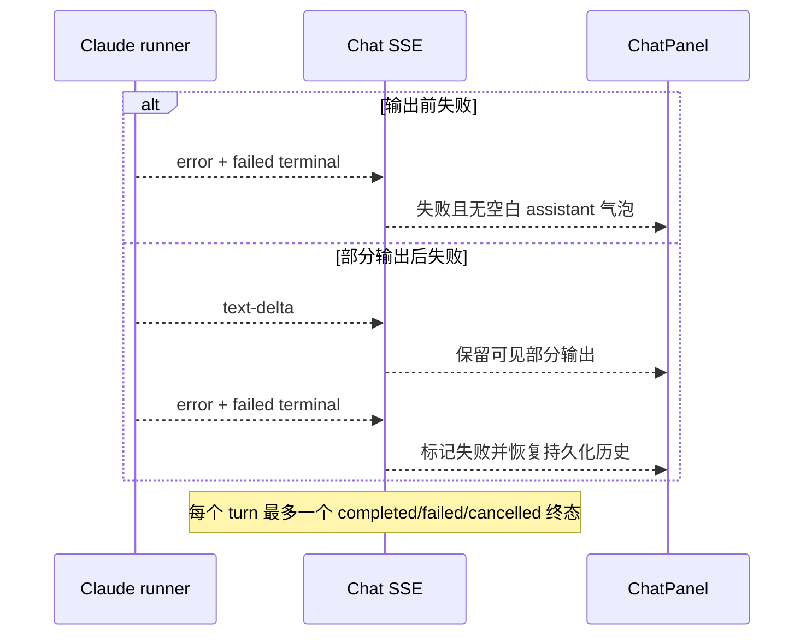
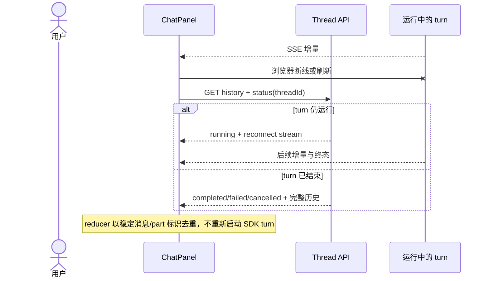
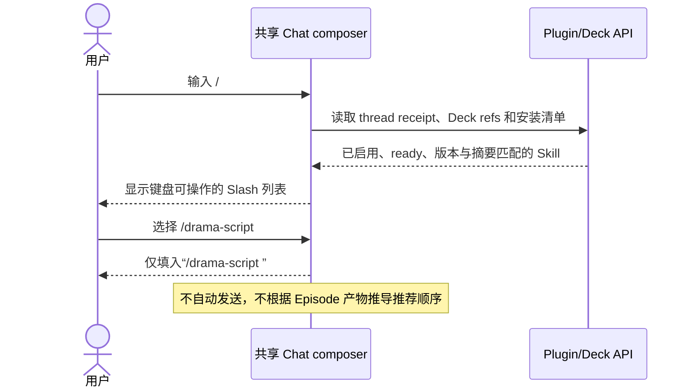
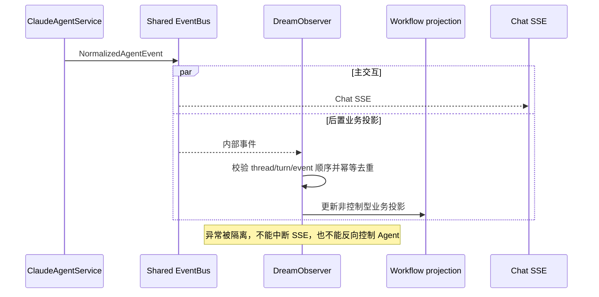
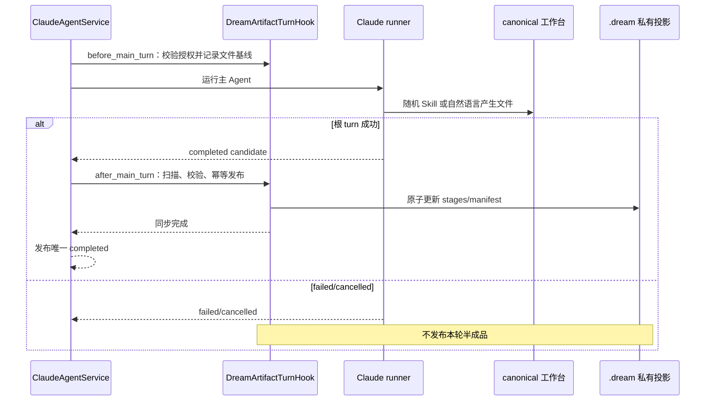

<!-- [Input] Shared Chat Thread/SSE runtime, Dream authority, confirmations, Stop, reconnect, and Deck Agent selection. -->
<!-- [Output] Canonical Dream Agent interaction contract without a parallel runtime or client-selected authority. -->
<!-- [Pos] Dream Agent interaction source of truth. -->
<!-- [Sync] 2026-08-31: consume structured Thread binding errors and permit legal same-Deck current-Agent switching. -->

# Dream Agent 共享交互设计

> 状态：当前设计。本文只定义 Dream 与 Chat 共用的 Agent 交互；Skill、工作台文件和
> `.dream` 发布业务由[全业务交互](./business-interaction-design.md)与
> [Skill 和工作台同步](../story-workspace/skill-commands-and-workbench-sync.md)定义。

## 1. 交互合同

Dream 和 Chat 是同一个 actor-owned thread 的两个页面。两者共用：

- thread 消息、状态、历史和 Claude session；
- Chat SSE transport、parser、reducer 和 composer；
- 工具确认、AskUserQuestion、Stop、失败、取消和断线恢复；
- `ClaudeAgentService.assemble_context` 与既有 runner 入口。

Dream 浏览器只能携带标准 `threadId` 调用 Chat API。Workflow Run 与 Dream 上下文由服务端
根据已认证用户和 thread 反向解析，不能新增 Claude 报文字段，也不能由浏览器指定内部
run。Dream 页面可以额外读取 actor-scoped 的业务投影，但它不能覆盖 thread lifecycle。

`ChatPanel` 是唯一实时消息与输入状态 owner。Dream 不建立第二套 EventSource、消息过滤、
parser、reducer 或 Stop 状态。用户消息和内部 JSON 控制报文遵循 Chat 的原始可见性合同，
Dream 不额外做正文脱敏或页面级过滤。

Dream launch message 中的 Agent 是不可变来源证明；Thread 当前 Agent 是下一轮执行者，允许
在同一 Deck 内按既有 CAS 规则切换。resolver 必须校验 launch Agent 与其 top-level/nested
字段和请求指纹自洽，但不得要求它永远等于当前 Thread Agent。真正无法证明 authority 时，
沿用标准 Chat SSE 的结构化 `errorCode`，前端按
[Thread 绑定冲突与恢复](../story-workspace/thread-binding-conflict-recovery.md) 显示安全状态。

## 2. 普通发送与增量输出

## 3. Dream 与 Chat 页面切换

## 4. 工具确认、拒绝和 AskUserQuestion

Dream 不包装确认内容，不生成私有确认消息，也不通过 workflow 状态判断是否等待确认。

## 5. 子代理

## 6. Stop 与取消传播

页面卸载或切换只断开当前 reader，不等同于 Stop。

## 7. 输出前失败与部分输出后失败

## 8. 断线重连与页面刷新

## 9. Slash Skill 建议

## 10. Observer

事件重放或重复到达时，Observer 使用稳定 event/turn/thread 标识幂等；观察到终态后忽略
同一 turn 的迟到业务事件。Observer 不存储第二份 Agent 消息历史，也不决定 Skill、Stop、
确认或 Chat 终态。

## 11. Hook 与 Agent 终态边界

Hook 以文件事实工作，不判断 `/drama-*` 的执行顺序，不写 completion fact，也不依赖 Agent
主动调用 MCP 才能保证同步。Hook 失败沿原 turn 失败路径处理，不新增第二终态。

## 12. 权限与数据边界

- Chat 路由校验 thread 所有权；Dream 业务 GET/写命令另行校验 actor、thread、run、workflow。
- 统一协议不取消 workflow 权限、路径 allowlist、schema、摘要、原子发布或数据完整性校验。
- Dream 上下文由服务端反向映射；客户端不能借 `threadId` 读取其他用户的 Run。
- `.dream` 是 Story Workspace 控制面；主 Agent 写 canonical 工作台，Hook 负责私有投影。
- MCP 写工具是辅助能力，不能成为成功、同步或生命周期的唯一依据。

## 13. 验收

- Dream 与 Chat 使用同一 thread history、status、SSE、confirmation、Stop 和 Claude session。
- 普通文本、Unicode、换行、JSON 控制正文和工具消息不被 Dream 额外过滤。
- 输出前失败、部分输出后失败、取消、断线和刷新均只产生一个权威终态。
- 只有真实可取消的主 turn 显示 Stop；历史子代理记录不阻塞输入。
- 输入 `/` 只展示当前 thread/Deck 实际安装且校验通过的 Skill，选择后不自动发送。
- 页面没有 Episode 阶段推荐按钮、next action、completion fact 或顺序状态机。
- Hook 在成功边界自动发布实际工作台文件；Observer 和 MCP 均不控制主 Agent。
