# Dream Agent interaction design

> Status: **current interaction seams implemented and locally accepted**. R41
> passed S01–S10 sequentially in headless and visible headed Chromium with
> semantic waits and one worker; S11–S14 remain covered by backend/source
> acceptance. This is not staging, canary, immutable rollback or production-load
> evidence.

This document is the canonical **Agent runtime interaction** view. The complete
Dream product/workflow/file/Episode business view is intentionally separated
into [Business interaction design](./business-interaction-design.md), where
every B01–B21 business capability has its own sequence diagram. Neither document
may use the other plane's state as truth.

## Interaction contract

Dream and Chat are two views of the same owned Chat thread. Switching surfaces
must not create a second thread, second stream, copied history or translated
message schema.

The Dream surface keeps Dream-specific layout, workflow actions, unread markers,
focus behavior and business projection. It directly composes the existing
`ChatPanel`; `ChatPanel` remains the sole `useChat` and live reducer owner.

| Data/operation | Identifier sent by Dream browser | Boundary |
|---|---|---|
| History/status/stream/send/confirm/stop | `threadId` only | Canonical Chat routes |
| Run/files/review/episode actions | `workflowRunId` | Actor-scoped Story Workspace REST |
| Trusted Dream context | None | Server reverse-lookup by authenticated actor + owned thread |

During `ClaudeAgentService.assemble_context`, zero authorized Dream attempts
means generic Chat. One valid retry chain means the server selects its single
unsuperseded leaf and derives internal Dream context. Multiple independent
leaves, a broken/cyclic retry chain or frozen-source mismatch means `409` plus a
data-integrity alert. The browser and Chat request never select a run.

## ChatPanel-first composition and hydration

`ChatView` and the Dream wrapper share
`frontend/src/components/chat/threadSessionHydration.ts` for history → status
ordering, terminal-history stabilization, visibility filtering and
pending/settled tool IDs. `chatRuntimeState.ts` carries small main-turn
Stop/reconnect helpers. Generation protection, reconnect nonce and post-EOF
recovery remain in the two shells and `ChatPanel`; neither helper owns `useChat`,
live messages, send/confirm/stop or event parsing.

The current `ChatPanel` owns:

- ordered persisted and transient `UIMessage` parts;
- AI SDK live status plus authoritative runtime/reconnect/Stop state;
- active/pending tool confirmations for the owned thread; the server supplies
  the active `turnId` authority;
- reconnect/stop/error state;
- send, confirm, stop, refresh and mark-read commands;
- authoritative post-terminal history recovery.

Dream mounts the same `ChatPanel`, canonical transport/parser/reducer, composer,
confirmation dock and Stop behavior as Chat. This migration must not introduce
an app-wide `ClaudeThreadSessionProvider`, a second `useChat` wrapper or a copied
Dream controller.

Dream-specific `settledRevision` is gone. The current Dream/Execution pages use
`StoryWorkspaceDreamThreadChat.onSettled` to refresh their authoritative
business/file projections, and workflow polling remains the fallback. The
Observer's default latest-hint sink has no push/UI invalidation or durable owner
wiring. The already-authorized Dream-files response may attach a matching safe
`agentActivity` for informational copy only; it is absent when no hint exists
and never controls lifecycle, confirmation, input or Stop. The page view-model
renders only content-generation/workflow-operation activity and reconcile copy;
turn-terminal, waiting-confirmation, subagent and generic-tool hints render only
through canonical `ChatPanel` when applicable.

Current reusable seams are `frontend/src/lib/claude-agent-transport.ts`,
`frontend/src/lib/claude-agent-sse-utils.ts`,
`frontend/src/components/chat/threadSessionHydration.ts`,
`frontend/src/components/chat/chatRuntimeState.ts`, `ChatPanel.tsx`, and
`StoryWorkspaceDreamThreadChat.tsx`.

## Scenario 1 — Dream sends a normal message and receives incremental output

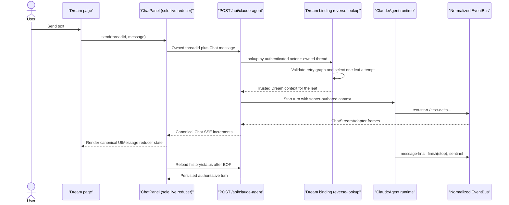

Dream must not call `/dream-agent/messages` or `/dream-agent/events`. The
deleted baseline calls are recoverable at `git show
a506c83:frontend/src/hooks/story-workspace/useStoryWorkspaceDreamAgent.ts`
(former lines 220-417).

## Scenario 2 — Switch Dream → Chat and continue the same thread

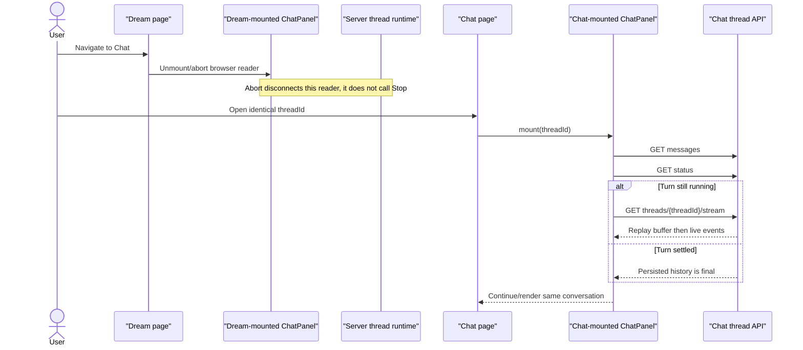

No Dream-to-Chat message export or ID translation is allowed.

## Scenario 3 — Switch Chat → Dream and restore the same thread

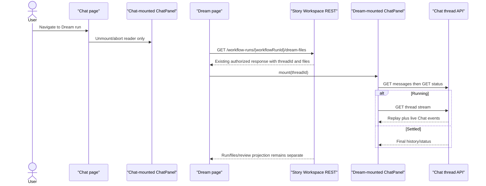

`workflowRunId` is used only for the existing Dream-files business REST call;
the hydration primitive and `ChatPanel` receive only `threadId`. No re-entry API
or binding identifier is added by this migration. Optional `agentActivity` is
display-only and is not passed to `ChatPanel`.

## Scenario 4 — Tool approval, rejection and AskUserQuestion

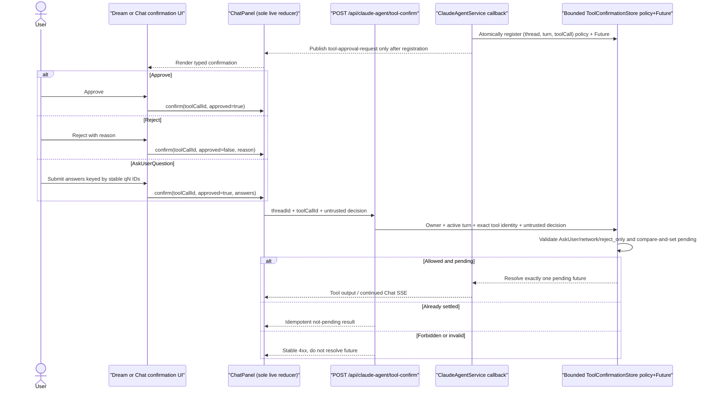

The old Dream endpoint branch is removed. `ToolConfirmationDock.tsx` submits only
the canonical Chat decision, while
`backend/claude_agent/tool_confirmation_store.py` owns typed AskUser,
network/reject-only validation, atomic settlement and bounded replay tombstones.
A `reject_only` confirmation cannot be approved regardless of browser payload.

## Scenario 5 — Subagent starts, runs and completes

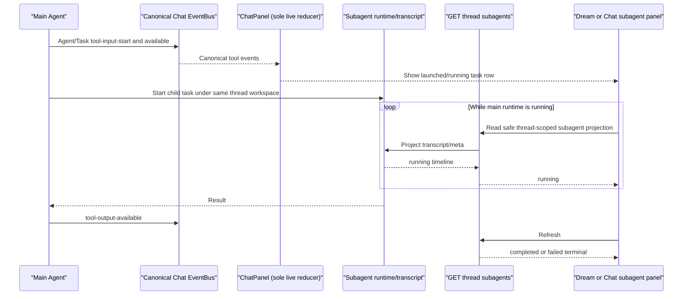

The existing owned subagent REST route is in
`backend/routers/claude_agent.py`; the current hook is
`frontend/src/hooks/useThreadSubagents.ts`. Dream reuses this thread-scoped
projection and must not create a run-scoped subagent protocol.
Historical subagent rows or a completed subagent projection never make the main
thread busy and never make Stop visible.

## Scenario 6 — Main Agent Stop and cancellation propagation

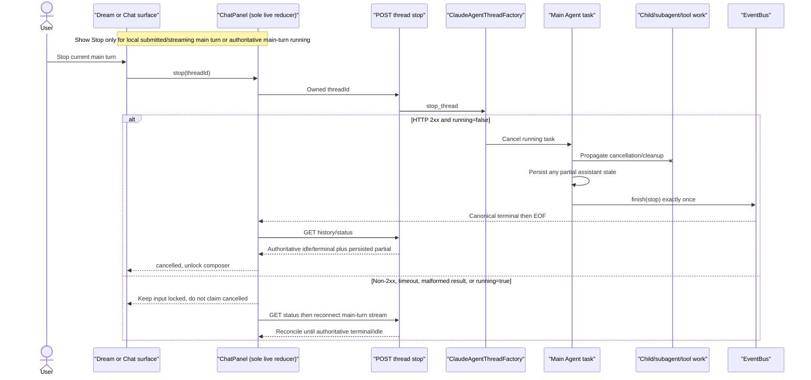

Stop is an explicit action, unlike merely unmounting or losing the network. The
verified endpoint is in `backend/routers/claude_agent.py`. Unmount,
navigation and network abort close only the reader and never call Stop.

## Scenario 7 — Failure before any output

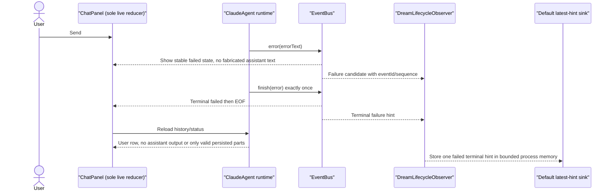

Provider diagnostics may be shown only according to the canonical Chat error
policy; the Observer records no provider text or diagnostics.

## Scenario 8 — Failure after partial output

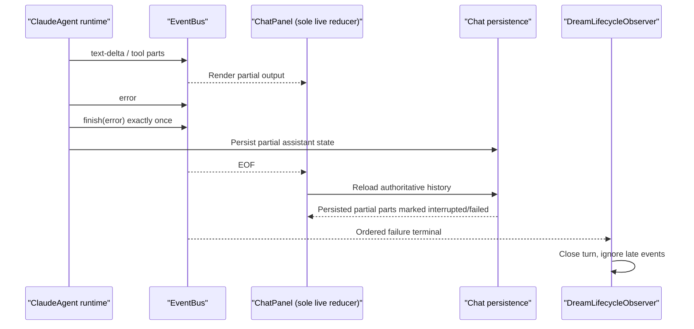

Partial conversation output remains visible, but it cannot prove Dream required
files or Workflow Run completion.

## Scenario 9 — Browser disconnect and SSE reconnect

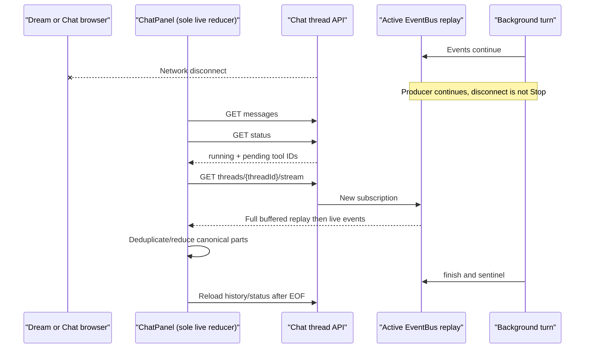

Reconnect preserves cached tool input when approval events omit it through the
shared SSE merge path; current coverage lives in
`frontend/src/components/chat/__tests__/ToolConfirmationRecovery.test.ts`.

This sequence assumes the HTTP request reaches the process that owns the active
turn. That is true for the current single-uvicorn-worker,
backend-`max-instances=1` deployment. Redis EventBus can replay a stream to a
caller that already knows `(session_id, turn_id)`, but does not provide
active-turn discovery, HTTP routing, `/status`, Stop or confirmation ownership;
it must not be used to claim this sequence works across arbitrary workers/pods.

## Scenario 10 — Page refresh and history recovery

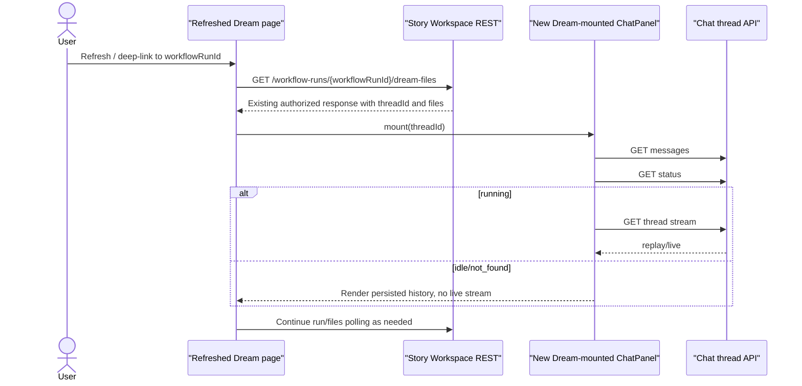

No local Dream cursor, transient text buffer or `settledRevision` is required to
recover the conversation. No new re-entry endpoint is introduced.

## Scenario 11 — Observer receives events without owning workflow projection

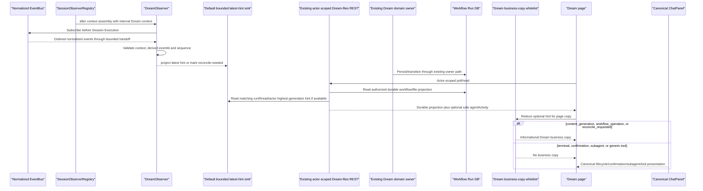

Subscriber/sink execution is off the Chat response path. On terminal/sentinel,
context failure, Stop, task exception, eviction or factory close, the Coordinator
revokes the lease, unsubscribes and applies bounded task cancellation/await. The
default sink stores at most 256 latest `(run, thread, actor)` hints in memory,
rejects an older generation, and calls no lifecycle owner. Actor/generation are
selection guards and never enter the wire. Tool, subagent, content-generation
and workflow-operation hints expose only safe enums and an optional SHA-256
correlation value. The REST
field is display-only, absent on no match/error and cannot alter the durable
projection. Its page view-model only renders content-generation,
workflow-operation and reconcile copy; terminal, waiting-confirmation, subagent
and generic-tool hints are ignored there. Existing transition guards and
`ChatPanel` remain authoritative. A complete Observer-to-durable-owner
integration is not claimed.

## Scenario 12 — Observer replay, duplicates and idempotency

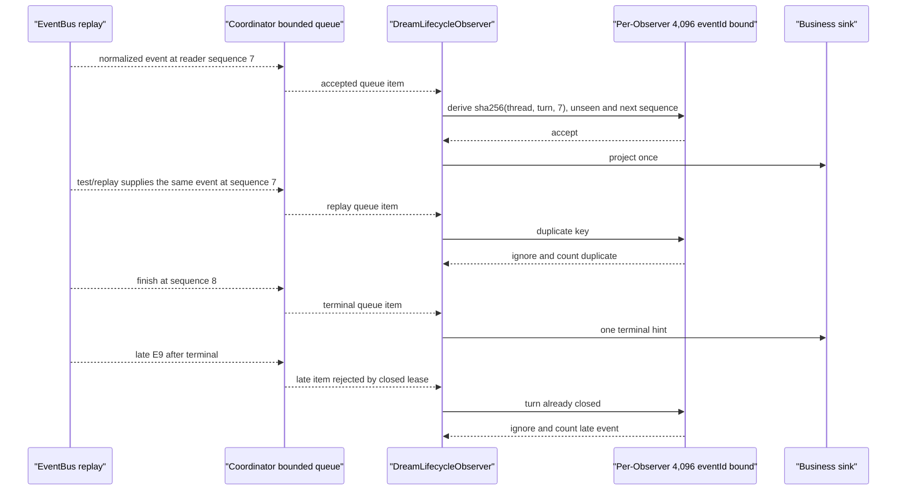

On handle close or process restart the Observer dedup set is gone; no terminal
TTL/checkpoint is loaded. The independent owner/REST paths remain the source of
durable convergence.

If the EventBus reader itself raises, the Coordinator first projects reconcile
to clear stale activity, then resubscribes/replays once. Stable sequence-derived
IDs make the replay idempotent. A second failure follows bounded close and never
restarts the main Agent producer.

## Scenario 13 — Normal completion produces one terminal

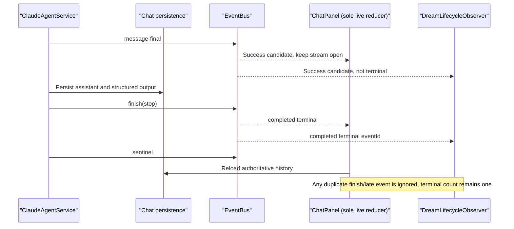

`message-final` must never independently emit a second terminal. Acceptance
asserts exactly one terminal in `ChatPanel` and Observer for each turn.

## Scenario 14 — Migrate old Dream protocol to Chat thread SSE

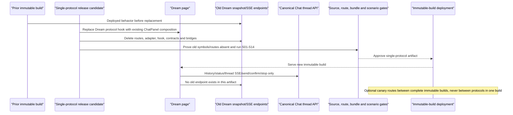

The repository change directly replaces production callers and hard-deletes the
old protocol. A deployment canary is optional infrastructure routing between
complete immutable builds; there is no repository feature flag or releasable
dual-protocol artifact. The hard removal and rollback gates are in
[Migration plan](./migration-plan.md).

## Permission behavior

- Dream re-entry obtains `threadId` only from the actor/run/workspace-authorized,
  already-existing Dream-files response, which is the sole re-entry
  binding seam and this migration adds no endpoint.
- Every Chat route independently rechecks thread ownership.
- Chat POST reverse-lookups Dream attempts by authenticated actor and owned
  thread. `workflowRunId` is not accepted by Chat conversation operations.
- Multiple rows are allowed only as one valid retry chain. The single
  unsuperseded leaf is selected; multiple leaves, graph corruption or frozen
  source mismatch fails closed with 409. No newest-run heuristic is allowed.
- Tool confirmation policy is server-owned. The UI cannot turn a `reject_only`
  request into an approval.
- Direct Chat adoption uses the same owner-visible row/part/export contract on
  both surfaces; server-private control rows and zero-visible-part rows remain
  hidden.

## Shared visibility and export behavior

History, live render, reconnect recovery and export all apply
`filterStoryWorkspaceControlMessages` before rendering parts. Rows marked
`story-workspace-guidance`, `story-workspace-dream-confirmation`, or a
server-attested `story-workspace-episode-action/v1` envelope are omitted
entirely. A remaining row with no visible parts is skipped; no empty text part or
blank bubble is synthesized.

For every remaining owner-visible row, Dream and Chat show/export the same
canonical fields: text; reasoning text/state under the existing collapsed UI;
tool call identity/name/state plus canonical input/output/error; and only the
client-safe provider/turn error emitted by `ClaudeAgentService`. Raw logs,
credentials, prompts and filesystem paths never become visible. Export consumes
this filtered non-empty view model and cannot re-read unfiltered persistence.

## UI and accessibility requirements

- Preserve the Dream rail/panel/dialog layouts and business actions, but render
  conversation rows by composing `ChatPanel` and its canonical `UIMessage` parts.
- Opening the conversation moves focus to the heading or composer according to
  the initiating action; closing returns focus to the trigger.
- Trap focus only in the mobile/modal dialog, not in the desktop inline panel.
- Stream announcements are polite and coalesced; token deltas are not announced
  individually.
- Confirmation focus remains stable through retry and cannot jump to a replayed
  settled card.
- Stop has an explicit accessible name and is never represented by closing the
  panel. It appears only for the current main turn, and its pending/failure state
  keeps the composer locked until authoritative recovery.
- “Jump to latest” appears when the user is not following the tail; replay must
  not force scroll away from their reading position.
- Failed partial output is labelled as interrupted without discarding readable
  content.

Unique source requirements are in
`docs/design/story-workspace/dream-workspace-and-reentry.md`;
transport-specific portions of that document are superseded, not its focus,
confirmation and re-entry behavior.

## Interaction acceptance summary

- The named S01–S10 browser suite passed in R19 headless Chromium with one worker
  and semantic waits. S11–S14 passed in the backend/source acceptance suite;
  they are not browser tests. The deployment-only immutable rollout/rollback
  action described in Scenario 14 remains unexercised.
- Both Dream → Chat and Chat → Dream switches preserve the same thread and live
  turn.
- Pre-output and partial-output failures are visibly different but share one
  terminal outcome.
- Runtime tool confirmation and one-time Dream business confirmation remain
  distinct.
- Subagents, Stop, reconnect and refresh use thread-scoped Chat capabilities.
- Existing Dream-files supplies the authorized `threadId`; no re-entry transport
  API is added.
- Observer duplicates/replay cannot duplicate a live-turn terminal hint; the
  current default sink does not project durable business state. Its optional
  Dream-files `agentActivity` is content-free display metadata; only the
  business-copy whitelist renders it, never canonical terminal/confirmation/
  subagent/tool state.
- R10 focused evidence for this Observer/UI boundary is 116 backend tests plus
  20 subtests and 6 frontend tests; R19 subsequently passed 687 focused backend
  tests, 1,927 broad backend tests with 17 skips and 655 subtests, 340 frontend
  unit/contract tests, S01–S10 headless Chromium and S11–S14 backend/source
  acceptance.
- The current worktree has no old conversation caller or endpoint; local source,
  OpenAPI and built-bundle deletion gates passed. An immutable artifact and
  deployment rollback proof remain mandatory before production promotion.
