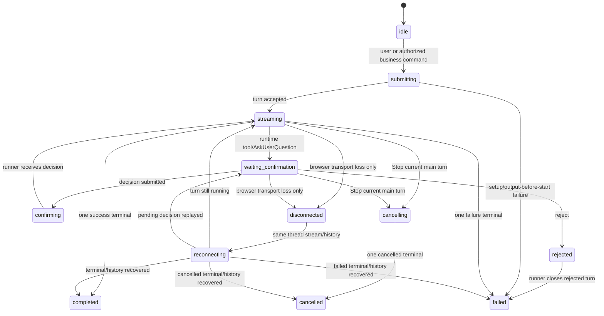
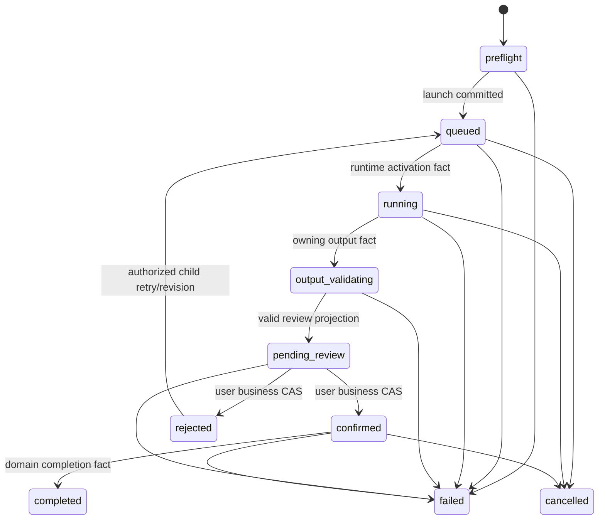
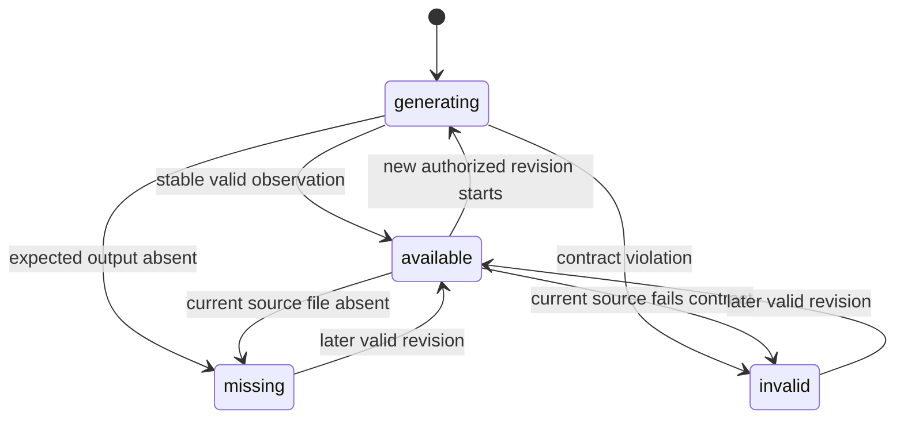
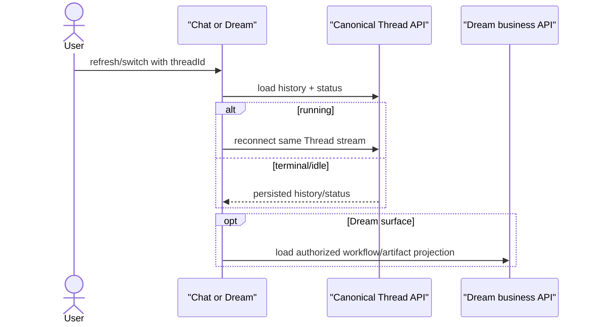
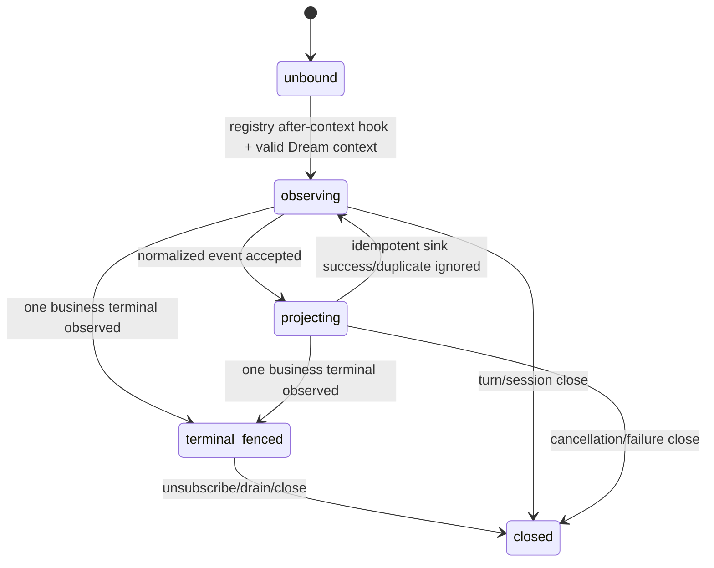

# Dream Agent lifecycle

## Independent state domains

Dream renders three independent domains:

1. Canonical Thread turn lifecycle.
2. Dream Workflow Run lifecycle.
3. Artifact/Story projection status.

They share immutable actor/thread/run provenance but never form a bidirectional
state loop.

## Canonical Thread turn

There is no extra lifecycle stage between a confirmation decision and resumed
streaming. `message-final` and EOF are not terminal; one `finish` outcome closes
the turn. Exactly one of completed, failed or cancelled is observed.

Stop is available only when the factory owns a non-finished main-turn task.
Historical subagent transcripts or business activity cannot expose Stop or
block the composer.

## Workflow Run

Rejected Workflow Runs are terminal attempts. An authorized retry or revision
creates a new child attempt and queues that child; it never reopens the
rejected row. After business confirmation the Workflow Run remains `confirmed` while any
follow-up Agent work executes. The Thread lifecycle shows whether that work is
currently submitting, streaming, awaiting confirmation, stopped or terminal.
Only an Artifact/action owning service can move the Workflow to completed,
failed or cancelled.

## Artifact and Story projection

Storage outage or unstable observation is `unavailable/degraded`, not a durable
missing transition. Story Index independently reports syncing, indexed, stale,
missing or failed. Review is bound to a complete script revision.

## Confirmation comparison

| Concern | Runtime confirmation | Dream business confirmation |
|---|---|---|
| Owner | canonical Thread confirmation store | Workflow domain service |
| Trigger | tool policy / AskUserQuestion | reviewed Dream draft |
| Identity | thread + turn + tool call | actor + run + expected version + idempotency |
| Effect | resolve runner Future | `pending_review -> confirmed`, dispatch private Thread command once |
| UI | shared Chat confirmation | Dream business confirmation bar |
| Terminal proof | none | none; later domain fact required |

## Disconnect, refresh and switching

GET and reconnect do not start a model turn. Business projection cannot rewrite
Thread status. Thread history cannot mark Workflow complete.

## Observer lifecycle

Identity is `(actorId, threadId, turnId, workflowRunId, generation)`. Derived
event IDs and monotonically checked sequences make replay/duplicates idempotent.
After a business terminal fence, late business updates are ignored. Observer
errors are isolated and never alter Chat terminal or SSE delivery.

## Single-terminal rules

- EventBus atomically accepts the first Chat terminal and rejects later ones.
- Workflow service validates one legal terminal transition and idempotent replay.
- Observer may observe both domains but cannot create a Chat terminal.
- Agent/session cleanup runs in `finally`; business sink cleanup is registry
  Observer responsibility and cannot strand Thread locks.
