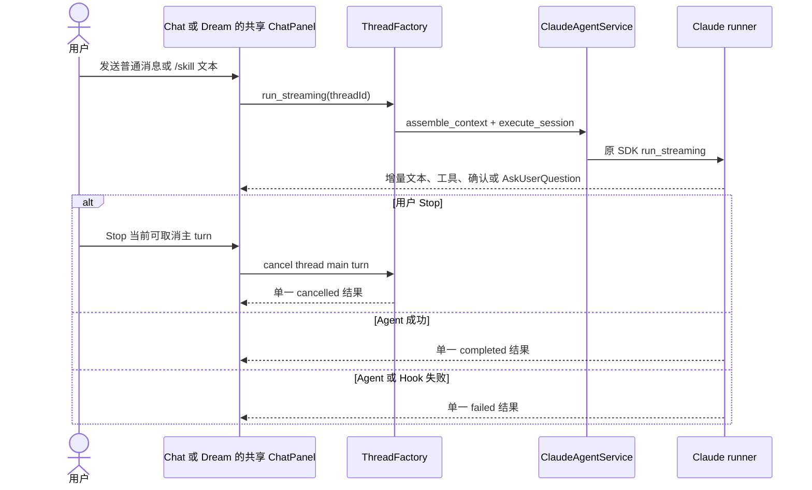
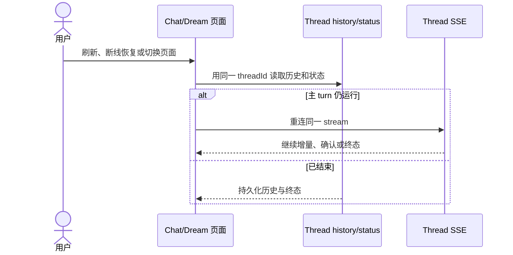
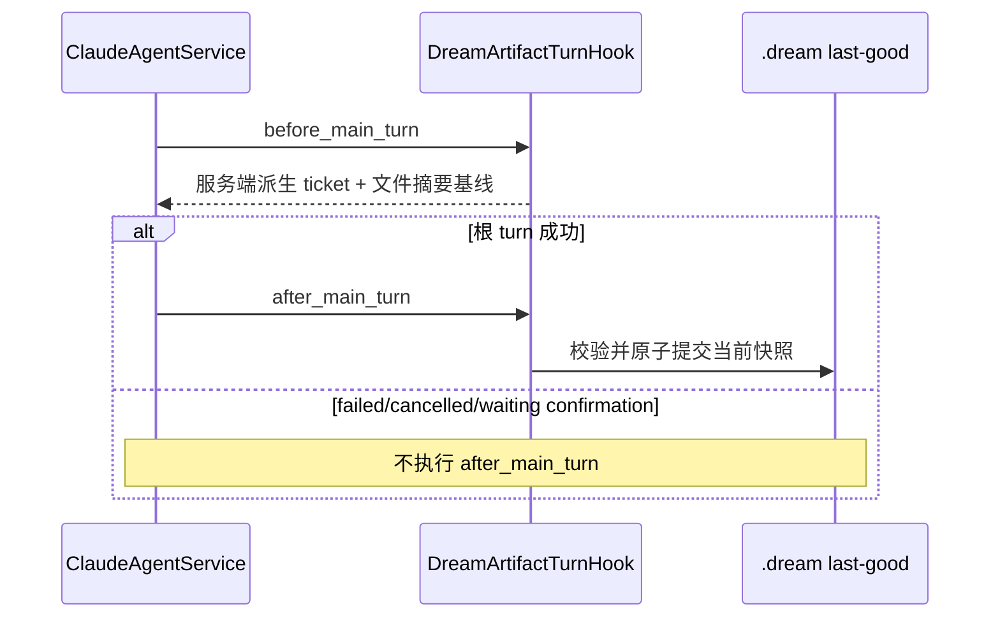

# Dream Agent 生命周期边界

Dream 不定义业务阶段状态机。Agent turn 的运行、工具确认、Stop、失败、取消、断线和恢复
全部使用 Chat 的 thread 生命周期；Skill 与 Artifact 不参与这些状态的计算。

## 1. 单一 Agent 生命周期

页面不保存第二份 `submitting/streaming/waiting_confirmation` 业务状态，也不根据历史子 Agent
transcript、Artifact、Observer 或 Workflow 行显示 Stop。

## 2. 刷新、断线与页面切换

GET 不启动新 turn。切换页面不创建 thread、不重发首轮消息，也不改变 Claude session ID。

## 3. Hook 生命周期

Hook 只在 Dream 根 turn 上执行一次；SDK 内部子 Agent 不单独提交快照。Hook 不生成第二
终态，但 Hook 失败会使同一 Chat turn 走既有唯一失败路径，不能继续宣称完成。

## 4. Observer 生命周期

Observer 由 `SessionObserverRegistry` 创建和关闭，订阅标准事件，使用 thread/turn/event
身份去重并忽略终态后的迟到业务提示。它没有持久状态账本，不扫描工作台、不发布文件、
不构建 Episode 关联，也不改变 Agent 或 Workflow 状态。异常由 registry 隔离，资源在
turn/session close 时释放。

## 5. 明确没有的生命周期

- 没有 Continuing 阶段；
- 没有 Skill 阶段、推荐动作、next action 或 completion fact；
- 没有 Episode action 的确认、派发、恢复或刷新状态机；
- 没有用 Artifact availability 推进 Agent turn；
- 没有用 Observer 投影反向控制 Chat 输入、Stop 或终态。
