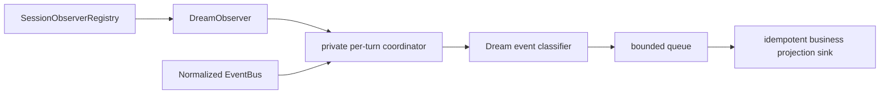
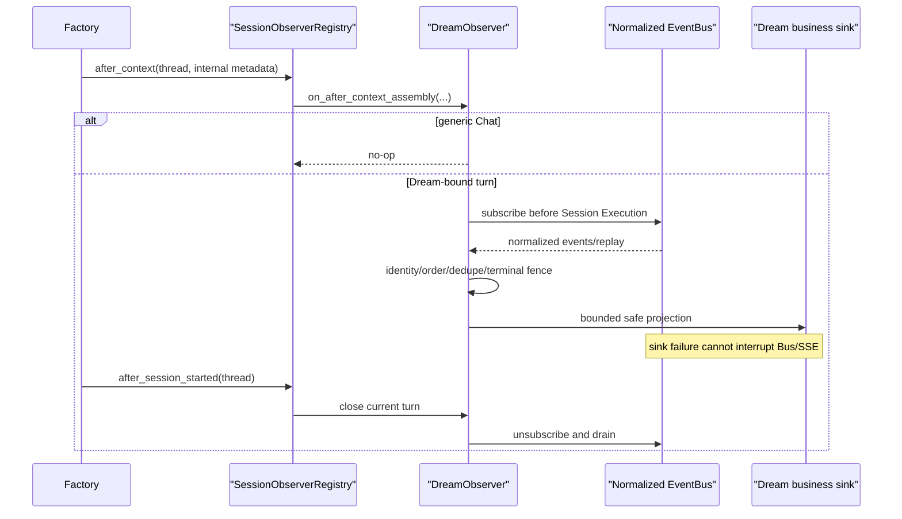

# DreamObserver design

## Role

`DreamObserver` is DreamAgent's class-based implementation of the existing
`SessionLifecycleObserver` protocol. A single instance is registered in
`SessionObserverRegistry` when ThreadFactory is constructed.

It owns Dream-specific post-processing resources. ThreadFactory owns only the
generic registry and emits existing lifecycle hooks; it contains no direct
Dream coordinator branch.

## Hooks

| Hook | DreamObserver behavior |
|---|---|
| `on_before_context_assembly` | no mutation; clear stale per-turn preparation if present |
| `on_after_context_assembly` | ignore generic Chat; for internal Dream context attach normalized EventBus subscriber before producer execution |
| `on_before_session_started` | validate attached identity; no Agent control |
| `on_after_session_started` | close/drain the completed turn resources |
| `on_before_session_ended` | close all handles for Thread |
| `on_after_session_ended` | discard bounded session diagnostics |

The metadata passed to hooks is process-local and contains object references
such as the bus and internal assembled context. It is not logged wholesale,
persisted or serialized to the browser.

## Internal composition



The existing normalized-event classifier/coordinator may remain private
implementation detail. Its public owner is `DreamObserver`; other modules do not
attach or close it directly.

## Allowed observations

- safe tool class and start/settlement;
- safe subagent class and start/settlement;
- bounded content/workflow operation classifiers;
- explicit domain completion/failure/cancellation facts;
- canonical Thread terminal only as diagnostics/cleanup input.

It must not persist raw prompt/reasoning, tool input, secrets, filesystem paths,
subagent transcript or user content. A Chat terminal alone cannot become a
Workflow terminal.

## Identity, order and idempotency

Each handle binds:

```text
(actor_id, thread_id, turn_id, workflow_run_id, generation)
```

For every derived business event:

1. Calculate a stable event ID from identity, normalized event kind, source
   event ID and safe operation correlation.
2. Reject an identity mismatch.
3. Ignore a previously committed event ID.
4. Enforce non-decreasing source sequence within a generation.
5. Apply through the owning business service with its own transaction and
   idempotency constraint.
6. Fence the first business terminal and ignore later business writes.

Replay can restart local reader sequence only when source event IDs remain
stable; duplicate IDs prevent repeat projection. A conflicting payload for the
same event ID is an error and is not applied.

## Failure isolation

The registry catches/logs Observer exceptions while preserving
`CancelledError`. The EventBus reader uses a bounded queue and never awaits a
slow business sink on the producer path. Overflow records a diagnostic and
drops non-terminal hints according to policy; it cannot delay Chat SSE.

Business repositories remain authoritative. If a sink write fails, the Agent
turn continues. Recovery replays safe source facts or reconciles from durable
domain facts; it does not ask the browser to resend Agent events.

## Cleanup

One idempotent close path:

1. revoke handle lease;
2. unsubscribe EventBus token;
3. signal bounded queue;
4. cancel and await reader/worker with bounded timeout;
5. archive bounded diagnostics;
6. remove handle and dedupe cache.

It runs on terminal/sentinel, setup failure, Stop/cancellation, task exception,
explicit Thread close, TTL eviction and factory shutdown. A cancellation-
swallowing sink is detached into a bounded tracked set and awaited again during
factory close.

## Prohibited responsibilities

- creating/renaming/reordering SSE frames;
- approving or rejecting a tool;
- calling Stop or controlling `ClaudeAgentService`;
- persisting a second message/event transcript;
- deciding composer availability;
- treating activity projection as Workflow or Thread truth;
- accepting Run/thread identity from a public Chat payload.

## Interaction sequence


