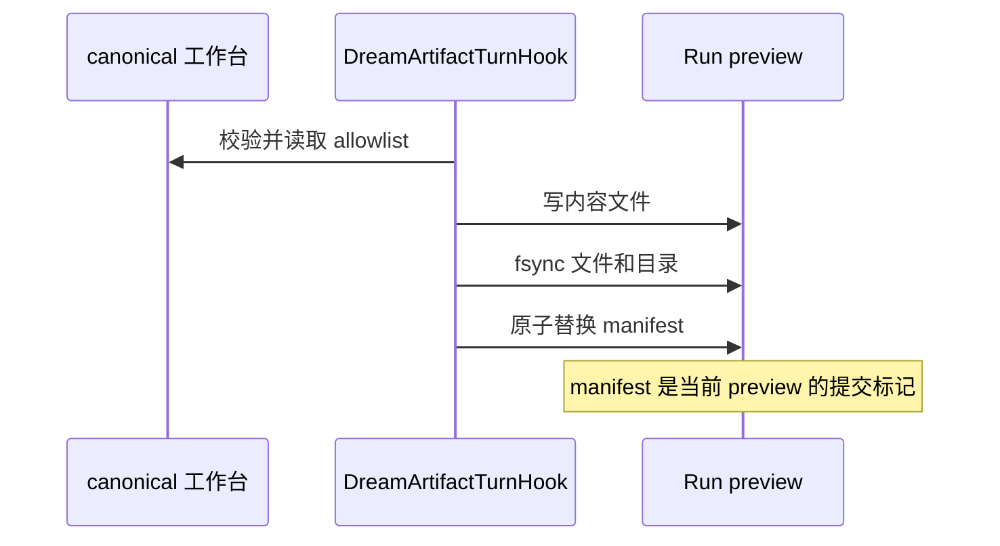
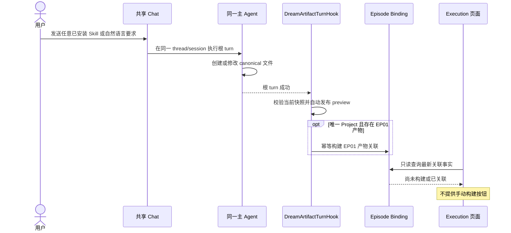

# Project / Episode Artifact 合同

跨系统权威文档是
`/Users/dmeck/project/ink-admin-memory/docs/design/modules/story-business/admin-dream-interaction-design.md`。
本文只定义 Dream 当前最小闭环使用的概念和边界；若出现冲突，以 Admin 权威合同为准。

## 1. 概念

| 概念 | 含义 | 不是 |
|---|---|---|
| Project | 稳定的创作容器，由 `project_id/project_slug` 标识 | Workflow Run 或 thread |
| Episode | Project 中的分集，目录身份为 `EP01`–`EP99` | 一次 Agent turn |
| Thread | Chat/Dream 共用的对话与 Claude session 容器 | Story 身份或浏览器路径 |
| Workflow Run | 一次可审计执行尝试 | Project/Episode 稳定身份 |
| Run preview | 当前 Run 工作台文件的私有发布副本 | Admin sealed Artifact |

## 2. canonical 工作台合同

```text
<thread-workspace>/
  assets/
    characters/*.{md,yaml,yml}
    scenes/*.{md,yaml,yml}
  stories/<project-id>/
    project.yaml
    episodes/<EPxx>/
      episode-outline.md
      script.md
      storyboard.yaml
      review-report.md
```

- `project.yaml` 的 `project_id` 和 `project_slug` 必须与目录完全一致。
- Project ID 必须匹配 `^[a-z0-9]+(?:-[a-z0-9]+)*$`。
- Episode 目录必须匹配 `^EP[0-9]{2}$`。
- 当前同步只复制上述五类 Project/Episode 核心文件；资产卡只生成页面 stage。
- 浏览器、模型正文和绝对路径都不能覆盖服务端派生的 thread/run 根目录。

## 3. 当前 Run 私有发布

```text
<thread-workspace>/.dream/runtime/runs/<run-id>/
  run.json
  stages/
    characters.json
    scenes.json
    storyboards.json
  artifact/
    manifest.json
    stories/<project-id>/
      project.yaml
      episodes/<EPxx>/
        episode-outline.md
        script.md
        storyboard.yaml
        review-report.md
```

`manifest.json` 使用 `dream-artifact-manifest/v1`，记录当前 Run、内容 revision、每个
已发布文件的相对路径、大小和 SHA-256。文件先写，manifest 最后原子提交；manifest
未引用的旧物理文件不属于当前发布集合。



## 4. 成功 turn 后自动构建首集产物关联

用户不在 Execution 页面或 Dream Agent 消息面板中手动构建产物关联。任意 Dream 根
turn 成功后，宿主 Hook 按以下顺序处理：

1. 重新读取当前 canonical 工作台的 allowlist 文件并校验路径与内容边界；
2. 自动发布完整的 Run-private preview；
3. 若已存在唯一 Project 且 EP01 至少构建了一项 canonical 产物，则用服务端持有的
   actor、thread、Run、Project 与 Episode 身份幂等构建 EP01 产物关联；
4. Execution 页面继续读取 actor-scoped REST，只读显示“尚未构建 EP01 产物关联”或
   “EP01 产物关联：已关联”。



Agent turn 失败、取消或 Hook 发布失败时不提交本轮 manifest，也不构建新关联。某个
Episode 文件尚未生成不是失败：Hook 发布已经存在的文件，页面据实显示缺失项。关联
建立不代表该 Episode 的所有产物已经完成，也不产生“下一步”或 completion fact。

## 5. 与 Admin sealed Artifact 的区别

当前 preview 只证明“这个 Run 已把哪些工作台字节同步给 Dream 页面”。它不会：

- 创建或切换 Admin canonical Story；
- 构建 Admin `episode.json` / `episode-workflow.json` 产物关联；
- 完成 Source Message authority、完整 Artifact 校验或 Story CAS；
- 把 Chat finish、stage revision 或 preview manifest 当作业务发布完成。

未来实现 sealed Artifact 时，必须直接遵循 Admin 权威合同，不得把当前 preview 扩展
成第二套版本账本或 lifecycle truth source。

## 6. 权限与一致性

发布前必须证明：Run 属于当前用户和 Workspace；source message 属于同一 owned
thread；冻结 Deck binding 与 Run 一致；Project/Episode 目录和文件身份一致。任何不一致
都 fail closed，不扫描替代目录、不按文件名合并跨 thread 内容。

成功后重复同步相同字节必须是 no-op；failed/cancelled turn 不提交新 manifest。
