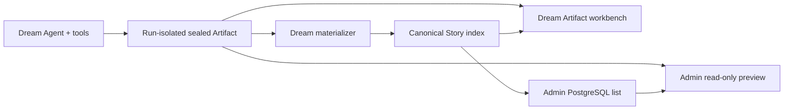
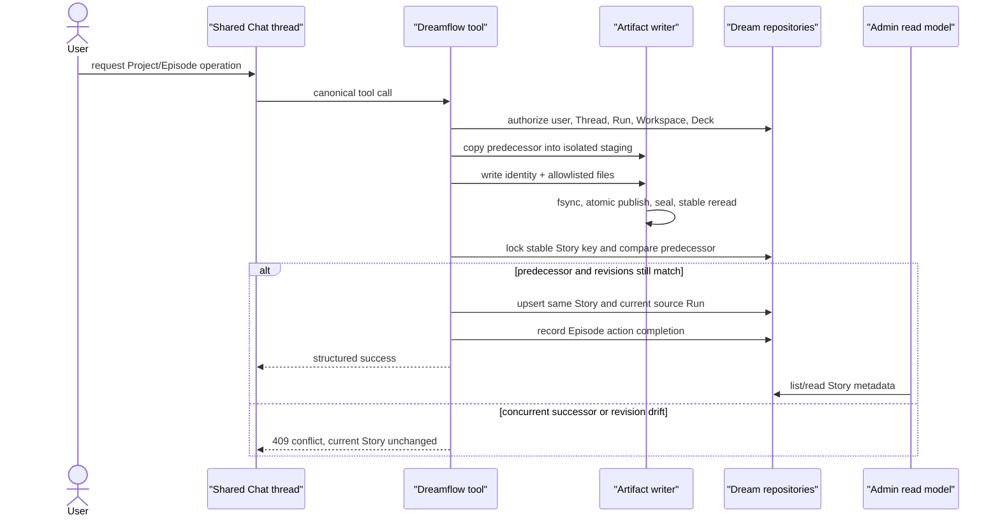
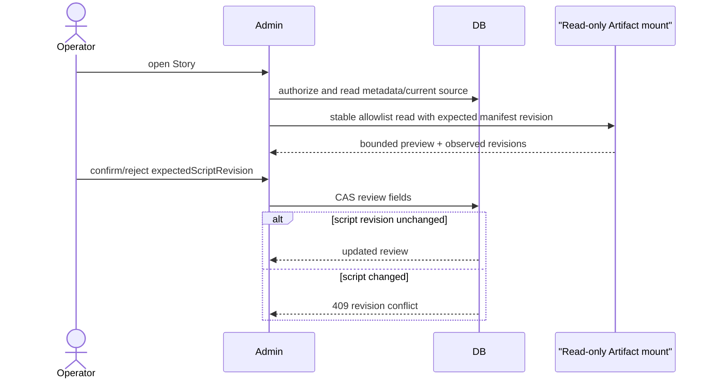

# Project / Episode Artifact contract

> Normative concept definition for Dream. The cross-system authority is
> `/Users/dmeck/project/ink-admin-memory/docs/design/modules/story-business/admin-dream-interaction-design.md`.
> This document restates the Dream-facing rules; conflicting details must be
> corrected in both repositories, with the Admin document remaining the shared
> contract authority.

## Business meaning

- **Project** is the stable creative container identified by
  `source_project_id` inside one Workspace.
- **Episode** is one ordered unit in that Project. Its display identity is
  `EP01`–`EP99`; its durable identity is `episode_uid`.
- **Workflow Run** is one retryable execution attempt. It is not the Project,
  Episode or Story identity.
- **Thread** is the Agent conversation/session and the server-side Artifact-root
  locator. It is not a Story identity and never becomes a browser file path.
- **Artifact** is one complete, run-isolated Project snapshot. Sealed bytes are
  the content truth.
- **Story Index** is the PostgreSQL search, relationship, status and revision
  projection. It is not a copy of the script.

Dream is the only writer of Project/Episode Artifact bytes and the canonical
Story identity/index. Admin reads the same PostgreSQL index, mounts Artifact
storage read-only and may update only review fields through revision-bound CAS.

## Stable identity

```text
story stable key = (workspace_id, "dream_episode", source_project_id)
story id = UUIDv5(
  NAMESPACE_URL,
  "urn:ink-memory:artifact-story:v1:"
  + workspace_id + ":dream_episode:" + source_project_id
)
```

Consequences:

1. One Project maps to one Story in one Workspace.
2. Adding an Episode updates that Story; it does not create another Story.
3. Run ID, Thread ID, Episode UID and Episode code never enter the Story key.
4. A retry may change the current source Run only after predecessor CAS and a
   complete Artifact validation; the Story ID remains stable.
5. A cross-thread Project rebind is a Dream-owned server command. The browser
   cannot declare it and files from two Threads cannot be merged by name.

## Run-isolated layout

```text
<shared-root>/<server-derived-thread-key>/.dream/runtime/runs/<run-id>/
  episode.json
  episode-workflow.json
  artifact/
    stories/<source-project-id>/
      project.yaml
      episodes/<EPxx>/
        script.md
        episode-outline.md
        storyboard.yaml
        review-report.md
```

The visible path is conceptual. Resolver code derives the single Thread
directory key from the owned `chat_thread.id`, opens through a canonical root
directory descriptor and rejects traversal, symlink escape and browser-supplied
paths.

A Run writes into a sibling staging directory, fsyncs files and directories,
then publishes the one `artifact/` directory by atomic rename. A pre-existing
snapshot is accepted only when bytes are identical. A sealed snapshot is never
overwritten. If Story CAS loses to a concurrent successor, the snapshot remains
non-current and cannot affect Admin reads.

## Identity files

All schemas are strict: UTF-8 without BOM, no unlisted fields, bounded depth and
size, UTC RFC 3339 timestamps and no YAML tags, aliases, duplicate keys or
multiple documents.

### `project.yaml`

```yaml
schema: dream-project/v1
project_id: rainy-night-letter
workspace_id: workspace-01
project_name: 雨夜来信
planned_episode_count: 12
```

`project_id` must equal `source_project_id` and the server-derived Project
directory. `planned_episode_count` is `null` or 1–99 and never replaces the
actual Episode registry.

### `episode.json`

`episode.json` uses `dream-episode-registry/v1` and is the complete Project
registry for that Run, not an Episode fragment. It contains:

- `workflow_run_id`, `predecessor_run_id`, `workspace_id` and
  `source_project_id`;
- `active_episode_uid`, monotonically increasing `registry_revision` and
  `sealed=true`;
- 1–99 ordered entries whose `episode_number` is contiguous, code is the
  matching `EP01`–`EP99`, UID is unique and `relative_root` is server-derived.

The first snapshot has no predecessor and revision 1. Every successor names the
Story's locked current source Run and increments its registry revision by one.
Two successors of one predecessor cannot both become current.

### `episode-workflow.json`

`episode-workflow.json` uses `dream-episode-workflow/v1` and records sealed,
idempotent Episode action completion facts. Its Run, Workspace, Project,
Episode and registry revision must match database authority and `episode.json`.
Each action appears at most once and carries its input revision, resulting
manifest revision, private command message ID and recorded time.

Allowed actions are:

```text
plan_episode
write_script
review_script
build_assets
regenerate_storyboard
review_full_chain
commit_episode
prepare_render_guide
```

This file does not control the Chat thread and an Agent `finish` event does not
prove an action completed. Only the owning tool/service may append a completion
fact after verifying the expected input and output revisions.

## Cross-check before materialization

Dream must prove all of the following in one authorized operation:

1. Run belongs to the authenticated user and Workspace.
2. Run's source message belongs to the same owned Thread.
3. Thread, frozen Deck binding and plugin lock match the Run.
4. Database authority, `project.yaml`, `episode.json` and
   `episode-workflow.json` agree on Project/Episode identity.
5. Registry predecessor equals the Story source locked at operation start.
6. Every directory and allowlisted filename is derived from that identity.

Mismatch is `artifact_identity_conflict` (409) or
`artifact_contract_invalid` (422). Dream must not guess, scan for a replacement
or join partial identities.

## Revisions

| Revision | Definition | Consumer |
|---|---|---|
| per-file revision | SHA-256 of exact bytes | ETag and file CAS |
| `script_revision` | SHA-256 of the ordered complete Episode script facts | Admin review CAS |
| `artifact_manifest_revision` | SHA-256 of registry plus all allowlisted file facts | Project snapshot comparison |
| observation ETag | SHA-256 of public Artifact observation plus current Story index facts | Dream reconcile `If-Match` |

The complete script revision exists only when the sealed registry is valid and
every registered Episode has exactly one available script. During generation,
missing or invalid states, the last complete revision may be displayed as stale
history but must not authorize review, publish or reconcile success.

An observation reads identity files and allowlisted content using directory-fd
operations, records `dev/ino/size/mtime_ns/hash`, then restats every entry. Any
change retries the whole bounded observation; exhaustion returns degraded 503,
not `missing`.

## Two independent state tracks



- Artifact availability: `generating | available | missing | invalid`.
- Story index: `syncing | indexed | stale | missing | failed`.
- Review: `pending | confirmed | rejected`, bound to `script_revision`.

File success and index success are always reported separately. A missing index
does not make files missing; missing files do not delete Story metadata; a
storage outage is degraded 503 rather than missing; revision drift is `stale`.

## Write and read boundaries

| Operation | Dream | Admin |
|---|---|---|
| create Project/Episode | owns | forbidden |
| write/seal Artifact | owns | OS/container read-only |
| calculate revisions | owns | verifies bounded reads |
| create/update Story identity/index | owns | forbidden |
| reconcile | owns, actor + ETag + idempotency | may request a controlled Dream command |
| read list metadata | actor-scoped | operator-scoped |
| review | displays | owns CAS on expected script revision |

Admin lists only PostgreSQL rows. Artifact preview starts from an authorized
Story ID, resolves a server-only locator and reads only registered allowlist
files. Public DTOs never contain filesystem paths, Thread directory keys,
source-message metadata, credentials or raw internal exceptions.

## Business interaction: publish and index



## Business interaction: Admin review



## Prohibited shortcuts

- Treat Run, Thread or Episode as Story ID.
- Let the browser submit a path or Dream run binding to Chat.
- Scan directories to invent Episode registry entries or Admin list rows.
- Overwrite a sealed snapshot or silently upsert through a conflict.
- Infer workflow completion from assistant prose, SSE EOF or page state.
- Store full script content, prompt text, secrets or paths in Story index/logs.
