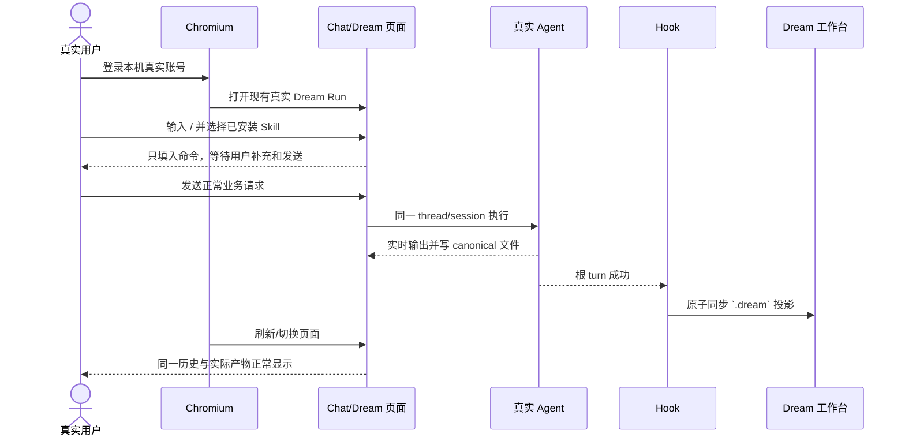

# Dream Agent 测试与验收

> 本文定义当前目标的可执行验收合同，不保存逐轮执行日志。实际轮次结果记录在
> [prompt-rounds.md](./prompt-rounds.md) 和 Git 历史中。

## 1. 验收原则

- 根因测试优先于只断言页面文案的测试。
- Dream 与 Chat 必须对同一 thread 执行同一组交互契约。
- Skill 建议从真实安装与 Deck/thread receipt 推导，不写死十三个命令。
- Hook 测试按文件事实验证 before 基线、成功后发布、失败/取消不发布和重复幂等。
- Observer 测试只验证后置投影与异常隔离，不给它增加 Agent 控制职责。
- 真实业务 E2E 使用本机真实账号、数据和安装，不克隆数据库或构造业务副本。
- 浏览器用语义等待；不得用固定 sleep 掩盖竞态。
- 不调用真实模型的契约测试与调用真实模型的业务验收必须分别标记。

## 2. 后端合同

### 2.1 共享 Agent runtime

- Dream 发送只进入标准 Chat thread API 和 `run_streaming()` 公开入口。
- `ClaudeAgentService.assemble_context` 通过 actor-owned thread 反向解析 Dream 上下文。
- 不修改 Claude runner 消息处理、原始 `claude_session_id` 或 resume 语义。
- 文本、工具、AskUserQuestion、子代理、Stop、失败和取消各自最多一个终态。
- SSE 正文不包含服务日志；subscriber 异常不截断主流。

### 2.2 Hook 自动同步

- before Hook 校验 actor/thread/run/workspace 并记录 canonical 文件摘要基线。
- 根 turn 成功后扫描实际文件，校验 allowlist、路径、schema 和内容摘要。
- 新增或变化文件原子发布到当前 Run 的 `.dream` 私有目录。
- 唯一合法 Project 与任一 EP01 产物存在时，可幂等建立第一集产物关联。
- 关联建立不表示 Episode 完成，也不产生推荐动作或 completion fact。
- 重复执行同字节无副作用；被删除文件不再出现在新 manifest。
- failed、cancelled、Stop 或同步校验失败不得发布半成品。
- Hook 异常沿同一 turn 的既有失败路径处理，不产生第二终态。

### 2.3 权限和读取

- `dream-files` GET 只读，不修复绑定、不调度任务、不启动 SDK turn。
- actor、thread、run、workflow ownership 任一不匹配均 fail closed。
- Artifact GET 只返回 canonical surface，不返回 workflow action 或推荐投影。
- MCP 写工具不能绕过路径、run/thread 绑定和业务权限。

## 3. 前端合同

### 3.1 共享 Chat

- Dream 直接组合共享 `ChatPanel`；生产代码只有共享 transport/parser/reducer。
- Dream→Chat→Dream 始终使用同一 threadId，不重发首轮消息。
- 刷新、断线和 SSE chunk 拆分/合并后恢复相同历史与终态。
- 工具批准、拒绝、reject-only、sandbox/network 和 AskUserQuestion 在两页面一致。
- 只有存在可取消主 turn 时显示 Stop；历史子代理 transcript 不阻塞输入。
- Dream 不隐藏左右两侧用户消息，不额外过滤或脱敏正文、Unicode、换行、特殊字符
  和内部 JSON 控制报文。

### 3.2 Slash Skill 建议

- 输入不是单一 Slash token 时不显示建议。
- 输入 `/` 时读取当前 thread receipt 或当前 Deck。
- 只展示 enabled、installation ready、版本匹配、摘要匹配且名称安全的 Skill。
- frozen receipt 存在时，只展示 receipt 中已验证的插件 Skill。
- 同名 Skill 去重并保持 Deck ref 顺序。
- ArrowUp/ArrowDown 移动选择，Enter/Tab 填入，Escape 关闭。
- 鼠标选择与键盘选择都只写入 `/skill `，不得自动发送。
- 无安装、API 失败或 receipt 无法解析时静默为空，不伪造固定命令。

### 3.3 Dream 工作台

- 页面没有 Episode 阶段推荐按钮、“下一步”、completion fact 或动作确认弹窗。
- 未建立关联时显示“尚未构建 Episode 产物关联”等事实文案。
- 已有 manifest 时按当前 `episodeCode` 展示，不把 EP01 文案写死到多 Episode 页面。
- GET 失败保留最后一次成功数据；ETag/轮询不产生重复内容。
- 页面适配桌面与较窄窗口，不出现输入框或工作台横向溢出。

## 4. Observer 合同

- 使用稳定 eventId/turnId/threadId 去重并检查事件顺序。
- 终态后忽略同一 turn 的迟到业务事件。
- 重放同一事件不会重复写业务投影。
- Observer 抛错不会中断 Chat SSE、改变确认或制造失败终态。
- workflow projection 不得反向设置 thread status、Stop、输入禁用或 Agent 完成。

## 5. 测试层级

| 层级 | 必须覆盖 |
|---|---|
| Python 单元/契约 | Hook、Artifact、binding、权限、Observer、单终态、路由删除 |
| 前端单元 | Skill 安装解析、Slash 过滤、键盘交互、artifact reducer、动态 Episode 文案 |
| 类型与静态检查 | TypeScript、ESLint、Python import/compile、旧协议和状态机源码扫描 |
| 构建 | 前端 production build、`git diff --check` |
| Chromium 合同 | 同 thread 发送/恢复、确认、Stop、断线、Slash 菜单、无推荐按钮 |
| 真实业务 Chromium | 本机真实账号/数据/安装；主 Agent 真实产物经 Hook 发布并由页面显示 |

## 6. 真实业务旅程

验收过程不得克隆真实数据。若测试会产生内容，必须使用用户明确放入范围的真实 Run，
记录产生的业务写入，并在结束时清理浏览器、测试进程和可安全清理的临时资源。

## 7. 完成门槛

- 聚焦后端和前端合同测试通过。
- 合理范围的后端/前端全量回归通过；与本任务无关的既有失败单独列明证据。
- TypeScript、ESLint、生产构建和 `git diff --check` 通过。
- 旧 Dream Event/SSE、Episode action/recovery API、推荐 reducer 和状态机不再被生产调用。
- Chromium 使用一个 worker 和语义等待完成；需要真实模型时明确记录模型、Run 与可见结果。
- 所有未执行验证、环境限制和剩余风险在最终汇报中逐项说明，不能用推断冒充通过。
