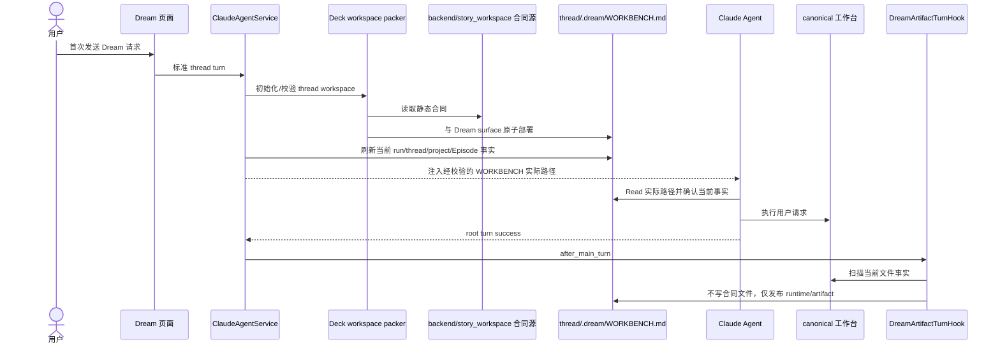
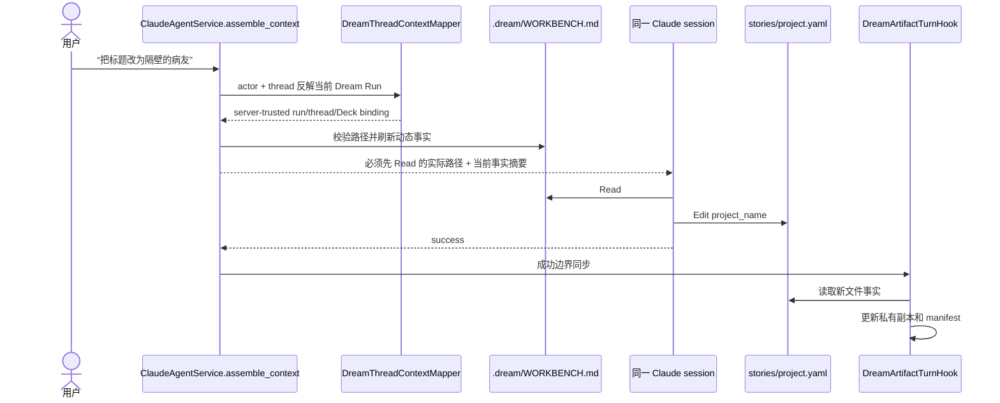

# Dream 工作台上下文初始化与逐轮注入设计

> 状态：设计审查通过。本文只定义 Dream 工作台合同文件如何在 workspace 初始化时部署，
> 以及每个 Dream 用户 turn 如何刷新并注入。它不定义 Skill 顺序、Workflow 状态机、
> Observer 控制或第二套 Agent 协议。

## 1. 背景与问题

Dream 用户会在同一 thread 中先初始化项目，再用自然语言或任意已安装 Skill 持续修改工作台。
只在首次 launch 中注入 `_launch_instruction` 不足以支撑“继续”“修改标题”等后续请求。

旧实现虽然在 `ClaudeAgentService.assemble_context` 末段生成 `.dream/WORKBENCH.md`，但存在
两个缺口：

1. Dream surface 首次原子初始化只部署 `README.md` 和 `workspace.json`，工作台上下文文件
   要等到更后的 assemble 阶段才出现；
2. 每轮指令只告诉 Agent 相对路径，没有把服务端校验后的实际路径作为强制 `Read` 目标，
   模型可以仅依赖历史记忆而跳过当前文件事实。

## 2. 目标与非目标

目标：

- `backend/story_workspace/dream_workbench_context.md` 是唯一静态 Agent 合同源；
- Dream surface 初始化原子部署 `.dream/WORKBENCH.md`；
- 每个 Dream 用户 turn 在调用模型前刷新动态事实；
- `assemble_context` 把同步后的实际文件路径注入本轮 prompt，并要求 Agent 先 `Read`；
- 后续修改落到当前 canonical Project/Episode，成功后仍由 Hook 按文件事实发布。

非目标：

- 不把设计文档全文直接作为运行时 prompt；
- 不让 Agent 写或刷新 `.dream/WORKBENCH.md`；
- 不增加 Skill 顺序、Episode 状态机、文件 watcher、轮询或新消息 DTO；
- 不修改 Claude runner、标准 Chat 报文、thread/session/resume 或 Observer 职责。

## 3. 合同边界

静态合同只描述长期稳定规则：canonical 目录、Project/Episode Artifact、Skill 任意执行、
Hook 文件事实同步、Observer 非控制型、MCP 仅辅助以及 `.dream` 私有写边界。

动态事实由服务端根据 actor-owned thread 解析，每轮刷新：

```text
workflow_run_id
thread_id
workspace_root
workbench_context_path
project_slug
canonical_project_path
episode_codes
```

静态合同不是 lifecycle truth；动态事实也不控制 thread。二者只帮助同一个 Claude Agent
session 正确定位当前工作台。

## 4. 初始化与逐轮生命周期



后续 turn 不重建 Agent runtime，也不依赖首次 launch 文本：



## 5. 失败与安全

- workspace、`.dream` 和 `WORKBENCH.md` 必须是服务端派生路径，拒绝符号链接、越界路径和
  非普通文件；
- 初始化写入与每轮刷新都使用临时文件、fsync 和原子替换；字节未变化时 no-op；
- 文件缺失时下一次 assemble 自动恢复；文件类型或路径异常时 fail closed，不调用模型；
- prompt 中的绝对路径仅存在于服务端构建的 Agent message，不进入公开 REST/SSE DTO；
- Agent 读取失败或文件事实冲突时不得猜测 Project；
- Stop、取消和失败 turn 不触发 after Hook，不发布半成品。

## 6. 职责划分

| 组件 | 职责 | 禁止事项 |
|---|---|---|
| workspace packer | 首次原子部署静态合同 | 不写 run/project 动态事实 |
| `DreamWorkbenchContext` | 每轮验证路径、刷新动态事实、生成内部指令 | 不执行 Agent、不发布页面 |
| `ClaudeAgentService.assemble_context` | 解析 Dream binding 并注入内部上下文 | 不改变公开报文/session ID |
| Claude Agent | 每轮先 Read，再修改 canonical 文件 | 不写 `.dream/**` |
| Hook | 成功后按文件事实同步 | 不识别 Skill 顺序、不控制 Agent |
| Observer | 非控制型业务投影 | 不扫描文件、不发布、不推进状态 |

## 7. 验收标准

- 新 Dream workspace 初始化完成时已存在静态 `.dream/WORKBENCH.md`；
- 每个 Dream turn 调用模型前，文件包含当前 run/thread/workspace/project/Episode；
- 注入指令包含该文件经过校验的实际路径，并明确要求本轮调用 `Read`；
- 删除文件后下轮自动恢复；符号链接或非普通文件失败关闭；
- 普通 Chat turn 不注入 Dream 工作台；Dream↔Chat↔Dream 仍复用同一 thread/session；
- 真实模型的持久化 tool parts 能证明先读取 WORKBENCH，再操作 canonical 文件；
- Hook 发布结果与 canonical 文件及 manifest SHA 一致。
