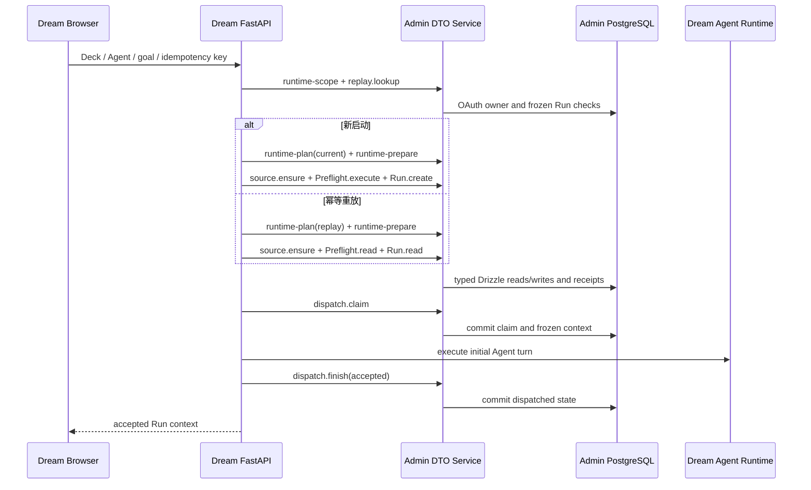

<!-- [Input] Admin Registry133 plus registered Runtime/source/Preflight/Run/dispatch/failure contracts and the Dream launch call graph. -->
<!-- [Output] Current launch DTO/ORM ownership, normal/replay/failure flows, state rules and verification evidence. -->
<!-- [Pos] Dream launch production design; Admin owns persistence and Dream owns Agent execution. -->
<!-- [Sync] 2026-09-16: close the production launch PostgreSQL path through one request-scoped Admin consumer composition. -->

# Dream launch Admin 数据消费现行设计

## 背景与问题

迁移前的 `POST /api/story-workspace/dream-runs/start` 在 Dream Python 内部查询或写入 hidden Chat source、Workflow Preflight、Workflow Run、dispatch claim 和失败 metadata。Runtime 准备虽然已迁至 Admin Registry130–132，启动组合仍保留本地数据库连接与事务，导致 Dream 同时承担业务执行和数据访问。

Admin 已有这些业务领域的严格 Zod DTO、Service、typed Drizzle Repository、权限校验与 original receipt。缺口是启动前无法在不读取 Dream PostgreSQL 的情况下判断同一业务 key 是否已有冻结 Run。Registry133 增加一个只读 replay lookup，生产 endpoint 随后可只组合 Admin 业务操作。

## 目标与边界

Admin 负责 launch 涉及的全部 SQL、ORM、锁、权限过滤、数据库时间、事务、receipt 与 audit。Dream 使用一个请求级 `AdminDataClient` 和当前 `AdminRequestActor` 调用严格 Pydantic DTO，保留公开请求/响应、Agent Runtime、Runner、ThreadFactory、EventBus、SSE、turn/resume/cancel、资源策略 LKG 与共享文件系统。

Dream 不发送 actor ID、表列、SQL、数据库连接、文件路径、锁或目标状态。Admin 不执行 Agent turn，不读写 thread workspace，也不改变 `CLAUDE_CODE_TMPDIR={AGENT_CWD}/{thread_id}/.claude-tmp`、`0700`、符号链接和 sandbox 边界。本阶段不增加 Drizzle schema 或 migration。

## 概念与规则

### DTO、Service 与 ORM 边界

| 业务步骤 | Admin operation | Dream 输入 | Admin 执行 |
| --- | --- | --- | --- |
| 授权范围 | `dream-launch.runtime-scope` | Workspace、Deck、nullable Agent | 从 OAuth actor 校验 owned enabled Workspace/Deck/Voice |
| 幂等恢复 | `dream-launch-replay.lookup` | Workspace、Deck、nullable Agent、goal、业务 key | 读取 owned Run，复算 source identity/fingerprint，校验 Preflight goal hash |
| Runtime 计划与准备 | `dream-launch.runtime-plan` / `dream-launch.runtime-prepare` | current 或 frozen Run identity、Dream 本地校验证据 | 派生 binding/lock，重验 materialization 和安装并提交 receipt |
| 隐藏来源 | `dream-launch-source.ensure` | 原 launch command 字段 | 原子创建或恢复 Thread/message/source metadata |
| Preflight | `workflow-preflight.execute` / `workflow-preflight.read` | Deck、binding revision、canonical `{goal}` 或 frozen Preflight ID | 执行检查、签发或读取 token、保存状态 |
| Run | `workflow-run.create` / `workflow-run.read` | Preflight token 与完整 source tuple，或 frozen Run ID | 消费 token、创建 queued Run，或读取原 Run |
| 派发 | `dream-launch-dispatch.claim` / `dream-launch-dispatch.finish` | owned Run、instruction、claim ID、accepted | CAS claim、生成 frozen context、提交 pending/dispatched metadata |
| 失败 | `workflow-run.fail` / `dream-launch-failure.envelope` | owned Run 与业务错误码 | 先提交 failed Run，再独立提交 source failure metadata |
| Voice prompt | `deck.detail` | owned Deck | 读取 enabled Voice 并返回 system prompt |

Registry133 operation SHA 为 `af4d06490d6d030d9aa0a3b68460c15813786130a85c5133b438439a3fcb11fb`；Registry132 prefix SHA 保持 `6e0149b3d3354d081564af21349f364cc092087d5aadce0d5164654a6c005bb2`，完整 Registry133 SHA 为 `951a3ee9d26354d0094dafec6233a13638a430672ddacd730cefc95f654b5ec3`。两仓使用同一生成合同 `docs/architecture/admin-dream-operation-contracts.json`。

### 正常流程

顺序固定为授权范围、replay lookup、Runtime 准备、source、Preflight、Run、claim、Dream Runtime、finish。新启动只有在 replay 为空时解析当前模型并消费新的 Preflight token。重放读取原 Preflight 和 Run；已消费 Preflight 不伪造或重新签发 token，也不按当前模型覆盖冻结配置。两个同内容、同业务 key 的并发新启动可能各自完成 Preflight，但 Run 唯一约束只提交一个；后到请求可接收先提交 Run 及其等价 Preflight ID，同时仍校验 source、binding、snapshot、actor 和 Workspace。

### 状态转换

| 条件 | 数据状态 | Dream 行为 |
| --- | --- | --- |
| 无原 Run | source created/replayed → Preflight passed → Run queued | 调用 claim 并启动一次 Agent turn |
| 有匹配原 Run | frozen Preflight/Run/source 重新校验 | 不创建新 PF/Run，不解析当前模型；继续幂等 claim |
| claim 返回 `claimed=false` | 已派发、已有有效 claim 或状态不允许 | 不启动第二个 turn，返回原 Run context |
| Runtime 接受 | finish `accepted=true` | Admin 固定写入 dispatched metadata |
| Runtime 拒绝或同步抛错 | finish `accepted=false` | 保留可恢复状态并返回稳定业务失败 |
| Agent terminal error | Run fail committed → failure envelope | 背景错误不改写成功状态，不删除历史记录 |

### 失败与原请求恢复

每个非幂等写使用独立 request ID。客户端只发送一次；网络超时、坏回复或响应丢失标记 outcome unknown，并以同 operation 和原 request ID 读取 original receipt。只有 `committed` 且完整 DTO、actor、Workspace、Run/source 绑定重新校验通过时才继续；`absent`、`in_progress`、能力缺失或绑定错配都停止，不切回 Dream PostgreSQL。

失败记录保持两个原事务。`workflow-run.fail` 未确认 committed 时不发送 failure envelope。两步均成功或精确 replay 时保留已有 failed 历史与 metadata；Admin 不可用只记录安全错误码，不让后台异常传播成另一个 Agent turn。

### API 契约和权限

公开 start 请求仍只接受 Deck、nullable Agent、goal 和 idempotency key。当前 OAuth bearer 由 Dream 请求身份依赖获得，不进入业务 DTO、日志、Agent 环境或浏览器持久化。所有 launch 写要求 `dream:write`，读要求 `dream:read`；同一认证主体不会因此获得 Admin 管理权限。Admin 从 OAuth principal 派生 canonical actor，并在每个 Repository 查询中重复实体 owner 范围。

`dream-launch-replay.lookup` 输出仅为 `null` 或 `{workflow_run_id, workflow_preflight_id, thread_id, message_id}`。changed goal、Deck、Agent、source 或 Preflight hash 返回幂等冲突；没有记录返回 `null`。接口不接受任意用户 ID，也不提供通用 CRUD 或查询 selector。

### 数据模型与迁移

本阶段复用既有 `chat_thread`、`chat_message`、Workflow Preflight/Run、binding、runtime materialization、receipt 与 audit 结构。Admin Drizzle 仍是唯一 schema 管理来源；Registry133 是 API capability 增量，没有数据库 capability 或 migration 变化。Dream 不执行 runtime DDL、Alembic、自动建表或 SQLite fallback。

### 页面行为与失败反馈

浏览器成功响应和 Run context 字段保持不变。授权、Deck/Voice、模型、capability、冲突或 Admin 不可用时，FastAPI 使用已有安全 code/status 映射；不展示 SQL、token、内部 claim、数据库地址或上游错误正文，也不增加重复确认。HTTP 响应完成后由 `DreamLaunchTaskRegistry` 继续拥有已接受的 drain；应用关闭时只取消并等待本进程拥有的任务。

### 影响范围与验收

生产实现位于 `backend/services/story_workspace/dream_launch_application_service.py`、`dream_launch_endpoint_service.py`、`dream_launch_infrastructure.py`、路由和 `backend/services/admin_data/*` 消费者。launch 模块不得导入 `database`、调用 `get_db`、执行 SQL/ORM 或定义数据库 fallback。

已通过的技术证据：Dream focused 75 项 launch 测试、相关 Admin request/preflight/run/deck 247 项测试、Python compile 与 AST/关键字 DB fence；Admin focused 18 项测试、TypeScript typecheck，以及 script-owned PostgreSQL 的 63 migration + 受限执行角色 9 项集成测试。隔离数据库已清理。完整仓库门禁、正常 Google 登录和真实模型 launch 仍按跨项目验收计划执行，不能由这些隔离结果替代。

### 发布顺序与回滚条件

发布顺序为 Admin Registry133 与合同 JSON、Admin 服务、Dream consumer。Dream 启动前必须读取包含 Registry133 及全部依赖 operation/schema hash 的 capability；缺少任一能力即失败关闭。回滚 Dream 时回到上一版 consumer；回滚 Admin 必须先停止使用 Registry133 的 Dream 版本。没有 schema 变更，因此本阶段不执行数据库 contract migration 或数据回填。
