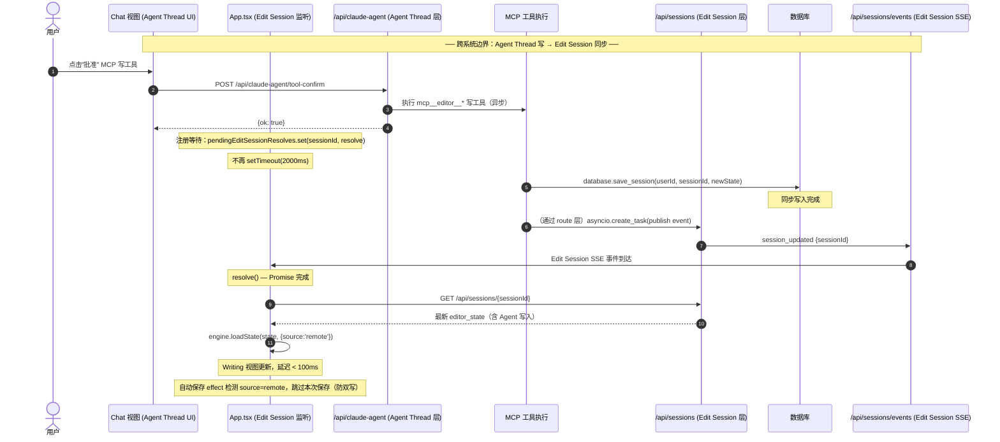
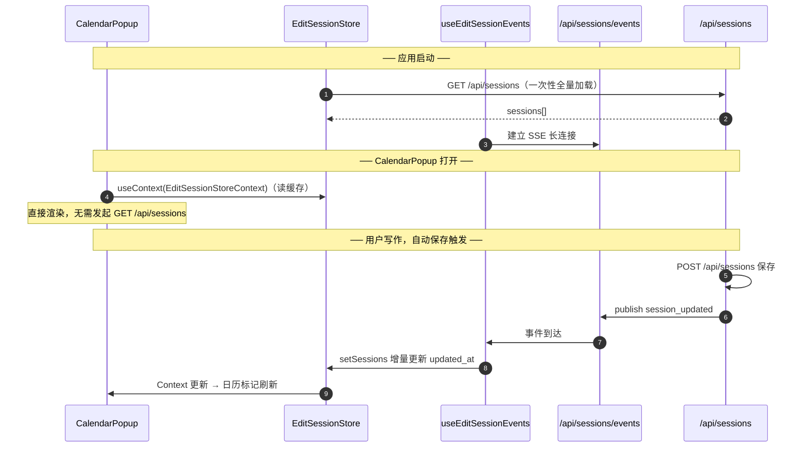

# Edit Session 事件驱动同步机制设计

> **版本**: 2026-06-09 v2 — 修正概念混淆  
> **问题来源**: `api/sessions`（edit session，即写作日记会话）接口请求量过大，MCP 写工具确认存在 2000ms 硬编码盲等待  
> **关联文件（Edit Session 层）**:  
> - `docs/design/edit-session/overview.md` §6.4（MCP 写工具确认现状）  
> - `backend/routers/sessions.py`（Edit Session REST 接口：POST/GET /api/sessions/*）  
> - `backend/database.py` `save_session()`（同步写入函数）  
> - `frontend/src/hooks/useSessionLifecycle.ts`（自动保存、初始化加载）  
> - `frontend/src/App.tsx` `handleEditorWriteConfirmed`（MCP 写确认回调）

---

## ⚠️ 概念区分：Edit Session vs Agent Thread

本文档只涉及 **Edit Session（写作日记会话）**，与 Agent Thread 是两个完全独立的系统：

| 维度 | Edit Session（本文档范围）| Agent Thread（不在本文档范围）|
|------|--------------------------|-------------------------------|
| 是什么 | 用户的写作日记条目 | Claude AI 对话线程 |
| 后端路由 | `backend/routers/sessions.py` `/api/sessions/*` | `backend/routers/claude_agent.py` `/api/claude-agent/*` |
| 存储结构 | `editor_state` JSON（cells、commentors 等）| 对话消息列表 |
| 前端入口 | `useSessionLifecycle` → `EditorEngine` | `ChatPanel.tsx` / `ChatView.tsx` |
| SSE 体系 | 本文档新建 `SessionEventBus`（edit session 变更通知）| 已有 `IEventBus`（`claude_agent/event_bus.py`，agent 推理流推送）|
| 互动关系 | Agent Thread 执行 MCP 工具 → **写入** Edit Session DB | — |

> **MCP 写工具的跨系统边界**：Agent Thread 通过 MCP 工具写 edit session 内容时，写入的是 Edit Session DB（`/api/sessions`），确认完成后前端需要重新加载 Edit Session。本文档优化的正是这个「写入完成 → 前端感知」的同步链路，属于 Edit Session 层的改造，不涉及 Agent Thread 的 SSE 推流逻辑。

---

## 目录

1. [现状问题分析](#1-现状问题分析)
2. [设计目标](#2-设计目标)
3. [架构概述：Edit Session 事件通道](#3-架构概述edit-session-事件通道)
4. [后端：SessionEventBus 与 SSE 端点](#4-后端sessioneventbus-与-sse-端点)
5. [前端：统一 SessionStore 缓存层](#5-前端统一-sessionstore-缓存层)
6. [MCP 写工具零延迟同步方案](#6-mcp-写工具零延迟同步方案)
7. [自动保存幂等保护](#7-自动保存幂等保护)
8. [各组件迁移策略](#8-各组件迁移策略)
9. [时序图](#9-时序图)
10. [实现文件清单](#10-实现文件清单)
11. [部署与回退策略](#11-部署与回退策略)

---

## 1. 现状问题分析

### 1.1 请求来源拆解（均为 Edit Session 接口）

| # | 来源模块 | 接口 | 触发模式 | 频率 | 问题评级 |
|---|---------|------|---------|------|---------|
| A | `useSessionLifecycle` 自动保存 | `POST /api/sessions` | 状态变更 + 3s 防抖 | 每次写入触发 | 🟡 合理，但存在双写风险 |
| B | `useSessionLifecycle` 初始化 | `GET /api/sessions` + `GET /api/sessions/{id}` | 应用启动一次 | 极低 | ✅ 无需改动 |
| C | `CalendarPopup` 挂载 | `GET /api/sessions` | 每次打开日历 | 中 | 🟡 可共享缓存消除 |
| D | `CollectionsView` 懒加载 | `GET /api/sessions/range` (分片) | 滚动触发 | 中 | ✅ 已是事件驱动 |
| **E** | **MCP 写工具确认后** | **`GET /api/sessions/{id}`** | **2000ms 定时盲等待** | Agent 每次写后 | 🔴 核心痛点 |
| **F** | **Agent 写→状态刷新→自动保存** | **`POST /api/sessions`** | MCP 写后 engine 重载触发 | Agent 每次写后 | 🔴 双写竞态 |

### 1.2 核心痛点

**痛点 E：2000ms 硬编码盲等待**（`App.tsx` `handleEditorWriteConfirmed`）

```
用户批准 MCP 写工具（Chat 视图）
  → POST /api/claude-agent/tool-confirm   ← Agent Thread 层确认接口
  ← {ok: true}  ← 此时 Agent Thread 执行 MCP 写工具是异步的，DB 写入尚未完成
  → setTimeout(2000ms)   ← 经验值，脆弱
  → GET /api/sessions/{sessionId}         ← Edit Session 层拉取接口
```

问题：
- DB 写入完成的精确时机前端无法感知，2000ms 是猜测值
- 慢网络/高负载下可能仍读到旧数据；快速操作下无谓等待
- 前端拉取到最新 edit session → `engine.loadState()` → state 变更 → 自动保存再触发一次 `POST /api/sessions`（痛点 F，双写覆盖 Agent 写入）

**痛点 C：多组件独立拉取**

`CalendarPopup` 每次挂载调用 `GET /api/sessions` 全量拉取，与 `useSessionLifecycle` 无共享缓存，同一份列表数据重复加载。

---

## 2. 设计目标

| 目标 | 说明 |
|------|------|
| **消除 MCP 写盲等待** | Edit Session DB 写入完成后，后端通过 SSE 主动推送 `session_updated` 事件，前端立即响应，延迟 <100ms |
| **防止 MCP 写后双写** | 前端 engine 从远端事件刷新后，标记来源为 `remote`，自动保存 effect 跳过本次触发 |
| **多组件共享会话列表缓存** | 统一 `SessionStore` React Context，`CalendarPopup` 等消费 store 而非各自调用 `GET /api/sessions` |
| **系统边界清晰** | 新建 `SessionEventBus`（edit session 专用），与 agent thread 的 `IEventBus` 完全独立，不共享实现 |
| **向后兼容** | SSE 连接不可用时，降级回原有 2000ms + GET 拉取机制 |

---

## 3. 架构概述：Edit Session 事件通道

```
┌────────────────────────────────────────────────────────────────────┐
│                          前端                                        │
│                                                                      │
│  ┌──────────────────┐   订阅    ┌────────────────────────────────┐  │
│  │  SessionStore    │◄──────────│  useEditSessionEvents (Hook)   │  │
│  │  (React Context) │           │  SSE: GET /api/sessions/events │  │
│  │  · sessions[]   │           │  处理 session_updated 事件     │  │
│  │  · invalidate() │           └────────────────────────────────┘  │
│  └────────┬─────────┘                                               │
│           │ 读取                                                     │
│  ┌────────▼────────────────────────────────────────────────────┐    │
│  │  CalendarPopup · useSessionLifecycle · AnalysisView         │    │
│  │  （消费 SessionStore 缓存，不再各自发起 GET /api/sessions）   │    │
│  └─────────────────────────────────────────────────────────────┘    │
│                                                                      │
│  App.handleEditorWriteConfirmed                                      │
│    等待 session_updated 事件（带 sessionId 过滤）→ 精准 GET 一条    │
└────────────────────────────────────────────────────────────────────┘
                   ▲ SSE 推送 /api/sessions/events
┌────────────────────────────────────────────────────────────────────┐
│                     后端 Edit Session 层                             │
│                                                                      │
│  POST /api/sessions（自动保存）                                      │
│    → database.save_session()  [同步]                                │
│    → asyncio.create_task(session_event_bus.publish(event))          │
│      → SSE 帧 → 前端                                                │
│                                                                      │
│  MCP 工具执行（来自 Agent Thread）→ database.save_session()  [同步] │
│    → route 层 publish session_updated 事件                          │
│      → SSE 帧 → 前端                                                │
└────────────────────────────────────────────────────────────────────┘

注：Agent Thread 层的 IEventBus（claude_agent/event_bus.py）负责 Claude AI 推理流推送，
    是完全独立的系统，本文档的 SessionEventBus 与其无关。
```

**关键设计决策**：

1. **事件发布位置**：在 `backend/routers/sessions.py` 的 async route handler 里，`database.save_session()` 同步成功后，用 `asyncio.create_task()` 非阻塞发布事件（不在 `database.py` 内发布，保持 DB 层纯粹）
2. **前端订阅**：`useEditSessionEvents` Hook 建立 `GET /api/sessions/events` SSE 长连接，在 App 顶层挂载一次
3. **MCP 写确认**：`handleEditorWriteConfirmed` 注册一个 Promise，等待对应 sessionId 的 `session_updated` 事件后再调用 `GET /api/sessions/{id}`，消除 2000ms 盲等待
4. **自动保存防双写**：engine `loadState` 增加 `source` 参数，来源为 `remote` 时自动保存 effect 跳过

---

## 4. 后端：SessionEventBus 与 SSE 端点

### 4.1 SessionEventBus（Edit Session 专用，与 claude_agent/event_bus.py 完全独立）

```python
# backend/session_events.py（新建）
# [Input] 由 routers/sessions.py 的 save_session route 调用 publish
# [Output] 向已连接的 /api/sessions/events SSE 消费者推送事件
# [Pos] Edit Session 变更事件广播，与 claude_agent/event_bus.py 无关联
# [Sync] 新建，搭配 docs/design/edit-session/session-event-driven-sync.md

from __future__ import annotations
import asyncio
import datetime
from dataclasses import dataclass, field
from typing import Optional


@dataclass
class EditSessionEvent:
    type: str            # "session_updated" | "session_deleted"
    session_id: str
    user_id: str
    timestamp: str = field(
        default_factory=lambda: datetime.datetime.utcnow().isoformat() + "Z"
    )


class SessionEventBus:
    """全局单例：向已认证用户的 SSE 连接广播 Edit Session 变更事件。

    按 user_id 定向推送，保证用户数据隔离。
    每个 SSE 连接对应一个 asyncio.Queue；连接断开时 unsubscribe 移除 queue。

    注意：与 backend/claude_agent/event_bus.py 的 IEventBus 完全独立，
    IEventBus 用于 Claude Agent 推理流 SSE，本类用于 Edit Session 变更通知。
    """

    def __init__(self) -> None:
        # user_id → list[asyncio.Queue[EditSessionEvent]]
        self._subscribers: dict[str, list[asyncio.Queue]] = {}
        self._lock: asyncio.Lock = asyncio.Lock()

    async def subscribe(self, user_id: str) -> asyncio.Queue:
        q: asyncio.Queue = asyncio.Queue()
        async with self._lock:
            self._subscribers.setdefault(user_id, []).append(q)
        return q

    async def unsubscribe(self, user_id: str, q: asyncio.Queue) -> None:
        async with self._lock:
            queues = self._subscribers.get(user_id, [])
            try:
                queues.remove(q)
            except ValueError:
                pass

    async def publish(self, event: EditSessionEvent) -> None:
        async with self._lock:
            queues = list(self._subscribers.get(event.user_id, []))
        for q in queues:
            await q.put(event)


# 全局单例，在 server.py lifespan 或模块顶层创建
session_event_bus = SessionEventBus()
```

### 4.2 routers/sessions.py：save_session route 改为 async 并发布事件

当前 `save_session` route 是同步 `def`，改为 `async def` 以便使用 `asyncio.create_task`：

```python
# backend/routers/sessions.py（修改 save_session 端点）

import asyncio
from session_events import session_event_bus, EditSessionEvent

# 修改前：def save_session(...)
# 修改后：async def save_session(...)
@router.post("/api/sessions")
async def save_session(request: dict, current_user: dict = Depends(get_current_user)):
    user_id = current_user["user_id"]
    session_id = request.get("session_id")
    editor_state = request.get("editor_state")
    name = request.get("name")
    labels = request.get("labels")

    if not session_id or not editor_state:
        raise HTTPException(status_code=400, detail="session_id and editor_state required")

    # database.save_session 保持同步调用（DB 层不感知事件系统）
    database.save_session(user_id, session_id, editor_state, name, labels=labels)

    # DB 写入同步完成后，非阻塞地广播 session_updated 事件
    # create_task 保证不阻塞 HTTP 响应返回
    asyncio.create_task(
        session_event_bus.publish(
            EditSessionEvent(
                type="session_updated",
                session_id=session_id,
                user_id=str(user_id),
            )
        )
    )

    return {"success": True}
```

> **关键点**：`database.save_session()` 是**同步**函数，DB 写入在 `publish` 前已完成；
> 前端收到 `session_updated` 事件时，DB 数据一定是最新的。

### 4.3 SSE 端点：GET /api/sessions/events

```python
# backend/routers/sessions.py（新增端点）

from fastapi.responses import StreamingResponse
import json

@router.get("/api/sessions/events")
async def edit_session_events(
    current_user: dict = Depends(get_current_user)
):
    """Edit Session 变更通知 SSE 流。

    前端通过此端点订阅 session_updated / session_deleted 事件，
    替代 MCP 写工具确认后的 2000ms 定时拉取。

    与 /api/claude-agent/* 的 Agent Thread SSE 完全独立。
    """
    user_id = str(current_user["user_id"])

    async def event_generator():
        q = await session_event_bus.subscribe(user_id)
        try:
            yield "event: connected\ndata: {}\n\n"
            while True:
                try:
                    event: EditSessionEvent = await asyncio.wait_for(
                        q.get(), timeout=30.0
                    )
                    data = json.dumps({
                        "type": event.type,
                        "sessionId": event.session_id,
                        "timestamp": event.timestamp,
                    })
                    yield f"event: {event.type}\ndata: {data}\n\n"
                except asyncio.TimeoutError:
                    yield ": keepalive\n\n"   # 防止代理/浏览器断连
        finally:
            await session_event_bus.unsubscribe(user_id, q)

    return StreamingResponse(
        event_generator(),
        media_type="text/event-stream",
        headers={"Cache-Control": "no-cache", "X-Accel-Buffering": "no"},
    )
```

---

## 5. 前端：统一 SessionStore 缓存层

### 5.1 useEditSessionEvents Hook

```typescript
// frontend/src/hooks/useEditSessionEvents.ts（新建）
// [Input] GET /api/sessions/events (SSE, Edit Session 专用)
// [Output] 回调 → SessionStore 增量更新 / App MCP 写确认
// [Pos] Edit Session 变更事件订阅，与 useChat / ChatView 的 Agent SSE 无关
// [Sync] 新建，搭配 session-event-driven-sync.md

interface EditSessionEventHandlers {
  onSessionUpdated?: (sessionId: string, timestamp: string) => void;
  onSessionDeleted?: (sessionId: string) => void;
}

export function useEditSessionEvents(handlers: EditSessionEventHandlers) {
  const { isAuthenticated } = useAuth();
  const handlersRef = useRef(handlers);
  handlersRef.current = handlers;

  useEffect(() => {
    if (!isAuthenticated) return;

    // 注意：这是 Edit Session 事件端点，不是 Agent Thread 的 SSE 端点
    const es = new EventSource('/api/sessions/events', { withCredentials: true });

    es.addEventListener('session_updated', (e: MessageEvent) => {
      const data = JSON.parse(e.data);
      handlersRef.current.onSessionUpdated?.(data.sessionId, data.timestamp);
    });

    es.addEventListener('session_deleted', (e: MessageEvent) => {
      const data = JSON.parse(e.data);
      handlersRef.current.onSessionDeleted?.(data.sessionId);
    });

    // EventSource 会自动重连，onerror 只需记录日志
    es.onerror = () => console.warn('[EditSessionEvents] SSE error, will retry');

    return () => es.close();
  }, [isAuthenticated]);
}
```

### 5.2 SessionStore（Edit Session 列表共享缓存）

```typescript
// frontend/src/stores/EditSessionStore.tsx（新建）
// [Input] GET /api/sessions (初始加载) + useEditSessionEvents (增量更新)
// [Output] React Context → CalendarPopup, useSessionLifecycle, AnalysisView
// [Pos] Edit Session 列表的统一缓存层，消除多组件独立拉取 GET /api/sessions
// [Sync] 新建，搭配 session-event-driven-sync.md

interface EditSessionListItem {
  id: string;
  name: string;
  date_key: string;
  updated_at: string;
  labels?: string[];
}

interface EditSessionStoreValue {
  sessions: EditSessionListItem[];
  isLoading: boolean;
  invalidate: () => void;
}

export const EditSessionStoreContext = createContext<EditSessionStoreValue>({
  sessions: [],
  isLoading: false,
  invalidate: () => {},
});

export function EditSessionStoreProvider({ children }: { children: ReactNode }) {
  const [sessions, setSessions] = useState<EditSessionListItem[]>([]);
  const [isLoading, setIsLoading] = useState(false);
  const { isAuthenticated } = useAuth();

  const load = useCallback(async () => {
    if (!isAuthenticated) return;
    setIsLoading(true);
    try {
      const { listSessions } = await import('../api/voiceApi');
      const { sessions: data } = await listSessions();
      setSessions(data);
    } finally {
      setIsLoading(false);
    }
  }, [isAuthenticated]);

  useEffect(() => { load(); }, [load]);

  // 收到 session_updated 事件：对列表做增量更新（更新 updated_at、name）
  // 不重新全量拉取，减少请求量
  useEditSessionEvents({
    onSessionUpdated: (sessionId, timestamp) => {
      setSessions(prev =>
        prev.map(s => s.id === sessionId ? { ...s, updated_at: timestamp } : s)
      );
    },
    onSessionDeleted: (sessionId) => {
      setSessions(prev => prev.filter(s => s.id !== sessionId));
    },
  });

  return (
    <EditSessionStoreContext.Provider value={{ sessions, isLoading, invalidate: load }}>
      {children}
    </EditSessionStoreContext.Provider>
  );
}
```

---

## 6. MCP 写工具零延迟同步方案

### 6.1 现状 vs 新方案

```
现状（盲等待，脆弱）:
  用户批准（Chat 视图）
    → POST /api/claude-agent/tool-confirm   ← Agent Thread 层
    ← {ok: true}
    → setTimeout(2000ms)   ← 盲等待
    → GET /api/sessions/{id}               ← Edit Session 层

新方案（事件精准触发）:
  用户批准（Chat 视图）
    → POST /api/claude-agent/tool-confirm   ← Agent Thread 层
    ← {ok: true}
    → 注册 Promise，等待 session_updated 事件（最多 10s 超时降级）
    ←← SSE: session_updated {sessionId}   ← Edit Session 事件（DB 写入已完成）
    → GET /api/sessions/{id}               ← Edit Session 层，此时数据最新
```

### 6.2 App.tsx 改造

```typescript
// frontend/src/App.tsx（修改 handleEditorWriteConfirmed）

// 等待特定 edit session 更新事件的 resolve 函数 map
const pendingEditSessionResolves = useRef<Map<string, () => void>>(new Map());

// 在 App 顶层挂载 Edit Session SSE 监听
useEditSessionEvents({
  onSessionUpdated: (sessionId) => {
    const resolve = pendingEditSessionResolves.current.get(sessionId);
    if (resolve) {
      resolve();
      pendingEditSessionResolves.current.delete(sessionId);
    }
  },
});

const handleEditorWriteConfirmed = useCallback(async () => {
  if (!engineRef.current) return;
  const sessionId = engineRef.current.getState().id;
  if (!sessionId) return;

  // 等待 edit session 的 session_updated 事件，最多 10s（降级：超时仍拉取）
  await new Promise<void>((resolve) => {
    pendingEditSessionResolves.current.set(sessionId, resolve);
    setTimeout(() => {
      pendingEditSessionResolves.current.delete(sessionId);
      resolve();  // 超时降级
    }, 10_000);
  });

  if (!engineRef.current) return;   // 用户已切换会话

  // 此时 DB 写入已由 session_updated 事件保证完成
  const { getSession } = await import('./api/voiceApi');
  const refreshed = await getSession(engineRef.current.getState().id);
  if (!engineRef.current) return;

  // 标记来源为 remote，防止自动保存双写（见 §7）
  engineRef.current.loadState(refreshed.editor_state, { source: 'remote' });
  setState({ ...engineRef.current.getState() });
}, []);
```

---

## 7. 自动保存幂等保护

防止 MCP 写入 → edit session 重载 → 自动保存 → 覆盖 Agent 刚写入数据的双写竞态。

### 7.1 EditorEngine 来源标记

```typescript
// frontend/src/engine/EditorEngine.ts（修改）

type LoadSource = 'local' | 'remote';

loadState(state: EditorState, options?: { source?: LoadSource }): void {
  this._lastLoadSource = options?.source ?? 'local';
  // ... 现有 loadState 逻辑不变 ...
}

getLastLoadSource(): LoadSource {
  return this._lastLoadSource ?? 'local';
}

resetLoadSource(): void {
  this._lastLoadSource = 'local';
}
```

### 7.2 useSessionLifecycle 自动保存跳过来源为 remote 的变更

```typescript
// frontend/src/hooks/useSessionLifecycle.ts（修改自动保存 effect）

useEffect(() => {
  if (!isAuthenticated) return;

  // 若本次 state 变更是由 remote 数据刷新（MCP 写后重载）触发，跳过自动保存
  // 防止以旧状态覆盖 Agent 刚写入的最新 edit session
  if (engineRef.current?.getLastLoadSource() === 'remote') {
    engineRef.current.resetLoadSource();
    return;
  }

  const autoSaveTimer = setTimeout(async () => {
    // ... 现有自动保存逻辑不变 ...
  }, 3000);

  return () => clearTimeout(autoSaveTimer);
}, [state, isAuthenticated, ensureStateForPersistence, saveSessionToDatabase, getFirstLineFromState]);
```

---

## 8. 各组件迁移策略

| 组件 | 现状 | 迁移后 | 优先级 |
|------|------|--------|--------|
| `App.tsx` `handleEditorWriteConfirmed` | `setTimeout(2000ms)` + GET | 等待 `session_updated` 事件 + GET | P0 |
| `EditorEngine.ts` | `loadState` 无来源标记 | 增加 `source` 参数 | P0 |
| `useSessionLifecycle` 自动保存 | 无幂等检测 | 跳过 `source=remote` 的变更 | P0 |
| `backend/routers/sessions.py` | `def save_session`（同步）| `async def save_session` + `create_task(publish)` | P0 |
| `backend/session_events.py` | 不存在 | 新建 `SessionEventBus` + `EditSessionEvent` | P0 |
| `CalendarPopup` | 挂载时独立 `listSessions` | 读 `EditSessionStoreContext` | P2 |
| `useSessionLifecycle` 初始化加载 | 独立 `listSessions` | 读 `EditSessionStoreContext` | P2 |

---

## 9. 时序图

### 9.1 MCP 写工具新流程（事件驱动，跨系统边界清晰）



### 9.2 多组件共享 Edit Session 列表



---

## 10. 实现文件清单

| 文件 | 变更类型 | 说明 |
|------|---------|------|
| `backend/session_events.py` | **新建** | `SessionEventBus` + `EditSessionEvent`（Edit Session 专用，与 `claude_agent/event_bus.py` 无关）|
| `backend/routers/sessions.py` | 修改 | `save_session` 改为 `async def`，DB 写入后 `create_task(publish)`；新增 `GET /api/sessions/events` SSE 端点 |
| `frontend/src/hooks/useEditSessionEvents.ts` | **新建** | Edit Session SSE 事件订阅 Hook |
| `frontend/src/stores/EditSessionStore.tsx` | **新建** | Edit Session 列表共享缓存 Context |
| `frontend/src/App.tsx` | 修改 | `handleEditorWriteConfirmed` 事件等待替代盲等待；顶层挂载 `useEditSessionEvents` |
| `frontend/src/engine/EditorEngine.ts` | 修改 | `loadState` 新增 `source` 参数；`getLastLoadSource()` / `resetLoadSource()` |
| `frontend/src/hooks/useSessionLifecycle.ts` | 修改 | 自动保存 effect 增加 `source=remote` 跳过逻辑 |
| `frontend/src/components/CalendarPopup.tsx` | 修改（P2）| 读 `EditSessionStoreContext` 替代独立 `listSessions` |

---

## 11. 部署与回退策略

### 11.1 降级兼容

- `useEditSessionEvents` SSE 建连失败时静默，`pendingEditSessionResolves` 的 Promise 10s 超时后自动降级为原有拉取逻辑
- `EditSessionStore` 的 `invalidate()` 保留强制全量拉取入口
- `database.save_session` 仍为同步，事件系统故障不影响保存功能

### 11.2 关键不变量

| 约束 | 保证方式 |
|------|---------|
| DB 写入先于事件推送 | `database.save_session()` 同步返回后才执行 `create_task(publish)`，DB 写入完成是前提 |
| 用户数据隔离 | `SessionEventBus.publish` 按 `user_id` 过滤队列，不广播到其他用户 |
| 防双写 | `engine.loadState({source:'remote'})` → 自动保存 effect 跳过该轮 |
| 系统边界 | `SessionEventBus`（`session_events.py`）与 `IEventBus`（`claude_agent/event_bus.py`）无代码依赖关系 |

### 11.3 预期效果

| 指标 | 预期变化 |
|------|---------|
| MCP 写确认→视图更新延迟 | 2000ms+ → <100ms |
| `POST /api/sessions` 请求数 | 因防双写，下降约 20-30% |
| `GET /api/sessions` 列表请求数（P2 后）| 因 EditSessionStore 共享缓存，下降约 40-60% |
