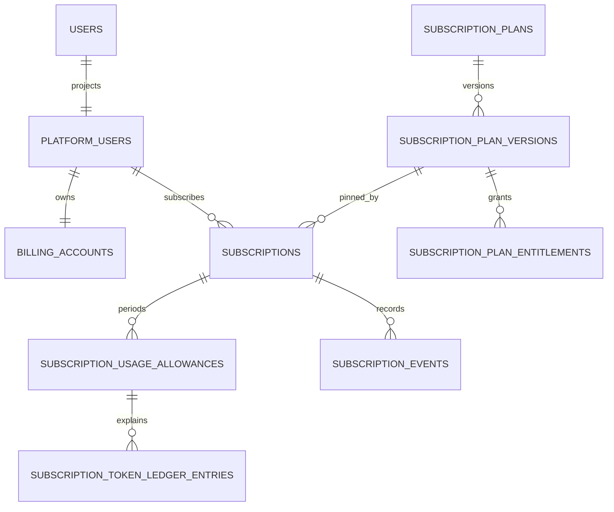
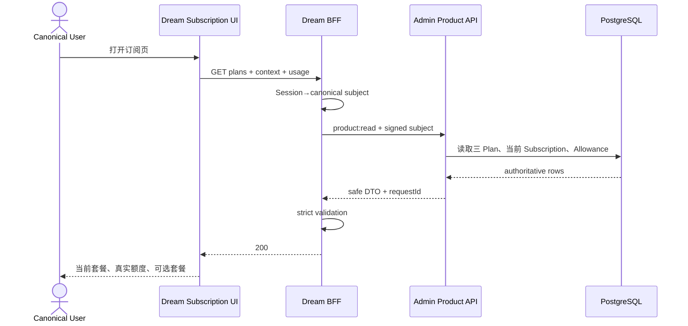
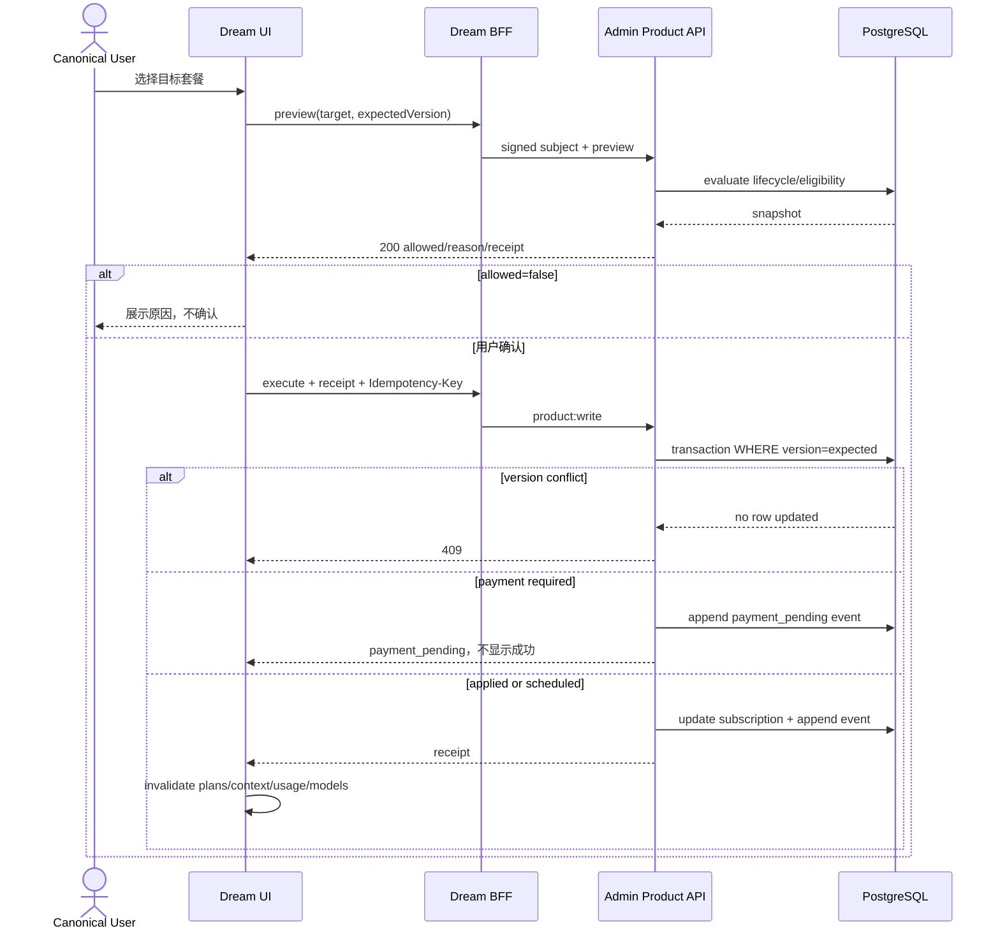
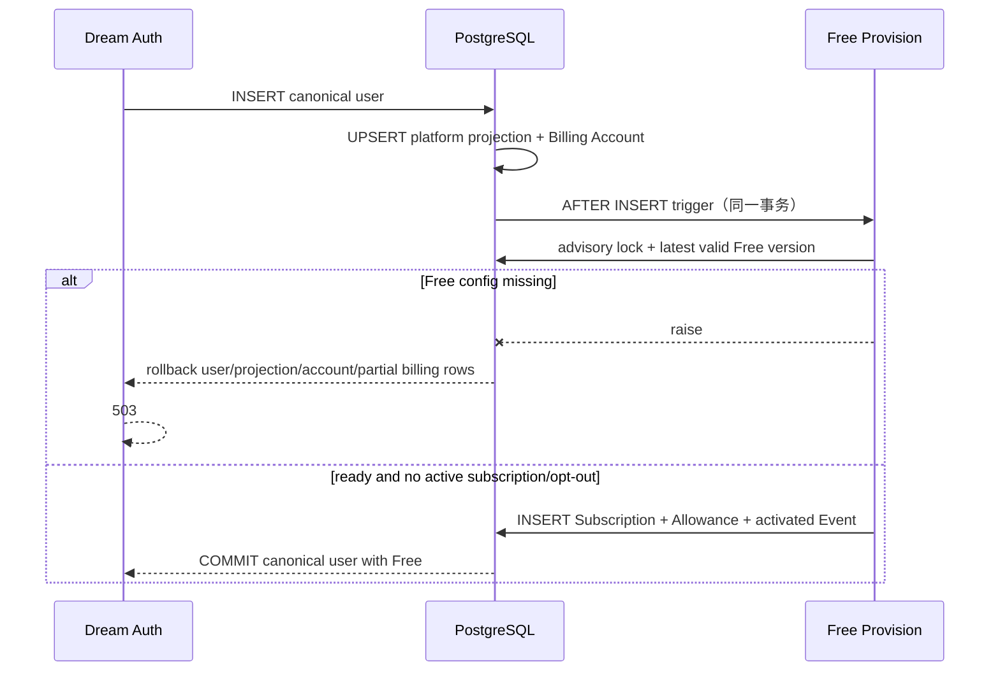
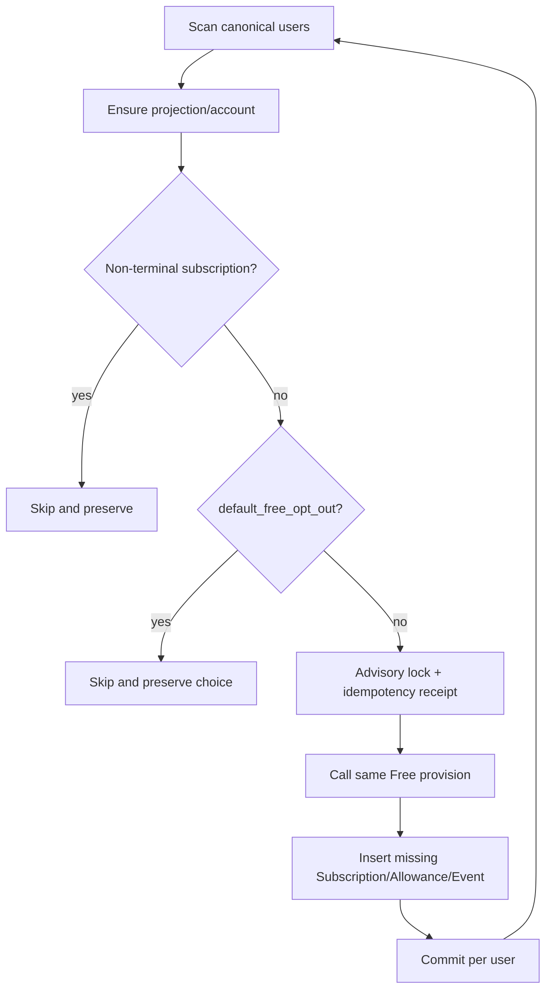
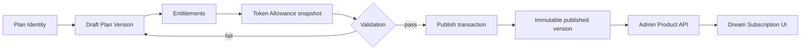

# Ink Memory 订阅业务设计稿

> 文档状态：最终设计
> 设计日期：2026-08-10
> 适用系统：`ink-admin-memory`、`ink-dream-memory`、PostgreSQL `ink-memory`
> 配套文档：`07-model-service-integration-design.md`
> 文档性质：最终产品方案与代码级设计；本稿不实现业务代码

## 术语与概念定义

本文中的术语按下表解释；如与日常含义不同，以本文定义为准。

| 术语 | 概念定义 | 权威与边界 |
|---|---|---|
| Admin | Ink Memory 的运营管理、产品配置、订阅计费与 Gateway 服务端系统 | 负责 Plan、Subscription、Allowance、Entitlement 和计费事实 |
| Dream | 面向 canonical user 的创作产品，包含浏览器前端与 FastAPI BFF | 负责会话、展示和命令转发，不拥有计费真值 |
| canonical user | Dream 中可登录用户的唯一产品身份，对应 PostgreSQL `users.id` | 用户身份唯一来源；不得另建计费用户 |
| platform user projection | canonical user 在 Billing/Gateway 外键体系中的一对一投影，对应 `platform_users(source='ink-dream')` | 仅作为服务端关联适配器，不是第二套登录用户 |
| Billing Account | 与 platform user 一对一关联的计费账户容器 | 由 Admin/PostgreSQL 管理；Dream 不维护余额副本 |
| Plan Identity | 稳定套餐身份，对应 `subscription_plans`；例如 `free`、`dream`、`is-dreaming` | 保存 code、公开名称和叙事文案，不保存可变商业快照 |
| Plan Version | 某个 Plan 在特定版本下的商业参数、周期、额度和权益快照 | draft 可编辑；published 后永久不可变 |
| Entitlement | Plan Version 授予的能力范围，包括可调用模型、scope 和限额 | 由 Admin 发布；Dream 不自行计算 |
| Subscription | 某个 platform user 对确定 Plan Version 的生命周期实例 | 始终 pin 到具体版本；历史记录不删除 |
| 非终态 Subscription | 仍可能提供当前或未来服务的订阅状态，如 active、trialing、paused、past_due 或 cancel-at-period-end | 每个 platform user 同时最多一个 |
| Allowance | Subscription 在一个周期内可使用的 Token 配额状态 | 满足 `granted = remaining + reserved + consumed` |
| Usage | Gateway 已确认的模型调用消耗记录 | 由 Admin Gateway 生成，Product API 只做安全聚合 |
| Token Ledger | 解释 Allowance 变化的 append-only Token 账本 | reserve、capture、release、refund、reversal 均以新记录表达 |
| Subscription Event | 记录创建、升级、降级、暂停、恢复、取消等生命周期事实的 append-only 事件 | 不允许 UPDATE/DELETE；重复命令由幂等键合并 |
| Free provision | 为符合条件的 canonical user 创建默认 Free Subscription、Allowance 和 Event 的单事务操作 | 新用户触发和历史 backfill 复用同一函数 |
| backfill | 对历史 canonical user 扫描并只补齐缺失 Free 资格的数据作业 | 必须幂等；不得覆盖已有订阅、Usage、Ledger 或 Event |
| Product API | Admin 提供给 Dream BFF 的套餐、订阅上下文、Usage 和生命周期命令接口 | 只返回当前 signed subject 的安全产品投影 |
| BFF | Backend for Frontend；Dream 浏览器访问的同源 FastAPI 服务边界 | 持有服务端凭据、校验 Admin DTO、映射安全错误 |
| Payment Intent | 对一次待完成商业动作的服务端状态记录 | `requires_action/processing` 不代表支付成功 |
| `expectedVersion` | Subscription 命令携带的乐观并发版本 | 与当前 `subscriptions.version` 不同返回 409 |
| `Idempotency-Key` | 标识一次写命令业务意图的唯一键 | 相同键和相同 payload 返回原 receipt；不同 payload 返回 409 |

## 1. 文档摘要

本设计定义 Free、Dream、is Dreaming 三个套餐从 Admin 配置、发布、订阅、额度生成到 Dream 展示和生命周期命令的完整合同。

最终边界：

- Admin/PostgreSQL 是 Plan、Plan Version、Entitlement、Subscription、Allowance、Subscription Event 与 Token Ledger 的唯一权威。
- Dream 只持有 canonical user Session，通过 FastAPI BFF 读取安全产品投影、展示套餐并发起受控命令。
- Dream 不维护静态套餐数组、价格、Token 数量、余额、套餐资格或支付结果。
- 新 canonical user 在同一数据库事务内获得 Free Subscription；历史用户由同一幂等 provision 函数补齐。
- published Plan Version 与其 Entitlement 永久不可变；Subscription Event 和 Token Ledger append-only。
- 真实支付闭环未完成前，付费套餐可以展示，但必须明确“暂不可开通”或 `payment_pending`，不得显示支付成功。
- 模型目录、模型选择和 Gateway 调用由配套模型接入文档定义；本稿只提供其所消费的 Subscription/Entitlement/Allowance 权威事实。

## 2. 产品目标与范围

### 2.1 目标用户与操作者

- **Dream 普通用户：** 查看当前套餐、周期 Token 状态和 Admin 发布的可选套餐，发起当前允许的订阅动作。
- **Admin 操作者：** 使用独立 Admin Session 与 permission 管理 Plan Identity、draft Plan Version、Entitlement、发布和 Subscription 运营。
- **服务身份：** Dream BFF 使用 server-only credential 和由当前 Session 派生的 signed canonical subject 调用 Admin Product API。

### 2.2 本次范围

- `free`、`dream`、`is-dreaming` 三个 Plan Identity。
- Plan Version draft、validation、publish 与不可变约束。
- Subscription 创建、升级、降级、暂停、恢复、取消和周期转换边界。
- Free 自动 provision 与历史 backfill。
- Token Allowance 的安全展示，以及 Gateway 消费后的读模型。
- Admin Product API、Dream FastAPI BFF、Dream 订阅页和错误恢复。

### 2.3 明确不做

- 不新增 Billing 微服务、消息队列、事件总线、Saga 或分布式事务。
- 不实现真实 Payment Provider、税务、发票、多币种、优惠券、退款对账。
- 不设计现金余额或自动超额扣费。
- 不在 Dream 复制 Subscription 状态机、Entitlement evaluator 或 Allowance 守恒规则。
- 不在本稿重复模型目录、Provider 路由或 Gateway 协议细节。

## 3. 最终业务判断

### 3.1 最终原则

1. `subscription_plans` 保存稳定 Plan Identity 和公开展示文案；商业值与权益快照属于 `subscription_plan_versions`。
2. `free`、`dream`、`is-dreaming` 的 code 唯一；Dream 只渲染 Product API 返回的三项和 `displayOrder`。
3. draft 允许编辑；published version 与其 Entitlement 永久不可变。变更通过发布下一 version 完成。
4. Subscription 始终 pin 到确定的 Plan Version，不能随“最新版本”隐式漂移。
5. 每个 platform user 同时最多一个非终态 Subscription；历史记录不删除。
6. 新用户注册成功的后置条件包含 Billing Account 和有效 Free Subscription；配置缺失时整个注册事务回滚并返回 503。
7. backfill 只处理没有非终态订阅且没有 `default_free_opt_out` 的 canonical user；重复执行不得重复订阅或重复发 Token。
8. 当前套餐以 Subscription Context 为准；Plan Catalog 只负责可比较产品，不反推用户当前状态。
9. Allowance 展示 `granted/reserved/consumed/remaining/resetsAt` 的真实值，不换算假余额。
10. 付费套餐只有在 published、配置完整、商业依赖 ready 且 eligibility 通过时才能开通。
11. Payment Intent 的 `requires_action/processing` 不是成功；只有服务端验证结果才能改变 Subscription。
12. 所有生命周期写操作使用 preview、`expectedVersion` 和 `Idempotency-Key`，避免重复命令与并发覆盖。

### 3.2 订阅决策表

| 业务场景 | Product API | UI 状态 | 是否可执行命令 | HTTP | 处理动作 |
|---|---|---|---:|---:|---|
| 当前 Subscription active/trialing | 返回真实 context | 正在使用 | 按 `allowedActions` | 200 | 展示 Allowance 和周期 |
| 无 Subscription，但 Free provision 正在建立 | context subscription=null | Free 资格建立中 | 否 | 200 | 显式刷新；不伪造当前套餐 |
| Free 配置缺失 | fail closed | 服务暂不可用 | 否 | 503 | 修复 Admin 配置后重试 |
| Dream/is-dreaming published 且可开通 | catalog available=true | 可开通 | 是 | preview 200 | 显示 Admin 文案与真实数值 |
| 付费套餐未接真实支付 | catalog available=false | 暂不可开通 | 否 | catalog 200 | `payment_unavailable`，不得显示成功 |
| draft/配置不完整 | catalog available=false | 商业参数待发布 | 否 | catalog 200 | price/Token 字段为 null |
| Allowance exhausted | context remaining=0 | 本周期额度不足 | 套餐命令按资格 | context 200；推理 402 | 显示 resetsAt 与套餐入口 |
| Subscription paused/expired/cancelled | 返回真实状态 | 订阅不可用 | 仅返回允许动作 | context 200；受保护操作 403 | 恢复、续订或查看套餐 |
| 命令 preview 不允许 | `allowed=false` | 展示明确原因 | 否 | 200 | 不进入确认步骤 |
| Subscription version 已变化 | 返回安全 actualVersion | 状态已变化 | 本次否 | 409 | refetch 后用户重新确认 |
| 相同幂等 key、相同 payload | 返回原 receipt | 保持原结果 | 不重复写 | 200 | 安全重放 |
| 相同幂等 key、不同 payload | 安全冲突 | 请求冲突 | 否 | 409 | 生成新 key 并重新 preview |
| Admin Product/DB 不可达 | 不用缓存补业务事实 | 服务暂不可用 | 否 | 503 | 保留页面壳，用户显式重试 |

## 4. Admin 与 Dream 职责边界

### 4.1 Admin

- 管理 Plan Identity、文案、display order、draft/published 状态。
- 校验并发布 Plan Version、Entitlement 和 Token Allowance 快照。
- 管理 Subscription 生命周期、并发版本和 append-only Event。
- 为新用户和 backfill 幂等创建 Free Subscription/Allowance。
- 提供当前用户 Product Plan Catalog、Subscription Context、Usage 和命令端点。
- 为 Gateway 提供实时 Subscription/Entitlement/Allowance 事实；Gateway 写 Usage/Ledger 后由 Product API 聚合展示。
- 保持 Admin 页面与管理 API 的既有 RBAC。

### 4.2 Dream

- 从 Session 解析当前 `users.id`，拒绝浏览器覆盖 user/platform user ID。
- BFF 以服务身份调用 Admin，严格验证 DTO，映射安全错误。
- 页面按 Admin `displayOrder`、文案、状态、`availableActions` 渲染。
- 只保存 UI 状态和未提交意图，不落地套餐、金额、Token 或订阅状态副本。
- 命令成功后 invalidate context/plans/usage/model catalog；不直接写 Billing 表。

### 4.3 数据所有权矩阵

| 数据 | 写入权威 | Dream 可见 | Dream 可写 |
|---|---|---|---:|
| canonical user | Dream Auth / `users` | 当前用户 | 用户资料范围 |
| platform projection | Admin DB trigger | opaque 当前 subject | 否 |
| Billing Account | Admin/PostgreSQL | 安全状态摘要 | 否 |
| Plan/Version/Entitlement | Admin | 公开投影 | 否 |
| Subscription/Event | Admin Product service | 当前用户投影 | 仅经命令 |
| Allowance/Usage/Ledger | Admin Gateway/PostgreSQL | 聚合值 | 否 |
| Payment 状态 | Admin Payment Adapter | 安全状态 | 仅发起意图 |

## 5. 领域模型与 PostgreSQL 设计

### 5.1 复用实体

| 表/实体 | 作用 | 必要约束 |
|---|---|---|
| `users` | canonical user | Dream Auth 唯一用户事实 |
| `platform_users` | Billing/Gateway FK projection | `UNIQUE(source, external_user_id)` |
| `billing_accounts` | 用户计费账户 | `UNIQUE(platform_user_id)` |
| `subscription_plans` | Plan Identity/文案 | `UNIQUE(code)` |
| `subscription_plan_versions` | 商业与额度快照 | `UNIQUE(plan_id, version_number)` |
| `subscription_plan_entitlements` | 模型/scope 权益 | `UNIQUE(plan_version_id, model_id)`；每版本最多一个 default |
| `subscriptions` | 用户当前/历史订阅 | FK user/version；每用户最多一个非终态 |
| `subscription_usage_allowances` | 周期 Token 守恒 | cycle/period unique；非负与守恒 CHECK |
| `subscription_events` | 生命周期事实 | `UNIQUE(idempotency_key)`；append-only |
| `subscription_token_ledger_entries` | Token 变动事实 | request/sequence unique；append-only |

### 5.2 PostgreSQL ER



### 5.3 约束与不可变边界

- partial unique：每个 `platform_user_id` 对非终态状态最多一行 Subscription。
- Subscription 乐观并发：`version` 每次成功命令加一；命令 `WHERE id=? AND version=?`。
- Allowance 守恒：`granted = remaining + reserved + consumed`，四项非负。
- published Plan Version 禁止 UPDATE/DELETE；其 Entitlement 禁止 INSERT/UPDATE/DELETE。
- 已 published 版本不改成 retired；新发布版本取代其作为新订阅目标，已有 Subscription 继续 pin 旧版本。
- Subscription Event 和 Token Ledger 禁止 UPDATE/DELETE；纠正使用新 Event 或 refund/reversal entry。
- 外键删除策略以 restrict 为主，防止删除仍被 Subscription、Allowance 或 Ledger 引用的历史事实。

### 5.4 Free 自动创建

单事务顺序：

1. INSERT `users`；
2. UPSERT `platform_users(source='ink-dream')`；
3. ensure `billing_accounts`；
4. advisory lock `platformUserId`；
5. 选择最新合格 Free published Plan Version；
6. 检查无非终态 Subscription、无 `default_free_opt_out`；
7. INSERT Subscription、周期 Allowance、activated Event。

幂等键使用 `platformUserId + planVersionId + provisionContractVersion`。若合格 Free version 缺失，trigger 抛错并回滚 canonical user、projection、account 和部分计费行，注册返回 503。

### 5.5 历史 backfill

- 从全部 canonical user 左连接 platform projection、Billing Account、非终态 Subscription 和 opt-out Event。
- 缺 projection/account 时先用同一确定性规则修复。
- 已有 active/trial/past_due/paused/cancel_at_period_end 等非终态订阅一律跳过，包括付费用户。
- 有 `default_free_opt_out` 一律跳过，除非用户显式恢复。
- 对剩余用户调用同一 provision 函数；每用户独立事务和 advisory lock。
- dry-run 输出 eligible/skipped/reason；apply 可重复执行。
- 不改写既有 Allowance、Usage、Ledger、Event 或历史 Subscription。

### 5.6 Migration 策略

1. preflight 查询重复非终态订阅、Allowance 守恒异常、缺失 Free version。
2. forward-fix 数据后增加 partial unique、不可变/append-only trigger 和必要 CHECK。
3. deploy Admin service，再 deploy Dream BFF/前端。
4. rollback 只回退无数据语义的应用代码；已写 Event/Ledger 不 destructive rollback。
5. 产品配置纠正通过新 Plan Version、Plan Identity 状态或补偿 Event/Ledger 完成。

## 6. API 与 DTO 合同

### 6.1 Admin Product API

| 接口 | 权限 | 作用 | 缓存 |
|---|---|---|---|
| `GET /api/product/v1/plans` | `product:read` + signed subject | 三套餐与 eligibility | `no-store` |
| `GET /api/product/v1/me/subscription-context` | `product:read` | 当前订阅与 Allowance | `no-store` |
| `GET /api/product/v1/me/usage` | `product:read` | 当前周期聚合 Usage | `no-store` |
| `POST /api/product/v1/me/subscription-commands` | `product:write` | preview/execute | 不缓存；execute 幂等 |

所有 endpoint 拒绝请求携带的 `userId/platformUserId` override，以 signed subject 为唯一用户身份。

### 6.2 Product Plan DTO

```ts
type ProductPlan = {
  planCode: string;
  displayOrder: number;
  planName: string;
  planStatus: 'draft' | 'active' | 'retired';
  eyebrow: string;
  note: string;
  details: string[];
  planVersionId: string | null;
  versionStatus: 'draft' | 'published' | 'retired' | null;
  billingCycle: 'monthly';
  monthlyAllowanceTokens: number | null;
  monthlyPriceMicrousd: number | null;
  currency: 'USD';
  available: boolean;
  unavailableReason:
    | 'commercial_parameters_pending'
    | 'payment_unavailable'
    | 'configuration_incomplete'
    | 'maintenance'
    | null;
  eligibility: {
    eligible: boolean;
    reasonCode: string | null;
    appliesAt: string | null;
  };
  availableActions: Array<'create' | 'upgrade' | 'downgrade'>;
};
```

该 DTO 是公开传输合同，不是数据库表。price/Token 未发布时为 null；真实 zero-price 才可为 0。Admin seed/Product service 持有 `free`、`dream`、`is-dreaming` 的唯一 membership；Dream 不维护 code allowlist、静态数组或排序表，只验证三项、code 安全且唯一、`displayOrder` 唯一递增。Admin 若在生成响应前发现 membership/configuration 不完整，返回 `PRODUCT_CATALOG_INVALID` 503；若 Admin 返回 200 但 BFF 发现 DTO、数量、唯一性或顺序非法，BFF 返回 502。两种情况都不做本地补齐。

### 6.3 Subscription Context DTO

```ts
type SubscriptionContext = {
  canonicalUser: { id: string };
  subscription: null | {
    id: string;
    status: string;
    version: number;
    currentPeriodStart: string;
    currentPeriodEnd: string;
    cancelAtPeriodEnd: boolean;
    allowedActions: string[];
    pendingChange: null | Record<string, string | null>;
  };
  planVersion: null | {
    id: string;
    planCode: string;
    planName: string;
    versionNumber: number;
  };
  allowance: null | {
    grantedTokens: number;
    reservedTokens: number;
    consumedTokens: number;
    remainingTokens: number;
    resetsAt: string;
  };
  asOf: string;
  meta: { requestId: string };
};
```

### 6.4 Subscription Command

preview：

```json
{
  "action": "upgrade",
  "phase": "preview",
  "targetPlanVersionId": "safe-product-version-id",
  "expectedVersion": 7
}
```

preview 200 返回 `allowed/reasonCode/previewId/digest/expiresAt/current/target/appliesAt/allowanceImpact/entitlementImpact/warnings`；`allowed=false` 仍为 200，UI 不进入确认。

execute 必须提交相同 action/target/expectedVersion、preview receipt、用户可读 reason 和 `Idempotency-Key`。成功返回 `outcome=applied|scheduled|payment_pending` 与最新 receipt；相同 key/相同 payload 返回原 receipt；key 相同但 payload 不同或 expectedVersion 失配返回 409。

### 6.5 安全错误信封

```ts
type SafeProductError = {
  error: {
    code: string;
    message: string;
    details?: Record<string, string | number | boolean | null>;
  };
  meta: { requestId: string; retryAfterSeconds?: number };
};
```

不得包含 SQL、stack、Provider/Gateway Secret、内部路由 FK 或其他用户 ID。

## 7. Subscription 生命周期设计

### 7.1 状态与动作

Admin 返回状态和 `allowedActions`，Dream 不自行推导。允许动作集合包含 `create/upgrade/downgrade/pause/resume/cancel/revoke_cancel/renew`；具体动作是否允许由当前状态、Plan eligibility、payment readiness 和 `expectedVersion` 共同决定。

### 7.2 生效时点

- Free 首次创建：立即生效。
- 升级：只有无额外支付要求且 Admin policy 明确允许时立即；否则 `payment_pending`。
- 降级：默认下一周期 `scheduled`，不回写当前 Plan Version。
- cancel_at_period_end：保留当前周期权益，到周期边界转终态。
- pause/resume：只由 Admin 生命周期服务执行并追加 Event。

### 7.3 与模型服务的合同

模型 Gateway 每次调用实时读取：

- 非终态且当前周期有效的 Subscription；
- pinned Plan Version 的 enabled Entitlement；
- 当前周期 Allowance；
- 用户级 model permission。

Product API 只展示这些事实；Dream 不把 context 当授权凭据。Gateway reserve/capture/release 详见模型服务接入文档。

## 8. 三套餐产品设计

| code | 产品角色 | 开通规则 |
|---|---|---|
| `free` | 默认入口 | 必须存在合格 published monthly version 和 default Entitlement |
| `dream` | 进阶创作 | published、配置完整、商业依赖 ready 后才 available |
| `is-dreaming` | 持续世界/长期创作 | 同上；未就绪时诚实展示不可开通 |

Dream 不根据 code 生成名称、价格、推荐、Token 或权益。当前套餐由 Subscription Context 的 pinned Plan Version 与 Catalog join 得到；其他套餐以 `available/eligibility/availableActions` 决定按钮。

## 9. Dream FastAPI BFF 设计

### 9.1 路由

| Dream 路由 | Admin 下游 |
|---|---|
| `GET /api/story-workspace/subscription/plans` | `GET /api/product/v1/plans` |
| `GET /api/story-workspace/subscription/context` | `GET /api/product/v1/me/subscription-context` |
| `GET /api/story-workspace/subscription/usage` | `GET /api/product/v1/me/usage` |
| `POST /api/story-workspace/subscription/commands` | `POST /api/product/v1/me/subscription-commands` |

### 9.2 BFF 规则

- 从 Session 取得 canonical user；body/query 中不允许 user override。
- Pydantic DTO 使用 strict 与 `extra='forbid'`；整数不超过 JS safe integer。
- 未知字段、缺字段、守恒冲突或枚举未知返回 Dream 502。
- 连接/timeout 映射 503；安全 4xx 保留状态；不透传 Admin 原 body。
- GET/POST 不自动重试；用户显式重试。execute 仅通过原 Idempotency-Key 安全重放。
- Product client deadline 由服务端配置；Browser 不能传递或覆盖 service credential。
- 不允许静态套餐、mock price/Token/余额作为生产 fallback。

## 10. Dream 订阅页面交互

### 10.1 信息层级

```text
eyebrow
→ plan name
→ note
→ details
→ 当前状态 / 主要操作
```

页面使用 Dream 安静、叙事化、低干扰风格，不使用 Refine 默认 CRUD 表格。

### 10.2 桌面 1440×1000

```text
┌──────────────────────────────────────────────────────────────┐
│ eyebrow  当前套餐名                  状态 / 主要操作          │
│ note                                                         │
│ remaining · consumed/granted · 周期结束                      │
├──────────────────────────────────────────────────────────────┤
│ Free                    Dream                  is Dreaming     │
│ note                    note                   note            │
│ details                 details                details         │
│ 当前/动作               动作/不可用原因         动作/不可用原因   │
└──────────────────────────────────────────────────────────────┘
```

三卡等宽；Allowance 只保留 remaining、consumed/granted、period end，降低信息密度。

### 10.3 移动 390×844

```text
┌─────────────────────────────┐
│ eyebrow                     │
│ 当前套餐名                  │
│ note                        │
│ remaining · 周期结束        │
├─────────────────────────────┤
│ Free                        │
│ details                     │
│ 当前/满宽动作               │
├─────────────────────────────┤
│ Dream                       │
│ details · 满宽动作          │
├─────────────────────────────┤
│ is Dreaming                 │
│ details · 满宽动作          │
└─────────────────────────────┘
```

按 Admin `displayOrder` 单列，不横向滚动；dialog 全屏并尊重 safe-area。

### 10.4 页面状态机

```text
loading -> ready | plans-empty | context-empty | error
ready -> idle -> previewing -> preview-ready -> executing
executing -> applied | scheduled | payment-pending | conflict | failed
conflict -> refetch -> idle
payment-pending -> refresh-status -> pending | verified-result | failed
```

### 10.5 页面状态与无障碍

- loading 使用稳定骨架和 `aria-busy=true`。
- empty 不渲染本地三卡；显示配置不可用和显式重试。
- maintenance/no permission 仍展示可读文案，命令 disabled。
- network/503 保留页面壳、当前 tab、滚动位置和 requestId。
- 焦点顺序：h1→刷新→主要动作→tabs→tabpanel→套餐卡动作。
- tabs 使用 tablist/tab/tabpanel、roving tabindex、Arrow/Home/End。
- 状态更新使用 `aria-live=polite`，阻断错误 `role=alert`；颜色不是唯一信号。
- Esc 关闭 dialog 后恢复触发按钮焦点；429 倒计时不高频播报。

## 11. 错误和状态映射

| HTTP | 业务含义 | Dream 文案 | 前端动作 | 自动重试 |
|---:|---|---|---|---:|
| 200 | 正常数据、preview allowed=false、无当前订阅 | 按数据状态 | 渲染真实状态 | 否 |
| 401 | Session/subject 无效 | 请重新登录 | 登录恢复 | 否 |
| 402 | 需要完成真实商业动作或额度不足 | 额度不足/需要完成开通 | 保留意图 | 否 |
| 403 | 订阅状态或权限不允许 | 订阅不可用/无权限 | 刷新 context | 否 |
| 409 | expectedVersion/idempotency payload 冲突 | 状态已变化 | refetch 后重新确认 | 否 |
| 429 | Product 命令限流 | 请求过于频繁 | 展示 Retry-After，用户重试 | 否 |
| 502 | Admin DTO/协议响应非法 | 服务响应异常 | 展示 requestId | 否 |
| 503 | Admin/Product/DB/config 不可达 | 服务暂不可用 | 保留页面壳，显式重试 | 否 |

## 12. 安全、RBAC 与 Secret 边界

### 12.1 调用链

```text
Dream Browser
→ Dream FastAPI BFF
→ Admin Product API
→ PostgreSQL
```

Gateway 对 Allowance 的消费是并列服务端链路：

```text
Dream server
→ Admin Gateway
→ PostgreSQL eligibility/reserve
→ Provider
→ PostgreSQL capture/release
```

### 12.2 分层合同

| 层 | 身份 | 权限 | 缓存/超时/重试 | 权威与 Secret |
|---|---|---|---|---|
| Browser | Dream Session | 当前用户 UI | AbortController；用户重试 | 非权威；无服务 Secret |
| Dream BFF | Session + signed subject | same-origin write | no shared cache；配置 deadline | server credential 仅 env/secret provider |
| Admin Product | service identity + subject | `product:read/write` | no-store；不自动重试 | Plan/Subscription 权威 |
| PostgreSQL | Admin DB role | 最小权限/事务 | lock timeout/advisory lock | 全部订阅事实权威 |

普通用户读取 Product API 不获得 Admin Session，不可访问 `/admin/**` 或 `/api/admin/**`。响应、DOM、Storage、埋点和普通日志不得包含 service key、subject signing key、SQL、内部 FK、Provider route 或其他用户数据。

## 13. Mermaid 业务时序图

### 13.1 页面加载



### 13.2 命令 preview/execute



### 13.3 新用户 Free Subscription



### 13.4 历史 backfill



### 13.5 套餐发布



## 14. 代码模块映射

### 14.1 Admin

| 位置 | 设计职责 |
|---|---|
| `app/lib/db/schema.ts` | partial unique、published/append-only 约束声明 |
| `drizzle/<next>_*.sql` | preflight、forward-fix、trigger/constraint |
| `app/lib/subscriptions/service.ts` | 生命周期、版本并发、Event |
| `app/lib/subscriptions/repository.ts` | 单事务命令与幂等 receipt |
| `app/lib/product/service.ts` | plans/context/usage 安全投影 |
| `app/lib/product/contracts.ts` | strict DTO 与 reason enum |
| `app/api/product/v1/plans/route.ts` | Dream 三套餐目录 |
| `app/api/product/v1/me/subscription-context/route.ts` | 当前上下文 |
| `app/api/product/v1/me/subscription-commands/route.ts` | preview/execute |
| `scripts/seed-default-dream-plans.mjs` | 三 Plan、Free version、dry-run/apply backfill |

### 14.2 Dream

| 位置 | 设计职责 |
|---|---|
| `backend/services/admin_product/models.py` | strict Pydantic DTO |
| `backend/services/admin_product/client.py` | signed subject、deadline、安全错误 |
| `backend/routers/product.py` | same-origin BFF、身份防覆盖 |
| `frontend/src/api/productApi.ts` | strict Zod、API client |
| `frontend/src/hooks/story-workspace/useStoryWorkspaceSubscription.ts` | query key、invalidate、命令状态机 |
| `frontend/src/pages/story-workspace/StoryWorkspaceSubscriptionPage.tsx` | 叙事化页面与状态 |
| `frontend/src/pages/story-workspace/StoryWorkspaceSubscriptionPage.css` | desktop/mobile/focus/reduced-motion |

Query keys：

- `['product-plans', sessionVersion, page, pageSize, locale]`
- `['subscription-context', sessionVersion]`
- `['subscription-usage', sessionVersion, period]`

## 15. 测试与验收设计

### 15.1 合同测试

| 测试对象 | 必测场景 | 通过条件 |
|---|---|---|
| Product Plan Catalog | 恰好三项、唯一 code/order、null 商业字段 | Dream 不补静态数据；非法 DTO 返回 502/503 |
| Subscription Context | active、paused、expired、null subscription | 状态、周期、allowedActions 与 Allowance 保真 |
| Subscription Command | preview denied、execute applied/scheduled/payment_pending | 不允许的 preview 不写库；成功返回唯一 receipt |
| 并发与幂等 | stale expectedVersion、相同/不同 payload 重放 | stale 或 payload 冲突为 409；相同命令不重复写 Event |
| Free provision | 正常、Free 配置缺失、重复触发 | 成功时用户与 Free 同事务；失败全部回滚；重复不发 Token |
| 历史 backfill | 免费缺失、已有付费、opt-out、重复执行 | 只补缺；不覆盖订阅、Allowance、Usage、Ledger、Event |
| Plan publish | draft 校验失败、发布成功、发布后写入 | published 快照不可修改，变更只能新建 version |

### 15.2 BFF 与前端测试

- BFF 拒绝 user override、未知字段、未知枚举、超出 JS safe integer 的值和守恒冲突。
- 401/402/403/409/429/502/503 均映射到本文定义的唯一文案与恢复动作。
- 订阅页不出现静态套餐、假价格、假 Token、假余额或未经验证的支付成功。
- 1440×1000 显示三列套餐；390×844 单列且无横向溢出。
- keyboard、focus、tablist、aria-live、role=alert、dialog focus return 通过自动化和人工检查。
- 命令成功后 plans/context/usage/model catalog query 全部失效并重新获取权威数据。

### 15.3 验收标准

- [ ] 三套餐完全来自 Admin Product API，Dream 无静态数组。
- [ ] Plan/Version/Entitlement、Subscription、Allowance 只有一套权威事实。
- [ ] 新用户 Free 与 canonical user 同事务，失败无半完成用户。
- [ ] backfill 重复执行不重复订阅、不重复发 Token、不覆盖历史。
- [ ] published Plan Version/Entitlement 不可变；Event/Ledger append-only。
- [ ] 命令 preview/execute、expectedVersion、Idempotency-Key 可测。
- [ ] 未发布商业字段为 null，不虚构价格、Token 或余额。
- [ ] 未接真实支付时不显示支付成功。
- [ ] Admin RBAC 不放宽，Browser 无 service Secret。
- [ ] BFF strict schema、状态映射、超时和无 fallback 明确。
- [ ] 1440×1000 与 390×844 页面及无障碍状态明确。
- [ ] 与模型接入文档通过 Subscription/Entitlement/Allowance 权威事实一致衔接。

## 16. 架构约束与设计取舍

| 领域 | 采用方案 | 禁止方案 | 原因 |
|---|---|---|---|
| 用户身份 | 复用 canonical user + platform projection | Dream 第二用户体系 | 保持认证与计费主体唯一 |
| 计费账户 | 复用 Billing Account | Dream 本地账户/余额 | 避免双写和余额不一致 |
| 套餐 | Admin Plan/Version/Entitlement | Dream 静态套餐数组 | 商业事实只有一个来源 |
| 生命周期 | Subscription + append-only Event | 覆盖历史状态 | 保留审计与幂等边界 |
| Token | Allowance 守恒 + append-only Ledger | 直接改历史消费 | 保证可审计和可恢复 |
| 跨系统同步 | 同库事务、no-store、前端 invalidate | 消息队列/Saga/分布式缓存协议 | 当前边界无需额外基础设施 |
| 未发布商业值 | null + unavailableReason | 假价格/Token/余额 | 页面只展示真实事实 |
| 支付 | verified server result 才改变 Subscription | 前端跳转即成功 | 防止虚假支付结果 |

## 17. 非本次范围

- 业务代码、migration、seed、UI 或测试的实际实现。
- 模型目录、选择 UI、Provider 路由和 Gateway 协议实现。
- 真实支付 Provider、税务、发票、退款对账和多币种。
- 现金余额、自动超额、优惠券和企业 Seat。
- 新微服务、消息队列、事件总线或分布式缓存协议。
