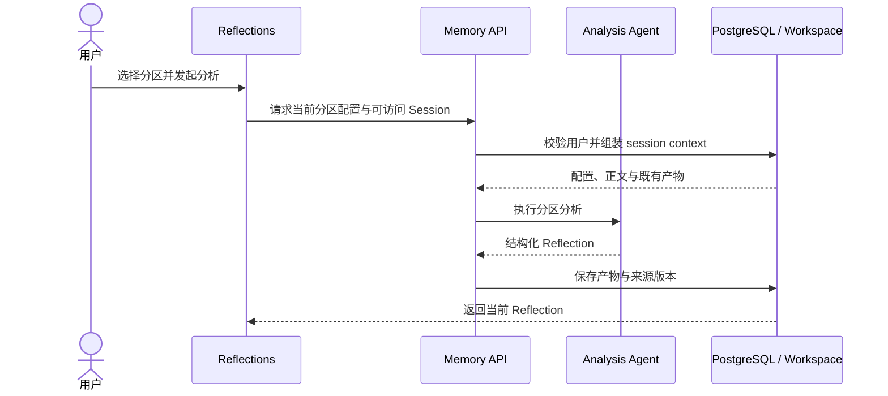

# docs/design/memory — Folder Contract

## Architecture Summary
Memory subsystem design docs for Claude Agent workspace memory behavior.
Documents procedural Memory Workspace boundaries, partition config sources, and migration rules.

## 核心概念定义

| 概念 | 定义 |
|---|---|
| Memory Workspace | 为当前用户组织长期写作记忆配置和分析产物的工作区 |
| Partition | 回响、特质、模式等具有独立输入与输出约束的分析分区 |
| Partition config | 定义分区目标、上下文选择和输出结构的服务端配置 |
| Session context | 从用户可访问写作 Session 组装的分析输入 |
| Reflection | Agent 基于 Session context 生成的可阅读分析结果 |
| Memory artifact | 分区输出及其版本、来源和恢复信息 |

## 业务交互时序图

## File Table

| File | Pos | Function |
|---|---|---|
| `memory-workspace-design.md` | `memory-workspace-design-doc node` | Define procedural Memory Workspace design, partition-config prompt source, file-interface initialization, and migration notes. |
| `reflections-analysis-prd.md` | `reflections-analysis-prd node` | 完整 PRD：Reflections 页面三分区记忆工作空间配置（分区定义、5 个配置文件内容、sessions_context 格式、Agent 执行协议、输出格式、前端交互设计、Polanyi 原则、扩展性）。 |
