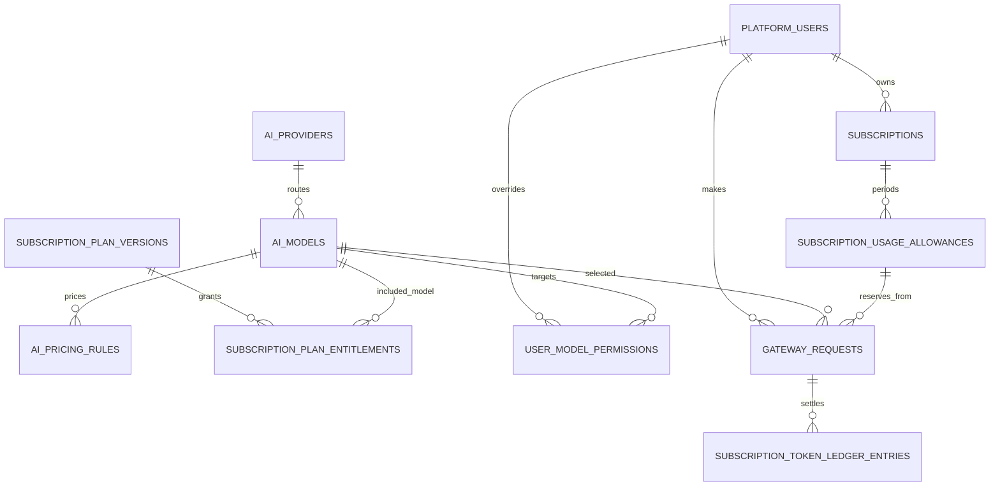
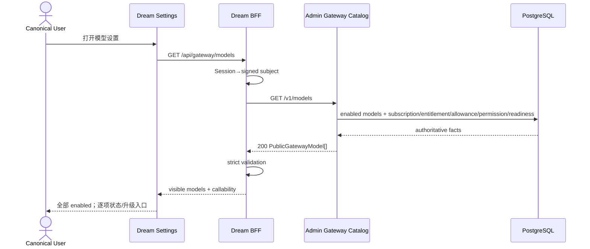
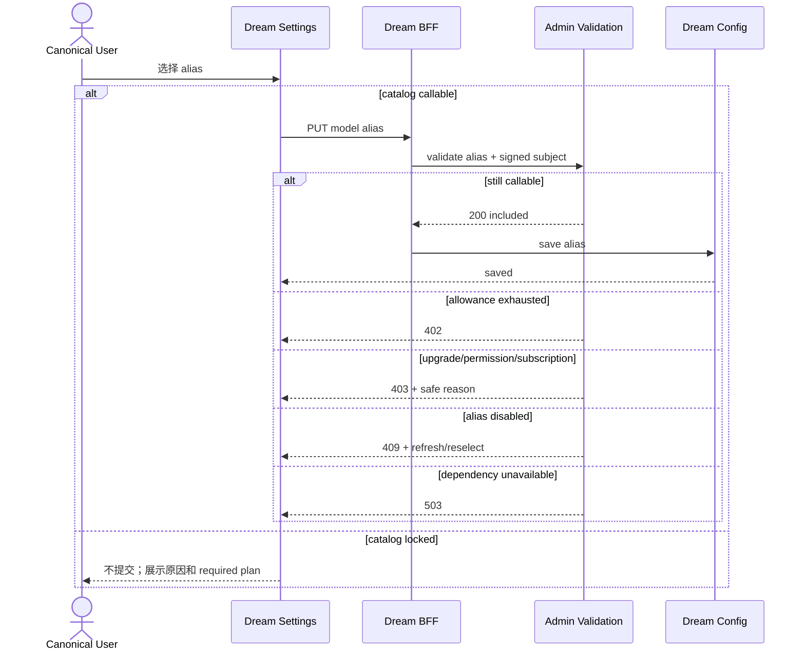
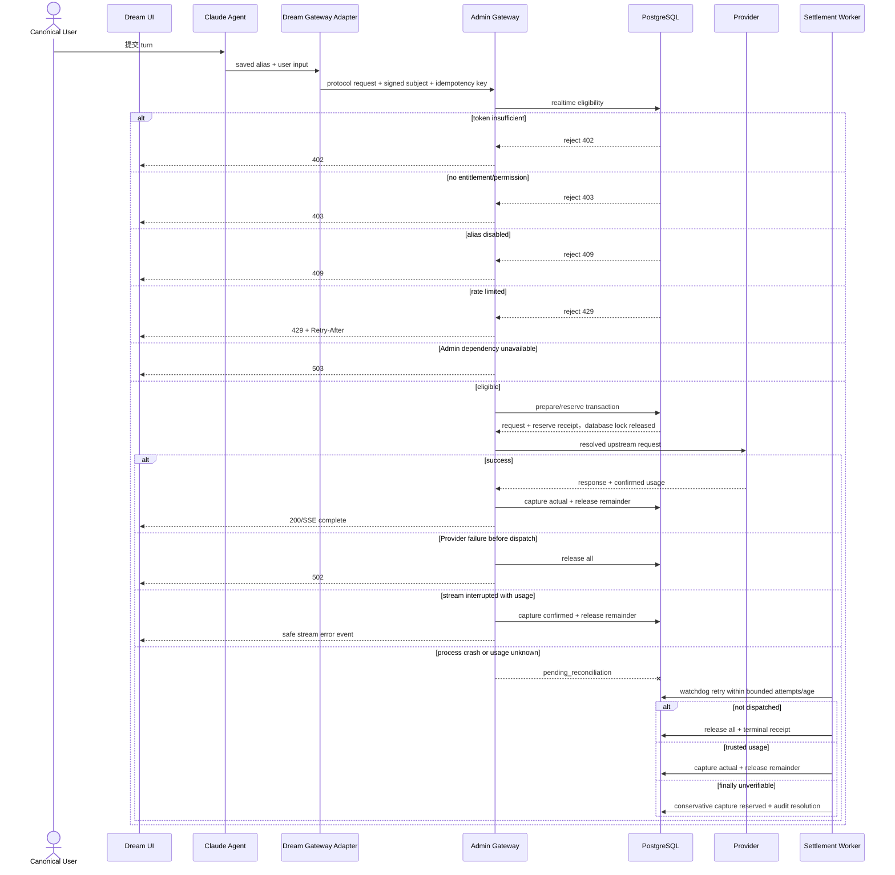
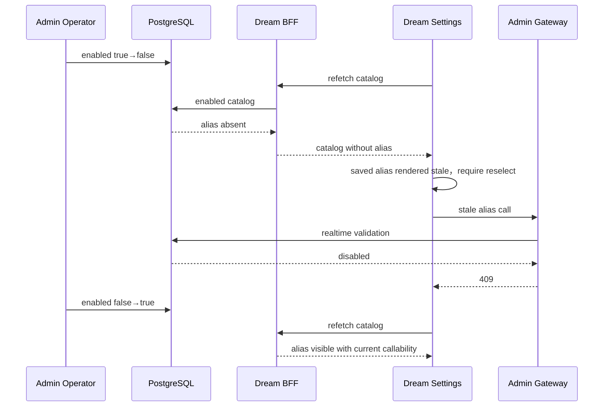

# Ink Memory 模型服务接入设计稿

> 文档状态：最终设计
> 设计日期：2026-08-10
> 适用系统：`ink-admin-memory`、`ink-dream-memory`、PostgreSQL `ink-memory`
> 配套文档：`../subscription/06-subscription-business-design.md`
> 文档性质：最终产品方案与代码级设计；本稿不实现业务代码

## 术语与概念定义

本文中的术语按下表解释；如与日常含义不同，以本文定义为准。

| 术语 | 概念定义 | 权威与边界 |
|---|---|---|
| Admin | Ink Memory 的模型管理、订阅授权和 AI Gateway 服务端系统 | 持有 Registry、Provider route、资格规则、Secret 和 Usage/Ledger 真值 |
| Dream | 面向 canonical user 的创作产品，包含浏览器前端、FastAPI BFF 和 Claude Agent | 展示安全目录、保存 alias、发起调用，不拥有路由或授权真值 |
| canonical user | Dream 中可登录用户的唯一产品身份，对应 PostgreSQL `users.id` | Browser Session 的用户主体；不得由请求参数覆盖 |
| signed canonical subject | Dream BFF 根据当前 Session 为 Admin 服务调用生成的短时签名用户声明 | 只在服务端传递，用于把服务身份与当前用户绑定 |
| AI Model Registry | Admin 中唯一的平台模型注册表，对应 `ai_models` | 管理 alias、显示信息、能力、限制和 enabled，不在 Dream 建副本 |
| Provider | 实际提供模型推理能力的上游服务及其 Admin 内部路由配置 | base URL、credential、timeout/retry 仅存在 Admin |
| upstream model | Provider 接口要求的真实模型标识 | 仅由 Admin route 解析，禁止返回 Dream Browser |
| platform alias | Ink Memory 对外稳定暴露的模型标识，对应 `ai_models.code` | Browser 只选择和保存 alias，不感知 Provider 型号 |
| enabled | 模型是否进入公共平台目录的 Registry 开关 | `enabled=true` 进入目录；false 不返回，保存值单独按 stale 处理 |
| visible | 模型是否出现在当前 canonical user 的安全公共目录中 | 所有 enabled 模型都 visible，与套餐权益无关 |
| entitled | 当前 Subscription 所绑定 Plan Version 是否存在匹配且 enabled 的模型/scope Entitlement | 是 callability 的必要条件，但不是充分条件 |
| callable | 当前用户此刻是否可以选择并调用该 alias | 仅当模型、路由、Subscription、Entitlement、Permission 和 Allowance 全部满足 |
| availability | 公共 DTO 对 callability 的单一原因枚举 | `included`、`upgrade_required`、`subscription_inactive`、`allowance_exhausted`、`permission_denied`、`maintenance` |
| `upgrade_required` | 当前套餐无匹配 Entitlement，且 Admin 能证明某个公开套餐可解锁该模型 | 模型继续 visible，并提供 required plan 入口 |
| `maintenance` | enabled 模型的平台、Provider、credential、pricing 或 route dependency 未就绪 | 只表示服务依赖不可用，不能用于表达缺少套餐权益 |
| Model Permission | Admin 对特定 platform user 和 model 的显式 allow/deny 或限额覆盖 | 显式 deny 产生 `permission_denied`，Dream 只看到安全原因 |
| Gateway | Admin 中接收模型协议请求、执行资格校验、路由 Provider 并结算 Token 的服务边界 | Dream Browser 不直连；Provider Secret 不离开 Admin |
| eligibility | Gateway 对模型、scope、Subscription、Entitlement、Permission、Allowance 和限流的实时资格判定 | 模型保存和每次推理均重新执行，不能使用前端缓存替代 |
| reserve | Provider 调用前从 Allowance 暂时占用 estimated Tokens 的短事务 | 成功后必须由 capture/release 进入确定终态 |
| capture | 根据可信 Usage 把已 reserve Token 转为 consumed 的结算动作 | 与 release remainder 在 settlement transaction 中原子执行 |
| release | 将确认未消费的 reserve Token 归还 remaining 的结算动作 | 只有确认未 dispatch/未生成 Token 或存在可信 remainder 时执行 |
| Usage | Provider 响应或协议适配器确认的实际 Token 消耗 | 用于 capture；不可信或缺失时进入 reconciliation |
| reconciliation | 对进程中断或 Usage 暂时未知的 Gateway Request 进行有界重试和审计结算 | 达到次数/时间上限必须进入 release、actual capture 或 conservative capture 终态 |
| DTO | Data Transfer Object；Admin、BFF 和前端之间的版本化传输合同 | 不是数据库表；必须 strict allowlist 并排除内部路由字段 |
| SSE | Server-Sent Events；流式模型响应的传输形式 | 首字节后错误通过安全 error event/termination 表达，后台仍完成结算 |
| BFF | Backend for Frontend；Dream 浏览器访问的同源 FastAPI 服务边界 | 注入服务身份、传递 signed subject、严格校验 DTO 和安全错误 |

## 1. 文档摘要

本设计定义 Admin AI Model Registry 到 Dream 模型目录、模型选择、Claude Agent、Gateway eligibility、Provider 调用与 Token 结算的完整接入合同。

最终边界：

- Admin 是模型、Provider route、Plan Entitlement、用户 Model Permission、Gateway eligibility、限流、Token reserve/capture/release 与 Usage 的唯一权威。
- Dream 只负责 canonical user 体验、FastAPI BFF、安全 DTO、platform alias 选择和调用发起。
- 所有已登录 canonical 用户看见 Admin 中全部 `enabled=true` 的平台模型；套餐权益只改变 `callable/availability`，不改变可见性。
- `visible !== callable`。无权益显示“需要升级”；Subscription 无效显示“订阅不可用”；Allowance 耗尽显示“额度不足”；显式 deny 显示“无权限”；路由依赖不可用显示“维护中”。
- disabled 模型不进入目录；若它是保存值，Dream 单独显示 stale 并要求显式重选，不自动 fallback。
- Dream Browser 永远不能获得 Provider Secret、Gateway Key、upstream model、base URL、pricing/cost 或内部路由。
- Subscription、Plan Entitlement 和 Allowance 的生命周期详见配套订阅文档；模型服务只实时消费其权威事实。

## 2. 产品目标与范围

### 2.1 目标用户与操作者

- **Dream canonical user：** 查看平台模型、理解不可调用原因、选择当前可调用 alias，并通过 Claude Agent 使用。
- **Admin 模型操作者：** 用独立 Admin Session/RBAC 管理 Registry、Provider、enabled 和 route readiness。
- **Admin 套餐操作者：** 管理 Plan Entitlement/Allowance，决定哪些 Subscription 获得哪些模型 scope。
- **Gateway runtime：** 使用服务身份和 signed canonical subject 执行最终资格、限流、Provider 路由和结算。

### 2.2 本次范围

- AI Model Registry 与 platform alias。
- enabled、公共目录、套餐 Entitlement、用户 Permission 和实时 callability。
- Dream 模型设置页和保存验证。
- Claude Agent 到 Admin Gateway 的 Anthropic/OpenAI-compatible 调用。
- Token estimate、reserve、capture、release、unknown usage reconciliation。
- 正常、失权、维护、停用、限流、Provider 失败、Admin 不可达和流式中断。

### 2.3 明确不做

- 不新增 Model service、Gateway 微服务、权限中心、消息队列或事件总线。
- 不在 Dream 维护静态模型目录、套餐模型映射或 Provider 型号 fallback。
- 不允许 Browser 直连 Admin Gateway 或 Provider。
- 不设计没有完整 eligibility/usage/settlement 合同的 ASR、图片、视频调用。
- 不在本文重复 Plan 发布、Free backfill 或支付业务细节。

## 3. 最终业务判断

### 3.1 最终原则

1. `ai_models.enabled` 决定公共目录成员，不代表当前用户可调用。
2. 已登录 canonical user 看见全部 enabled platform alias 及安全 metadata。
3. Plan Version Entitlement 决定套餐模型/scope；Subscription、Allowance、Permission 和 route readiness 决定实时调用资格。
4. `callable=true` 当且仅当 `availability='included'`。
5. 无 matching Entitlement 且存在公开 required plan → `upgrade_required`；不能证明升级可解锁时 → `permission_denied`。
6. `maintenance` 只表示 enabled 模型的平台/Provider/credential/pricing/route 依赖不 ready；缺权益不能显示维护。
7. Allowance 剩余为 0 → `allowance_exhausted`；具体请求 estimatedTokens 超出 remaining 在调用时返回 402。
8. `user_model_permissions.enabled=false` 优先产生 `permission_denied`，避免错误承诺升级。
9. disabled 模型不在目录；若保存 alias 指向它，UI 显示“模型已停用，请重选”，保存/调用返回 409。
10. 选择 locked 模型不直接保存；点击仅解释原因和 required plan。
11. 保存成功不是长期授权；每次 Gateway 调用都实时复验。
12. Dream 不从 alias 推导 Provider，不保存 upstream model，不在 Admin 不可达时使用静态 fallback。

### 3.2 availability 判定顺序

仅对 `enabled=true` 模型执行，固定顺序且 fail closed：

1. route/platform readiness 不满足 → `maintenance`；
2. 无当前有效 Subscription → `subscription_inactive`；
3. 显式用户 deny → `permission_denied`；
4. 无 matching enabled Entitlement：存在公开 required plan → `upgrade_required`，否则 `permission_denied`；
5. 当前周期 Allowance 不存在 → `subscription_inactive`；
6. remaining `<= 0` → `allowance_exhausted`；
7. 全部满足 → `included`、`callable=true`。

### 3.3 业务决策表

| 业务场景 | 模型是否可见 | 是否可选择 | 是否可调用 | UI 状态 | HTTP 状态 | 处理动作 |
|---|---:|---:|---:|---|---:|---|
| enabled，权益/订阅/额度/路由满足 | 是 | 是 | 是 | 可使用 | catalog 200；调用 200 | 保存 alias；调用时复验 |
| enabled，当前 Plan 无 Entitlement，有 required plan | 是 | 否 | 否 | 需要升级 | catalog 200；保存/调用 403 | 展示 required plan 与订阅入口 |
| enabled，无有效 Subscription | 是 | 否 | 否 | 订阅不可用 | catalog 200；保存/调用 403 | 刷新 context，进入订阅页 |
| enabled，显式用户 deny | 是 | 否 | 否 | 无权限 | catalog 200；保存/调用 403 | 联系管理员，不承诺升级 |
| enabled，remaining=0 | 是 | 否 | 否 | 额度不足 | catalog 200；保存/调用 402 | 展示 resetsAt/套餐入口 |
| enabled，请求估算 Token 超出 remaining | 是 | 目录仍可选 | 本次否 | 额度不足 | 调用 402 | 保留用户未提交的创作输入，展示 available/required |
| enabled，Provider/credential/pricing/route 未就绪 | 是 | 否 | 否 | 维护中 | catalog 200；调用 503 | 稍后重试，不显示升级 |
| enabled，Provider 已接收但失败/响应非法 | 是 | 是 | 本次失败 | 上游服务失败 | 502 | 安全结算 reserve，展示 requestId |
| enabled，超过 RPM/日/月策略 | 是 | 是 | 本次失败 | 请求过于频繁 | 429 | 展示 Retry-After，用户显式重试 |
| alias 加载后 disabled | 否；保存值单独 stale | 否 | 否 | 模型已停用 | 保存/调用 409 | 刷新目录，显式重选 |
| 保存 alias 仍 enabled，但用户刚失权 | 是 | 否 | 否 | 升级/无权限 | 保存/调用 403 | 刷新 catalog/context |
| Allowance 并发变化 | 是 | 是 | 当前尝试失败 | 状态已变化 | 409 | refetch 后用户重试 |
| Admin Gateway/DB 不可达 | 不用静态值补齐 | 否 | 否 | 服务暂不可用 | 503 | 保留页面壳和用户未提交的创作输入 |
| Catalog DTO 非法/含危险字段 | 不渲染 | 否 | 否 | 服务响应异常 | Dream BFF 502 | strict fail closed |
| 未登录/Session 失效 | 否 | 否 | 否 | 请重新登录 | 401 | Dream 登录恢复 |

## 4. Admin 与 Dream 职责边界

### 4.1 Admin

- 管理 `ai_models` platform alias、display name、protocol、capabilities、limits 和 enabled。
- 管理 `ai_providers` route、base URL、encrypted credential、timeout/retry 和 readiness。
- 读取 Plan Entitlement、Subscription、Allowance、user permission，统一计算 availability。
- `/v1/models` 返回安全公共目录；不得返回 Provider/upstream/credential/cost。
- 保存前 validation 与每次 Gateway 调用使用同一 eligibility application service。
- Gateway 解析 alias、限流、reserve、调用 Provider、capture/release、记录 Usage/Ledger。
- Admin 页面与管理 API 继续由 Admin RBAC 保护。

### 4.2 Dream

- 从当前 Session 获取 `users.id`，BFF 派生 signed canonical subject。
- 浏览器通过 same-origin BFF 读取目录和提交 alias，不获得 Gateway credential。
- 严格验证公共 DTO；未知字段、枚举或不变量冲突 fail closed。
- 设置页保留所有 visible model，显示当前 availability 和恢复入口。
- 保存前请求 Admin validation；只在 200 后写 `system_config.model=alias`。
- Claude Agent 每个新 turn 读取保存 alias，经 Admin Gateway 调用；不直连 Provider。

### 4.3 数据所有权矩阵

| 数据 | 权威 | Dream 可见 | Dream 可写 |
|---|---|---|---:|
| model alias/display/capabilities | Admin `ai_models` | 安全投影 | 否 |
| Provider/upstream/credential | Admin `ai_providers` | 否 | 否 |
| Plan Entitlement | Admin subscription domain | required plan 安全提示 | 否 |
| Subscription/Allowance | Admin subscription domain | 当前摘要 | 否 |
| user model permission | Admin | 仅安全 reason | 否 |
| 保存 alias | Dream `system_config` | 是 | 当前用户经验证后 |
| Gateway Request/Usage/Ledger | Admin Gateway | safe requestId/聚合 Usage | 否 |

## 5. 领域模型与 PostgreSQL 设计

### 5.1 复用实体

| 表/实体 | 作用 | 必要约束 |
|---|---|---|
| `ai_providers` | Provider route/credential | `UNIQUE(code)`；protocol CHECK；Secret 密文 |
| `ai_models` | 唯一 Model Registry/platform alias | `UNIQUE(code)`；`UNIQUE(provider_id, upstream_model)` |
| `ai_pricing_rules` | Gateway 计量所需 pricing snapshot | FK model；有效期/单位 CHECK |
| `subscription_plan_entitlements` | Plan Version 到模型/scope | `UNIQUE(plan_version_id, model_id)` |
| `subscriptions` | 当前用户 pinned version | 单一非终态约束 |
| `subscription_usage_allowances` | 周期 Token 状态 | 守恒 CHECK；period unique |
| `user_model_permissions` | 用户级 allow/deny/limit override | `UNIQUE(platform_user_id, model_id)` |
| `gateway_api_keys` | Dream server 服务凭据 | hash/encrypted 边界；scope |
| `gateway_requests` | eligibility、route snapshot、usage、settlement | user idempotency unique；相关 FK |
| `gateway_request_payloads` | request digest/受控 payload | `sha256`；访问受限 |
| `subscription_token_ledger_entries` | reserve/capture/release | request sequence unique；append-only |

### 5.2 PostgreSQL ER



### 5.3 数据约束

- `ai_models.code` 是公开 alias；upstream model 永远只在 Admin 内部。
- enabled 变更影响目录成员，但不改写用户保存值。
- Entitlement 必须引用 published Plan Version 和 enabled model 才可授权新调用；published Entitlement 不可变。
- Gateway eligibility 成功必须得到非空 `subscription_id/plan_version_id/entitlement_id/allowance_id`。
- Allowance reserve/capture/release 与 Ledger entry 在各自短事务中原子提交。
- `gateway_requests` 保存请求时 eligibility/route 快照供审计，但下一请求必须重新评估。
- Ledger append-only；相同 request/sequence 不重复消费。

### 5.4 Migration 与 forward-fix

- 发布前扫描 duplicate alias/upstream pair、无 Provider 的 model、孤立 Entitlement、Allowance 守恒异常和悬挂 reserve。
- 先修数据，再增加/收紧 unique、CHECK、FK 和 append-only trigger。
- disabled/route maintenance 通过状态更新前进，不删除被历史 Gateway Request 引用的 model/provider。
- 已写 Usage/Ledger 不 destructive rollback；使用 release/refund/reversal 或 settlement forward-fix。

## 6. API 与 DTO 合同

### 6.1 API 总览

| 接口 | 调用方 | 权限 | 作用 | 缓存 |
|---|---|---|---|---|
| `GET /v1/models` | Dream BFF | `models:list` + service key + subject | enabled models + callability | `no-store` |
| `POST /api/product/v1/me/model-selection-validations` | Dream BFF | `product:read` + subject | 保存前实时校验 alias | `no-store` |
| `POST /v1/messages` | Dream server | `messages:create` | Anthropic-compatible 推理 | 不缓存；幂等 |
| `POST /v1/chat/completions` | Dream server | `chat:create` | OpenAI-compatible 推理 | 不缓存；幂等 |
| `POST /api/internal/gateway/settlements` | Admin worker | internal settlement scope | reconciliation | 内部、幂等 |

### 6.2 公共模型 DTO

```ts
type PublicGatewayModel = {
  modelAlias: string;
  displayName: string;
  protocol: 'anthropic' | 'openai';
  capabilities: Record<string, boolean>;
  contextWindow: number | null;
  maxOutputTokens: number | null;
  enabled: boolean;
  callable: boolean;
  availability:
    | 'included'
    | 'upgrade_required'
    | 'subscription_inactive'
    | 'allowance_exhausted'
    | 'permission_denied'
    | 'maintenance';
  requiredPlanCode?: string | null;
  upgradeHint?: string | null;
};
```

这是公共传输合同，不是数据库表。目录中的 `enabled` 必须为 true；disabled 不返回。禁止字段：`providerId/providerCode/baseUrl/upstreamModel/apiKey/keyPrefix/pricingRule/cost/credentialRoute/internal FK`。

严格不变量：

- `callable === (availability === 'included')`。
- `upgrade_required` 时 requiredPlanCode 必须属于 Admin Product Catalog，upgradeHint 为有长度上限的纯文本；其他状态二者为 null。
- capability key 只允许版本化 allowlist：`chat|json|tools|vision|streaming`。
- display text/reason 不接受 HTML；未知字段、未知 enum、超长值使 BFF 返回 502。

安全示例：

```json
{
  "data": [{
    "modelAlias": "story-model-alias",
    "displayName": "Story Model",
    "protocol": "anthropic",
    "capabilities": { "chat": true, "tools": true },
    "contextWindow": null,
    "maxOutputTokens": null,
    "enabled": true,
    "callable": false,
    "availability": "upgrade_required",
    "requiredPlanCode": "dream",
    "upgradeHint": "查看 Dream 套餐"
  }],
  "defaultModelAlias": null
}
```

示例 alias/数值只说明结构，不代表真实 Provider 或能力。

### 6.3 Model Selection Validation

请求：

```json
{ "modelAlias": "selected-platform-alias", "purpose": "claude-agent" }
```

成功 200：

```json
{
  "data": {
    "modelAlias": "selected-platform-alias",
    "callable": true,
    "availability": "included",
    "evaluatedAt": "2030-01-01T00:00:00Z"
  },
  "meta": { "requestId": "safe-request-id" }
}
```

示例时间只说明格式。失败：Allowance 402；upgrade/subscription/permission 403；alias disabled/removed 409；route/platform dependency 503。Dream 只在 200 后保存 alias。

### 6.4 Gateway eligibility 内部合同

```ts
type EligibilityRequest = {
  platformUserId: string;
  modelAlias: string;
  requiredScope: 'messages:create' | 'chat:create';
  estimatedTokens: number;
  at: string;
};

type EligibleContext = {
  subscriptionId: string;
  planVersionId: string;
  entitlementId: string;
  allowanceId: string;
  allowanceReservedTokens: number;
  limits: {
    requestsPerMinute?: number;
    dailyTokenLimit?: number;
    monthlyTokenLimit?: number;
  };
};

type EligibilityRejection = {
  status: 402 | 403 | 409 | 429;
  code: string;
  availableTokens?: number;
  requiredTokens?: number;
  periodEnd?: string;
  retryAfterSeconds?: number;
};
```

该合同是 Admin 内部 application service，不开放给 Browser。Gateway route 调用同一 evaluator，不允许“目录可调用”绕过实时判定。

### 6.5 Token reserve/capture/release

```ts
type TokenLedgerReceipt = {
  requestId: string;
  entryType: 'reserve' | 'capture' | 'release';
  amountTokens: number;
  availableTokens: number;
  reservedTokens: number;
  consumedTokens: number;
  idempotentReplay: boolean;
};
```

1. **prepare/reserve transaction：** eligibility、rate limit、Gateway Request、Allowance reserve、Ledger reserve 原子提交后释放锁。
2. **Provider I/O：** 不持有 DB transaction；执行上游请求/stream/cancel，收集 confirmed usage。
3. **settlement transaction：** confirmed usage capture actual 并 release remainder；确认未 dispatch/未生成 Token 才 release all；已 dispatch 且 usage unknown 进入 reconciliation。

### 6.6 安全错误信封

```ts
type SafeGatewayError = {
  error: {
    code: string;
    message: string;
    details?: Record<string, string | number | boolean | null>;
  };
  meta: { requestId: string; retryAfterSeconds?: number };
};
```

不得透传 Provider body/header、SQL、stack、Secret、route 或 pricing snapshot。

## 7. 模型目录与调用资格设计

### 7.1 目录查询

目录以 `ai_models.enabled=true` 为成员集合，逐项 left join 当前用户的 Subscription、pinned Entitlement、Allowance、Permission 与 route readiness，输出单一 availability。

required plan 从公开、active、published、配置完整且含该 model/scope 的 Plan Version 中选择，并按 Admin Product Catalog `displayOrder`，不按价格猜测“最低”。无法验证时返回 `permission_denied`。

### 7.2 缓存

- Admin model catalog `no-store`，因为含用户实时 eligibility。
- Dream BFF 不建立跨用户共享缓存。
- 前端 query key：`['gateway-models', canonicalUserSessionVersion]`，`staleTime<=15s`。
- 窗口聚焦、保存 402/403/409、订阅命令成功时 invalidate catalog/context。
- 目录缓存只服务 UX，保存和推理不使用缓存授权。

### 7.3 结算终态

| 场景 | Request 终态 | Allowance/Ledger |
|---|---|---|
| Provider 成功且有 usage | settled/succeeded | capture actual；release remainder |
| Provider 调用前失败/确认未 dispatch | settled/failed | release all |
| 用户取消/断流，有 confirmed usage | settled/interrupted | capture confirmed；release remainder |
| 取消且确认未生成 Token | settled/cancelled | release all |
| usage 暂时未知 | pending_reconciliation | reserve 暂保留 |
| reserve 后进程崩溃 | watchdog 接管 | 依据 dispatch/usage 证据结算 |

`GATEWAY_SETTLEMENT_MAX_ATTEMPTS` 与 `GATEWAY_SETTLEMENT_MAX_AGE_SECONDS` 为必填、正整数、受运维上限约束的 Admin 配置。达到任一边界强制终态：未 dispatch → release all；有可信 usage → capture actual/release remainder；已 dispatch 且最终不可验证 → conservative capture reserved。写唯一 receipt/resolution/audit time，不允许永久悬挂。

相同 Idempotency-Key + 相同 payload digest 可重放非流式完成 receipt；不同 digest 或流式重放返回 409。SSE 首字节后错误保持 HTTP 200，以安全 error event/termination 表达，后台仍完成结算。

## 8. 与订阅业务的接口边界

模型服务只消费以下 Admin 权威事实：

| 订阅事实 | 模型服务用途 | 不允许的做法 |
|---|---|---|
| Subscription status/period | 判断订阅是否有效 | Dream 自行推导 |
| pinned Plan Version | 定位 Entitlement | 使用“最新套餐”替换 |
| enabled Entitlement + scope | 判断模型是否包含 | 仅看 Allowance 授权 |
| Allowance remaining/reserved | reserve 与 402 | Browser 传余额 |
| current Plan Catalog | requiredPlanCode/升级入口 | 按价格猜推荐套餐 |

Subscription Context 是 UI 投影，不是授权 token。Gateway 直接从 PostgreSQL/统一 application service 读取最新事实。三套餐发布、Free、backfill 和订阅命令见 `../subscription/06-subscription-business-design.md`。

## 9. Dream 模型设置交互

### 9.1 模型卡字段

- display name、platform alias、protocol；
- capability tags、context window、max output tokens；
- callable、availability；
- 当前套餐、required plan；
- 不可调用原因、升级/恢复入口。

不显示 Provider 名/型号、upstream model、URL、Secret、pricing/cost 或 route。

### 9.2 状态定义

| 状态 | 呈现 | 主动作 |
|---|---|---|
| loading | 稳定骨架、aria-busy | 无 |
| 正常可调用 | radio 可选，“可使用” | 保存 |
| 需要升级 | 卡片保留，radio disabled | 查看 required plan |
| 订阅失效 | 订阅不可用 | 查看/恢复订阅 |
| 额度不足 | 本周期额度不足 + reset date | 查看额度/套餐 |
| 模型停用 | 保存值 stale 条 | 重新选择 |
| 模型维护 | 卡片保留，平台维护中 | 稍后重试 |
| 保存模型失效 | 页首 alert，当前值不 checked | 选择 callable 模型 |
| 无可调用模型 | 全部 visible row + 原因 | 修复订阅/升级/重试 |
| network/error | 保留设置壳与未提交选择 | 显式重试 |

### 9.3 选择状态机

```text
loading -> error|empty|ready
ready -> saved-valid|saved-stale|no-selection
ready + select(callable) -> validating -> saving -> saved
                              ├─402 -> allowance-exhausted
                              ├─403 -> locked
                              ├─409 -> refresh + saved-stale
                              └─502/503/network -> save-error + restore previous
```

locked 卡片不发送保存。保存请求只含 `{model: alias}`；BFF 调 selection validation，200 后写 Dream config。保存成功只影响下一 Claude Agent turn，不热切换进行中 turn。

### 9.4 无障碍与响应式

- 模型列表使用 `fieldset/legend`；radio 与升级链接是独立焦点项。
- 不可调用原因由 `aria-describedby` 关联；阻断错误 `role=alert`。
- 颜色不是唯一状态信号；键盘顺序与视觉顺序一致。
- 1440×1000 使用有稳定标题/说明的多列卡片；390×844 使用单列，不横向溢出。
- 保存后焦点回到已保存项；错误恢复保留选择、滚动位置和用户未提交的创作输入。

## 10. Dream FastAPI BFF 与 Claude Agent

### 10.1 BFF 路由

| Dream 路由/模块 | Admin 下游 |
|---|---|
| `GET /api/gateway/models` | `GET /v1/models` |
| `PUT /api/system-config/model` | selection validation 后写 alias |
| Claude Agent Gateway adapter | `/v1/messages` 或 `/v1/chat/completions` |

### 10.2 BFF 合同

- 当前 user 从 Session 取得；不接受 browser user override。
- Pydantic strict、`extra='forbid'`；枚举/callable 不变量严格验证。
- Admin DTO 非法 → 502；connection/timeout → 503；安全业务 4xx 保真。
- GET/POST/stream 不透明自动重试；由用户显式重试。幂等重放使用原 key/digest。
- 不缓存授权结果，不允许 `models.json`、env Provider 型号或静态套餐 fallback。
- Gateway/service key 和 subject signing key 只存在 server env/secret provider。

### 10.3 Claude Agent 调用

1. 新 turn 读取保存的 platform alias。
2. 若 alias stale，不调用 Provider，返回 409 和重选状态。
3. Dream server 发送 alias、protocol request、signed subject、Idempotency-Key 到 Admin Gateway。
4. Gateway 实时 eligibility + reserve。
5. Gateway 内部解析 Provider/upstream/credential 并调用。
6. Gateway capture/release，返回安全响应/requestId。
7. Dream 将输出交给 Agent；Browser 不接触路由信息。

## 11. 错误和状态映射

| HTTP | Gateway 语义 | Dream 文案 | 前端动作 | 自动重试 |
|---:|---|---|---|---:|
| 200 | 目录成功/推理成功/SSE 已开始 | 按 DTO/stream | 正常处理 | 否 |
| 401 | Session/service subject 无效 | 请重新登录 | 登录恢复 | 否 |
| 402 | estimatedTokens 超出 Allowance | 本周期额度不足 | 保留用户未提交的创作输入，展示 reset/套餐 | 否 |
| 403 | upgrade/subscription/permission deny | 需要升级/订阅不可用/无权限 | invalidate catalog/context | 否 |
| 409 | alias disabled、idempotency 或并发状态变化 | 模型状态已变化 | refetch，显式重选/重试 | 否 |
| 429 | RPM/日/月限制 | 请求过于频繁 | 展示 Retry-After，用户重试 | 否 |
| 502 | Provider 已接收但失败/协议非法 | 上游服务响应异常 | 展示 requestId | 否 |
| 503 | Admin/Gateway/DB/config/maintenance 不可达 | 服务暂不可用 | 保留页面壳和用户未提交的创作输入 | 否 |

目录单模型 `maintenance` 是 200 中的业务状态；整个目录依赖不可达才是 503。SSE 首字节后错误用安全 stream error event，HTTP 状态不能改写。

## 12. 安全、RBAC 与 Secret 边界

### 12.1 调用链

```text
Dream Browser
→ Dream FastAPI BFF
→ Admin Gateway Catalog / Product Validation
→ PostgreSQL eligibility
→ Admin Gateway
→ Provider
→ PostgreSQL settlement
```

### 12.2 分层合同

| 层 | 输入/输出 | 认证/权限 | 缓存/超时/重试 | 权威/Secret |
|---|---|---|---|---|
| Browser | alias/safe DTO | Dream Session | 短前端缓存；用户重试 | 无 Gateway/Provider Secret |
| Dream BFF | canonical subject/alias | same-origin + Session | 无共享授权缓存；配置 deadline | service key 仅 server |
| Admin Catalog/Product | subject/safe model DTO | `models:list`/`product:read` | no-store | availability 权威 |
| PostgreSQL | 参数化查询/短事务 | DB role 最小权限 | row/advisory lock | 模型/订阅/额度事实 |
| Admin Gateway | alias/protocol payload | scope + service key + subject | Provider timeout/retry 配置 | route/eligibility/settlement 权威 |
| Provider | resolved upstream request | Provider credential | Admin 配置 | 非产品权限权威 |

### 12.3 RBAC 与 Secret

公共模型目录使用专用 service scope 与 allowlisted DTO，不复用或放宽 Admin Session。普通用户不能访问 `/admin/**` 或 `/api/admin/**`。

以下不得进入 Browser response/DOM/Storage/log/analytics：Provider Secret/ciphertext/fingerprint、Gateway service key、signing key、upstream model、base URL、Provider headers、pricing/cost snapshot、Provider/model/Entitlement/Allowance 内部 FK、SQL/stack、其他用户标识。日志只允许 safe requestId、alias、受控 subject 标识和错误 code；默认不记录完整用户创作输入。

## 13. Mermaid 业务时序图

### 13.1 模型目录加载



### 13.2 模型选择与保存



### 13.3 Claude Agent 调用与结算



### 13.4 Admin 模型状态变化



## 14. 代码模块映射

### 14.1 Admin

| 位置 | 设计职责 |
|---|---|
| `app/lib/db/schema.ts` | model/provider/permission/gateway/ledger 约束 |
| `drizzle/<next>_*.sql` | preflight 与 forward-fix |
| `app/lib/gateway/models.ts` | enabled catalog + availability evaluator |
| `app/lib/subscriptions/gateway.ts` | entitlement/allowance eligibility |
| `app/lib/gateway/repository.ts` | request + reserve 短事务 |
| `app/lib/gateway/provider-transport.ts` | Provider I/O，无 DB lock |
| `app/lib/subscriptions/token-ledger.ts` | capture/release 幂等 append-only |
| `app/lib/gateway/settlement-worker.ts` | bounded reconciliation/watchdog |
| `app/v1/models/route.ts` | 公共目录 |
| `app/api/product/v1/me/model-selection-validations/route.ts` | 保存前验证 |
| `app/api/internal/gateway/settlements/route.ts` | internal worker settlement |

### 14.2 Dream FastAPI

| 位置 | 设计职责 |
|---|---|
| `backend/services/admin_gateway/models.py` | PublicGatewayModel strict parser |
| `backend/routers/gateway_models.py` | current-user catalog BFF |
| `backend/routers/system_config.py` | selection validation + alias save |
| `backend/routers/claude_agent.py` | 每 turn 读取 alias、cancel 传播 |
| Gateway adapter | service identity、signed subject、协议和 safe errors |

### 14.3 Dream 前端

| 位置 | 设计职责 |
|---|---|
| `frontend/src/api/gatewayModelsApi.ts` | strict Zod、query、safe error |
| `frontend/src/components/dashboard/ModelConfigSection.tsx` | visible/locked/stale 状态机 |
| `frontend/src/api/productApi.ts` | subscription context/required plan 类型 |
| Story Workspace Agent client | 402/403/409/429/502/503 与 SSE error |

禁止生产 fallback：静态 model array、`models.json`、Provider 型号 env、从 alias 猜 Provider、mock entitlement/allowance。

## 16. 架构约束与设计取舍

| 领域 | 采用方案 | 禁止方案 | 原因 |
|---|---|---|---|
| 模型注册 | Admin AI Model Registry | Dream 第二模型表/静态数组 | alias、能力和 enabled 只有一个来源 |
| Provider 路由 | Admin server-only route | Browser/Dream 前端推导 Provider | 隔离 Secret 与 upstream model |
| 调用资格 | Admin 统一 evaluator | Dream 复制 Entitlement/Allowance 规则 | 防止目录、保存和调用规则漂移 |
| 公共目录 | enabled 全量 + 安全 availability | 按套餐隐藏模型 | 保持可见性与调用资格分离 |
| 最终授权 | 保存和每次调用实时复验 | 使用前端缓存授权 | 消除 TOCTOU 绕过 |
| Token 结算 | 短事务 reserve、Provider I/O、短事务 settlement | 持锁等待 Provider | 避免长事务并保证守恒 |
| unknown usage | 有界 reconciliation + 审计终态 | 永久悬挂或假定零消耗 | 保证 Allowance 最终一致 |
| 系统边界 | 现有 Admin Gateway/PostgreSQL/Dream BFF | 新微服务、消息队列、分布式资格缓存 | 当前规模无需额外基础设施 |

## 17. 非本次范围

- 业务代码、migration、API、UI 或测试的实际实现。
- Plan Version 发布、Free provision/backfill 和支付生命周期细节。
- 浏览器直连 Gateway/Provider 或用户自带 Provider Key。
- ASR、图片、视频等未完成全链路计量合同的能力。
- 新微服务、消息队列、事件总线、Saga 或分布式缓存协议。
