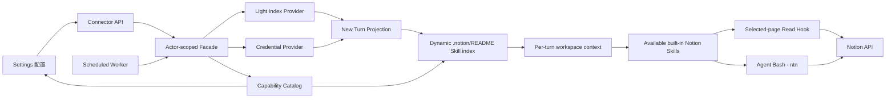

<!-- [Input] Reviewed Notion PRD, current connector facade, Settings/Chat components, and Runtime delivery design. -->
<!-- [Output] Product-to-architecture interaction mapping without duplicating historical workbench paths. -->
<!-- [Pos] Current Notion connector interaction architecture bridge in docs/design/notion-session. -->
<!-- [Sync] 2026-08-30: map the synchronized notion-cli Skill to the actor/thread-bound Agent Bash environment. -->
<!-- [Sync] 2026-08-30: make the capability catalog the shared Skill source for Settings, workspace README, and per-turn context; retain discovery-only Feishu/local CLI placeholders. -->

# Notion 连接器交互与架构映射

产品规则见 [`../../prd/notion-session/resource-connector.md`](../../prd/notion-session/resource-connector.md)，界面稿见 [`../../prd/notion-session/resource-connector-ui-design.md`](../../prd/notion-session/resource-connector-ui-design.md)。本文只说明交互如何映射到现有架构，不重新定义产品状态。

## 1. 单一正式路径

- Settings 是连接、授权、范围和策略的唯一产品配置入口。
- Chat 只读取服务器状态和来源摘要，点击“管理”回到 Settings。
- 后台同步只发布轻量索引；Chat 初始化只投影，不运行同步。
- Settings 的 Skill 行、workspace `.notion/README.md` 与每轮 workspace context 都消费 `build_notion_capability_catalog` 的返回值；README/materializer 和 context 不维护 Skill ID、标题、状态或 revision 的第二份清单。
- Agent 可通过 `notion-session` 的文件导航模型或 `notion-cli` 的 Bash 命令使用 Notion；两者绑定同一个 actor/thread projection。
- `ntn` 未安装时 Settings 先提示固定安装命令；安装且连接后，`sdk_env` 将四个 `NOTION_*` 变量直接注入 Runtime。

## 2. 用户动作映射

| 用户动作 | 业务入口 | 架构行为 | 不发生的行为 |
|---|---|---|---|
| 连接 | Settings Notion 详情 | 创建/复用连接，启动 actor 待授权会话 | 浏览器保存凭证 |
| 完成授权 | 授权轮询 | 成功后原子提升有效凭证 | 把 token 返回前端 |
| 重新授权 | 同一详情页 | 新会话成功才替换旧凭证 | 失败时清除旧凭证 |
| 保存资源 | 资源范围 | 替换选择；非空立即建轻索引 | 下载全部正文 |
| 清空资源 | 资源范围 | 清除 current identity 和 actor 索引 | 断开账号 |
| 保存策略 | 策略区 | 校验并推进 desired/effective/revision | 新建调度服务或表 |
| 立即同步 | 已挂载来源子页 | 复用同一轻索引生产路径 | 改变策略、同步正文 |
| 查看 Skill | Settings Skill 子页 | 按 catalog Skill ID 读取对应发布包正文、revision 和动态 reference 文件 | 浏览器拼接服务器路径、读取 thread 副本 |
| 开始 Chat | Agent turn | 投影当前 actor 的有效凭证和范围内 LKG，并向 Bash 注入 thread-bound `NOTION_*` | 触发后台索引同步、继承其他 actor/ambient home |
| 读取页面 | Agent Skill | 校验当前 index 后获取单页 Markdown | 读取未选 ID、使用 ambient 凭证 |
| 断开 | Settings Notion 详情 | 删除连接、actor 凭证/索引和已知 thread 投影 | 删除 Notion 数据 |

## 3. 状态所有权

| 状态 | Source of truth | 前端行为 |
|---|---|---|
| 连接/授权 | connector + credential Provider | 只规范化服务器 DTO |
| 当前选择 | connector resources | 保存后用完整响应替换 UI |
| 同步策略 | connector config 中的 policy snapshot | 展示 default/desired/effective/revision/status |
| 最近成功索引 | actor current + connector identity | 无 identity 不显示“已同步” |
| 部分可用 | 有有效授权/LKG，但最近重授权或同步失败 | warning，不覆盖为健康 |
| 页面可读范围 | 当前选择与 LKG 的交集 | UI 不参与授权判断 |

## 4. 失败边界

- 授权、发现、选择和策略失败由 Settings 展示；浏览器不得生成 fallback 成功状态。
- 定时同步失败只更新该连接的安全状态并保留 LKG。
- 新 turn 始终按当前选择过滤 LKG，因此取消范围优先于“保留旧成功”。
- Notion Read/Skill 局部失败只影响该能力，不改变 turn、resume、cancel、EventBus 或 SSE。
- 未选择、无凭证、权限不足、路径异常和 actor 不匹配全部 fail closed。

## 5. 已删除的历史路径

- 未被路由引用的 `ResourceConnectorPage` 工作台；
- Chat 内授权/资源选择/同步配置；
- 浏览器 localStorage connector authority；
- 未绑定 actor/thread 的 CLI fallback、显式 Notion MCP 和静态正文 snapshot；
- 飞书/本地 CLI 的伪配置、授权和运行入口；资源链接列表仍保留两张禁用的能力发现占位卡。

历史 issue/task 文档只作为过程记录，不得覆盖本文件、当前 PRD或 Runtime 设计。
