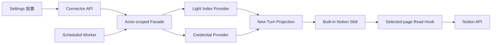

<!-- [Input] Reviewed Notion PRD, current connector facade, Settings/Chat components, and Runtime delivery design. -->
<!-- [Output] Product-to-architecture interaction mapping without duplicating historical workbench paths. -->
<!-- [Pos] Current Notion connector interaction architecture bridge in docs/design/notion-session. -->
<!-- [Sync] 2026-08-29: delete the superseded multi-workbench proposal and map the implemented single path. -->

# Notion 连接器交互与架构映射

产品规则见 [`../../prd/notion-session/resource-connector.md`](../../prd/notion-session/resource-connector.md)，界面稿见 [`../../prd/notion-session/resource-connector-ui-design.md`](../../prd/notion-session/resource-connector-ui-design.md)。本文只说明交互如何映射到现有架构，不重新定义产品状态。

## 1. 单一正式路径

- Settings 是连接、授权、范围和策略的唯一产品配置入口。
- Chat 只读取服务器状态和来源摘要，点击“管理”回到 Settings。
- 后台同步只发布轻量索引；Chat 初始化只投影，不运行同步。
- Agent 只通过内置 Skill 的文件导航模型使用 Notion；正文只有一个受控按需读取入口。
- `ntn` 是后端内部 driver，不是产品能力，也不暴露给 Agent。

## 2. 用户动作映射

| 用户动作 | 业务入口 | 架构行为 | 不发生的行为 |
|---|---|---|---|
| 连接 | Settings Notion 详情 | 创建/复用连接，启动 actor 待授权会话 | 浏览器保存凭证 |
| 完成授权 | 授权轮询 | 成功后原子提升有效凭证 | 把 token 返回前端 |
| 重新授权 | 同一详情页 | 新会话成功才替换旧凭证 | 失败时清除旧凭证 |
| 保存资源 | 资源范围 | 替换选择；非空立即建轻索引 | 下载全部正文 |
| 清空资源 | 资源范围 | 清除 current identity 和 actor 索引 | 断开账号 |
| 保存策略 | 策略区 | 校验并推进 desired/effective/revision | 新建调度服务或表 |
| 立即同步 | 策略区 | 复用同一轻索引生产路径 | 改变策略、同步正文 |
| 开始 Chat | Agent turn | 投影当前 actor 的有效凭证和范围内 LKG | 查询 PostgreSQL 以外的远程正文、触发同步 |
| 读取页面 | Agent Skill | 校验当前 index 后获取单页 Markdown | 读取未选 ID、使用 ambient 凭证 |
| 断开 | Settings Notion 详情 | 删除连接、actor 凭证/索引和已知 thread 投影 | 删除 Notion 数据 |

## 3. 状态所有权

| 状态 | Source of truth | 前端行为 |
|---|---|---|
| 连接/授权 | connector + credential Provider | 只规范化服务器 DTO |
| 当前选择 | connector resources | 保存后用完整响应替换 UI |
| 同步策略 | connector config 中的 policy snapshot | 展示 default/desired/effective/revision/status |
| 最近成功索引 | actor current + connector identity | 无 identity 不显示“已同步” |
| 部分可用 | 有有效授权/LKG，但最近重授权或同步失败 | warning，不覆盖为健康 |
| 页面可读范围 | 当前选择与 LKG 的交集 | UI 不参与授权判断 |

## 4. 失败边界

- 授权、发现、选择和策略失败由 Settings 展示；浏览器不得生成 fallback 成功状态。
- 定时同步失败只更新该连接的安全状态并保留 LKG。
- 新 turn 始终按当前选择过滤 LKG，因此取消范围优先于“保留旧成功”。
- Notion Read/Skill 局部失败只影响该能力，不改变 turn、resume、cancel、EventBus 或 SSE。
- 未选择、无凭证、权限不足、路径异常和 actor 不匹配全部 fail closed。

## 5. 已删除的历史路径

- 未被路由引用的 `ResourceConnectorPage` 工作台；
- Chat 内授权/资源选择/同步配置；
- 浏览器 localStorage connector authority；
- Agent 可见 CLI/Bash、显式 Notion MCP 和静态正文 snapshot；
- Feishu/CLI 不可用占位。

历史 issue/task 文档只作为过程记录，不得覆盖本文件、当前 PRD或 Runtime 设计。
