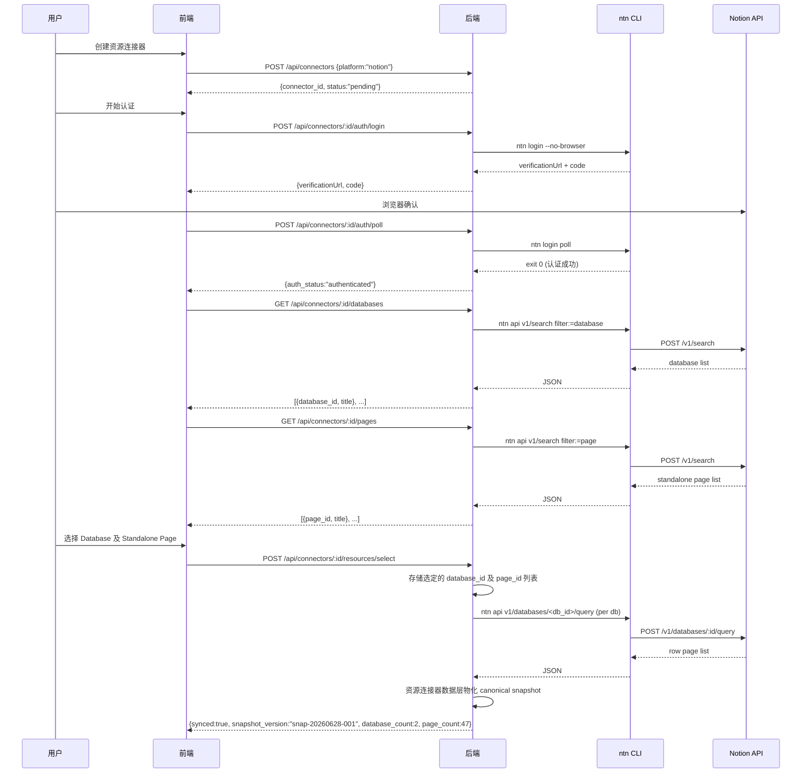
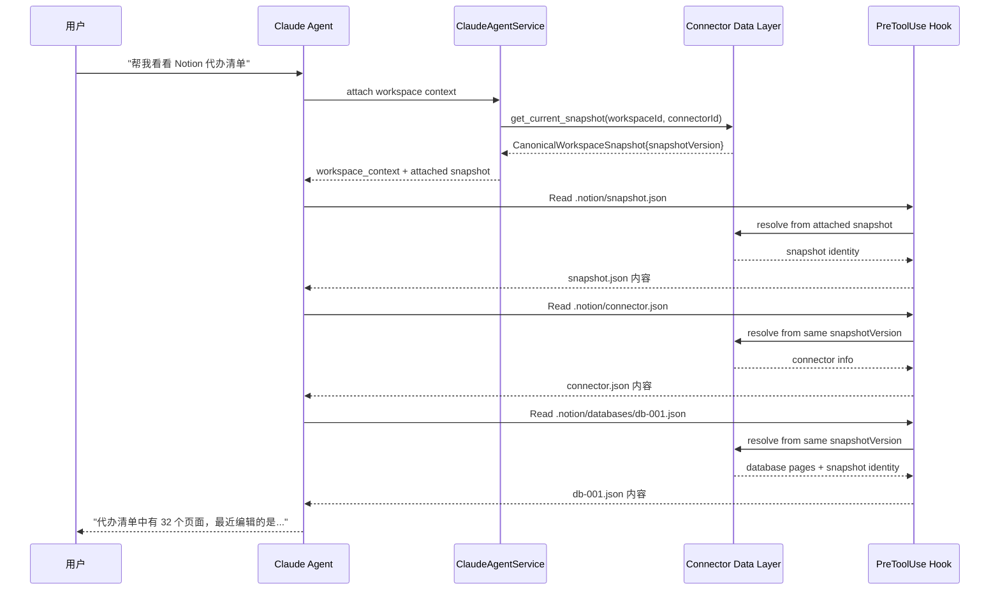
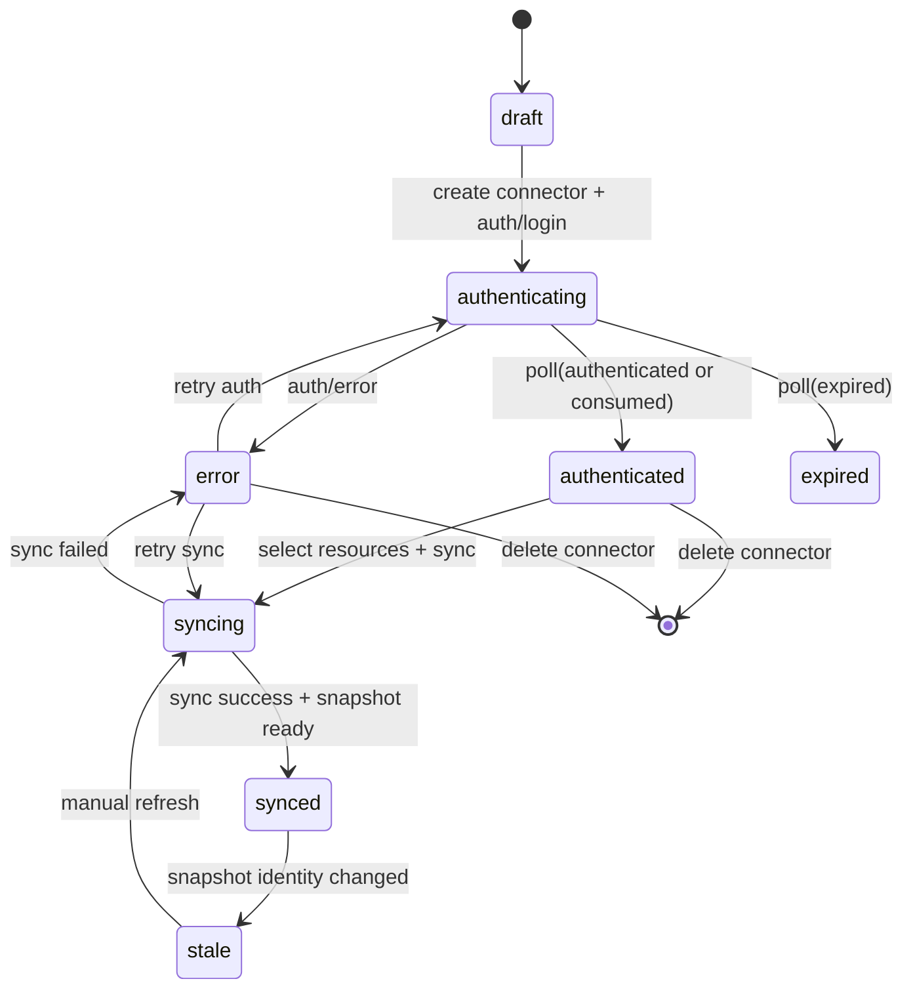

# Notion Device 资源连接器 — 交互方案设计

Status: Draft  
Updated: 2026-07-08
Scope: 设计 — 智能体创建工作空间 Notion Device 资源连接器的完整交互流程

> [Input] `docs/design/notion-session/overview.md`,
>      `docs/design/claude-agent/edit-point/workspace-adapter.md`,
>      `docs/design/claude-agent/edit-point/workspace-context.md`,
>      `docs/design/claude-agent/edit-point/workspace-switch.md`
> [Output] 定义用户从创建资源连接器到 Agent 消费 `.notion/` 映射的完整业务交互流程
> [Pos] connector-interaction-doc in `docs/design/notion-session`
> [Sync] 2026-06-21: 初始设计 — 资源连接器交互方案
> [Sync] 2026-06-22: 修正核心概念声明 — 依据 Notion API Reference 区分 Database/Row Page/Standalone Page/Block
> [Sync] 2026-06-28: 修正 Agent 初始化一致性 — `.notion/` 映射由资源连接器数据层的 canonical snapshot 提供，不再以 Agent 本地 NotionCache 作为权威状态。
> [Sync] 2026-07-05: 增补认证会话保持语义，避免 `ntn login poll` 单次会话消费后前端重复轮询导致状态回退。
> [Sync] 2026-07-07: 交互入口迁移到 Chat 入口页，应用导航控制 `历史对话` / `连接器` landing state，连接器工作台嵌入 Chat shell；同页新增输入框下方的快捷功能 strip，并定义 shell 级 `shell_error` 降级。
> [Sync] 2026-07-07: 明确嵌入态状态隔离：`聊天` 使用已创建 workbench 语义与 normalized fallback，`来源` 只由真实 connector context 驱动空态/认证/资源选择；外层 shell 锁定 viewport，滚动只发生在内部区域。
> [Sync] 2026-07-07: 移除 Chat 输入框下方重复的 `历史对话` / `连接器` pill row 和连接器 workbench 内部重复标题/tab chrome；嵌入态只保留右上 `分享 / 更多` 与内容区入口。
> [Sync] 2026-07-08: Connector 入口迁移到 Settings 资源链接区，Chat 仅保留摘要面板；Notion 具体管理页继续复用 `ResourceConnectorPage` page mode。

---

## 目录

1. [问题分析](#1-问题分析)
2. [核心概念声明](#2-核心概念声明)
3. [业务交互流程](#3-业务交互流程)
4. [资源连接器创建流程](#4-资源连接器创建流程)
5. [数据同步至 `.notion/` 映射](#5-数据同步至-notion-映射)
6. [Agent 对话消费流程](#6-agent-对话消费流程)
7. [ntn api 集成设计](#7-ntn-api-集成设计)
8. [时序图](#8-时序图)
9. [与 workspace-adapter 模式的映射关系](#9-与-workspace-adapter-模式的映射关系)
10. [不实现清单](#10-不实现清单)

---

## 1. 问题分析

### 1.1 现状评估

`overview.md` 已定义四层抽象（认证层、数据层、操作层、任务层）及 `.notion/` 虚拟索引机制，但**缺少以下关键设计**：

| 缺失项 | 影响 |
|--------|------|
| 用户创建资源连接器的交互流程 | 前端无法落地 |
| Database 选择与 PageID 映射 | Agent 无法定位用户可访问的数据 |
| `ntn api v1/search` 集成路径 | 同步任务无实现方案 |
| Agent 对话中如何触发 `.notion/` 同步 | 数据新鲜度无保障 |

### 1.2 设计边界

本文档仅覆盖**交互方案设计**，不涉及代码实现。实现细节参考 `overview.md`。

### 1.3 目标符合性判断

| 现有设计 | 是否符合目标 | 调整 |
|---|---|---|
| 用户创建连接器、认证、选择 Database/Page | 符合 | 保留 |
| `.notion/` 映射作为 Agent 读取入口 | 符合 | 数据源改为 canonical snapshot |
| Agent 对话中触发 lazy load 并更新缓存 | 不符合 | Agent Read 不直接远程拉取；由连接器数据层刷新并生成新 snapshot |
| `switch_editor(device="notion")` | 过度设计 | 不复用 editor session 切换；Notion connector 由 workspace resource selection 决定 |
| Notion 写回 | 超出本期 | 仅保留 proposal/write pipeline 交互边界 |
| Chat landing 快捷功能与 shell fallback | 现状未明确 | 增补输入框下方的 secondary action strip，并定义可恢复的 `shell_error` 态，避免 `ChatViewContent` 渲染失败时把入口整体吞掉 |

---

## 2. 核心概念声明

> 参考：[Notion API — Database](https://developers.notion.com/reference/database)

| 概念 | 定义 | 关系 |
|------|------|------|
| **Resource Connector（资源连接器）** | 连接外部平台资源到 ink-and-memory 工作空间的抽象实体 | 一个用户可拥有多个连接器 |
| **Database** | Notion 中定义属性 Schema（列/字段）的特殊对象。可以是 full-page database 或 inline database（内嵌于某个 Page 中）。Database 本身不包含内容块，仅定义 properties schema | 一个连接器可关联多个 Database |
| **Page（页面）** | Notion 中的内容单元。分为两类：① **Database Row Page** — parent 为 database，属性值遵循所属 Database 的 schema；② **Standalone Page** — parent 为 workspace 或另一个 page，与 Database 无关联 | 一个 Database 下可包含多个 Row Page；Standalone Page 独立存在 |
| **PageID** | Page 的唯一标识（UUID）。无论是 Database Row Page 还是 Standalone Page，均拥有独立的 PageID | — |
| **Block** | Notion 中的最小内容单元（段落、标题、列表等）。Page 由 Block 组成；Database 不直接包含 Block | Page 的 children |
| **`.notion/` 映射文件** | 工作空间内的虚拟索引目录，呈现连接器数据层物化的 canonical snapshot | 与连接器数据层强关联 |
| **ntn api** | Notion 官方 CLI 提供的 API 直调命令 | 自动处理 Auth/Version 头 |

### 2.1 Notion 对象层次（API 视角）

```
Workspace
  ├── Database (定义 properties schema)
  │     └── Page (Database Row — 属性值遵循 schema)
  │           └── Block (段落/标题/列表等内容块)
  └── Page (Standalone — 独立页面，无 Database 关联)
        ├── Block (内容块)
        └── Database (Inline — 内嵌数据库，parent 为此 Page)
              └── Page (Database Row)
```

### 2.2 资源连接器映射层次

```
Resource Connector (资源连接器)
  ├── Database (用户选定的数据库)
  │     └── Page (Database Row)
  │           └── .notion/pages/<page_id>.json
  └── Standalone Page (独立页面，通过 v1/search 发现)
        └── .notion/pages/<page_id>.json
```

---

## 3. 业务交互流程

### 3.1 全局流程概览

```
用户从顶部 / 移动端导航进入 Settings 的资源链接区
    │
    ├─ 看到远程资源链接与本地资源链接分区
    │
    ├─ 在 Notion 卡片点击「管理」
    │
    ├─ 进入 Notion 具体管理页（复用 `ResourceConnectorPage` page mode）
    │
    ├─ 选择或新建资源连接器
    │
    ├─ 选择认证平台服务 (Notion)
    │
    ├─ 完成 ntn login 认证
    │
    ├─ 用户选择可访问的 Database 及 Standalone Page
    │     └─ 后端通过 ntn api v1/search 分别获取 database 和 page 列表
    │
    ├─ 后端同步数据层
    │     └─ 将选定 Database 的 Row Page 及 Standalone Page 物化为 canonical snapshot
    │
    └─ 用户回到 Chat 对话
          │
          ├─ Agent 初始化时 attach 当前 canonical snapshot
          ├─ .notion/ 虚拟索引从同一 snapshotVersion 读取
          │
          └─ 同步常用 notion-cli skill 到工作空间
```

### 3.2 流程阶段定义

| 阶段 | 触发者 | 输出 | 存储位置 |
|------|--------|------|---------|
| 1. 创建连接器 | 用户（Settings 的资源链接区 / Notion 管理页） | connector 实体 | 数据库 `resource_connectors` 表 |
| 2. 认证 | 用户（浏览器确认） | ntn token | `NOTION_HOME/` |
| 3. Database 及 Page 选择 | 用户（前端列表） | 选定的 database_id 及 standalone page_id 列表 | `resource_connectors.databases` / `.selected_pages` |
| 4. 数据同步 | 后端（自动） | Database Row Page + Standalone Page canonical snapshot | 资源连接器数据层 |
| 5. 对话消费 | Agent（PreToolUse） | 同一 snapshotVersion 下的页面内容 | `.notion/pages/<id>.json` 虚拟读取 |

### 3.3 认证会话保持（避免 `poll` 回退）

`ntn login poll` 在授权完成后可能返回 `No pending login session found` 或 `authorization session already consumed`。
这不是认证失败，而是会话消费后的正常状态。设计要求后端对每次认证启动持久化会话并做幂等判断。

策略：

- `auth/login` 先创建新的 `auth_session`：
  - `auth_session_id`
  - `auth_session_status`（`running`/`pending`）
  - `auth_session_started_at`
  - `auth_session_last_polled_at`
  - `auth_session_poll_in_flight`
  - `auth_session_expires_at`
- `auth/poll` 读取会话状态；当状态已 `authenticated` 时，直接返回 `authenticated`，不再回退。
- `auth/poll` 遇到 `No pending login session found` 时将会话标记 `consumed`，并保留认证成果。
- 前端不应以“重复 pending”作为唯一阻塞根因；应改以 `connector.auth_status` + `config.auth_session` 进行 UI 判定。

### 3.4 Chat shell 降级与恢复

- `ChatViewContent` 若因渲染异常、快捷功能区域挂载失败或 landing state 初始化失败而不可交互，必须显示可恢复错误态，而不是整页留白。
- `shell_error` 只表示 Chat shell 级故障，不表示 connector 认证、同步或 snapshot 状态异常。
- 在 `shell_error` 下，用户仍应至少能看到重新加载入口，并在 shell 恢复后回到上一次选中的 `history` 或 `connector` 视图。
- `连接器` landing state 现在只作为 Chat shell 内的轻量摘要面板，不再渲染完整工作台；`QuickActionStrip` 仍只保留在输入框下方一次，不与 connector 生命周期状态重复表达。
- `ConnectorSettingsSection` 承载远程 / 本地资源入口与 Notion 管理页切换；Notion 的 page mode 继续复用 `ResourceConnectorPage`，但不再以黑底嵌入态作为默认入口。
- Chat shell、Settings 资源链接区与 Notion page mode 仍需保持 `height: 100%` / `min-height: 0` / `overflow: hidden` 的连续链路；需要滚动时只允许历史列表、摘要面板或 Notion page mode 内部 `overflow-auto`。

---

## 4. 资源连接器创建流程

### 4.1 前端交互步骤

```
Step 0: 进入 Settings 的资源链接区，或从 Chat 的 Connector CTA 跳转过去
    │
    ├─ 看到远程资源链接与本地资源链接分区
    │
┌─────────────────────────────────────────────────────────────┐
│ Step 1: 选择平台                                             │
│                                                             │
│   [Notion]  [GitHub]  [Google Drive]  ...                   │
│     ↓                                                       │
│ Step 2: 认证                                                 │
│                                                             │
│   "正在连接 Notion..."                                       │
│   验证码: VAF-HWY                                           │
│   [打开浏览器确认] ← 用户点击                                 │
│     ↓                                                       │
│ Step 3: 选择 Database 及 Standalone Page                     │
│                                                             │
│   Databases:                                                │
│   ☑ ink-and-memory 代办清单                                  │
│   ☑ 阅读笔记                                                │
│   ☐ 项目管理看板                                             │
│                                                             │
│   Standalone Pages:                                         │
│   ☑ 产品设计文档                                             │
│   ☐ 个人日记                                                 │
│   [确认选择]                                                 │
│     ↓                                                       │
│ Step 4: 同步完成                                             │
│                                                             │
│   "已同步 2 个数据库，共 47 个页面"                           │
│   [完成]                                                     │
└─────────────────────────────────────────────────────────────┘
```

### 4.2 API 设计

| 端点 | 方法 | 用途 |
|------|------|------|
| `/api/connectors` | POST | 创建资源连接器 |
| `/api/connectors/:id/auth/login` | POST | 启动 ntn login 认证 |
| `/api/connectors/:id/auth/poll` | POST | 轮询认证完成状态（幂等：已认证直接返回 authenticated） |
| `/api/connectors/:id/databases` | GET | 获取可访问的 database 列表 |
| `/api/connectors/:id/pages` | GET | 获取可访问的 standalone page 列表 |
| `/api/connectors/:id/resources/select` | POST | 用户选择要同步的 database 和 standalone page |
| `/api/connectors/:id/sync` | POST | 触发数据同步 |

### 4.3 数据模型

```
resource_connectors
├── id: UUID
├── user_id: FK → users
├── platform: "notion"
├── auth_status: "pending" | "authenticated" | "expired"
├── config: JSON
│     ├── notion_home: string
│     ├── selected_databases: string[]  ← 用户选定的 database_id 列表
│     └── selected_pages: string[]      ← 用户选定的 standalone page_id 列表
├── last_synced_at: timestamp
├── current_snapshot_version: string | null
├── current_source_revision: string | null
├── current_sync_cursor: string | null
├── created_at: timestamp
└── updated_at: timestamp
```

---

## 5. 数据同步至 canonical snapshot，再通过 `.notion/` 映射读取

### 5.1 同步触发时机

| 时机 | 触发方式 | 同步范围 |
|------|---------|---------|
| 连接器创建完成 | 自动 | 全量同步并物化首个 canonical snapshot |
| 用户进入对话 | Agent init / workspace attach | 读取当前 canonical snapshot，不直接远程拉取 |
| 用户点击刷新 | 前端触发连接器 sync | 生成新 snapshotVersion |
| Agent 提出写入 | proposal/write pipeline | 远程确认后同步并生成新 snapshotVersion |

### 5.2 `.notion/` 虚拟映射结构（扩展）

`.notion/` 目录中的 JSON 是占位读入口。实际内容来自连接器数据层当前 attach 的 canonical snapshot。

```
.notion/
├── README.md                    ← Agent 引导说明
├── connector.json               ← ★ 连接器元信息
├── snapshot.json                ← 当前快照身份
├── index.json                   ← 所有已同步 Page 列表
├── databases.json               ← 选定的 Database 元信息
├── databases/
│     ├── <db_id_1>.json         ← Database 1 的 Page 清单
│     └── <db_id_2>.json         ← Database 2 的 Page 清单
└── pages/
      └── <page_id>.json         ← 当前 snapshot 已物化的单页内容
```

### 5.3 `connector.json` 内容

```json
{
  "connector_id": "conn-abc123",
  "platform": "notion",
  "auth_status": "authenticated",
  "snapshot": {
    "workspace_id": "workspace-001",
    "resource_connector_id": "conn-abc123",
    "snapshot_version": "snap-20260628-001",
    "source_revision": "notion-rev-789",
    "sync_cursor": "cursor-456",
    "fetched_at": "2026-06-28T14:00:00Z"
  },
  "selected_databases": [
    {
      "database_id": "db-001",
      "title": "ink-and-memory 代办清单",
      "page_count": 32
    },
    {
      "database_id": "db-002",
      "title": "阅读笔记",
      "page_count": 15
    }
  ],
  "selected_standalone_pages": [
    {
      "page_id": "page-xyz",
      "title": "产品设计文档"
    }
  ],
  "last_synced_at": "2026-06-28T14:00:00Z"
}
```

### 5.4 `databases/<db_id>.json` 内容

> Database 下的每个 Page 是一个 Row Page，其属性值遵循该 Database 的 properties schema。

```json
{
  "database_id": "db-001",
  "title": "ink-and-memory 代办清单",
  "properties_schema": {
    "Name": { "type": "title" },
    "Status": { "type": "select" },
    "Due": { "type": "date" }
  },
  "pages": [
    {
      "page_id": "page-aaa",
      "title": "用户认证模块重构",
      "last_edited": "2026-06-20T10:30:00Z",
      "status": "In Progress"
    },
    {
      "page_id": "page-bbb",
      "title": "前端组件优化",
      "last_edited": "2026-06-19T08:00:00Z",
      "status": "Done"
    }
  ],
  "snapshot": {
    "snapshot_version": "snap-20260628-001",
    "source_revision": "notion-rev-789",
    "sync_cursor": "cursor-456"
  },
  "synced_at": "2026-06-28T14:00:00Z"
}
```

---

## 6. Agent 对话消费流程

### 6.1 Agent 感知资源连接器

当用户进入对话时，`<workspace_context>` 中注入连接器状态信息：

```
Notion Device Connector:
  Status: authenticated
  Databases: 2 (ink-and-memory 代办清单, 阅读笔记)
  Total Pages: 47
  Snapshot: snap-20260628-001
  Source Revision: notion-rev-789
  Last Synced: 2026-06-28T14:00:00Z

  Read .notion/snapshot.json for the attached snapshot identity.
  Read .notion/connector.json for connector details.
  Read .notion/index.json for page listing.
  Read .notion/databases/<db_id>.json for database-specific pages.
```

### 6.2 Notion CLI Skill 同步

资源连接器创建成功后，自动同步常用 notion-cli skill 到工作空间 `skills/` 目录：

| Skill 文件 | 用途 |
|------------|------|
| `skills/notion-search.md` | 通过 ntn api 搜索 Notion 内容 |
| `skills/notion-page-read.md` | 读取指定页面完整内容 |
| `skills/notion-db-query.md` | 查询指定 Database 下的页面 |

各 Skill 文件的完整设计详见：[`skills/`](./skills/) 目录

- [`skills/notion-search.md`](./skills/notion-search.md) — 搜索 Notion 内容
- [`skills/notion-page-read.md`](./skills/notion-page-read.md) — 读取页面完整内容
- [`skills/notion-db-query.md`](./skills/notion-db-query.md) — 查询 Database 下的页面

---

## 7. ntn api 集成设计

### 7.1 核心命令映射

| 业务需求 | ntn api 命令 | 调用时机 |
|---------|-------------|---------|
| 获取 Database 列表 | `ntn api v1/search filter:='{"property":"object","value":"data_source"}'` | 连接器创建 Step 3（Database 选择） |
| 获取 Standalone Page 列表 | `ntn api v1/search filter:='{"property":"object","value":"page"}' page_size:=100` | 连接器创建 Step 3（Page 选择） |
| 获取 Database 下的 Row Page | `ntn api v1/databases/<db_id>/query` | 数据同步阶段 |
| 获取 Data Source 列表 | `ntn api v1/search filter:='{"property":"object","value":"data_source"}'` | 连接器初始化 |

### 7.2 后端封装

```python
# 概念设计 — 不是实现代码
class NotionAPIBridge:
    """封装 ntn api CLI 调用，统一错误处理与超时管理。"""

    async def search(self, filter_obj: dict, page_size: int = 100) -> dict:
        """调用 v1/search 端点。"""
        ...

    async def list_databases(self) -> list[dict]:
        """获取用户可访问的所有 Database。"""
        ...

    async def list_standalone_pages(self) -> list[dict]:
        """获取用户可访问的 Standalone Page（非 Database Row）。"""
        ...

    async def query_database(self, database_id: str) -> list[dict]:
        """查询指定 Database 下的 Row Page 列表。"""
        ...
```

### 7.3 错误处理策略

| 错误类型 | 处理方式 |
|---------|---------|
| Token 过期 | 标记 connector.auth_status = "expired"，提示用户重新认证 |
| Poll 已消费 / 无待处理会话 | 标记 `auth_session_status="consumed"`，不回退 `connector.auth_status` |
| ntn CLI 不可用 | 返回友好错误，建议用户安装 ntn |
| API 限流 | 指数退避重试，最多 3 次 |
| 网络超时 | 保留上一版 canonical snapshot，标记 `stale`，提示用户稍后刷新 |

---

## 8. 时序图

### 8.1 资源连接器创建完整流程



### 8.2 Agent 对话中读取 `.notion/` 流程



---

## 9. 与 workspace-adapter 模式的映射关系

### 9.1 模式对称性

本设计严格遵循 `workspace-adapter.md` 确立的虚拟索引模式：

| workspace-adapter 模式 | Notion Connector 对应实现 |
|------------------------|--------------------------|
| `.editor/` 虚拟索引 | `.notion/` 虚拟索引 |
| `editor_state` 当前运行快照 | `CanonicalWorkspaceSnapshot` 连接器数据层快照 |
| `EDITOR_RESOURCES` 映射表 | `NOTION_SNAPSHOT_RESOURCES` 映射表 |
| PreToolUse 拦截 Read | PreToolUse 拦截 Read（相同机制） |
| `switch_editor` 切换 `.editor/` 上下文 | Notion connector 不复用 `switch_editor`；由 workspace resource selection 决定 |
| workspace init 初始化 `.editor/` | workspace init 初始化 `.notion/` 占位符；snapshot attach 由连接器数据层提供 |

### 9.2 与 workspace-context 的集成

参考 `workspace-context.md` 的 `<workspace_context>` 块设计，Notion 连接器信息作为新的上下文段落注入：

```
<!-- workspace_context 中新增段落 -->
Notion Device (.notion/):
  Connector: authenticated | 2 databases | 47 pages | snapshot snap-20260628-001
  Read .notion/snapshot.json for the attached snapshot identity.
  Read .notion/index.json for full page listing.
  Read .notion/databases/<db_id>.json for per-database view.
```

### 9.3 与 workspace-switch 的集成

Notion connector 不复用 `switch_editor`。`switch_editor` 只切换 `.editor/` 文档会话；Notion connector 的选择由前端 workspace resource selection 决定。下一轮 Agent init / workspace attach 时，service 从资源连接器数据层读取当前 canonical snapshot。

如果后续需要同一 turn 内切换外部资源，应新增 workspace-level `switch_resource(resource_connector_id)`，并保持数据来源为连接器数据层 canonical snapshot。

---

## 10. 不实现清单

防止过度设计，以下内容**明确排除**：

| 排除项 | 原因 |
|--------|------|
| 多平台资源连接器统一框架 | 先只做 Notion，后续再抽象 |
| 实时 WebSocket 数据推送 | 事件驱动刷新 + 手动 sync 足够 |
| 页面内容全文索引/搜索 | 先依赖 snapshot index；全文检索后续单独设计 |
| 双向写回 Notion | 本期只设计 proposal/write pipeline，不接真实写入 |
| 连接器权限分级（只读/读写） | 本期仅只读 |
| 前端可视化 Database Schema | 先仅展示标题列表 |
| 自动检测 Schema 变更 | 先做全量同步 |
| 多用户共享同一连接器 | 连接器绑定单用户 |

---

## 11. 交互状态机与前后端协作边界（SUO-192 对齐）

### 11.1 用户态状态映射（UI Contract）

| UI 状态 | 触发条件（后端） | 关键数据 |
|---|---|---|
| `draft` | 已创建连接器，尚未发起认证 | `status="draft"`、无 `auth_session` |
| `authenticating` | 发起 `auth/login` 或存在未完成 auth 会话 | `auth_session_status="running"/"pending"`、`verification_code` |
| `authenticated` | `auth/poll` 返回已认证 | `auth_status="authenticated"`、`auth_session_status="consumed"` 或 `authenticated` |
| `syncing` | 资源选择后触发同步 | `status="syncing"`、`current_snapshot_version` 不变 |
| `synced` | 同步完成，快照写入成功 | 返回 `snapshot_version/source_revision/sync_cursor/fetched_at` |
| `stale` | 后端返回 `is_stale=true` 或 source_revision 落后 | `snapshot_version` 与当前不一致 / 已过期 |
| `error` | `error` / `failed` 状态或 poll 异常 | `message`、`error_code`、下一步建议动作 |

### 11.2 认证会话保活规则（避免“重复 pending”）

`POST /auth/poll` 的语义应满足：

- 当会话已消费，返回 `status="consumed"` 或 `error code="already_consumed"` 时，前端应**立即收敛到 authenticated** 展示（若 connector 已有 token）
- 当会话过期返回 `status="expired"` 时，前端应只显示 `Re-auth`，并保留最近快照但明确“仅历史只读”
- 当会话失败（`failed`）时，前端必须止损到 `error` 并给出 `Retry auth`。

### 11.3 来源列表与快照一致性规则

| 数据读取目标 | 成功态 | 失败态 |
|---|---|---|
| `.notion/snapshot.json` | 返回当前 snapshot identity | 失败：在前端提示 `snapshot missing` 并建议 `Refresh snapshot` |
| `.notion/index.json` | 返回最近页面清单 | 失败：展示空态骨架 + `刷新来源` |
| `.notion/databases/<id>.json` | 返回 db 与 page 列表 | 缺页：`reason=not_materialized_in_snapshot`（不触发远端拉取） |
| `.notion/pages/<page_id>.json` | 返回 page JSON | 缺页：`reason=not_materialized_in_snapshot` + 同步入口 |

### 11.4 状态流转最小事件图



### 11.5 Chat 嵌入态状态边界

| View | 默认状态来源 | 无真实 connector 时 | 401 / 后端不可用时 | 滚动边界 |
|---|---|---|---|---|
| Created workbench | `selectedConnector ?? normalizedFallbackConnector` | 显示 created connector workbench 与 fallback 来源列表 | 保持黑底 workbench 可见，不白屏、不跳错误空态 | connector 内容区内部滚动 |
| Source management (`添加源`) | `selectedConnector` | 显示 `ConnectorEmptyState`，引导新建连接器 | local fallback 若无真实 connector 仍保持空态 | 空态或资源选择内容区内部滚动 |

---

## 附录 A：设计决策记录

| 决策 | 选项 | 选择 | 理由 |
|------|------|------|------|
| 数据通道 | Notion SDK / ntn CLI | ntn CLI | 复用已有 CLI 认证，零额外依赖 |
| 同步方式 | 实时 / 定时 / 按需 | workspace init + 按需 | 避免后台常驻进程，简化部署 |
| 映射存储 | 数据库 / 文件系统 | `.notion/` 虚拟索引 | 与 `.editor/` 模式对称，Agent 直接可读 |
| Database 发现 | 硬编码 / 用户选择 | 用户选择 | 用户决定哪些数据对 Agent 可见 |
| PageID 同步 | 全量 / 增量 | 全量生成 snapshot（本期） | 保证多 Agent 初始化读取同一版本 |
