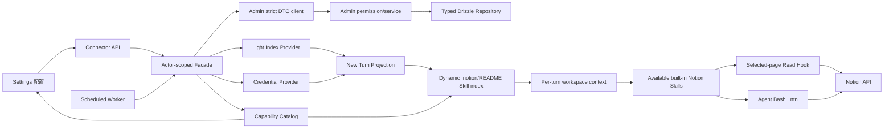
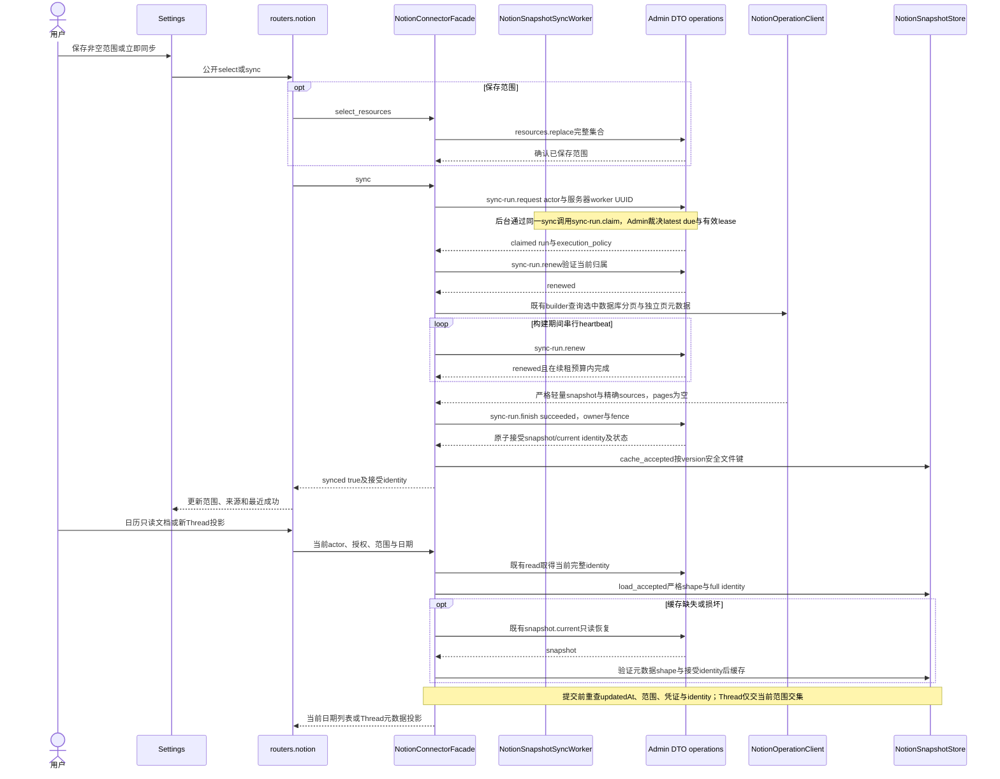
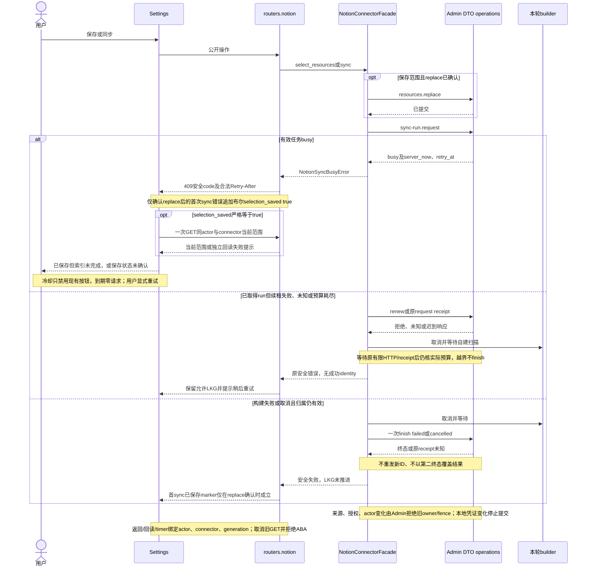
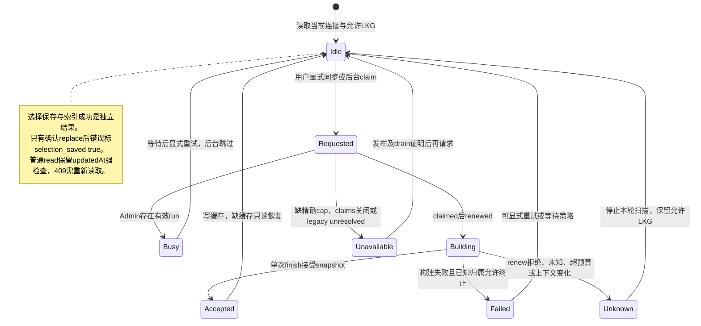

<!-- [Sync] 2026-10-07: frozen ownership and accepted snapshots pass isolated technical validation; four current Mermaid diagrams pass parse/render; normal release pending. -->
<!-- [Sync] 2026-10-06: Calendar consumes selected canonical index; only snapshot-today updates receive metadata verification. -->
<!-- [Sync] 2026-10-05: synchronize accepted Calendar Search-scope read boundary without selected-body/sync changes. -->
<!-- [Input] Reviewed Notion PRD, current connector facade, Settings/Chat components, and Runtime delivery design. -->
<!-- [Output] Product-to-architecture interaction mapping without duplicating historical workbench paths. -->
<!-- [Pos] Current Notion connector interaction architecture bridge in docs/design/notion-session. -->
<!-- [Sync] 2026-08-30: map the synchronized notion-cli Skill to the actor/thread-bound Agent Bash environment. -->
<!-- [Sync] 2026-08-30: make the capability catalog the shared Skill source for Settings, workspace README, and per-turn context; retain discovery-only Feishu/local CLI placeholders. -->
<!-- [Sync] 2026-09-16: route all connector metadata persistence through Admin Registry148-168 DTO/service/Drizzle operations. -->

<!-- [Sync] 2026-10-04: index the Calendar right-panel tab proposal and preserve the complete preceding text beside this file. -->
# Notion 连接器交互与架构映射

> 2026-10-06 现行补充：[日历日期文档](../claude-agent/calendar-right-panel-tabs-ui-design.md)使用连接器当前索引与当前选择的交集；历史读取当日创建，今天先显示快照，再仅校验快照当天更新项的元数据。日历不执行 Search、同步、选择或正文读取。现有同步需保留上游 created_time/last_edited_time，并对选中独立页面读取元数据更新轻量索引；pages 始终为空。新文档及未记录变化依赖原连接器同步。原完整正文保存在[connector-interaction 历史](./connector-interaction-pre-snapshot-20261006-history.md)。

产品规则见 [`../../prd/notion-session/resource-connector.md`](../../prd/notion-session/resource-connector.md)，界面稿见 [`../../prd/notion-session/resource-connector-ui-design.md`](../../prd/notion-session/resource-connector-ui-design.md)。本文只说明交互如何映射到现有架构，不重新定义产品状态。

## 0. 背景、目标与概念

背景：stored syncing不能证明当前仍存在有效执行者，重启后的私有文件也不能代替Admin接受identity；范围已保存但首同步失败需要分别反馈。目标是让手动、范围首次同步和后台worker复用现有builder，使用Admin的归属/续租/单次原子终止，并保留范围内LKG和原Agent正文权限。概念：选择由Admin resources所有；执行归属与lease由Admin新四operation所有；接受snapshot由Admin current identity及last_synced_at所有；Dream文件只作严格元数据缓存。普通read没有公开selection/auth revision，仍以updatedAt与当前范围、凭证身份保守检查。

边界：无通用多平台框架、Webhook、队列、正文同步或Dream DDL；Admin Drizzle共享合同按精确cap发布。当前本机正常目录缺新cap/四operation，claims开放与旧writer drain未证明，新写fail closed。本文对应的源码已通过Dream83项核心、3项取消边界、52项相关回归及Admin实际消费者6项/公开worker2项隔离技术验证；[完整回执](../../exec/notion-sync-ownership-dream-integration-20261007.md#13-本仓后端实际复测与范围)分别记录命令与验收边界，不能据此宣称正常服务自动恢复已经生效。[变更前全文](./connector-interaction-pre-ownership-20261007-history.md)完整保留。

## 1. 单一正式路径

```mermaid
flowchart LR
    Settings["Settings 配置"] --> Router["Connector API"]
    Router --> Facade["Actor-scoped Facade"]
    Facade --> AdminDTO["Admin strict DTO client"]
    AdminDTO --> AdminService["Admin permission/service"]
    AdminService --> Drizzle["Typed Drizzle Repository"]
    Facade --> Credential["Credential Provider"]
    Facade --> Index["Light Index Provider"]
    Facade --> Catalog["Capability Catalog"]
    Scheduler["Scheduled Worker"] --> Facade
    Index --> Turn["New Turn Projection"]
    Credential --> Turn
    Catalog --> Settings
    Turn --> Readme["Dynamic .notion/README Skill index"]
    Catalog --> Readme
    Readme --> Context["Per-turn workspace context"]
    Context --> Skill["Available built-in Notion Skills"]
    Skill --> Hook["Selected-page Read Hook"]
    Skill --> CLI["Agent Bash · ntn"]
    Hook --> Notion["Notion API"]
    CLI --> Notion
```

- Settings 是连接、授权、范围和策略的唯一产品配置入口；当前 Admin OAuth actor 是 connector 数据权限主体。
- Admin 执行 connector/resource/snapshot/thread 的权限过滤、SQL、ORM 和事务；Dream Facade 只编排 strict DTO、Notion CLI 与文件投影。
- Chat 只读取服务器状态和来源摘要，点击“管理”回到 Settings。
- 后台同步只发布轻量索引；Chat 初始化只投影，不运行同步。
- Settings 的 Skill 行、workspace `.notion/README.md` 与每轮 workspace context 都消费 `build_notion_capability_catalog` 的返回值；README 生成函数和 context 不维护 Skill ID、标题、状态或 revision 的第二份清单。
- Agent 可通过 `notion-session` 的文件导航模型或 `notion-cli` 的 Bash 命令使用 Notion；两者绑定同一个 actor/thread projection。
- `ntn` 未安装时 Settings 先提示固定安装命令；安装且连接后，`sdk_env` 将四个 `NOTION_*` 变量直接注入 Runtime。

## 2. 用户动作映射

| 用户动作 | 业务入口 | 架构行为 | 不发生的行为 |
|---|---|---|---|
| 连接 | Settings Notion 详情 | 创建/复用连接，启动 actor 待授权会话 | 浏览器保存凭证 |
| 完成授权 | 授权轮询 | 成功后原子提升有效凭证 | 把 token 返回前端 |
| 重新授权 | 同一详情页 | 新会话成功才替换旧凭证 | 失败时清除旧凭证 |
| 保存资源 | 资源范围 | 替换选择；非空立即建轻索引 | 下载全部正文 |
| 清空资源 | 资源范围 | 清除 current identity 和 actor 索引 | 断开账号 |
| 保存策略 | 策略区 | 校验并推进 desired/effective/revision | 新建调度服务或表 |
| 立即同步 | 已挂载来源子页 | 复用同一轻索引生产路径 | 改变策略、同步正文 |
| 查看 Skill | Settings Skill 子页 | 按 catalog Skill ID 读取对应发布包正文、revision 和动态 reference 文件 | 浏览器拼接服务器路径、读取 thread 副本 |
| 开始 Chat | Agent turn | 投影当前 actor 的有效凭证和范围内 LKG，并向 Bash 注入 thread-bound `NOTION_*` | 触发后台索引同步、继承其他 actor/ambient home |
| 读取页面 | Agent Skill | 校验当前 index 后获取单页 Markdown | 读取未选 ID、使用 ambient 凭证 |
| 断开 | Settings Notion 详情 | 删除连接、actor 凭证/索引和已知 thread 投影 | 删除 Notion 数据 |

## 3. 状态所有权

| 状态 | Source of truth | 前端行为 |
|---|---|---|
| 连接/授权 | Admin connector row + Dream credential Provider | 只规范化服务器 DTO |
| 当前选择 | Admin-owned connector resources | 保存后用完整响应替换 UI |
| 同步策略 | connector config 中的 policy snapshot | 展示 default/desired/effective/revision/status |
| 最近成功索引 | Admin接受的完整identity与last_synced_at；Dream按version隔离缓存 | 无identity不显示“已同步”；损坏/缺缓存只读Admin恢复 |
| 部分可用 | 有有效授权/LKG，但最近重授权或同步失败 | warning，不覆盖为健康 |
| 页面可读范围 | 当前选择与 LKG 的交集 | UI 不参与授权判断 |

## 4. 失败边界

- 授权、发现、选择和策略失败由 Settings 展示；浏览器不得生成 fallback 成功状态。
- 定时同步失败只在已知有效归属且无终态在途时提交一次安全终态并保留LKG；未知归属不补写。
- 新 turn 始终按当前选择过滤 LKG，因此取消范围优先于“保留旧成功”。
- Notion Read/Skill 局部失败只影响该能力，不改变 turn、resume、cancel、EventBus 或 SSE。
- 未选择、无凭证、权限不足、路径异常和 actor 不匹配全部 fail closed。
- Admin 不可用、capability 缺失或未知写无法由原 request receipt 确认时返回明确失败；Dream 不回退到 PostgreSQL。

## 5. 已删除的历史路径

- 未被路由引用的 `ResourceConnectorPage` 工作台；
- Chat 内授权/资源选择/同步配置；
- 浏览器 localStorage connector authority；
- 未绑定 actor/thread 的 CLI fallback、显式 Notion MCP 和静态正文 snapshot；
- 飞书/本地 CLI 的伪配置、授权和运行入口；资源链接列表仍保留两张禁用的能力发现占位卡。

历史 issue/task 文档只作为过程记录，不得覆盖本文件、当前 PRD或 Runtime 设计。

## 6. 同步归属与接受快照增量（2026-10-07）

### 6.1 正常业务时序

```mermaid
sequenceDiagram
    actor U as 用户
    participant UI as Settings
    participant R as routers.notion
    participant F as NotionConnectorFacade
    participant S as NotionSnapshotSyncWorker
    participant A as Admin DTO operations
    participant N as NotionOperationClient
    participant C as NotionSnapshotStore
    U->>UI: 保存非空范围或立即同步
    UI->>R: 公开select或sync
    opt 保存范围
        R->>F: select_resources
        F->>A: resources.replace完整集合
        A-->>F: 确认已保存范围
    end
    R->>F: sync
    F->>A: sync-run.request actor与服务器worker UUID
    Note over S,A: 后台通过同一sync调用sync-run.claim，Admin裁决latest due与有效lease
    A-->>F: claimed run与execution_policy
    F->>A: sync-run.renew验证当前归属
    A-->>F: renewed
    F->>N: 既有builder查询选中数据库分页与独立页元数据
    loop 构建期间串行heartbeat
        F->>A: sync-run.renew
        A-->>F: renewed且在续租预算内完成
    end
    N-->>F: 严格轻量snapshot与精确sources，pages为空
    F->>A: sync-run.finish succeeded，owner与fence
    A-->>F: 原子接受snapshot/current identity及状态
    F->>C: cache_accepted按version安全文件键
    F-->>R: synced true及接受identity
    R-->>UI: 更新范围、来源和最近成功
    U->>R: 日历只读文档或新Thread投影
    R->>F: 当前actor、授权、范围与日期
    F->>A: 既有read取得当前完整identity
    F->>C: load_accepted严格shape与full identity
    opt 缓存缺失或损坏
        F->>A: 既有snapshot.current只读恢复
        A-->>F: snapshot
        F->>C: 验证元数据shape与接受identity后缓存
    end
    Note over F,C: 提交前重查updatedAt、范围、凭证与identity；Thread仅交当前范围交集
    F-->>R: 当前日期列表或Thread元数据投影
```

### 6.2 异常与恢复时序

```mermaid
sequenceDiagram
    actor U as 用户
    participant UI as Settings
    participant R as routers.notion
    participant F as NotionConnectorFacade
    participant A as Admin DTO operations
    participant B as 本轮builder
    U->>UI: 保存或同步
    UI->>R: 公开操作
    R->>F: select_resources或sync
    opt 保存范围且replace已确认
        F->>A: resources.replace
        A-->>F: 已提交
    end
    F->>A: sync-run.request
    alt 有效任务busy
        A-->>F: busy及server_now、retry_at
        F-->>R: NotionSyncBusyError
        R-->>UI: 409安全code及合法Retry-After
        Note over R,UI: 仅确认replace后的首次sync错误追加布尔selection_saved true
        opt selection_saved严格等于true
            UI->>R: 一次GET同actor与connector当前范围
            R-->>UI: 当前范围或独立回读失败提示
        end
        UI-->>U: 已保存但索引未完成，或保存状态未确认
        Note over UI,U: 冷却只禁用现有按钮，到期零请求；用户显式重试
    else 已取得run但续租失败、未知或预算耗尽
        F->>A: renew或原request receipt
        A-->>F: 拒绝、未知或迟到响应
        F->>B: 取消并等待自建扫描
        Note over F,A: 等待原有限HTTP/receipt后仍核实际预算，越界不finish
        F-->>R: 原安全错误，无成功identity
        R-->>UI: 保留允许LKG并提示稍后重试
    else 构建失败或取消且归属仍有效
        F->>B: 取消并等待
        F->>A: 一次finish failed或cancelled
        A-->>F: 终态或原receipt未知
        Note over F,A: 不重发新ID、不以第二终态覆盖结果
        F-->>R: 安全失败，LKG未推进
        R-->>UI: 首sync已保存marker仅在replace确认时成立
    end
    Note over F,A: 来源、授权、actor变化由Admin拒绝旧owner/fence；本地凭证变化停止提交
    Note over UI,R: 返回/回读/timer绑定actor、connector、generation；取消旧GET并拒绝ABA
```

### 6.3 状态转换

```mermaid
stateDiagram-v2
    [*] --> Idle: 读取当前连接与允许LKG
    Idle --> Requested: 用户显式同步或后台claim
    Requested --> Busy: Admin存在有效run
    Busy --> Idle: 等待后显式重试，后台跳过
    Requested --> Building: claimed后renewed
    Requested --> Unavailable: 缺精确cap、claims关闭或legacy unresolved
    Building --> Accepted: 单次finish接受snapshot
    Building --> Failed: 构建失败且已知归属允许终止
    Building --> Unknown: renew拒绝、未知、超预算或上下文变化
    Unknown --> Idle: 停止本轮扫描，保留允许LKG
    Failed --> Idle: 可显式重试或等待策略
    Accepted --> Idle: 写缓存，缺缓存只读恢复
    Unavailable --> Idle: 发布及drain证明后再请求
    note right of Idle
      选择保存与索引成功是独立结果。
      只有确认replace后错误标selection_saved true。
      普通read保留updatedAt强检查，409需重新读取。
    end note
```

### 6.4 输入、判断及公开反馈

| 事件 | 判断/输出 | 页面恢复 |
| --- | --- | --- |
| manual busy | 409 detail.error_code=NOTION_SYNC_BUSY；Retry-After仅ceil非负server retry_at-server_now | “连接器已有同步任务，请稍后重试”；不显示已保存 |
| replace已确认后首sync错误 | 原安全HTTP status/code/header保留，detail追加严格selection_saved=true；无rawexception | “资源范围已保存，索引更新未完成”；一次公开GET；回读失败另说明并保留草稿/最近索引 |
| replace未知或marker缺失/false/字符串 | 不声明保存完成、不推测服务器未变 | “保存状态未确认，请返回查看当前范围后重试”；保留草稿 |
| Retry-After | 只控制现有保存/同步按钮；actor/connector/generation隔离旧timer | 到期解禁但零query/write；用户显式重试仍服务器裁决 |
| 续租/receipt预算 | Admin服务器policy，串行最多一个在途renew；monotonic仅预算，不裁决他人lease | 停止自建CLI；取消后等待原请求实际完成仍核预算，超时不终止写 |
| scheduled统计 | attempted仅指提交Admin claim的候选次数；busy/not_due没有实际构建 | succeeded/failed均不增加，不展示为已执行同步次数 |
| finish/cache | 先Admin接受，后严格cache；cache失败不把成功改成failed | 日历/Thread从Admin当前接受版本只读恢复 |
| 普通read上下文 | 实际public connector不含execution revisions；updatedAt、scope、凭证身份、full identity前后匹配 | 不凭同version或sync状态忽略409；下一正常周期/显式刷新恢复 |
| 元数据结构 | 严格connector/index/database_pages/identity、pages空；无未知body/config | 拒绝损坏结构；旧缺时间为未知partial；不扩大正文权限 |

完整identity按实际persistSnapshot绑定：resource_connector_id=connector.id、workspace_id=connector.id、metadata三个version字段=current三个字段，fetched_at=last_synced_at同UTC瞬间，state=snapshot_ready。版本不透明，文件键用固定摘要不拼接路径。凭证复用O_NOFOLLOW有限私有读取，比较内容与dev/inode/size/mtime；每次chmod的ctime不作为授权变化，摘要不返回浏览器。最后提交前再读当前上下文，失败清理本轮Thread投影。

### 6.5 验收与当前边界

验收调用现有公开router与真实DTO；覆盖select/manual/scheduled、busy与保存反馈、数据库分页含pages、串行heartbeat、取消×续租预算、原receipt未知恢复、finish拒绝LKG、成功缓存失败、重启/旧writer/未知正文拒绝、Calendar日期/Thread选择权限、缺精确cap和原业务回归。Dream DI仅证明消费者，Admin锁/CAS/fencing/实际DB原子性使用依赖任务真实隔离DB回执。执行命令、退出码和首次失败/复测由Luna与主任务保存。

当前正常目录已只读证明新四operation与schema缺失；claims/drain未证明。即使源码编译或隔离测试通过，也不能宣称正常自动恢复已启用。不得正常DDL、清legacy owner、停用户服务或fallback旧snapshot.save/状态patch。
