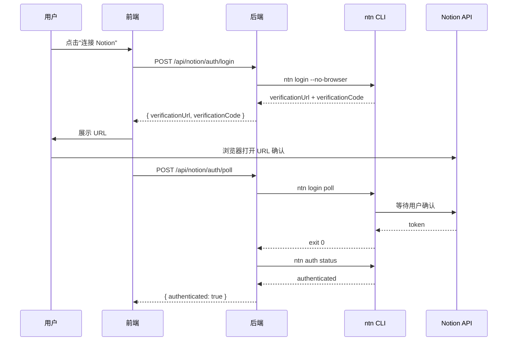
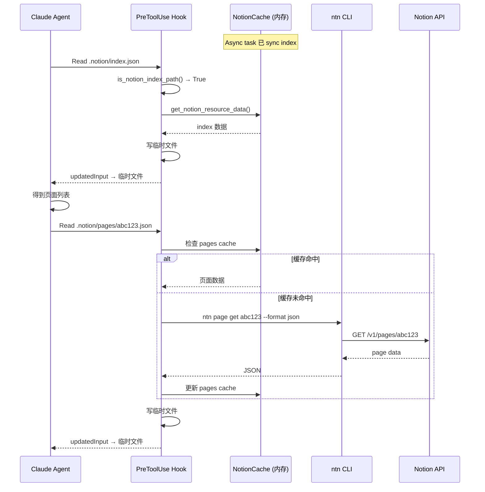

# Notion Device 资源连接器设计方案

Status: Draft
Updated: 2026-06-21
Scope: 设计 — Notion 作为外部设备资源接入 ink-and-memory 工作空间

> [Input] `docs/design/claude-agent/edit-point/workspace-adapter.md`,
>      `docs/design/claude-agent/edit-point/workspace-context.md`,
>      `docs/design/claude-agent/edit-point/workspace-switch.md`,
>      `docs/design/edit-session/overview.md`,
>      `backend/libs/claude_agent_kit/server/editor_index.py`,
>      `backend/libs/claude_agent_kit/server/workspace.py`,
>      `backend/libs/claude_agent_kit/types.py`,
>      `backend/claude_agent/context_builder.py`

---

## 目录

1. [设计背景与动机](#1-设计背景与动机)
2. [资源连接器抽象](#2-资源连接器抽象)
3. [`.notion/` 虚拟索引设计](#3-notion-虚拟索引设计)
4. [认证层设计 — `ntn login` 流程](#4-认证层设计--ntn-login-流程)
5. [数据层设计 — 异步同步 + PreToolUse 拦截](#5-数据层设计--异步同步--pretooluse-拦截)
6. [switch_editor 扩展：Notion 外部文档切换](#6-switch_editor-扩展notion-外部文档切换)
7. [工作空间上下文扩展](#7-工作空间上下文扩展)
8. [时序图](#8-时序图)
9. [实现文件索引](#9-实现文件索引)
10. [不实现清单](#10-不实现清单)

---

## 1. 设计背景与动机

### 1.1 现状

ink-and-memory 的工作空间模型目前仅管理**本地 EditorState**（`.editor/` 虚拟索引）。用户笔记散落在 Notion 中时，Agent 无法感知、读取或引用这些内容。

### 1.2 目标

以 **"Device"（设备）** 的抽象方式将 Notion 接入工作空间：

- Notion 被视为一个**外部文档资源设备**，类似 `.editor/` 是内部文档资源
- 使用 Notion 官方 CLI（`ntn`）作为通信桥梁
- Agent 通过 `.notion/` 虚拟索引**只读浏览** Notion 内容
- 认证由前端驱动，后端异步维护页面索引缓存

### 1.3 核心原则

- **复用现有模式**：`.notion/` 镜像 `.editor/` 的虚拟索引 + PreToolUse 拦截模式
- **ntn CLI 为唯一数据通道**：不引入 Notion SDK 依赖
- **只读优先**：先实现浏览能力，操作能力留待后续设计
- **认证与数据分离**：认证层由前端用户配置驱动，数据层由后端异步任务维护

---

## 2. 资源连接器抽象

### 2.1 四层模型

```
┌─────────────────────────────────────────────────────────┐
│                  Resource Connector                       │
│                   (资源连接器)                             │
├─────────────────────────────────────────────────────────┤
│                                                         │
│  ┌─────────────┐  ┌─────────────┐  ┌──────────────┐    │
│  │  Auth Layer  │  │  Data Layer  │  │ Operation    │    │
│  │  (认证层)    │  │  (数据层)    │  │ Layer (操作) │    │
│  │             │  │             │  │              │    │
│  │ ntn login   │  │ .notion/    │  │ (future)     │    │
│  │ token 管理  │  │ 虚拟索引    │  │ ntn page     │    │
│  │ NOTION_HOME │  │ 异步同步    │  │ create/update│    │
│  └─────────────┘  └─────────────┘  └──────────────┘    │
│                                                         │
│  ┌──────────────────────────────────────────────────┐   │
│  │               Task Layer (任务层)                  │   │
│  │                                                  │   │
│  │  (future) 定时 sync、批量 import、冲突检测         │   │
│  └──────────────────────────────────────────────────┘   │
│                                                         │
└─────────────────────────────────────────────────────────┘
```

### 2.2 各层职责

| 层                  | 职责                                                         | 实现位置                                      | 本期实现   |
| ------------------- | ------------------------------------------------------------ | --------------------------------------------- | ---------- |
| **Auth Layer**      | `ntn login --no-browser` 流程编排、token 路径管理、NOTION_HOME 配置 | `backend/notion/auth.py`                      | ✅ 是       |
| **Data Layer**      | `.notion/` 虚拟索引创建、异步 page 列表同步、PreToolUse 拦截注册 | `backend/notion/index.py` + `agent_runner.py` | ✅ 是       |
| **Operation Layer** | `ntn page get/create/update` 等读写操作封装                  | `backend/notion/ops.py`                       | ❌ 暂不实现 |
| **Task Layer**      | 定时 sync 调度、批量 import、增量变更检测                    | `backend/notion/tasks.py`                     | ❌ 暂不实现 |

### 2.3 与 `.editor/` 的对称关系

```
.editor/                     .notion/
  ├─ cells.json    ←→         ├─ index.json      (页面列表)
  ├─ session.json  ←→         ├─ databases.json  (数据库列表)
  ├─ full_state.json ←→       └─ pages/
  └─ ...                           └─ <page_id>.json  (页面内容)

editor_state (内存快照)        notion_cache (内存缓存, 由 async task 填充)
       │                              │
       ▼                              ▼
PreToolUse 拦截 Read           PreToolUse 拦截 Read
       │                              │
       ▼                              ▼
写临时文件 → Agent 读取        写临时文件 → Agent 读取
```

---

## 3. `.notion/` 虚拟索引设计

### 3.1 目录结构

```
{AGENT_CWD}/
  └── {session_id}/
      ├── .editor/                     ← 现有：EditorState 虚拟索引
      └── .notion/                     ← ★ 新增：Notion 虚拟索引
            ├── README.md              ← 说明文件（告知 Agent 这是 Notion 索引）
            ├── index.json             ← 占位符 {}，拦截 → 近期页面列表
            ├── databases.json         ← 占位符 {}，拦截 → 数据库列表
            └── pages/
                 └── <page_id>.json    ← 占位符 {}，拦截 → 单页内容
```

### 3.2 NOTION_RESOURCES 映射表

仿 `EDITOR_RESOURCES`，定义：

```python
NOTION_RESOURCES: dict[str, str] = {
    "index":      "__index__",       # → 近期页面列表
    "databases":  "__databases__",   # → 数据库列表
    # pages/<page_id> 由路径参数动态解析，不在此常量表中
}
```

### 3.3 `index.json` 内容示例

```json
{
  "pages": [
    {
      "page_id": "abc123...",
      "title": "ink-and-memory 代办清单",
      "last_edited": "2026-06-20T10:30:00Z",
      "url": "https://www.notion.so/abc123..."
    },
    {
      "page_id": "def456...",
      "title": "Obsidian × Notion 双向同步方案",
      "last_edited": "2026-03-26T08:00:00Z",
      "url": "https://www.notion.so/def456..."
    }
  ],
  "synced_at": "2026-06-21T14:00:00Z"
}
```

### 3.4 `pages/<page_id>.json` 内容示例

```json
{
  "page_id": "abc123...",
  "title": "ink-and-memory 代办清单",
  "url": "https://www.notion.so/abc123...",
  "last_edited": "2026-06-20T10:30:00Z",
  "blocks": [
    {
      "type": "heading_1",
      "text": "代办清单"
    },
    {
      "type": "paragraph",
      "text": "1. 用户认证模块..."
    }
  ],
  "fetched_at": "2026-06-21T14:00:01Z"
}
```

---

## 4. 认证层设计 — `ntn login` 流程

### 4.1 配置入口

前端设置页面提供 Notion 配置表单：

| 字段          | 说明                                              | 存储位置                     |
| ------------- | ------------------------------------------------- | ---------------------------- |
| `NOTION_HOME` | `ntn` CLI 配置目录路径（默认 `~/.config/notion`） | `user_profile.notion_config` |
| 认证状态      | 是否已完成 `ntn login`                            | 后端检测 `ntn auth status`   |

### 4.2 认证流程

```
用户点击"连接 Notion"
  │
  ├─ 前端 → POST /api/notion/auth/login
  │
  ├─ 后端执行：ntn login --no-browser
  │     stdout:
  │       Open this URL in your browser to log in:
  │         https://www.notion.so/workers/cli-login?verificationCode=VAF-HWY
  │       Confirm that this verification code matches:
  │         VAF-HWY
  │     ← 提取 verificationUrl + verificationCode
  │
  ├─ 后端返回 { verificationUrl, verificationCode } 给前端
  │
  ├─ 前端展示 URL，用户点击后在浏览器中确认
  │
  ├─ 前端 → POST /api/notion/auth/poll
  │
  ├─ 后端执行：ntn login poll
  │     ← 阻塞等待用户在浏览器确认，完成后 exit 0
  │
  ├─ 后端验证认证成功：ntn auth status
  │     ← 确认 token 已写入 NOTION_HOME
  │
  └─ 后端更新 user_profile.notion_config.authenticated = true
```

### 4.3 NOTION_HOME 管理

```python
# notion/auth.py
import os
from pathlib import Path

DEFAULT_NOTION_HOME = Path.home() / ".config" / "notion"

def get_notion_home(user_profile: dict) -> Path:
    """获取用户的 Notion 配置目录。"""
    configured = user_profile.get("notion_config", {}).get("notion_home")
    if configured:
        return Path(configured)
    return DEFAULT_NOTION_HOME

def get_notion_env(user_profile: dict) -> dict[str, str]:
    """构建 ntn 命令的环境变量。"""
    notion_home = get_notion_home(user_profile)
    return {
        **os.environ,
        "NOTION_HOME": str(notion_home),
        "PATH": os.environ.get("PATH", ""),
    }
```

### 4.4 Sandbox 适配

`ntn` CLI 需要网络访问（api.notion.com）。在 sandbox 模式下需要确保：

- `ntn` 二进制路径在 sandbox allowRead 列表中
- `NOTION_HOME` 目录在 sandbox allowRead 列表中
- `api.notion.com` 在 sandbox 网络 allowlist 中

这些由 `sync_workspace_sandbox_settings` 在 workspace init 时配置。

---

## 5. 数据层设计 — 异步同步 + PreToolUse 拦截

### 5.1 数据流概览

```
                    ┌──────────────────┐
                    │   Async Task      │
                    │   (定时触发)       │
                    │                   │
                    │ ntn search        │
                    │ ntn database query│
                    └────────┬─────────┘
                             │ 更新
                             ▼
                    ┌──────────────────┐
                    │  notion_cache     │  (内存 dict)
                    │                   │
                    │  index: [...]     │  ← 页面列表
                    │  databases: [...] │  ← 数据库列表
                    │  pages: {...}     │  ← page_id → 页面内容(lazy)
                    └────────┬─────────┘
                             │ PreToolUse 读取
                             ▼
                    ┌──────────────────┐
                    │  Agent           │
                    │  read_file(      │
                    │   ".notion/      │
                    │   index.json")   │
                    └──────────────────┘
```

### 5.2 NotionCache 数据结构

```python
# backend/notion/cache.py
from dataclasses import dataclass, field
from typing import Optional

@dataclass
class NotionPageMeta:
    page_id: str
    title: str
    last_edited: str  # ISO 8601
    url: str

@dataclass
class NotionCache:
    index: list[NotionPageMeta] = field(default_factory=list)
    databases: list[dict] = field(default_factory=list)
    pages: dict[str, dict] = field(default_factory=dict)  # page_id → page content
    synced_at: Optional[str] = None
```

### 5.3 异步同步任务

```python
# backend/notion/sync.py
import asyncio
import json
import subprocess
from pathlib import Path

async def sync_notion_index(
    notion_home: Path,
    cache: NotionCache,
    search_query: str = "",
) -> None:
    """通过 ntn CLI 同步近期页面列表到缓存。"""
    env = {"NOTION_HOME": str(notion_home), **__import__("os").environ}

    # ntn search 返回近期页面
    args = ["ntn", "search", "--format", "json"]
    if search_query:
        args.extend(["--query", search_query])

    proc = await asyncio.create_subprocess_exec(
        *args,
        env=env,
        stdout=asyncio.subprocess.PIPE,
        stderr=asyncio.subprocess.PIPE,
    )
    stdout, stderr = await proc.communicate()

    if proc.returncode != 0:
        raise NotionSyncError(f"ntn search failed: {stderr.decode()}")

    results = json.loads(stdout)
    cache.index = [
        NotionPageMeta(
            page_id=item["id"],
            title=item.get("title", "Untitled"),
            last_edited=item.get("last_edited_time", ""),
            url=item.get("url", ""),
        )
        for item in results.get("results", [])
    ]
    cache.synced_at = _now_iso()
```

### 5.4 PreToolUse 拦截扩展

在 `agent_runner.py` 的 `_pre_tool_use_hook` 中，在现有 `.editor/` 拦截之后新增 `.notion/` 拦截：

```python
# agent_runner.py — _pre_tool_use_hook 内部

if tool_name == "Read":
    # 现有：.editor/ 虚拟索引拦截
    if is_editor_index_path(file_path) and opts.editor_state is not None:
        return _apply_notion_index_redirect(file_path, opts)
    
    # ★ 新增：.notion/ 虚拟索引拦截
    if is_notion_index_path(file_path) and opts.notion_cache is not None:
        return _apply_notion_index_redirect(file_path, opts)
```

### 5.5 `.notion/` 拦截逻辑

```python
# backend/libs/claude_agent_kit/server/notion_index.py

_NOTION_PREFIX = ".notion/"
_PAGES_PREFIX = ".notion/pages/"

NOTION_RESOURCES: dict[str, str] = {
    "index": "__index__",
    "databases": "__databases__",
}

def is_notion_index_path(path: str) -> bool:
    """检测路径是否属于 .notion/ 虚拟索引。"""
    if not path:
        return False
    normalised = path.replace("\\", "/")
    idx = normalised.find(_NOTION_PREFIX)
    if idx == -1:
        return False
    remainder = normalised[idx + len(_NOTION_PREFIX):]
    
    # .notion/pages/<page_id>.json
    if remainder.startswith("pages/") and remainder.endswith(".json"):
        page_id = remainder[len("pages/"):-len(".json")]
        return bool(page_id)  # page_id 非空
    
    # .notion/index.json, .notion/databases.json
    if "/" in remainder:
        return False
    stem = remainder.split(".")[0]
    return stem in NOTION_RESOURCES


def get_notion_resource_data(path: str, cache) -> dict:
    """从 NotionCache 提取对应资源数据。"""
    resource = resolve_notion_resource(path)
    if resource is None:
        return {}
    
    mapped = NOTION_RESOURCES.get(resource)
    if mapped == "__index__":
        return {
            "pages": [
                {"page_id": p.page_id, "title": p.title,
                 "last_edited": p.last_edited, "url": p.url}
                for p in cache.index
            ],
            "synced_at": cache.synced_at,
        }
    
    if mapped == "__databases__":
        return {"databases": cache.databases}
    
    # .notion/pages/<page_id>.json → 从缓存读取，或触发 ntn page get
    if resource.startswith("pages/"):
        page_id = resource[len("pages/"):]
        return _get_page_data(page_id, cache)
    
    return {}
```

### 5.6 Workspace 初始化集成

在 `workspace.py` 的 `init_workspace` 中，在 `_init_editor_index` 之后新增：

```python
# workspace.py — init_workspace 内部

# ... 现有代码 ...
_init_editor_index(workspace)

# ★ 新增：初始化 .notion/ 虚拟索引
_notion_config = _load_notion_config(session_id)
if _notion_config and _notion_config.get("authenticated"):
    _init_notion_index(workspace)
```

---

## 6. switch_editor 扩展：Notion 外部文档切换

### 6.1 扩展现有工具

`switch_editor` 增加可选参数，用于切换到 Notion 上下文：

```json
{
  "name": "switch_editor",
  "description": "...切换工作空间上下文。可切换到另一个 editor session，或切换到 Notion 设备上下文。",
  "input_schema": {
    "type": "object",
    "properties": {
      "editor_session_id": {
        "type": "string",
        "description": "目标 session ID；留空 + 传 device 参数表示切换设备。"
      },
      "device": {
        "type": "string",
        "enum": ["notion"],
        "description": "设备类型。传 'notion' 时切换到 Notion 浏览模式。"
      },
      "device_page_id": {
        "type": "string",
        "description": "Notion page ID，切换后 Agent 默认浏览此页面。可选。"
      }
    },
    "required": []
  }
}
```

### 6.2 PostToolUse 钩子扩展

`agent_runner.py` 的 `_post_tool_use_hook` 中新增 Notion 设备切换逻辑：

```python
# 在现有 switch_editor 处理之后

if tool_name == "mcp__editor__switch_editor":
    tool_input = raw_input or {}
    device = tool_input.get("device")
    
    if device == "notion":
        # 切换到 Notion 设备上下文
        page_id = tool_input.get("device_page_id")
        opts.notion_context_setter({
            "active": True,
            "active_page_id": page_id,
            "device": "notion",
        })
    elif tool_input.get("editor_session_id"):
        # 现有逻辑：切换到另一个 editor session
        ...
```

### 6.3 NotionContext 享元

在 `AgentRunOptions` 中新增：

```python
# types.py — AgentRunOptions 新增字段
notion_context: Optional[dict[str, Any]] = None
notion_context_getter: Optional[Any] = None  # callable → notion_context
notion_context_setter: Optional[Any] = None  # callable(dict) → None
notion_cache: Optional[Any] = None  # NotionCache 实例
```

在 `AgentRunState` 享元中新增：

```python
# state.py
notion_context: Optional[dict] = None
```

---

## 7. 工作空间上下文扩展

### 7.1 `<workspace_context>` 块变更

在 `workspace_context.py` 的 `WORKSPACE_CONTEXT_TEMPLATE` 中，在 `.editor/` 描述之后新增：

```
Notion device index (.notion/):
  This directory holds Notion page index placeholder files. Reading them
  returns cached Notion content synced via ntn CLI.

  .notion/index.json       — list of recent Notion pages (title, page_id, url)
  .notion/databases.json   — list of accessible Notion databases
  .notion/pages/<id>.json  — individual Notion page content (read-only)

  Reading these works the same way as .editor/ — use read_file() and the
  PreToolUse hook will serve the cached/synced Notion content.

Notion CLI authentication:
  The ntn CLI is pre-authenticated via the NOTION_HOME configured for this
  session.  You do not need to handle login — just read .notion/ files.
```

### 7.2 系统提示词 Edit-Point Workflow 变更

在 `context_builder.py` 的 `## Switch-Editor Workflow` 章节中新增：

```
Switching to Notion device:
  switch_editor(device="notion", device_page_id="<page_id>")
  
  After switching, the .notion/ virtual index becomes the active browsing
  context.  Use read_file(".notion/index.json") to list recent pages, and
  read_file(".notion/pages/<page_id>.json") to read a specific page.
```

---

## 8. 时序图

### 8.1 认证流程



### 8.2 Agent 读取 Notion 内容流程



---

## 9. 实现文件索引

| 文件                                                         | 变更内容                                                     | 状态     |
| ------------------------------------------------------------ | ------------------------------------------------------------ | -------- |
| `backend/notion/__init__.py`                                 | 模块入口                                                     | 待实现   |
| `backend/notion/auth.py`                                     | `ntn login` 流程编排、NOTION_HOME 管理、auth status 检测     | 待实现   |
| `backend/notion/cache.py`                                    | `NotionCache` / `NotionPageMeta` 数据结构                    | 待实现   |
| `backend/notion/sync.py`                                     | 异步同步任务：`sync_notion_index`、`sync_page_content`       | 待实现   |
| `backend/libs/claude_agent_kit/server/notion_index.py`       | `NOTION_RESOURCES`、`is_notion_index_path`、`get_notion_resource_data` | 待实现   |
| `backend/libs/claude_agent_kit/types.py`                     | `AgentRunOptions` 新增 `notion_context`、`notion_cache` 等字段 | 待实现   |
| `backend/libs/claude_agent_kit/server/agent_runner.py`       | PreToolUse 新增 `.notion/` 拦截；PostToolUse 新增 device switch | 待实现   |
| `backend/libs/claude_agent_kit/server/workspace.py`          | `init_workspace` 新增 `_init_notion_index`                   | 待实现   |
| `backend/claude_agent/workspace_context.py`                  | `WORKSPACE_CONTEXT_TEMPLATE` 新增 `.notion/` 虚拟索引描述    | 待实现   |
| `backend/claude_agent/context_builder.py`                    | 系统提示词新增 Notion Switch 指导                            | 待实现   |
| `backend/claude_agent/service.py`                            | `assemble_context` 注入 `notion_cache`、`notion_context_setter` | 待实现   |
| `backend/api/notion_routes.py`                               | API 路由：`POST /auth/login`、`POST /auth/poll`、`GET /auth/status` | 待实现   |
| `docs/design/claude-agent/edit-point/notion-device-adapter.md` | 本设计文档                                                   | ✅ 本文档 |

### 9.1 相关现有文件（需阅读，不需修改）

| 文件                   | 作用                            |
| ---------------------- | ------------------------------- |
| `editor_index.py`      | `.notion_index.py` 的参考模板   |
| `workspace.py`         | `.notion/` 目录初始化入口       |
| `agent_runner.py`      | PreToolUse / PostToolUse 扩展点 |
| `workspace_context.py` | 工作空间上下文模板              |
| `context_builder.py`   | 系统提示词模板                  |
| `editor_tool.py`       | `switch_editor` handler 所在    |

---

## 10. 不实现清单

以下功能**明确不在本期范围内**，防止过度设计：

| 不实现项                                | 原因                                         |
| --------------------------------------- | -------------------------------------------- |
| `mcp__notion__*` MCP 查询工具           | 用户尚未确定操作交互模型                     |
| `ntn page create/update` 写操作         | 写操作的冲突策略、权限模型未定义             |
| Notion → EditorState 自动导入           | 导入映射规则未确定                           |
| 双向实时同步                            | 需要单独的冲突处理设计                       |
| Notion OAuth Web 流程                   | 当前用 `ntn login --no-browser` CLI 认证足够 |
| 定时 sync 任务调度框架                  | 先用 workspace init 时触发的一次性 sync      |
| 增量变更检测（`last_edited_time` 对比） | 先做全量 index 刷新                          |
| 多 Notion workspace 切换                | 先支持单 workspace                           |

