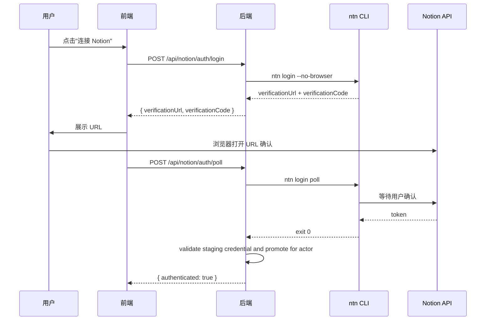
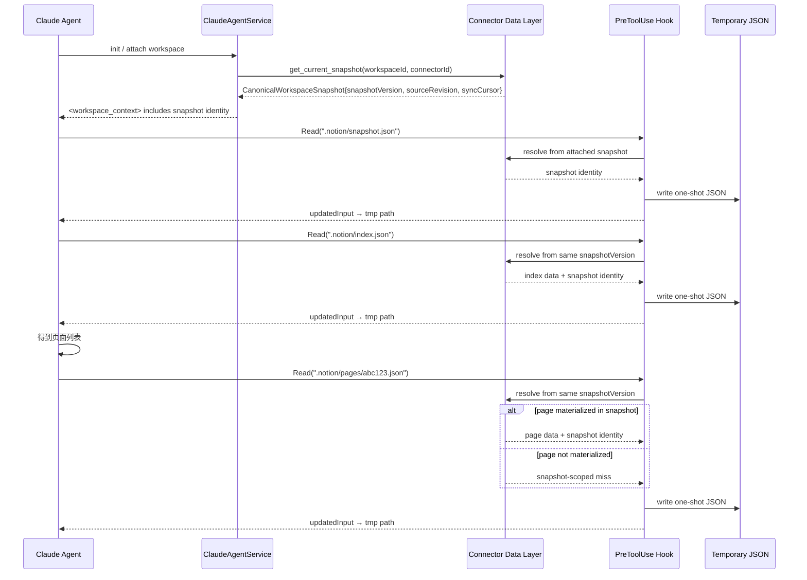

# Notion Device 资源连接器设计方案

Status: Historical baseline; credential/Runtime/Skill sections superseded
Updated: 2026-08-28
Scope: 设计 — Notion 作为外部设备资源接入 ink-and-memory 工作空间

> [Input] `docs/design/claude-agent/edit-point/workspace-adapter.md`,
>      `docs/design/claude-agent/edit-point/workspace-context.md`,
>      `docs/design/claude-agent/edit-point/workspace-switch.md`,
>      `docs/design/edit-session/overview.md`,
>      `backend/libs/claude_agent_kit/server/editor_index.py`,
>      `backend/libs/claude_agent_kit/server/workspace.py`,
>      `backend/libs/claude_agent_kit/types.py`,
>      `backend/claude_agent/context_builder.py`
> [Sync] 2026-06-28: 收敛 Notion 远程数据源的交互快照生命周期 — Agent 初始化读取资源连接器数据层物化的 canonical snapshot，不以 Agent 本地 notion_cache 作为权威状态；补齐 MVP 前端交互设计稿。
> [Sync] 2026-07-07: Chat 入口改为主落点，历史对话与连接器工作台下沉到输入框下方，输入框下方增加快捷功能 secondary action strip，并保留可恢复的 `shell_error` 态；连接器不再以独立主页面承载。
> [Sync] 2026-07-08: 依据最新版 Chat 入口页与连接器详情草图复核主路径：主入口仍是 Chat `WorkspaceTabBar` 的轻量摘要，复杂配置进入 Settings「资源链接」里的 `ConnectorNotionDetailPage`，并再次确认连接器不是独立主导航页。
> [Sync] 2026-07-08: 资源选择持久化收敛为 `connector_resources` / connector `sources`：Settings 已挂载来源、Chat 已链接资源和 Agent snapshot 入口读取同一份后端状态；Notion People 系统 data source 在 discovery 层过滤。
> [Sync] 2026-07-09: Chat `ResourceConnectorTabPanel` 根内容区减少线框化，状态信息块使用虚线边界但无卡片底色 / 阴影，空态和已链接资源行用轻表面和留白承接摘要内容。
> [Sync] 2026-07-09: Settings `ResourceOptionRow` 与 `MountedSourcesSection` 的页数元信息只在 `pageCount > 0` 时显示，避免 `0 pages` 占用资源行右侧状态区域。
> [Sync] 2026-08-30: 当前凭证、Runtime 与内置 Skill 合同改由 [`runtime-credential-and-skill-design.md`](./runtime-credential-and-skill-design.md) 与 [`runtime-credential-and-skill-sequence.md`](./runtime-credential-and-skill-sequence.md) 定义；Agent CLI 通过 `sdk_env` 获得当前 actor/thread 的四个 `NOTION_*` 变量。Runtime 0.1.3 Agent Bash allowlist 缺口及修复验收见 [`runtime-bash-env-remediation.md`](./runtime-bash-env-remediation.md)。
> [Sync] 2026-08-28: canonical current snapshot 与凭证统一进入 actor `notion-runtime`；保存资源和策略 worker 负责远程同步，Chat 初始化只投影到 thread `.notion/`。

> **当前运行结论：** durable Notion 凭证与 index-only canonical current snapshot 位于 server-owned agentdata actor root；启用可信 thread workspace 的 Chat Runtime 每 turn 分别刷新 `{thread}/.notion-home` 与 `{thread}/.notion`，但不触发远程 snapshot 构建。`sdk_env` 把当前 thread 的 `NOTION_HOME`、`NOTION_API_TOKEN`、`NOTION_KEYRING` 与可选 `NOTION_WORKERS_CONFIG_FILE` 注入 Agent Bash；`notion-session` 的 Read hook 与 `notion-cli` 的 `ntn` 命令共用该投影。

---

## 目录

1. [设计背景与动机](#1-设计背景与动机)
2. [资源连接器抽象](#2-资源连接器抽象)
3. [`.notion/` 虚拟索引设计](#3-notion-虚拟索引设计)
4. [认证层设计 — `ntn login` 流程](#4-认证层设计--ntn-login-流程)
5. [数据层设计 — 异步同步 + PreToolUse 拦截](#5-数据层设计--异步同步--pretooluse-拦截)
6. [switch_editor 扩展：Notion 外部文档切换](#6-switch_editor-扩展notion-外部文档切换)
7. [工作空间上下文扩展](#7-工作空间上下文扩展)
8. [时序图](#8-时序图)
9. [实现文件索引](#9-实现文件索引)
10. [不实现清单](#10-不实现清单)
11. [前端交互设计稿（MVP）](#11-前端交互设计稿mvp)

---

## 1. 设计背景与动机

### 1.1 现状

ink-and-memory 的工作空间模型目前仅管理**本地 EditorState**（`.editor/` 虚拟索引）。用户笔记散落在 Notion 中时，Agent 无法感知、读取或引用这些内容。

### 1.2 目标

以 **"Device"（设备）** 的抽象方式将 Notion 接入工作空间：

- Notion 被视为一个**外部文档资源设备**，类似 `.editor/` 是内部文档资源
- 使用 Notion 官方 CLI（`ntn`）作为通信桥梁
- Agent 通过 `.notion/` 轻量索引定位已选资源，并以虚拟 page Read **按需读取**单页内容
- 认证由前端驱动，后端异步同步 ID/紧凑元数据并物化 index-only canonical snapshot

### 1.3 核心原则

- **复用现有模式**：`.notion/` 镜像 `.editor/` 的虚拟索引 + PreToolUse 拦截模式
- **ntn CLI 是共用 driver**：不引入 Notion SDK 依赖；Dream 后端和 Agent `notion-cli` Skill 共用 `ntn`，不暴露另一套 Hosted Notion MCP 工具
- **actor agentdata current snapshot 是索引权威状态**：Notion 是正文 source of truth；保存资源/后台策略只物化轻量 index，Agent 初始化只读取该 actor 最近成功版本
- **已选择资源必须落库**：用户在 Settings 保存的 data_source / page 写入 `connector_resources`，并通过 connector `sources` 暴露给 Settings、Chat 和后续 snapshot 物化
- **只读优先**：先实现浏览能力；写入只设计 proposal/write pipeline 边界，不直接落地远程写回
- **认证与数据分离**：认证层由前端用户配置驱动，数据层负责同步、版本化和快照发布

---

## 2. 资源连接器抽象

### 2.1 四层模型

```
┌─────────────────────────────────────────────────────────┐
│                  Resource Connector                       │
│                   (资源连接器)                             │
├─────────────────────────────────────────────────────────┤
│                                                         │
│  ┌─────────────┐  ┌─────────────┐  ┌──────────────┐    │
│  │  Auth Layer  │  │  Data Layer  │  │ Operation    │    │
│  │  (认证层)    │  │  (数据层)    │  │ Layer (操作) │    │
│  │             │  │             │  │              │    │
│  │ ntn login   │  │ .notion/    │  │ page Read    │    │
│  │ actor 凭证  │  │ 轻量索引    │  │ selected ID  │    │
│  │ agentdata   │  │ 后台同步    │  │ Markdown only│    │
│  └─────────────┘  └─────────────┘  └──────────────┘    │
│                                                         │
│  ┌──────────────────────────────────────────────────┐   │
│  │               Task Layer (任务层)                  │   │
│  │                                                  │   │
│  │  定时 index sync；批量正文与写回不在本期             │   │
│  └──────────────────────────────────────────────────┘   │
│                                                         │
└─────────────────────────────────────────────────────────┘
```

### 2.2 各层职责

| 层 | 职责 | 实现位置 | 本期实现 |
| ------------------- | ------------------------------------------------------------ | --------------------------------------------- | ---------- |
| **Auth Layer** | actor 级 agentdata 凭证、授权 staging、完成后原子提升和 thread 私有投影 | `backend/notion/credentials.py` + `backend/notion/auth.py` | ✅ 是 |
| **Data Layer** | 已选资源同步、actor agentdata current snapshot 和 `.notion/` thread 投影 | `backend/notion/sync.py` + `backend/notion/snapshot_store.py` | ✅ 是 |
| **Operation Layer** | Dream 托管的只读 `ntn api`：后台 data-source query + Runtime 单页 Markdown | `backend/notion/operations.py` + `backend/libs/claude_agent_kit/server/notion_read_hook.py` | ✅ 是 |
| **Task Layer** | Settings policy 到期判断与定时只读同步 | `backend/notion/sync_policy.py` + `backend/notion/sync_scheduler.py` | ✅ 是 |
| **Write/Conflict Layer** | 写回、冲突检测 | — | ❌ 本期非目标 |

### 2.3 与 `.editor/` 的对称关系

```
.editor/                     .notion/
  ├─ cells.json    ←→         ├─ index.json      (页面列表)
  ├─ session.json  ←→         ├─ databases.json  (数据库列表)
  ├─ full_state.json ←→       └─ pages/
  └─ ...                           └─ <page_id>.json  (虚拟读取路径，无静态正文)

editor_state (内存快照)        index snapshot (连接器数据层物化)
       │                              │
       ▼                              ▼
PreToolUse 拦截 Read           PreToolUse 拦截 Read
       │                              │
       ▼                              ▼
写临时文件 → Agent 读取        校验 snapshot index → 按需 Markdown → 临时文件
```

---

## 3. `.notion/` 虚拟索引设计

### 3.1 目录结构

```
{AGENT_CWD}/
  └── {session_id}/
      ├── .editor/                     ← 现有：EditorState 虚拟索引
      └── .notion/                     ← ★ 新增：Notion 虚拟索引
            ├── README.md              ← 说明文件（告知 Agent 这是 Notion 索引）
            ├── index.json             ← 已投影的页面 ID/紧凑元数据列表
            ├── databases.json         ← 已投影的 database 列表
            └── pages/
                 └── <page_id>.json    ← 虚拟路径；Read hook 按需返回单页 Markdown
```

### 3.2 NOTION_RESOURCES 映射表

仿 `EDITOR_RESOURCES`，定义：

```python
NOTION_RESOURCES: dict[str, str] = {
    "index":      "__index__",       # → 近期页面列表
    "databases":  "__databases__",   # → 数据库列表
    # pages/<page_id> 由路径参数动态解析，不在此常量表中
}
```

### 3.3 `index.json` 内容示例

```json
{
  "pages": [
    {
      "page_id": "abc123...",
      "title": "ink-and-memory 代办清单",
      "last_edited": "2026-06-20T10:30:00Z",
      "url": "https://www.notion.so/abc123..."
    },
    {
      "page_id": "def456...",
      "title": "Obsidian × Notion 双向同步方案",
      "last_edited": "2026-03-26T08:00:00Z",
      "url": "https://www.notion.so/def456..."
    }
  ],
  "synced_at": "2026-06-21T14:00:00Z"
}
```

### 3.4 `pages/<page_id>.json` 按需响应示例

```json
{
  "page_id": "abc123...",
  "title": "ink-and-memory 代办清单",
  "url": "https://www.notion.so/abc123...",
  "last_edited": "2026-06-20T10:30:00Z",
  "markdown": "# 代办清单\n\n1. 用户认证模块...",
  "snapshot_version": "snap-20260828-001",
  "fetched_at": "2026-06-21T14:00:01Z"
}
```

该 JSON 只存在于 Runtime 的 `0600` one-shot 临时文件中；actor snapshot 与 thread `.notion/` 均不保存 `markdown`、blocks 或附件正文。

---

## 4. 认证层设计 — `ntn login` 流程

### 4.1 配置入口

前端在 Settings 内 `ConnectorNotionDetailPage` 中提供 Notion 配置入口。该页直接复用现有 connector API helpers 完成认证 / 资源选择流程，不再嵌入集合型 `ResourceConnectorPage`：

- 同一平台只保留一个 Notion 认证账号；详情页不展示新建连接器、刷新列表或连接器列表。
- `ResourceScopeSection` 使用统一 data_source / page 列表，不再拆成 Databases 与 Standalone Pages 两块。
- 资源范围操作行固定为 `搜索资源`、`保存资源`、`刷新同步`；默认每页 10 条，提供上一页 / 下一页。
- 点击「保存资源」后，后端把选定 data_source / page 写入 `connector_resources`，connector list/detail 响应必须返回 persisted `sources`；`MountedSourcesSection` 优先用 persisted `sources` 回显，如果后端短暂返回空 sources，前端才用当前选择构造 optimistic sources 完成即时反馈。
- Chat `ResourceConnectorTabPanel` 的「已链接资源」与 Settings `MountedSourcesSection` 同源，均读取 connector `sources`，刷新页面后不得丢失已挂载来源。
- Notion discovery 层过滤 Workspace People 等系统用户 data source；这类资源不进入 `ResourceScopeSection`，也不会进入 Chat 摘要或 Agent snapshot。
- 资源行和已挂载来源的 page count 是辅助信息，只在 `pageCount > 0` 时展示；`0 pages` 不渲染，避免空统计误导为异常状态。
- 底部“授权 / 同步状态”卡片移除，授权、同步、已链接资源数量、最近同步和限制提示统一放在顶部 `ConnectorHeader` 信息栏；策略设计只保留占位，不实现策略配置。

| 字段 | 说明 | 存储位置 |
| ------------- | ------------------------------------------------- | ---------------------------- |
| actor credential root | 后端按 actor 哈希解析的 durable credential home；客户端不可指定 | server-owned `AGENT_DATA_DIR/notion/actors/<actor_hash>` |
| auth staging root | 单次授权会话的隔离目录，成功后才原子提升 | server-owned agentdata staging |
| Runtime `NOTION_HOME` | 当前 thread 的运行时投影；传给 Dream 管理的子进程与 Agent Bash 中的 `ntn` | `{AGENT_CWD}/{thread_id}/.notion-home` |
| 认证状态 | actor credential provider 是否返回有效凭证 | 后端受控 status/poll 边界 |

### 4.2 认证流程

```
用户在 ConnectorNotionDetailPage 点击"连接 Notion"
  │
  ├─ 前端 → POST /api/notion/auth/login
  │
  ├─ 后端执行：ntn login --no-browser
  │     stdout:
  │       Open this URL in your browser to log in:
  │         https://www.notion.so/workers/cli-login?verificationCode=VAF-HWY
  │       Confirm that this verification code matches:
  │         VAF-HWY
  │     ← 提取 verificationUrl + verificationCode
  │
  ├─ 后端返回 { verificationUrl, verificationCode } 给前端
  │
  ├─ 前端展示 URL，用户点击后在浏览器中确认
  │
  ├─ 前端 → POST /api/notion/auth/poll
  │
  ├─ 后端执行：ntn login poll
  │     ← 阻塞等待用户在浏览器确认，完成后 exit 0
  │
  ├─ 后端在本次 actor staging 中验证认证成功
  │     ← 确认凭证只存在于 server-owned staging
  │
  └─ 后端原子提升到 actor credential root 并更新 connector 状态
```

### 4.3 NOTION_HOME 管理

`NOTION_HOME` 不是用户配置项，也没有进程用户 home fallback。后端使用认证 actor
解析 agentdata 权威目录；Agent 启动或继续 turn 时，把最新凭证快照复制到规范化后的
thread workspace 目录并设置 `0700/0600` 权限。`sdk_env` 清空 ambient Notion 值后，
把该投影解析出的 `NOTION_HOME`、`NOTION_API_TOKEN`、`NOTION_KEYRING` 与可选
`NOTION_WORKERS_CONFIG_FILE` 直接注入 Agent Runtime。

### 4.4 Sandbox 适配

`ntn` CLI 需要访问 Notion API；Runtime 仅为当前 actor/thread 开放 Notion 官方域名，并把
同一 thread projection 提供给后台 Read hook 与 Agent Bash。thread 投影必须位于真实 thread workspace 内、拒绝
符号链接；Skill 初始化失败只禁用 Notion 局部能力，不改变 turn、
resume、cancel、EventBus 或 SSE 语义。

---

## 5. 数据层设计 — canonical snapshot + PreToolUse 拦截

### 5.1 目标符合性修正

Notion 是远程数据源，任意 Agent 在初始化访问同一个连接器时必须看到一致的已选资源索引。
因此 `.notion/` 的索引权威不是 Agent 本地 cache，而是资源连接器数据层物化出的 index-only `CanonicalWorkspaceSnapshot`；正文权威仍在 Notion，并仅在用户请求对应 page Read 时获取。

```
Notion Remote Source
  └─ Connector Sync (ntn api / Notion API)
       └─ Resource Connector Data Layer
            └─ CanonicalWorkspaceSnapshot
                 ├─ metadata: workspaceId, connectorId, snapshotVersion, sourceRevision, syncCursor, fetchedAt
                 ├─ connector
                 ├─ index
                 ├─ databases
                 ├─ database_pages: IDs + compact metadata
                 └─ pages: {} (required for new snapshots)

Agent Read(".notion/pages/<selected-id>.json")
  └─ PreToolUse validates attached index + credential projection
       └─ Notion page Markdown endpoint → private temporary JSON file
```

### 5.2 快照身份

每个 canonical snapshot 必须包含以下身份字段：

| 字段 | 说明 |
|---|---|
| `workspace_id` | 当前 Ink & Memory 工作空间 |
| `resource_connector_id` | Notion 资源连接器 ID |
| `snapshot_version` | 系统内部快照版本 |
| `source_revision` | Notion 远程版本摘要，可由 latest edited 时间、水位或同步批次生成 |
| `sync_cursor` | 连接器同步游标 |
| `fetched_at` | 连接器数据层拉取/物化时间 |

同一 `snapshot_version` 下的 `.notion/connector.json`、`.notion/index.json`、`.notion/databases/<id>.json` 必须来自同一个 snapshot object。虚拟 `.notion/pages/<id>.json` 响应必须记录该 snapshot identity，但正文来自 Read 时的当前 Notion 页面，不写回 snapshot。

### 5.3 数据结构合同

方案代码位于 `backend/libs/claude_agent_kit/server/notion_snapshot.py`；`pages` 仅为旧合同兼容字段，新 snapshot 发布时必须为空：

```python
@dataclass(frozen=True)
class CanonicalWorkspaceSnapshot:
    metadata: SnapshotMetadata
    connector: dict[str, Any]
    index: list[dict[str, Any]]
    databases: list[dict[str, Any]]
    database_pages: dict[str, list[dict[str, Any]]]
    pages: dict[str, dict[str, Any]]

@dataclass(frozen=True)
class SnapshotWriteProposal:
    proposal_id: str
    workspace_id: str
    resource_connector_id: str
    base_snapshot_version: str
    base_source_revision: str
    base_sync_cursor: str
    operations: tuple[dict[str, Any], ...]
```

### 5.4 PreToolUse 拦截边界

当前 `.notion/` Read 拦截遵守：

1. `index.json`、database 文件等静态映射只从当前已 attach 的 index snapshot 读取。
2. 只对当前 workspace 精确 `.notion/pages/<page_id>.json` 启动 lazy hook；拒绝越界、symlink 和非法 ID。
3. 在任何远程调用前验证 page ID 存在于当前 thread index；未选 ID 返回 `NOTION_RESOURCE_NOT_SELECTED`。
4. 只使用 server-projected `.notion-home`，调用单页 Markdown endpoint，并将安全结果写入 `.claude-tmp` 的 `0600` one-shot 文件。
5. 不把正文、Agent 摘要或临时响应写回 snapshot；认证/权限/API 错误返回可操作的安全代码。

示意：

```python
if tool_name == "Read" and is_exact_notion_page_path(file_path):
    page_id = validate_selected_page_id(file_path, attached_index)
    markdown = await notion.get_page_markdown(page_id, projected_credential_home)
    return redirect_to_private_temporary_json(markdown)
```

### 5.5 Workspace 初始化集成

Workspace init 只创建 thread workspace，不负责同步远程数据。
Agent 初始化或工作空间 attach 时，由 service 层只向 actor agentdata snapshot provider 请求 current snapshot：

```
workspace.init_workspace(session_id)
  ├─ _init_editor_index(workspace)
  └─ _init_notion_index_placeholders(workspace)  # only README + placeholders

ClaudeAgentService.attach_workspace_context()
  └─ snapshot_store.project_thread(actor_id, connector_id, thread_workspace)
       └─ {thread}/.notion receives one immutable current snapshot
```

此步骤不得运行 CLI、调用 Notion 或以 Chat 为 snapshot 更新触发器；同一轮 run 持有固定 snapshot identity。

### 5.6 写入路径

本期不直接实现 Notion 写回。设计边界如下：

- Agent 只能生成 `SnapshotWriteProposal`。
- Proposal 必须携带 base `snapshotVersion/sourceRevision/syncCursor`。
- 连接器写入管线在远程提交前做乐观并发校验。
- Notion 确认远程写入后，连接器数据层同步并生成新 snapshot；旧 snapshot 进入 `snapshot_superseded`。
- 前端刷新沿用 `session_updated source="agent"` 事件驱动机制，不使用固定 sleep。

---

## 6. Workspace switch 边界：不复用 `switch_editor` 承载 Notion 状态

`switch_editor` 当前语义是切换 `.editor/` 文档会话，并已在 `workspace-switch.md` 中实现。
Notion 资源连接器不是另一个 EditorState，会话切换不应把 Notion 远程状态塞进 `editor_state` 或 AgentRunState 本地缓存。

MVP 交互边界：

| 场景 | 处理方式 |
|---|---|
| 用户在前端切换当前 workspace 的 Notion connector | 前端更新选中的 `resourceConnectorId`，下一轮 Agent init 从连接器数据层 attach 当前 canonical snapshot |
| Agent 需要读取当前 Notion 内容 | 通过 `.notion/` 虚拟索引读取已 attach 的 snapshot |
| Agent 需要切换到另一个 Editor session | 继续使用现有 `switch_editor(editor_session_id)` |
| Agent 需要切换到另一个 Notion connector | 本期不在同一 turn 内自动切换；提示用户在前端切换或刷新连接器上下文 |

后续如果需要同一 turn 内切换外部资源，应新增独立的 `switch_resource(resource_connector_id)` 或 workspace-level 工具，而不是扩展 `switch_editor` 的 schema。该工具仍必须从连接器数据层读取 canonical snapshot。

---

## 7. 工作空间上下文扩展

### 7.1 `<workspace_context>` 块变更

在 `workspace_context.py` 的 `WORKSPACE_CONTEXT_TEMPLATE` 中，在 `.editor/` 描述之后新增：

```
Notion device index (.notion/):
  This directory holds the selected-resource index projected from actor
  agentdata. Agent-local summaries are derived views, not source of truth.

  .notion/index.json       — list of recent Notion pages (title, page_id, url)
  .notion/databases.json   — list of accessible Notion databases
  .notion/pages/<id>.json  — virtual selected-page Read; fetches current Markdown on demand
  .notion/snapshot.json    — snapshot identity {version, revision, cursor}

  Read index/database files to locate an ID. Reading the virtual page path
  invokes a Runtime hook that validates the ID against this snapshot before
  calling Notion. The page body is never stored in the snapshot.

Notion live operations:
  Use the built-in notion-session Read workflow or the notion-cli Skill. The
  latter invokes ntn with the current thread's injected NOTION_* environment;
  a separate Hosted Notion MCP namespace is not exposed.
```

### 7.2 系统提示词 Workflow 变更

在系统提示中新增 Notion 读取约束，而不是扩展 `switch_editor`：

```
Notion Connector Workflow:
  When <workspace_context> lists a Notion connector, read .notion/snapshot.json
  first to identify the attached snapshot version. Then read .notion/index.json
  or .notion/databases/<id>.json to locate the selected page. Read
  .notion/pages/<id>.json only when the current page body is needed.

  Do not treat derived summaries as canonical state. Do not call switch_editor
  for Notion connector switching; switch_editor only changes .editor/ sessions.
  If the user needs a different connector, ask them to switch the workspace
  resource in the UI or refresh the connector snapshot.
```

---

## 8. 时序图

### 8.1 认证流程



### 8.2 Agent 读取 Notion 内容流程



---

## 9. 实现文件索引

| 文件 | 变更内容 | 状态 |
| ------------------------------------------------------------ | ------------------------------------------------------------ | -------- |
| `backend/libs/claude_agent_kit/server/notion_snapshot.py` | canonical snapshot 合同、状态枚举、`.notion/` 路径解析、write proposal stale 判断 | ✅ 已实现 |
| `backend/tests/test_notion_snapshot_contract.py` | 验证快照路径解析、数据提取、缺页语义、proposal 版本判断 | ✅ 已实现 |
| `backend/notion/credentials.py` | actor agentdata 权威凭证、staging 和 thread 投影 | ✅ 已实现 |
| `backend/notion/auth.py` | 隔离 `ntn login` 流程编排和认证状态检测 | ✅ 已实现 |
| `backend/notion/sync.py` | 分页同步选定资源 ID/紧凑元数据，禁止页面正文调用 | ✅ 已实现 |
| `backend/notion/snapshot_store.py` | index-only actor current 原子发布、正文拒绝与 thread `.notion/` 投影 | ✅ 已实现 |
| `backend/notion/sync_policy.py` | default/desired/effective/revision/status 策略合同 | ✅ 已实现 |
| `backend/notion/sync_scheduler.py` | 到期 connector 后台同步与单失败隔离 | ✅ 已实现 |
| `backend/notion/operations.py` | `ntn api` 索引查询、单页 Markdown 与安全错误归一化 | ✅ 已实现 |
| `backend/libs/claude_agent_kit/server/notion_read_hook.py` | 校验 selected ID/路径/凭证并按需重定向单页 Markdown | ✅ 已实现 |
| `backend/libs/claude_agent_kit/server/workspace.py` | 内置 Read-only Skill、index workspace 和 `.notion` denyWrite 初始化 | ✅ 已实现 |
| `backend/libs/claude_agent_kit/server/agent_runner.py` | 在权限判断前运行 exact-path Notion Read hook；不注册 Notion MCP | ✅ 已实现 |
| `backend/claude_agent/service.py` | 按认证 actor 解析 connector 与 Runtime snapshot | ✅ 已实现 |

### 9.1 相关现有文件（需阅读，不需修改）

| 文件 | 作用 |
| ---------------------- | ------------------------------- |
| `editor_index.py` | `.notion/` snapshot path resolver 的参考模板 |
| `workspace.py` | `.notion/` 目录初始化入口 |
| `agent_runner.py` | PreToolUse / PostToolUse 扩展点 |
| `workspace_context.py` | 工作空间上下文模板 |
| `context_builder.py` | 系统提示词模板 |
| `editor_tool.py` | `switch_editor` handler 所在；Notion connector 不复用该工具 |

---

## 10. 不实现清单

以下功能**明确不在本期范围内**，防止过度设计：

| 不实现项 | 原因 |
| --------------------------------------- | -------------------------------------------- |
| `ntn page create/update` 写操作 | 写操作的冲突策略、权限模型未定义 |
| Notion → EditorState 自动导入 | 导入映射规则未确定 |
| 双向实时同步 | 需要单独的冲突处理设计 |
| Notion OAuth Web 流程 | 当前用 `ntn login --no-browser` CLI 认证足够 |
| 多副本分布式同步租约 / 队列 | 当前复用 Dream 进程 worker；出现重复执行证据后再引入协调能力 |
| 增量变更检测（`last_edited_time` 对比） | 先做全量 index 刷新 |
| 多 Notion workspace 切换 | 先支持单 workspace |

---

## 11. 前端交互设计稿（MVP）

### 11.1 页面结构

```
Chat workspace
  ├─ Centered ChatInputDock
  ├─ WorkspaceTabBar
  │    ├─ HistoryTab
  │    │    └─ HistoryTabPanel
  │    │         ├─ EmptyChatState
  │    │         ├─ HistoryThreadList / ChatMessageList
  │    │         └─ HistorySkeletonList
  │    └─ ResourceConnectorTab
  │         └─ ResourceConnectorTabPanel
  │              ├─ ConnectorToolbar
  │              ├─ ConnectorEmptyState
  │              ├─ ConnectorList / ConnectorListSkeleton
  │              └─ ConnectorStatusPanel / 选择连接器 → Settings ConnectorSettingsSection
  ├─ ConnectorNotionDetailPage
  │    ├─ TopNavigation
  │    ├─ ConnectorHeader
  │    ├─ StrategyDesignSection: automatic sync toggle + interval + desired/effective status
  │    ├─ ResourceScopeSection: search + save-and-sync + immediate index refresh + paged unified resources; pageCount only when > 0
  │    └─ MountedSourcesSection: selected sources immediately after save; hide zero page counts
  ├─ Context banner: "Using Notion snapshot <version>"
  └─ Proposal card: diff preview + base snapshot identity
```

> 注：`HistoryTab` / `ResourceConnectorTab` 是 Chat 工作区的视图状态，不是连接器生命周期状态。连接器生命周期仍由下方的 connector state model 管理。
>
> 命名统一使用 `WorkspaceTabBar` / `HistoryTab` / `ResourceConnectorTab` / `ConnectorNotionDetailPage`，不再使用“landing tabs”之类别名。

### 11.2 状态模型

| 状态 | UI 展示 | 用户动作 |
|---|---|---|
| `empty_chat` | `HistoryTabPanel` 显示空聊天态，输入框保持中心主视觉 | `Start chat` |
| `active_chat` | 历史内容切换为消息流，输入 Dock 贴近底部 | `Continue chat` |
| `connector_empty` | `ResourceConnectorTabPanel` 显示轻表面空态、三枚图标、标题与 CTA | `选择连接器` |
| `connector_connected` | 显示 `ConnectorToolbar` + `ConnectorList` | `Open connector` |
| `connector_error` | 连接器列表或状态拉取失败，显示错误卡 | `Retry` |
| `shell_error` | Chat shell 或 `WorkspaceTabBar` 渲染失败，仍保留可恢复入口 | `Reload shell` / `Retry` |

### 11.3 Agent 写入确认卡

写入确认卡只在后续启用 Notion 写回时出现，本期保留设计边界：

- 显示 proposal 的 `base_snapshot_version`、`base_source_revision`、`base_sync_cursor`。
- 显示将修改的页面标题、Notion URL 和 block 摘要。
- 主按钮为 `Approve write`，次按钮为 `Reject`，冲突时主按钮变为 `Refresh first`。
- 批准后等待 `session_updated source="agent"` 事件再刷新，不在确认响应后固定 sleep。

### 11.4 不过度设计检查

| 可能扩展 | 本期处理 |
|---|---|
| 多平台连接器市场 | 不做，只保留 Notion row 的结构可扩展性 |
| Notion block 可视化编辑器 | 不做，只显示摘要和 diff |
| 实时同步动画 | 不做，只显示状态和最近同步时间 |
| 自动冲突合并 | 不做，冲突时让用户刷新并重新生成 proposal |
| Agent 同 turn 切换多个 Notion connector | 不做，由前端选择当前 connector 后下一轮 attach |
