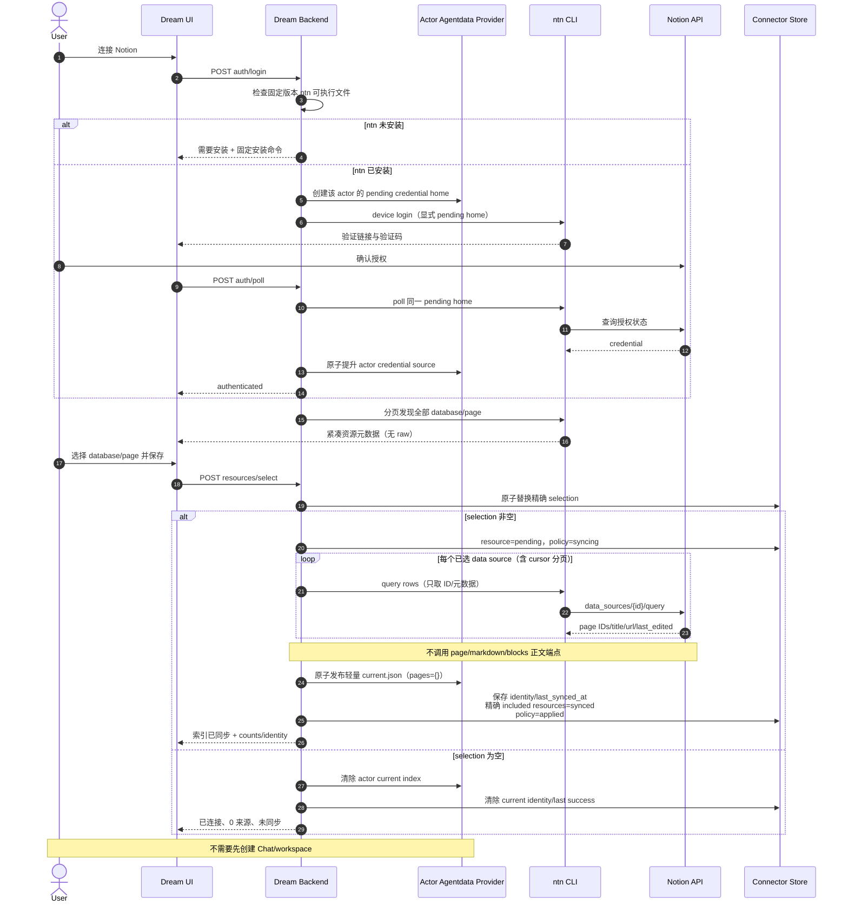
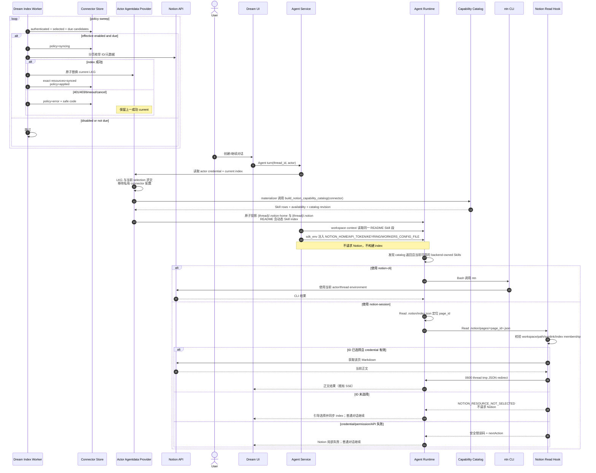
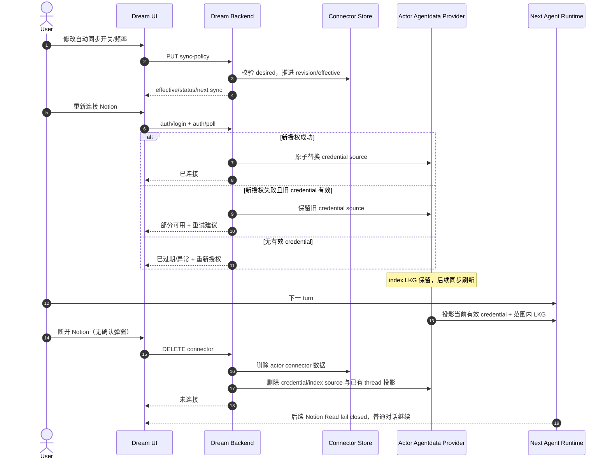
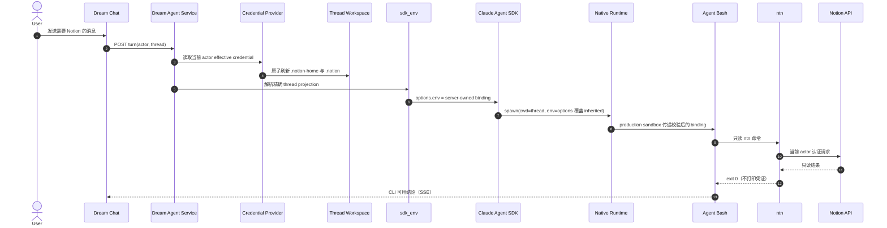
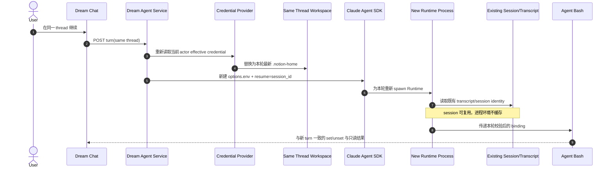
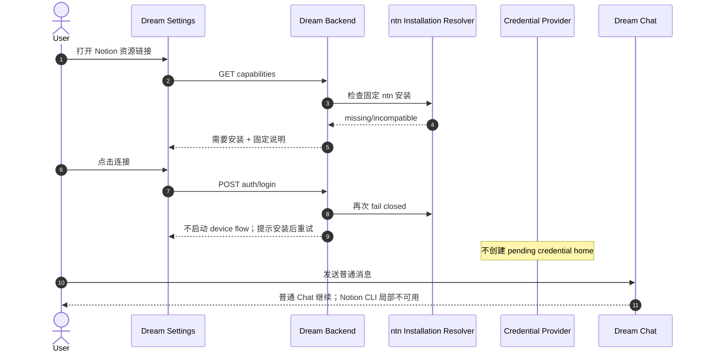
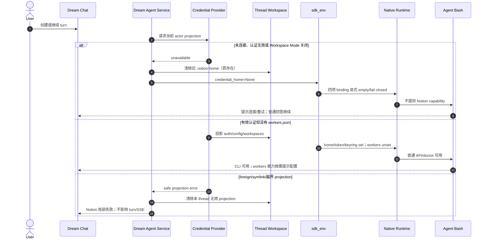
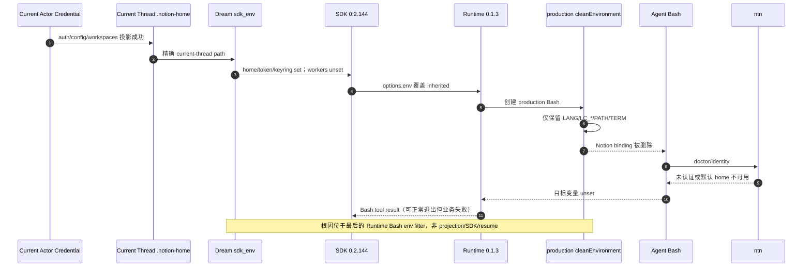
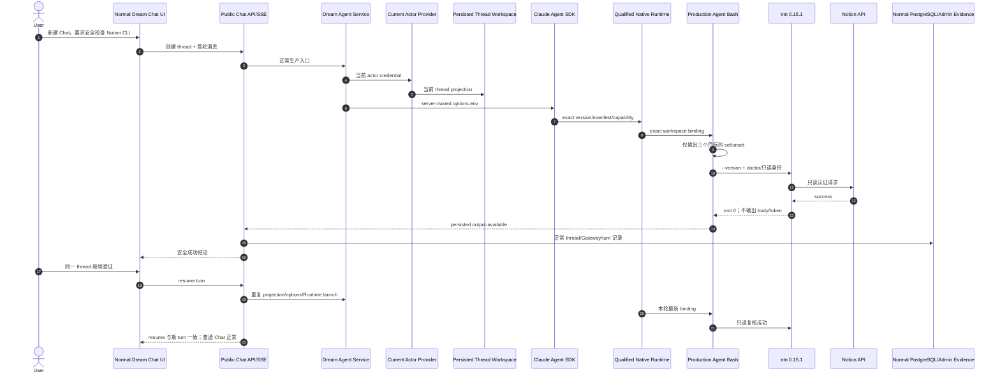

<!-- [Input] Actor credential source, lightweight index scheduler, thread projection, sdk_env CLI binding, and lazy Runtime Read hook design. -->
<!-- [Output] Business sequence diagrams for installation, authorization, index publication, Agent CLI/Read, failures, reauthorization, and disconnect. -->
<!-- [Pos] Current Notion credential/index/Runtime business-sequence source of truth in docs/design/notion-session. -->
<!-- [Sync] 2026-08-28: separate lightweight ID synchronization from on-demand page Markdown reads. -->
<!-- [Sync] 2026-08-29: add full discovery pagination, empty-scope revocation, current-scope projection filtering, and LKG reauthorization semantics. -->
<!-- [Sync] 2026-08-30: add the ntn prerequisite and direct four-variable Agent Runtime injection. -->
<!-- [Sync] 2026-08-30: add dynamic capability-catalog rendering into workspace README and reuse that generated Skill section in per-turn context. -->
<!-- [Sync] 2026-08-30: add explicit new-turn, resume, missing-install/config, Runtime-filter failure, and repaired real-Chat acceptance sequences. -->

# Notion 凭证、轻量索引与 Agent CLI/Read 业务时序

## 1. 连接、选择与首次轻索引

## 2. 定时更新、thread 投影与页面按需读取

## 3. 重新授权、策略修改与断开

## 4. 正常新 turn 注入流程

## 5. resume 环境刷新流程

## 6. CLI 未安装流程

## 7. 凭证或配置缺失流程

## 8. Runtime/Bash 环境被过滤时的失败链路

## 9. 修复后的真实 Chat → Agent Bash → ntn 验收链路

