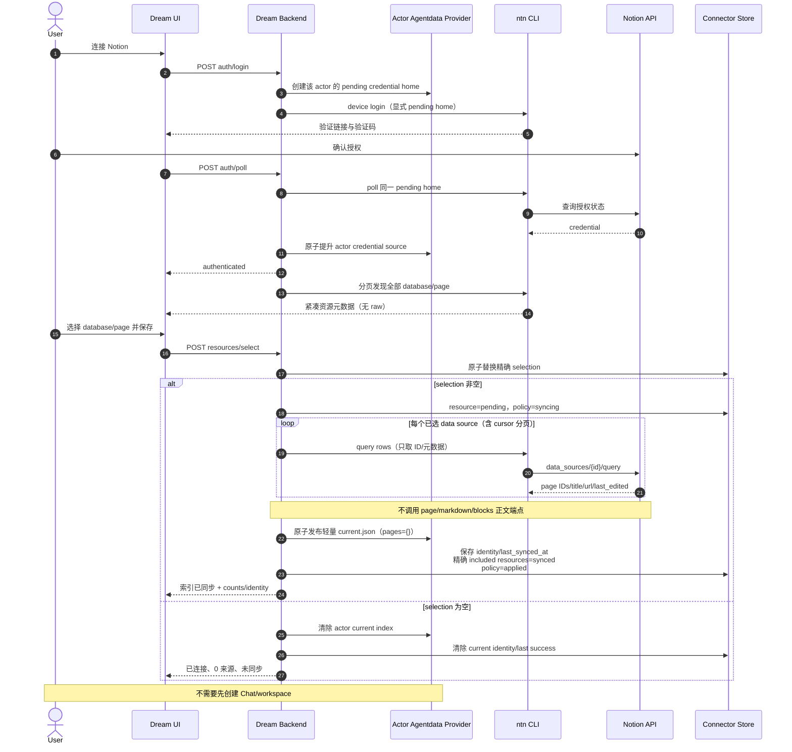
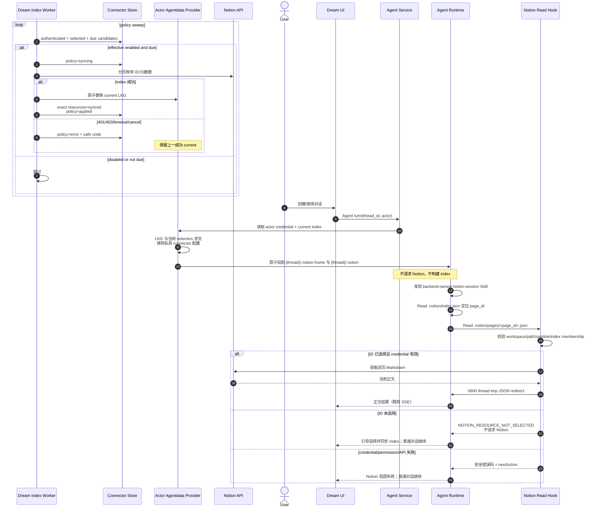
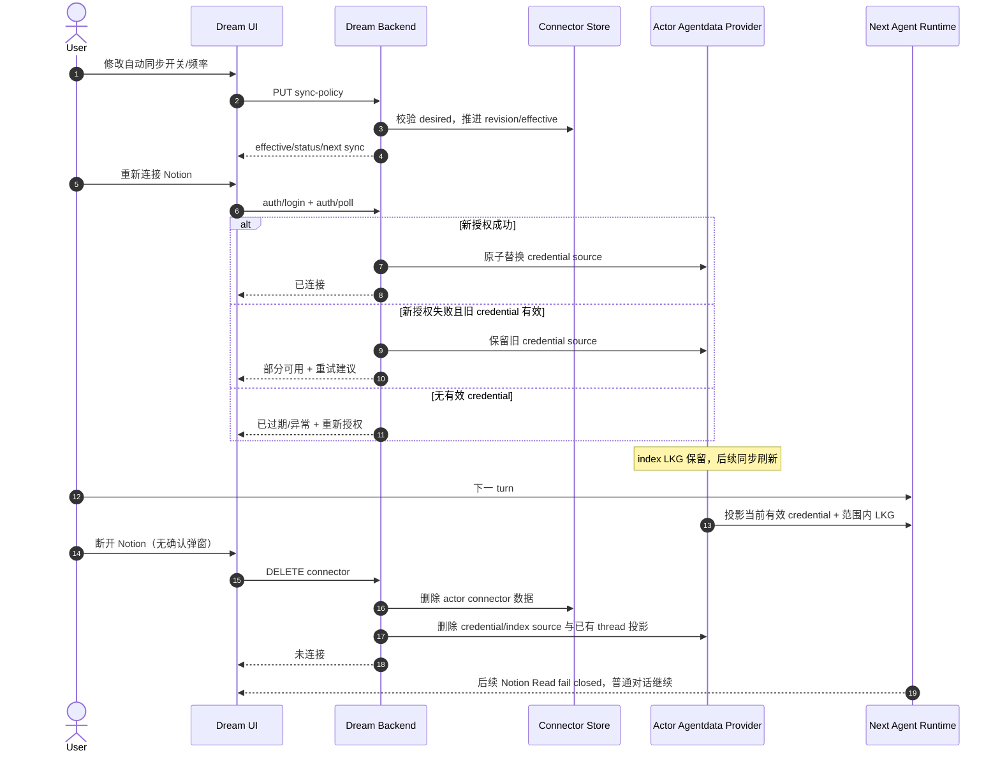

<!-- [Input] Actor credential source, lightweight index scheduler, thread projection, and lazy Runtime Read hook design. -->
<!-- [Output] Business sequence diagrams for authorization, index publication, thread Read, failures, reauthorization, and disconnect. -->
<!-- [Pos] Current Notion credential/index/Runtime business-sequence source of truth in docs/design/notion-session. -->
<!-- [Sync] 2026-08-28: separate lightweight ID synchronization from on-demand page Markdown reads. -->
<!-- [Sync] 2026-08-29: add full discovery pagination, empty-scope revocation, current-scope projection filtering, and LKG reauthorization semantics. -->

# Notion 凭证、轻量索引与按需 Read 业务时序

## 1. 连接、选择与首次轻索引

## 2. 定时更新、thread 投影与页面按需读取

## 3. 重新授权、策略修改与断开

