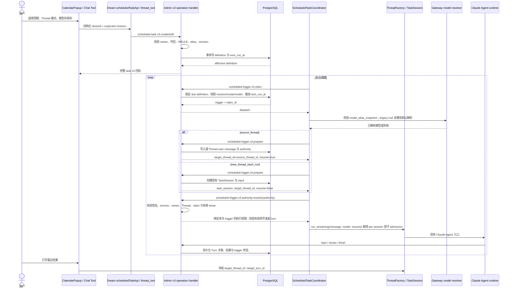
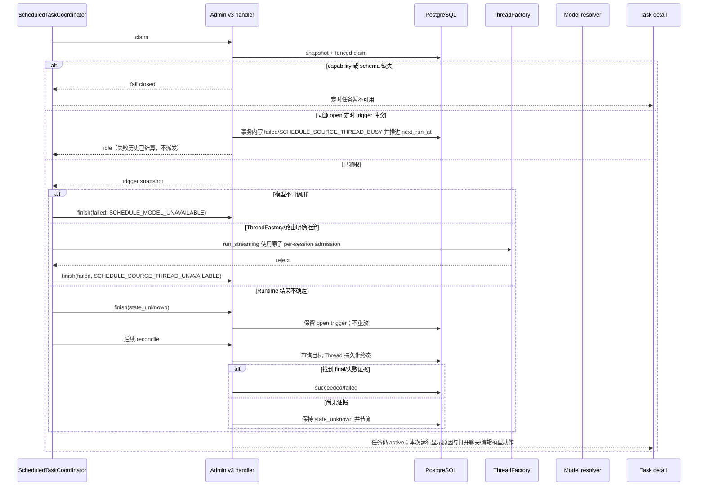
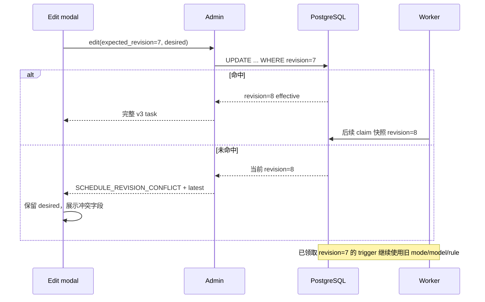
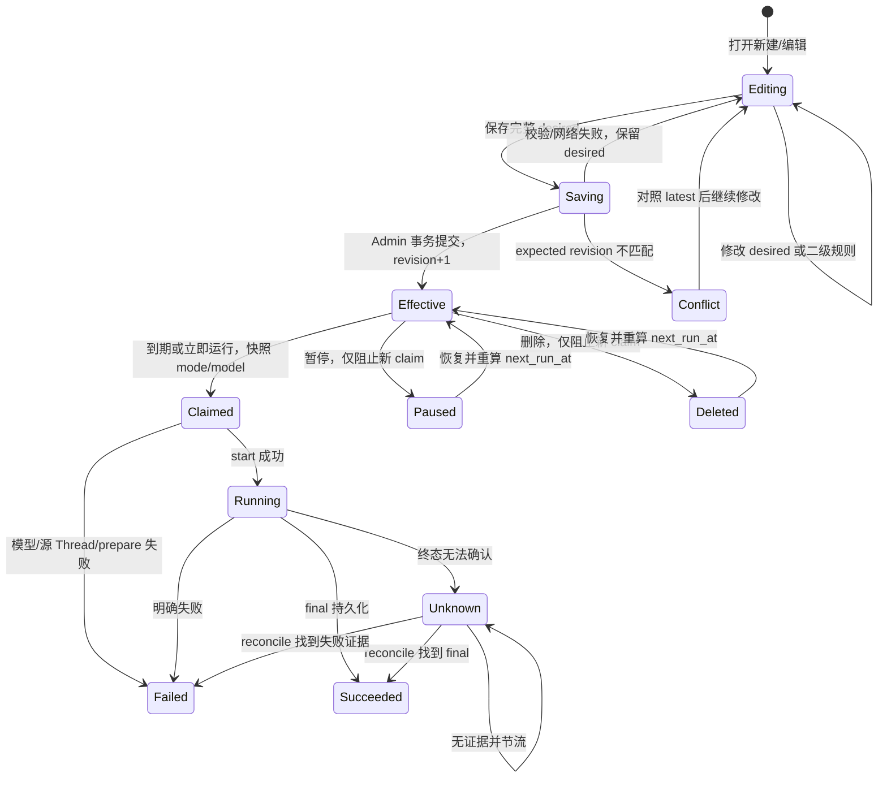

<!-- [Input] Codex repeat PRD, Admin v2 schedule contracts, Dream coordinator, Gateway model catalog, and restored Codex automation code. -->
<!-- [Output] v3 schedule/thread/model contract, normal and recovery sequences, state transitions, data impact, and acceptance design. -->
<!-- [Pos] Current formal implementation and interaction design for Codex-style recurring scheduled tasks. -->
<!-- [Sync] 2026-10-07: define restricted RRULE, source/new Thread execution, model snapshots, and v3 capability. -->
<!-- [Sync] 2026-10-07: post-0077 acceptance requires the exact v3 authority operation through existing token/owner/claim/lease validation; source tests and normal runtime receipts remain separate. -->
<!-- [Sync] 2026-10-07: link the implementation receipt after the reviewed design was delivered without changing its contract. -->

# 定时任务：Codex 风格周期与高级运行选项设计

## 1. 背景与问题

现有 v2 纵向切片已经由 Admin PostgreSQL 保存 definition、revision、`next_run_at`、trigger、lease 与结果，Dream `ScheduledTaskCoordinator` 通过 Admin operation contract 领取并调用既有 Claude Agent turn。前端可以查看、编辑和运行 `once`、`daily`、`interval`。

本轮需要增加 Codex.app 风格五项周期、源 Thread 复用/每次新建 Thread 选择，以及模型选择。实现必须复用现有 Task、TaskSession、Thread、Turn、消息、EventBus、SSE 和权限检查，不建立平行调度器。

## 2. 目标与边界

### 2.1 目标

- Admin v3 capability 持久化受限 RRULE、`run_thread_mode` 与 `model_alias`。
- Dream 通过 v3 operation 执行，按 trigger 快照选择源 Thread 或 TaskSession 新 Thread。
- 模型 alias 通过现有 Gateway/Admin 模型解析器校验并传给 Claude Agent 生产入口。
- Calendar 编辑器实现五项周期、二级高级日程、新聊天 switch 和模型下拉。
- 兼容 v1/v2 definition；存量行为保持每次新建 Thread。

### 2.2 边界

- 不接收用户原始 RRULE；API 接收规范化 RRULE 字符串时仍由 Admin 严格 parser 校验并重新序列化。
- 不新增 Dream schema、runtime DDL、SQLite fallback、队列或常驻内存 timer。
- 不修改普通 Chat admission、resume、cancel、事件和工具审批状态机。
- 不实现月份、节假日、结束次数、项目、推理强度或归档设置。

## 3. 概念与规则

### 3.1 Codex 恢复代码证据

| 行为 | 代码证据 | 采用方式 |
|---|---|---|
| 五项模式 | `src/shared/automations/contracts.ts` 的 `AutomationScheduleMode` | UI 固定为 hourly/daily/weekdays/weekly/custom。 |
| 受限 RRULE | `src/shared/automations/automation-schedule.ts` 的 parse、serialize、`automationRruleFromSchedule` | 在 Admin 实现等价闭集 parser/next-run，不复制 Codex UI 状态机。 |
| 每小时整点 | 同文件把 hourly 序列化为 `FREQ=HOURLY;...;BYMINUTE=0` | 每小时预设固定 `BYMINUTE=0`。 |
| 工作日/每周 | 同文件通过 `BYDAY` 区分 daily、weekdays、weekly、custom | 使用 IANA 时区计算当地日历触发。 |
| 新会话与继续会话 | `src/main/automations/automation-service.ts`：cron `thread/start`，heartbeat 对 `targetThreadId` `turn/start` | 本项目用 `run_thread_mode` 在同一 ScheduledTask definition 中选择既有两条生产入口。 |
| 模型 | cron definition 保存 model；heartbeat 恢复 Thread 时 model 为 null | 本项目按用户明确需求让两种 Thread 模式都保存精确 alias，并在执行时重新校验。 |

最后一项是产品差异，已在 PRD 中明确，不把 Codex heartbeat 的 `model=null` 当作本项目既定语义。

### 3.2 配置与快照

- definition 是 effective 配置，revision 单调递增。
- trigger 创建时复制 `definition_revision`、`run_thread_mode_snapshot`、`model_alias_snapshot`、标题、源 Thread、时区和 Editor target。
- 已领取 trigger 不读取后续 definition，因此编辑不会改变运行中或恢复中的执行。
- `source_thread` trigger 的 `target_thread_id` 等于 `source_thread_id`；`new_thread_each_run` 在 prepare 后写入新 Thread ID。
- v3 新建/编辑后的 `model_alias_snapshot` 必须是非空、长度受限的 alias。存量 v1/v2 definition 允许 null 并沿用原先执行时默认模型；首次 v3 编辑必须选择 alias，之后进入完整快照语义。

### 3.3 调度闭集

v3 公开规则在 v2 `once`、`daily`、`interval` 上增加结构化 `hourly` 与 `weekly`：

```ts
type ScheduledRuleV3 =
  | OnceRule
  | DailyRule
  | IntervalRule
  | { kind: "hourly"; interval_hours: number; minute: number; time_zone: string }
  | { kind: "weekly"; weekdays: Weekday[]; local_time: string; time_zone: string };
```

Admin 把 `hourly` / `weekly` 规范化为内部 canonical RRULE；公开 API、前端和 Dream Tool 不接收或生成 raw RRULE。内部 RRULE 只允许：

- `FREQ`: `MINUTELY | HOURLY | DAILY | WEEKLY`
- `INTERVAL`: 正安全整数
- `BYDAY`: `MO..SU` 的去重、规范顺序集合
- `BYHOUR`: `0..23`
- `BYMINUTE`: `0..59`

组合规则：

- MINUTELY 只允许 INTERVAL；HOURLY 允许 INTERVAL 与 BYMINUTE。
- DAILY/WEEKLY 必须有 BYHOUR/BYMINUTE；WEEKLY 必须至少一个 BYDAY。
- 不允许重复键、未知键、空项、`COUNT`、`UNTIL`、`BYMONTH` 或秒级频率。
- parser 返回规范化字符串；相同语义得到相同存储值。

`nextRecurringInstant` 按数据库 `now` 和 IANA 时区搜索下一候选点。`claimOneV3` 计算最近到期点并把下一个 `next_run_at` 推进到 `now` 之后；错过范围写入 skipped 字段。

### 3.4 Thread admission 与并发

- 现有“同一 task 一个 open trigger”唯一约束继续生效。
- migration 删除现有对全部 `target_thread_id` 的永久唯一约束；改为 new-thread 模式的非空 target Thread 历史唯一，以及 source-thread 模式仅 open 状态的 target Thread 唯一。这样同一源 Thread 可以有多条历史。
- claim/manual run 在同源 open trigger 冲突时写入终态 `failed/SCHEDULE_SOURCE_THREAD_BUSY` trigger，并推进本次计划；不得抛出未处理 unique violation 或保持 due 造成热循环。
- source prepare 持久化与 trigger 绑定的输入后，仍调用 `ClaudeAgentThreadFactory.run_streaming()`。该入口的 per-session lock 是普通 turn 与 scheduled turn 的最终原子 admission；不得以一次 `accepting_input()` 查询替代或绕过它。
- 若路由的现有队列/admission 明确拒绝，Coordinator 把已绑定输入对应 trigger 记为 failed；消息仍能通过 trigger 定位，不成为无归属消息。
- 不自动重试或改为新 Thread，以免重复执行有副作用的 prompt。

## 4. 用户交互流程

编辑弹窗结构直接采用 PRD 骨架和 html-design-workflow 第四阶段视觉规范。交互状态：

1. 打开时以 effective 构造 desired，同时异步加载可调用模型。
2. 选择重复预设只修改 desired；自定义进入高级日程二级弹窗。
3. 二级弹窗“应用”把受限结构写回 desired，不调用 API。
4. 新聊天 switch 映射 `source_thread` / `new_thread_each_run`。
5. 模型菜单保留 effective alias；目录中不存在时显示不可用项。
6. 主“保存”一次提交全部 desired + expected revision；成功使用完整 v3 task 回执替换。
7. revision 冲突时保留 desired，显示最新 effective 与变化字段。

## 5. 系统执行流程

### 5.1 创建、编辑与触发正常时序



### 5.2 异常与恢复时序



### 5.3 编辑与 trigger 快照



## 6. 状态与转换



页面的 advanced 展开/收起、菜单打开和目录 loading 是本地交互状态，不写数据库，也不改变 desired。

## 7. 数据及接口影响

### 7.1 Admin Drizzle migration 与 capability

新增前向 migration，不能改写已存在的 v1/v2 migration：

`chat_scheduled_task`：

- `rrule text null`
- `run_thread_mode varchar(...) not null default 'new_thread_each_run'`
- `model_alias varchar(...) null`

`chat_scheduled_trigger`：

- `run_thread_mode_snapshot varchar(...) not null default 'new_thread_each_run'`
- `model_alias_snapshot varchar(...) null`

同时扩展 schedule-kind shape check、mode check、alias check；删除 `uq_chat_scheduled_trigger_target_thread`，增加 new-thread target 历史唯一索引和 source-thread open-target 唯一索引，并发布 `dream.chat-scheduled-task.v3` contract/capability。源 Thread 外键继续 `ON DELETE CASCADE`：删除源聊天同时删除任务和 trigger 历史。v1/v2 operation 与 contract hash 保持不变。

### 7.2 v3 operation

v3 延续 v2 user/background operation 集合，名称使用 `scheduled-task.v3.*` 与 `scheduled-trigger.v3.*`。主要变化：

- task DTO 返回结构化 `ScheduledRuleV3`、`run_thread_mode`、`model_alias`；不返回 raw RRULE。
- create/edit 接收同样的结构化规则；Admin 单点生成 canonical RRULE。create 的 `source_thread_id`、Editor target 和 Tool 模型仍由服务端上下文约束。
- claim 返回包含 mode/model 快照的 trigger。
- prepare 成功回执包含 `task_session: TaskSession | null`、`target_thread_id`、`input_message_id`、`resume_existing_thread`、`model_alias`、authority 和 Editor target。
- `ChatScheduledTaskAuthority` 的 operation allowlist 必须包含已注册的精确 `scheduled-trigger.v3.authority.resolve`；沿用 v1/v2 的 token 签名、service、owner、Thread、claim 与 lease 校验，不接受版本通配符或通用权限。0077 数据 capability 和运行中的 Admin 代码必须同时支持该 operation。源码回归通过不代表正常进程已加载修复，实际回执见 [发布后真实 E2E](codex-repeat-and-run-options-real-e2e.md)。
- start 对 source mode 允许 `task_session_id=null`，但必须已有 target Thread 与 input message；new mode 仍要求 TaskSession。

### 7.3 Dream

- `scheduled_task_data.py` 增加严格 v3 DTO 和 operation hash。
- `ScheduledTaskCoordinator` 只使用 v3 background operation，并按 prepare 回执选择 resume。
- `thread_tool.py` 暴露结构化周期和 Thread 模式；模型默认由服务端当前 turn 捕获，只允许在现有模型目录与身份校验后覆盖，不让 prompt 提供 source Thread 或越权 alias。
- `claude_agent.py` 允许由已验证 scheduled context 发起 resume，普通请求仍不能伪造该 context。
- `service.py` 使用现有模型 resolver；模型未通过时不启动 Runtime。

### 7.4 Frontend

- `scheduledTaskApi.ts` 使用 v3 DTO。
- `CalendarPopup` 实现重复菜单、高级日程、高级折叠、switch 和模型目录状态。
- `ScheduledTaskDetailSidebar` 展示周期、Thread 模式、模型、最近结果和 Conversations。
- i18n 增加中英文标签与行动反馈。

## 8. 异常与失败反馈

| 错误 | 记录 | 用户动作 |
|---|---|---|
| `SCHEDULE_RULE_INVALID` | 保存失败，不增 revision | 返回高级日程修正规则。 |
| `SCHEDULE_MODEL_UNAVAILABLE` | 本 trigger failed，definition 保持 active | 编辑模型；查看失败详情。 |
| `SCHEDULE_SOURCE_THREAD_BUSY` | 多个任务同源 open 冲突时，本 trigger failed 且计划已推进 | 打开原聊天，稍后立即运行。 |
| `SCHEDULE_SOURCE_THREAD_UNAVAILABLE` | ThreadFactory/路由原子 admission 明确拒绝，本 trigger failed；输入仍绑定 trigger | 打开任务并切换为每次新聊天或修复权限。 |
| `SCHEDULE_REVISION_CONFLICT` | 不覆盖 effective | 对照最新配置重新保存。 |
| capability/schema 缺失 | Admin fail closed，无临时 schema | 显示暂不可用；部署 Admin migration 后重试。 |
| Runtime 终态不明 | `state_unknown`，不重放 | 打开聊天；后台 reconcile。 |

后台异常不能传播到普通 Agent turn。worker 按既有错误隔离继续轮询其他任务。

## 9. 兼容性与影响范围

- 存量 task migration default 为 `new_thread_each_run`，model alias 为 null 并沿用 v2 默认模型语义；首次 v3 编辑必须选择 alias。现有 next run、历史、TaskSession 关系不变。
- 删除源 Thread 继续级联删除其任务与 trigger，不引入失去 source owner 的 definition。
- v1/v2 contract 不改 hash、不返回 rrule task；Dream v3 capability 缺失时整体 fail closed。
- Calendar 的右栏仍为单一外滚动，左侧日历尺寸不因编辑器/列表增长。
- 普通 Chat 的模型选择、tool_choice、resume、cancel、SSE 和工具确认保持原协议。
- scheduled source resume 使用现有 ThreadFactory 的 per-session 原子锁与消息持久化，不能直接拼接 Runtime session，也不能用非原子状态查询替代 admission。

## 10. 测试和验收标准

### 10.1 Admin

- 受限 RRULE parser/serializer/next-run 覆盖五类菜单、夏令时、漏跑合并和非法输入。
- migration 从 v2 前进到 v3，contract hash 和 capability 正确；v1/v2 hash 不变。
- source/new Thread prepare、跨任务 source Thread 并发、revision、暂停/恢复、删除/还原、manual run 和 reconcile 集成测试。

### 10.2 Dream

- v3 DTO/hash、Coordinator 两种 Thread 模式、模型不可用、源 Thread busy、authority、renew/start/finish 单元/集成测试。
- Tool 创建每小时/每 10 分钟/工作日/每周任务，且服务端捕获当前模型与源 Thread。
- scheduled resume 只能由已验证 context 进入；普通请求无法伪造。

### 10.3 Frontend 与业务 E2E

- 桌面与 390×844 窄屏覆盖重复菜单、规则编辑、advanced、模型 loading/error/unavailable 和 revision conflict。
- 创建任务 → 查看 → 到期/立即运行 → 源 Thread 或新 Thread → 结果/历史 → 编辑 revision → 暂停/恢复 → 删除/还原。
- 回归普通 Chat、Tool 发起会话、resume、cancel、SSE、Calendar/日记独立滚动和自动笔记工具策略。
- 真实业务测试必须走正常 Dream/Admin/Gateway/PostgreSQL 和现有账户；若 v3 capability 未发布，只报告 capability 阻塞，不能把隔离数据库结果称为真实业务验收。

## 11. 非目标与后续事项

- 不实现 raw cron/RRULE 编辑器、节假日规则、月度规则、结束次数或跨项目工作流。
- 不实现隐式模型回退、自动切换 Thread 模式或失败重放。
- 推理强度、项目、运行记录归档需要单独 PRD 与 capability。

## 12. 关联文档

- PRD：[`codex-repeat-and-run-options.md`](../../prd/scheduled-tasks/codex-repeat-and-run-options.md)
- 独立评审：[`codex-repeat-and-run-options-review.md`](./codex-repeat-and-run-options-review.md)
- 实施后验收：[`codex-repeat-and-run-options-implementation-review.md`](./codex-repeat-and-run-options-implementation-review.md)
- html-design-workflow：[`workflow-20261007-advanced-schedule`](./workflow-20261007-advanced-schedule/)
- 基础 interval 与工具策略：[`interval-scheduling-and-tool-approval.md`](./interval-scheduling-and-tool-approval.md)
