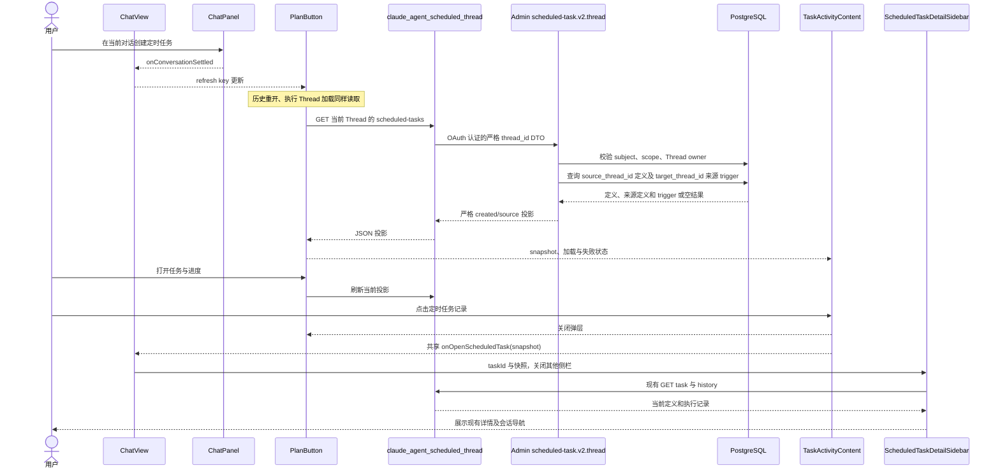
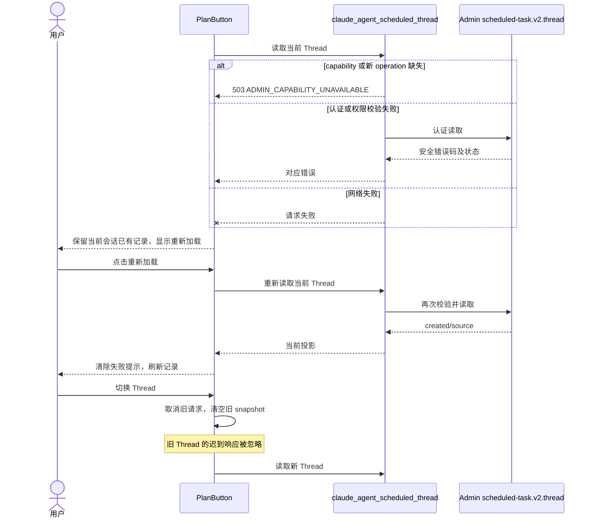
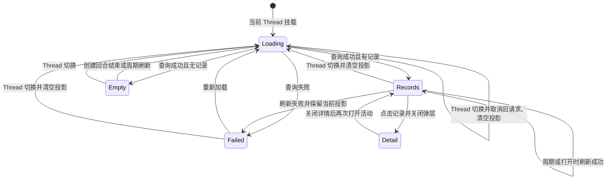

<!-- [Input] 对话定时任务活动 PRD、现有 Admin scheduled-task.v2 数据合同与 ChatView 详情入口。 -->
<!-- [Output] 正常与恢复时序、状态转换及具体模块与接口责任。 -->
<!-- [Pos] 对话定时任务活动的正式交互设计。 -->
<!-- [Sync] 2026-10-07: 设计创建与执行 Thread 的 owner-scoped 定时任务读投影。 -->

# 对话定时任务活动交互设计

## 背景与问题

现有 TaskActivityContent 的普通 task-links 不能表示尚未运行的定时任务，也不包含执行会话的 scheduled task ID。仅扫描已加载消息会遗漏历史任务；按今天查询会遗漏其他日期、已暂停或已删除的任务。需要 Admin 依据已有持久关系提供一次当前 Thread 的只读投影。

## 目标与边界

在现有 PlanButton 和 TaskActivityContent 中加入分区，复用 ScheduledTaskMarkerList 和同一 ChatView 详情回调。Admin 的现有 scheduled-task DTO/service/operationRegistry 追加只读 operation，Dream 复用 AdminScheduledTaskData。没有 schema、调度、Runtime、写操作或环境分支变化。

设计检查采用 frontend-design 的既有产品语境、层级、可访问性和克制原则：颜色、字体、尺寸直接继承当前活动卡片；时钟、任务名称和周期复用创建消息标记，不引入新视觉系统。

## 概念与程序规则

接口已按实施前评审合同实现：`GET /api/claude-agent/threads/{thread_id}/scheduled-tasks`，Admin operation `scheduled-task.v2.thread`，输入 `{thread_id}`，输出 `{created: ScheduledTaskV2[], source: {task: ScheduledTaskV2, trigger: ScheduledTrigger} | null}`。此处说明源码状态，技术验证回执单独记录，不表示真实业务验收。

1. Admin service 校验 dream:read、active subject、当前 Thread owner，并拒绝 thread-scoped Runtime delegation。created 查询按 task.user_id 与 source_thread_id 过滤，按 created_at/id 稳定排序。source 用 trigger.target_thread_id、trigger.user_id 与 task.user_id 联表查询；目标 Thread 删除后不会返回给其他 Thread。
2. 定义投影复用 projectTaskV2，trigger 复用 projectTrigger。来源定义可以为 deleted；created 也保留 deleted 记录，详情继续按现有规则处理。没有来源返回 null，没有创建任务返回 []。
3. operation 追加到整个 dreamOperations 末尾，保留包括 notionSyncRun 在内的全部旧 descriptor 顺序和 hash，使用既有 v2/link/turn capability。Dream 记录精确新 contract hash，并只在 capability 与 operation 均匹配时调用。不新增 schema capability、migration、后台执行权限或数据库直连。
4. PlanButton 承载当前 Thread 的 snapshot、loading、error。独立读取 scheduled 关系和普通 task-links，任何一方失败不阻断另一方。并发响应按请求序号及 Thread 隔离；AbortSignal 取消切换/卸载中的读取；同 Thread 失败与重试加载期间均保留已有数据。
5. 复用现有 ACTIVITY_REFRESH_INTERVAL_MS；打开弹层、重新可见与 ChatPanel 已有 onConversationSettled 回调引起的 refresh key 更新也读取。普通计划、待办、任务算法不变。
6. TaskActivityContent 的定时任务分区只消费投影和重试动作。来源任务与 created 按 task ID 合并，并把来源 trigger.status 标为“本次执行”，定义 status 使用现有 Calendar 翻译。ScheduledTaskMarkerList 可选渲染状态补充，默认创建消息保持现有表现。
7. ChatView 统一提供 openScheduledTask(task snapshot) 给消息标记和 PlanButton。点击记录先 onRequestClose，再回调；回调关闭其他互斥侧栏并设置 scheduledTaskDetail。不自动跳到执行 Thread；用户在详情中继续使用现有会话导航。

## 正常业务时序

## 异常与恢复时序

## 页面状态转换

## 影响与验收

Admin：scheduled DTO/service、自动 registry 与生成的合同清单；Dream：scheduled data DTO/operation 与单一只读 route；前端：scheduledTaskApi、PlanButton、TaskActivityContent、ScheduledTaskMarkerList、ChatView 与翻译。相关文件头及目录清单同步更新。

验证包含严格 DTO、哈希和旧 registry 前缀、认证与 owner 过滤、来源匹配、未运行创建记录、仅有定时任务的可见性、创建结束刷新、相同详情 ID、定义与 trigger 状态独立、读取失败保留与重试、Thread 迟到响应以及桌面/窄屏键盘交互。全部 provider-free 验证由 luna_test_runner 执行；不会写普通业务数据库、调用模型或重启用户服务。

产品规则与骨架：[PRD](../../prd/scheduled-tasks/conversation-activity.md)。独立评审：[评审记录](conversation-activity-review.md)。
