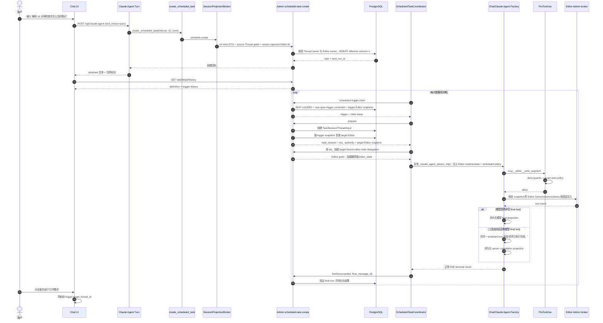
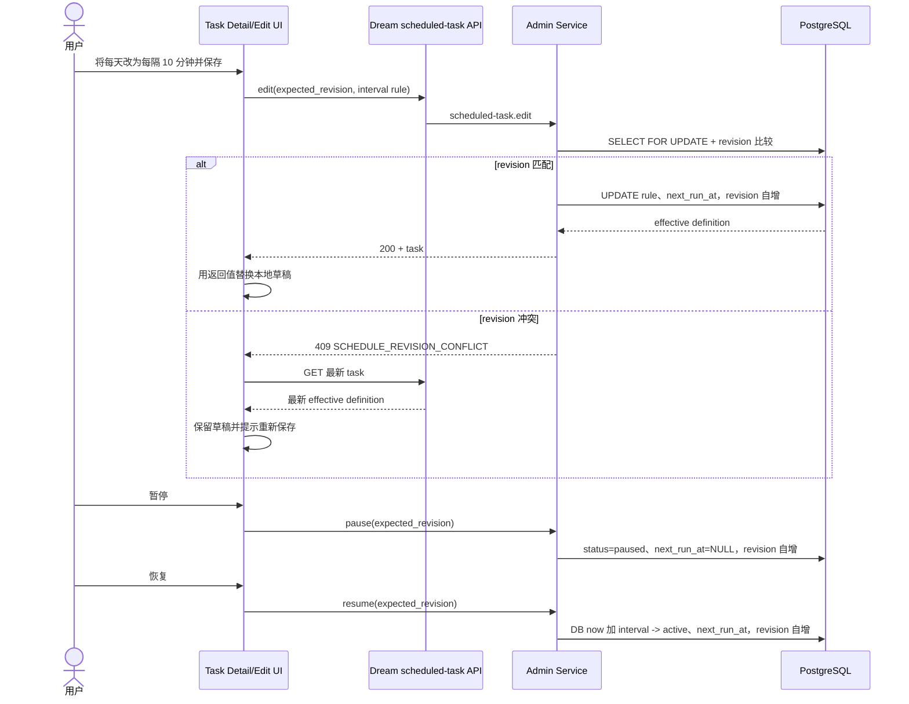
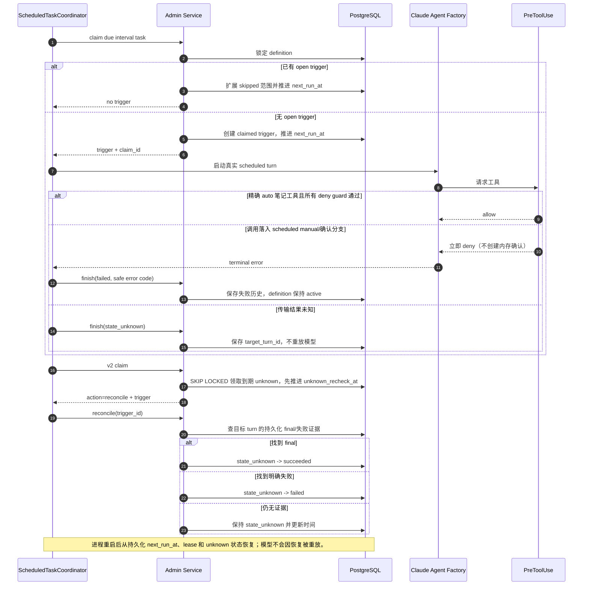
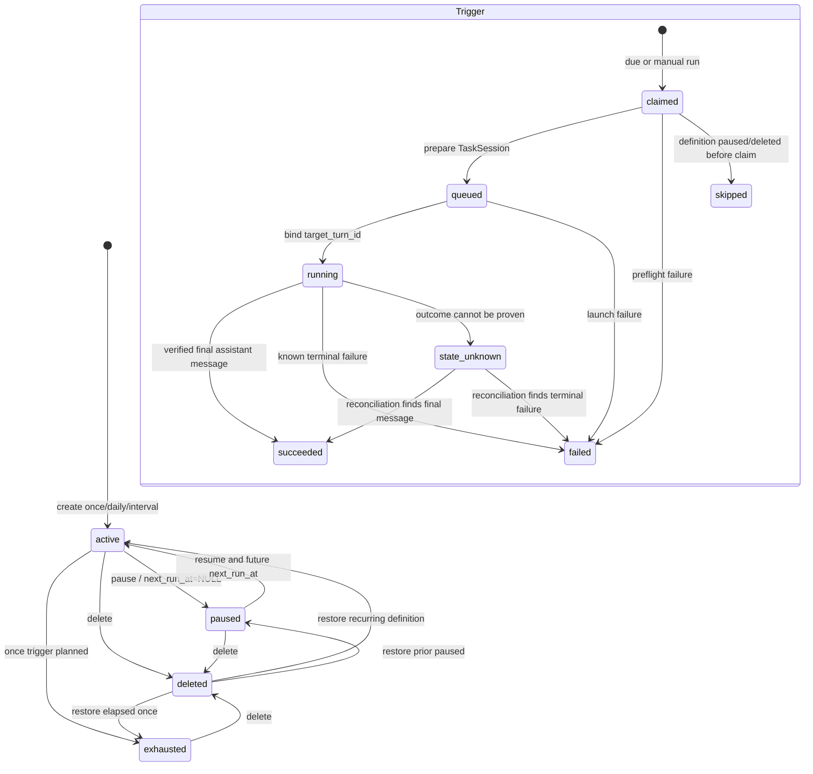

<!-- [Input] Scheduled-task PRD, Admin schedule v1 schema/service, Dream scheduled coordinator, Claude Agent tool permission flow, and Codex restored automation code. -->
<!-- [Output] Implementable interval scheduling and server-owned per-tool approval design with normal, failure, and state diagrams. -->
<!-- [Pos] Current formal interaction and implementation design for persistent scheduled tasks. -->
<!-- [Sync] 2026-10-07: keep revision increments renderable in the formal Mermaid edit sequence. -->
<!-- [Sync] 2026-10-07: close the tool-only successful turn gap with a server-owned final projection receipt. -->
<!-- [Sync] 2026-10-07: close Editor target, v1/v2 compatibility, approval precedence, skipped accumulation, and unknown recovery after independent review. -->

# 分钟间隔调度与定时会话工具审批设计

## 1. 背景与问题

Admin v1 的 `chat_scheduled_task`、DTO 和 CHECK 只接受 `once/daily`；Dream Tool、浏览器 DTO 和编辑弹窗重复这一闭集。Codex 恢复代码则把分钟间隔作为正式 RRULE 语义：`ScheduleMode` 包含 `hourly`，`intervalMinutes` 可生成 `FREQ=MINUTELY;INTERVAL=n`。本项目不引入 RRULE 存储，而将当前产品需要的最小子集建模为 `interval_minutes`。

Claude Runtime 的恢复代码将工具集合与权限分开：CLI `--tools` 选择可用工具，`--allowed-tools` 和 `can_use_tool`/PreToolUse 处理执行权限。Dream 现有 `tool_choice=auto` 仍会让执行、写入和交互工具进入前端确认链。定时执行没有稳定的前端确认者，需要一个服务端拥有、精确到工具名的审批覆盖。

## 2. 目标与边界

- 扩展现有 ScheduledTask DTO、Admin service、claim 算法、Dream Tool 和 UI，不建立第二套 scheduler。
- Admin Drizzle 新增前向 migration 和 `dream.chat-scheduled-task.v2` capability；Dream 只在 capability 存在时消费 interval。
- 每次 trigger 继续使用 `chat_task_session`、`_claude_agent_stream_impl`、Claude Agent Factory、EventBus/SSE 和现有持久化入口。
- 定时会话只自动审批两个非删除型 Editor 笔记写工具；任何最终需要确认的调用在无人值守 turn 中立即拒绝并形成失败结果。
- 普通 Chat 的 public request 不接受逐工具审批映射；该映射只能由 scheduled composition root 注入。

## 3. 概念与程序规则

### 3.1 数据模型

新增 rule：

```json
{
  "kind": "interval",
  "interval_minutes": 10,
  "time_zone": "Asia/Shanghai"
}
```

Admin 表新增 nullable `interval_minutes integer` 和 nullable `target_editor_session_id text`，trigger 新增 nullable `target_editor_session_id_snapshot text`，并放宽 `local_time` 为 nullable。目标字段不建立删除阻塞型 FK：create 时按 canonical user 共享锁校验 `user_sessions`，prepare 时再次读取同一 owner/ID；笔记删除后保留原 ID 以便稳定地失败，不能悄悄变成纯 Chat。约束闭集：

- once：`local_date`、`local_time`、`single_offset_minutes` 非空，`interval_minutes` 空；
- daily：`local_date` 空、`local_time` 非空、`single_offset_minutes` 空、`interval_minutes` 空；
- interval：`local_date`、`local_time`、`single_offset_minutes` 空，`interval_minutes >= 1`。

`time_zone` 继续非空。`next_run_at` 仍是索引和 claim 的唯一到期依据。

`target_editor_session_id` 不是模型参数。Dream 的 turn provider 只从已通过公开 Chat 入口校验的 `editor_state.id` 捕获它，并写入 Admin v2 create DTO；纯 Chat 为 `null`。edit 不改变目标。scheduled claim 与 manual run 在插入 trigger 的同一事务内复制 `target_editor_session_id_snapshot`；prepare 只读取并重新校验 snapshot，不从 definition、最近打开笔记或请求环境回填或改写它。后续 authority 和 Editor delegation 只使用 snapshot。

### 3.2 interval 时间算法

- `nextIntervalInstant(after, minutes) = after + minutes`，输入必须是正安全整数。
- 创建、编辑 active、恢复：以 Admin 事务读取的数据库 `now` 为基点计算第一次 `next_run_at`。
- claim due 时以持久化的旧 `next_run_at` 作为 lattice anchor，计算不晚于 `now` 的最近到期点 `scheduled_at`，再将 `next_run_at` 推进一个或多个完整 interval，保证结果严格晚于 `now`。
- 如果旧 `next_run_at < scheduled_at`，把旧值记为 `skipped_from_at`，把 `scheduled_at - interval` 记为 `skipped_through_at`。
- 若已有 open trigger，不创建第二条；更新范围时使用 `skipped_from_at = min(existing skipped_from_at, old next_run_at)`、`skipped_through_at = max(existing skipped_through_at, latest due)`，再推进定义。
- `interval_minutes` 在 Zod、Pydantic、TypeScript 与 PostgreSQL 统一为 `1..2_147_483_647` 的正整数。`minutes * 60_000` 必须保持 JavaScript 安全整数且生成有效时间戳；这是存储/日期运算边界，页面不把它描述成产品配额。

### 3.3 工具审批模型

新增服务端类型：

```text
ToolApprovalMode = auto | manual
ToolApprovalPolicy = {
  overrides: { exact_tool_name -> ToolApprovalMode }
}
```

CLI `tools`、MCP server 注册与 Dream 当前的 `allowed_tools` 一起组成实际可用工具集合；`tool_choice` 控制普通产品模式；PreToolUse / `can_use_tool` 决定具体调用。`ToolApprovalPolicy` 是仅由 scheduled composition root 注入的精确覆盖，没有命中的工具继续走现有 `auto` 分类器。若一个调用最终落入确认分支，scheduled turn 立即返回 deny，不创建五分钟内存确认。

定时会话策略：

```text
mcp__editor__write_segment = auto
mcp__editor__insert_widget = auto
mcp__editor__delete_segment = manual
mcp__editor__reply_to_comment = manual
AskUserQuestion = manual
mcp__user__ask_user = manual
```

判断顺序固定为：实际工具集合 → `tool_choice=none` → Editor Session/Dream surface/workspace/network/actor/schema/call-ID guard → scheduled exact override → 现有低敏感只读分类 → scheduled unresolved deny。scheduled policy 存在时忽略 `im_full_access_enabled` 的扩大效果；`can_use_tool` 的 `SandboxNetworkAccess` 也直接拒绝。普通 Chat 不带 policy，保留现有行为。

scheduled policy context 同时保存一个 server-owned、线程安全的 violation marker。PreToolUse 的显式 `manual`、未解析确认分支和 `can_use_tool` 拒绝在返回 SDK deny 时写入稳定错误码：工具策略拒绝为 `SCHEDULE_TOOL_APPROVAL_REQUIRED`，网络确认拒绝为 `SCHEDULE_NETWORK_APPROVAL_REQUIRED`。SDK deny 本身不被视为 turn 已终止；stream 消费结束后 coordinator 先读取 marker，再判断 assistant final。marker 存在时必须 `finish(failed, code)`，即使模型在工具拒绝后继续输出普通 final，也不得改成 `succeeded`。

### 3.4 v1/v2 兼容合同

- 0069 的 `dream.chat-scheduled-task.v1`、原 17 个 operation 名称、输入输出 hash 和 once/daily 行为保持不变。
- 新 migration 只做 additive schema expand 并发布 `dream.chat-scheduled-task.v2`。
- Admin 新增一组以 `.v2` 区分的 17 个内部 operation；它们复用同一 service/state machine，接受 interval 并携带 scheduled Editor target。旧 v1 worker 的 claim 只选择 once/daily 且无 Editor target 的定义，新 v2 worker处理全部 v2 定义，避免旧 worker 抢走需要自动写笔记的 trigger。
- Dream 新版本优先使用完整 v2 operation 集；capability/operation 缺失时，新功能 fail closed。旧 Dream 仍可通过 v1 operations 管理既有 once/daily 任务。完成 Admin migration、Dream 双版本回归和真实链路验收后，旧合同才能进入后续 contract 阶段。

### 3.5 `state_unknown` 持久重查

trigger 新增 nullable `unknown_recheck_at timestamptz` 和 `status='state_unknown' AND unknown_recheck_at IS NOT NULL` partial index。进入 `state_unknown` 时按数据库时钟写入 `now + unknownRecheckSeconds`；策略值来自 Admin 服务端配置，不进入产品 DTO。

v2 claim 在普通 trigger/due definition 之前，用 `FOR UPDATE SKIP LOCKED` 选择一个 `unknown_recheck_at <= now` 的候选，并在同一事务先把游标推进到下一节流时间，再返回 `action='reconcile'`、trigger 和空 claim ID。worker 收到该 action 只调用现有 reconcile，不启动模型。找到对应持久 final 时转 `succeeded`；找到现有持久终态失败证据时转 `failed`；仍无证据时保持 unknown 和已经推进的游标。任何终态都清空 `unknown_recheck_at`。因此多实例、worker 重启和重复 poll 不会在同一节流窗口重复重查。

### 3.6 仅含工具调用的成功结果

Claude Runtime 可以在成功执行工具后返回 completed terminal，同时不给出自然语言 final text。普通 Chat 继续保持严格 final projection 规则。对 `scheduled_turn_id` 已绑定且 Runtime 已判定成功的内部 turn，Dream assistant 持久化在工具 parts 之后追加一个 text part `任务已执行完成。`，将它作为 `history_final_text` 并写入现有 `turnStatus=completed`、`turnId`、`finalPartIndex`。工具 parts、工具输出和确定性 scheduled final message ID 均保持不变。

这个补全发生在成功 turn 的持久化边界，不参与模型执行、工具权限或 stream 成功判定。manual/network policy violation、Runtime error、cancelled、partial 或未能持久化的 turn 不进入该分支，不能用完成回执掩盖失败。Admin 继续使用同一 final projection 和 turn ID 校验完成结果，无需放宽 schema 或另建结果类型。

## 4. 正常业务时序



## 5. 编辑、暂停和恢复时序



## 6. 异常与恢复时序



## 7. 状态转换



## 8. 接口与代码影响

| 边界 | 变更 |
|---|---|
| Admin Drizzle | 前向 migration：`interval_minutes`、nullable `local_time`、definition/trigger Editor target、`unknown_recheck_at`/partial index、v2 CHECK、capability contract。 |
| Admin DTO/Service | 保留 v1 contracts；新增 `.v2` operation contracts、`IntervalRuleDTO`、目标 owner 校验、interval plan/claim/day projection、`dispatch/reconcile/idle` claim action；复用现有 transaction/lease/revision。 |
| Dream Admin consumer | 保留 v1 DTO/hash 常量；新增 v2 Pydantic interval union/operation set，v2 capability 缺失 fail closed。 |
| Thread Tool | `create_scheduled_task` JSON schema 和参数校验接受 interval。 |
| Scheduled coordinator | 处理 v2 claim 的 dispatch/reconcile action；根据 authority 的 Editor snapshot 创建 Editor runtime、加载 state，并在内部 dispatch 注入 server-owned approval policy；violation marker 优先结束为 failed。 |
| Claude Agent service/runner | `ToolApprovalMode/Policy` 与 violation marker 贯穿内部 RunOptions；PreToolUse 中 deny guards 后执行 exact override，scheduled unresolved confirmation 与 `can_use_tool` 立即拒绝并写稳定错误码。公开 body 不暴露 policy。 |
| Frontend API/UI | `ScheduledRule` 增加 interval；详情、卡片和编辑表单展示每隔 N 分钟。 |
| i18n | 增加 interval 和分钟输入文案。 |

Chat 详情和 Calendar 共用一个编辑弹窗语义：标题、提示词、频率、重复结束、暂停/保存。任务详情不再提供第二套内联编辑表面。详情正文使用一个滚动容器，历史分页追加到该容器；Calendar 右侧当日内容 section 独立外滚动，不改变左侧月历卡高度。

## 9. 失败反馈

| 失败 | 用户反馈 | 程序处理 |
|---|---|---|
| capability 未发布 | 定时任务暂不可用，可重试 | Dream fail closed；不使用 timer fallback。 |
| interval 非正整数 | 请输入大于 0 的整数分钟 | 前端校验；Admin DTO 再校验。 |
| revision 冲突 | 任务已在其他位置更新 | 拉取最新值，保留草稿。 |
| 目标笔记缺失/越权 | 无法写入目标笔记，打开聊天查看 | Editor broker 拒绝；trigger 保存失败结果。 |
| manual 工具 | 此次运行需要人工操作 | scheduled turn 立即拒绝；保存失败历史，不创建不可恢复的确认请求。 |
| open trigger 存在 | 最近一次仍在运行 | 跳过新到期点并推进计划。 |
| 结果未知 | 运行结果待确认，可打开聊天 | `state_unknown` 阻止重放；worker 节流 reconcile，查询持久化 final 或明确失败。 |
| 工具成功但模型无 final text | 任务已执行完成，可打开聊天 | scheduled assistant 持久化追加服务端完成回执；Admin 按原 final projection 校验为 succeeded。 |

## 10. 兼容性与发布顺序

1. Admin 先合入 additive migration、v2 capability 和 `.v2` internal operations；v1 operation descriptor/hash 不变。
2. Dream 发布双版本 consumer：普通旧 once/daily 数据仍可由 v1 读取，新建/编辑/worker 使用 v2；v2 capability 缺失时 interval 与 scheduled Editor target fail closed。
3. 前端只消费 Dream 返回规则，不自行计算 `next_run_at`；服务端 unavailable 时禁用 interval，不启用浏览器 timer。
4. 正常数据库必须由 Admin 显式执行 migration；Dream 启动不建表。
5. migration、Dream 双版本验证和真实业务链路通过后，另行评审 v1 contract；本次不删除旧 operation 或 capability。

## 11. 测试与验收

- Admin pure time tests：创建、恢复、多次错过、open trigger 跳过、正整数边界。
- Admin isolated PostgreSQL：migration、CHECK、capability、create/edit/claim/restart projection、唯一 open trigger。
- Dream runner tests：scheduled exact auto 两工具；普通 Chat 仍确认；delete/comment/Bash/unknown 仍 manual；deny guard 优先。
- Dream service tests：scheduled tool-only completed turn 追加服务端完成回执并形成合法 final projection；普通 Chat、失败、拒绝和取消不补全。
- Tool/DTO tests：interval JSON schema、严格参数、operation SHA 和 capability。
- Frontend unit/browser：卡片摘要、详情、编辑、窄屏 sheet 和独立滚动。
- 业务 E2E：真实公开入口创建每 10 分钟任务，等待触发，验证 TaskSession/Thread/Turn/结果、编辑、暂停、恢复、删除及 Chat 回归。

## 12. 来源证据

- Codex 恢复代码根 `/Users/dmeck/project/Codex-Original-Functionality-Round52-Delivery`，commit `e3fe334`：`src/renderer/recovered/agent-04/automation-schedule.ts` 的 `MINUTELY`、`intervalMinutes` 和 `FREQ=MINUTELY;INTERVAL=n`；`src/shared/automations/automation-schedule.ts` 的 MINUTELY 解析和 next occurrence。既有来源判断见 `docs/exec/scheduled-task-phase1-source-assessment-20260928.md`。
- Claude 恢复代码根 `/Users/dmeck/project/claude-code-sourcemap/restored-src`：`src/main.tsx` 的 `--tools`、`--allowed-tools`、`--permission-mode`；`src/entrypoints/sdk/controlSchemas.ts` 的 `can_use_tool`。
- Dream 当前实现：`agent_runner.py` 的 allowed_tools、PreToolUse 和确认链；`scheduled_task_coordinator.py` 的真实 Chat/Factory 复用。
