<!-- [Sync] 2026-09-15: replace social flows with Admin while preserving the original in history. -->
<!-- [Input] Module business flows, current Admin consumers and byte-preserved pre-migration sequence source. -->
<!-- [Output] Module flow reference with explicit current ownership and retained migration dependencies. -->
<!-- [Pos] Sequence index; focused current designs own authentication, Session, Deck, preferences and social rules. -->
<!-- [Sync] 2026-09-15: public user preferences use Admin; retain original whole source in history. -->

认证/Session/Deck的现行程序行为以[Admin交互](../architecture/admin-auth-data-interaction.md)和各功能稿为准；本稿其余尚未更新的旧issuer/直接SQL说明仅是迁移依赖，不作为现行规范。[原十模块时序原文](history/pre-admin-user-preferences-20260915/sequence-diagrams.md)字节保持；用户偏好正常、状态、失败和验收见[现行稿](user-preferences-current.md)。

<!-- [Input] Current Next.js Dream Web modules and Python business routes/services. -->
<!-- [Output] Current cross-module business sequence diagrams. -->
<!-- [Pos] Design-level sequence index; domain details remain in their focused documents. -->
<!-- [Sync] 2026-09-06: replace the retired Vite frontend label with the sole Next.js app/_dream source boundary. -->
<!-- [Sync] 2026-09-01: replace debounced random-Voice inspiration with manual persistent Suggestion Cells on one Session-owned Claude Thread. -->
<!-- [Sync] 2026-08-31: replace daily-picture generation with historical read-only Timeline access and remove its scheduler/runtime. -->

# Ink & Memory — 业务功能模块时序图

> 本文档梳理了 Ink & Memory 项目的核心业务功能模块，并以 Mermaid 时序图形式呈现各模块的交互流程。

---

## 目录

1. [用户认证模块（注册 / 登录）](#1-用户认证模块)
2. [编辑器会话管理模块](#2-编辑器会话管理模块)
3. [历史语音评论兼容](#3-历史语音评论兼容)
4. [Writing 手动建议模块](#4-writing-手动建议模块)
5. [语音对话模块（Chat with Voice）](#5-语音对话模块)
6. [深度分析模块（回响 / 特质 / 模式）](#6-深度分析模块)
7. [历史图片读取模块](#7-历史图片读取模块)
8. [卡组与声音管理模块](#8-卡组与声音管理模块)
9. [好友系统模块](#9-好友系统模块)
10. [语音输入模块（WebSocket 语音识别）](#10-语音输入模块)

---

## 1. 用户认证模块

### 1.1 用户注册

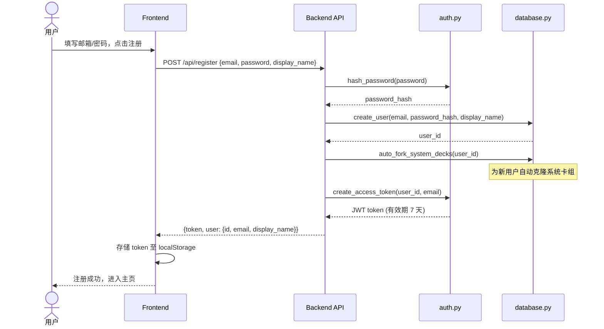

### 1.2 用户登录

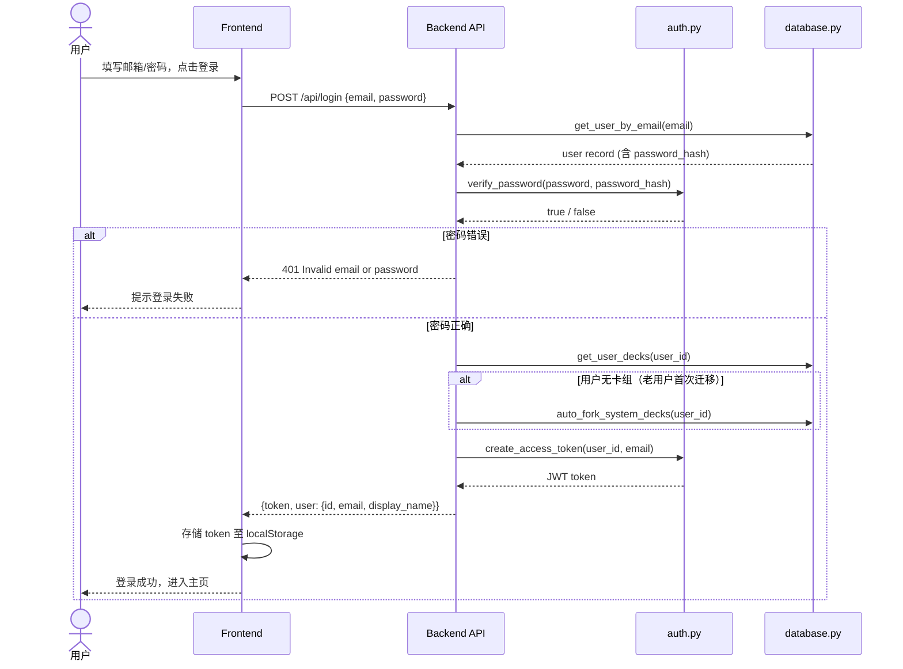

### 1.3 JWT 鉴权（通用依赖）

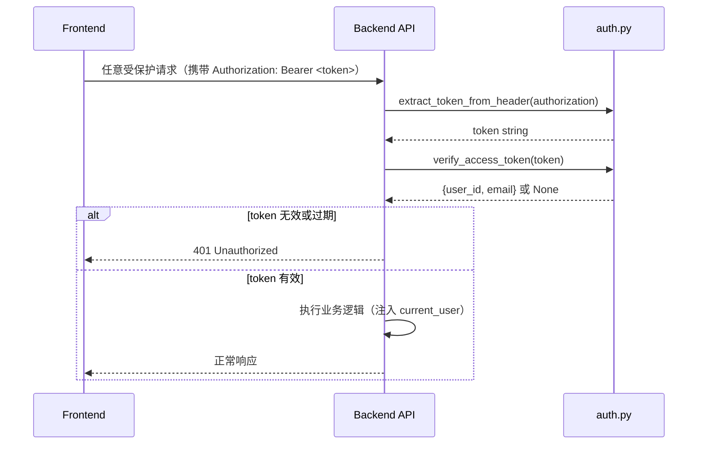

---

## 2. 编辑器会话管理模块

### 2.1 应用启动 — 加载会话

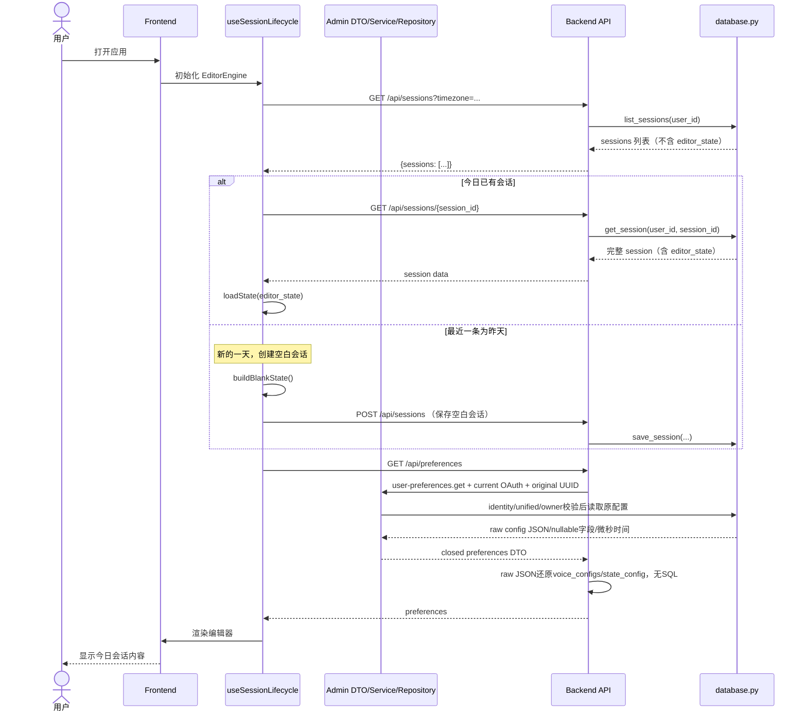

### 2.2 自动保存

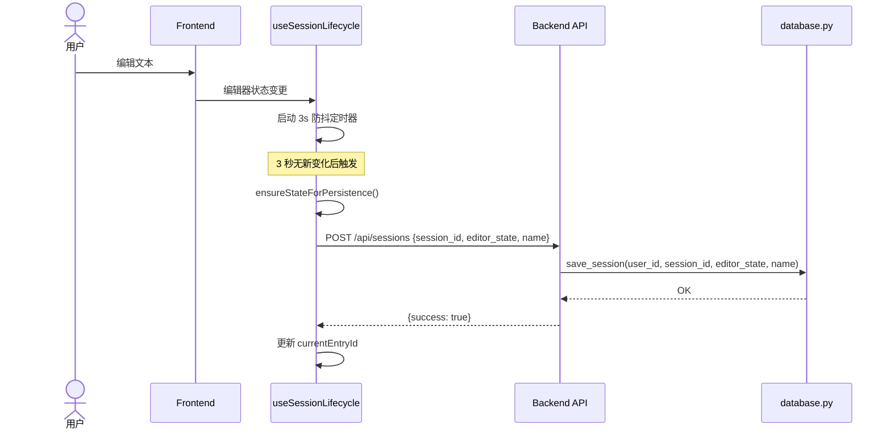

### 2.3 手动保存 / 新建会话

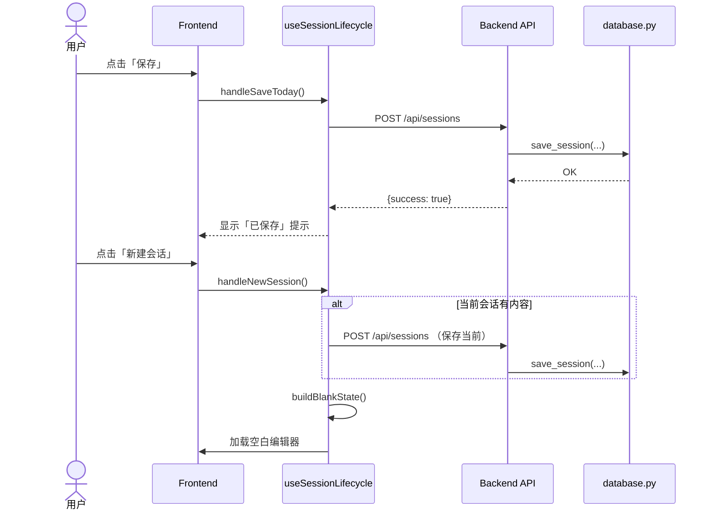

---

## 3. 历史语音评论兼容

普通 Writing 编辑只更新本地 `cells` 与 `weightPath`，不再自动调用模型，也不再注册 `analyze_text` PolyCLI session。已保存 Edit Session 中的 `commentors` 继续按原位置只读显示；用户显式发起历史评论对话时，前端复用对应 Voice 的 Claude Thread SSE。

---

## 4. Writing 手动建议模块

普通输入、粘贴、IME、回车、标点和停顿都不触发请求。用户点击 `Go deeper` 后，编辑器立即插入独立 Suggestion Cell；该 Writing Session 首次点击时懒创建产品级 Claude Agent Thread，后续建议与 Refresh 复用同一 Thread。

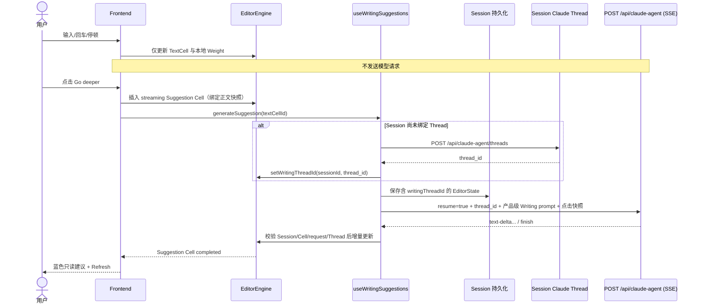

---

## 5. 语音对话模块

用户与某个语音角色就当前文本进行多轮对话。

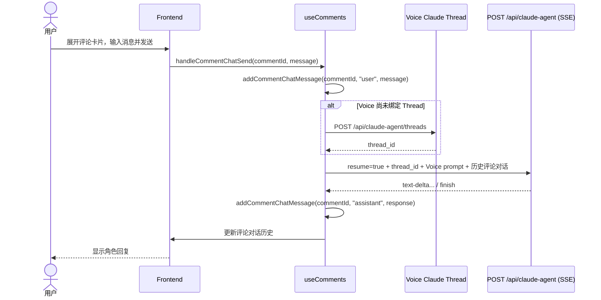

---

## 6. 深度分析模块

分析用户所有笔记，挖掘回响主题、性格特质、行为模式。

### 6.1 回响分析（Analyze Echoes）

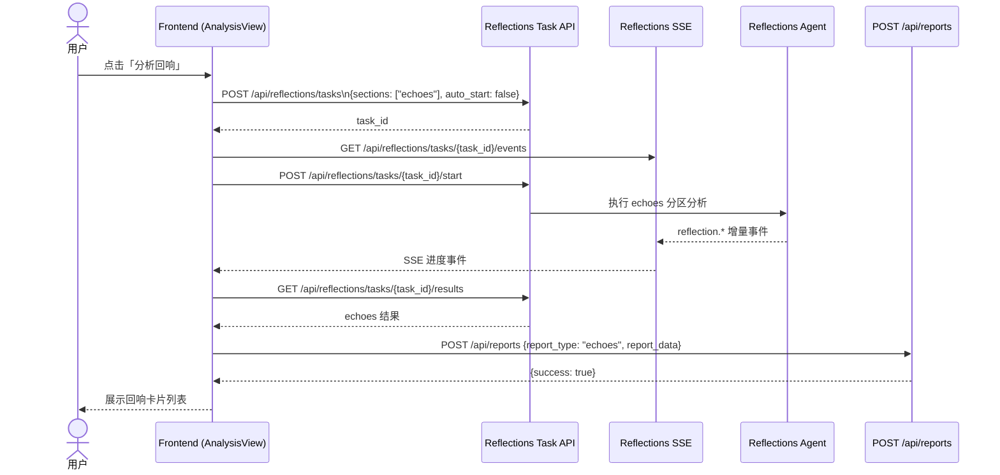

### 6.2 特质分析 / 模式分析

流程与回响分析相同，仅 Reflections section 与返回字段不同：
- **traits** → 返回 `{traits: [{trait, strength, evidence}]}`
- **patterns** → 返回 `{patterns: [{pattern, description, frequency}]}`

---

## 7. 历史图片读取模块

Timeline 只读取并展示数据库中已保留的历史图片，不提供生成、重绘或保存入口。

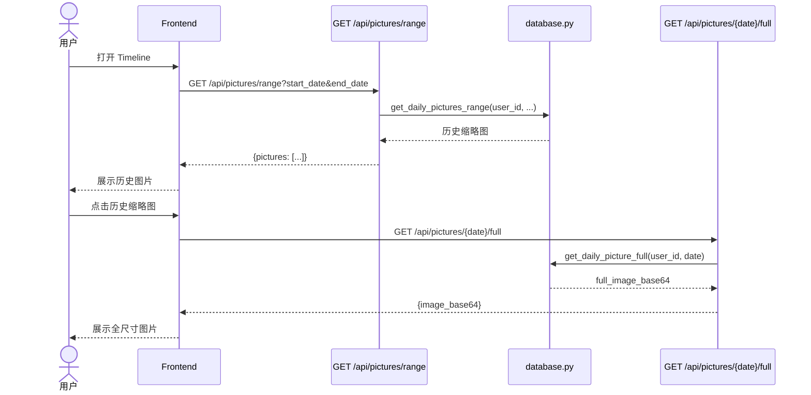

---

## 8. 卡组与声音管理模块

用户可管理「卡组（Deck）」及其下属「声音（Voice）」角色。

### 8.1 查看/创建卡组

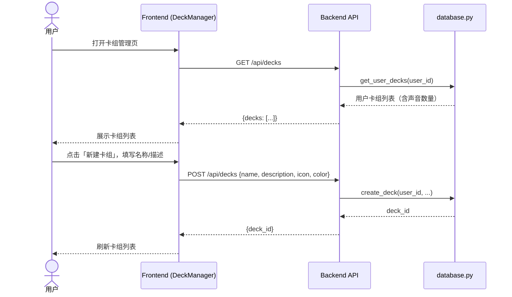

### 8.2 Fork 社区卡组

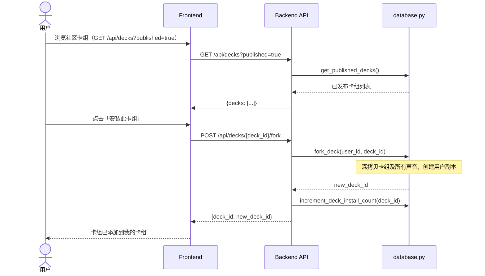

### 8.3 发布卡组到社区

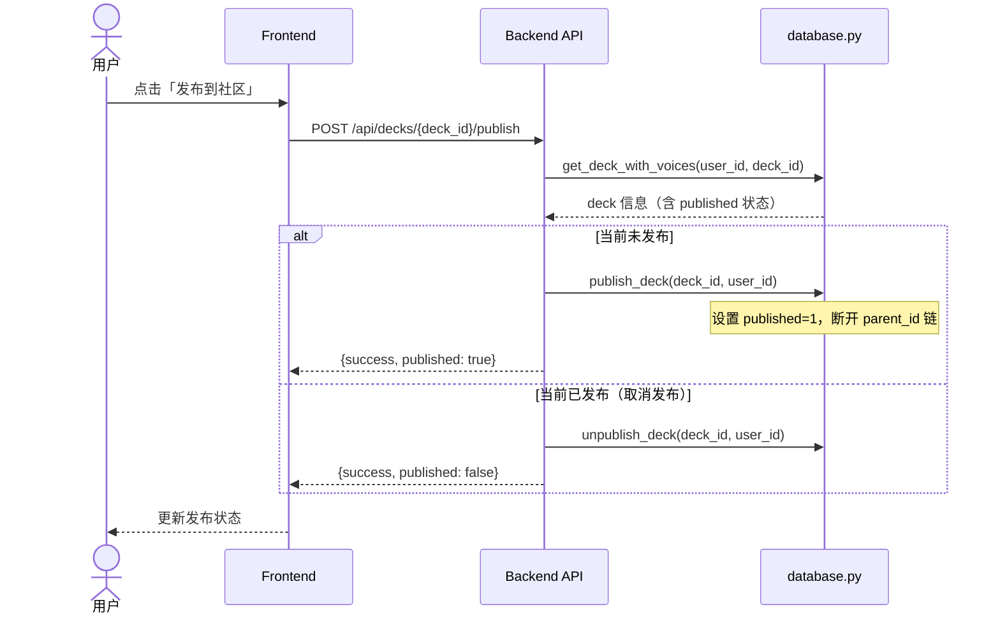

---

## 9. 好友系统模块

正常流程、状态、失败及验收以[现行稿](social-friendship-current.md)为准；旧SQL/锁缺口说明见已保留的[原文](history/pre-admin-user-preferences-20260915/sequence-diagrams.md)。

### 9.1 生成邀请码与处理申请

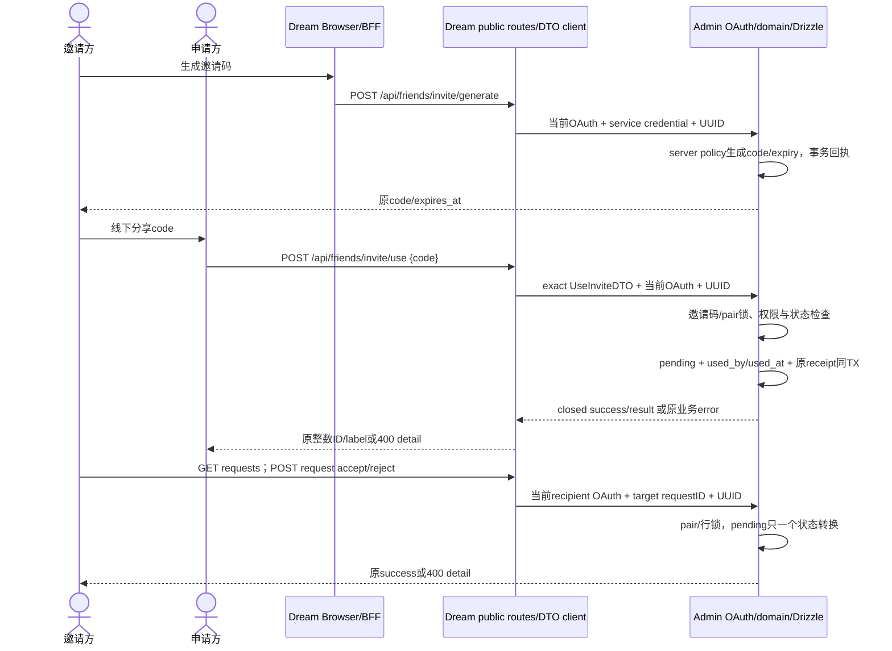

### 9.2 查看历史图片

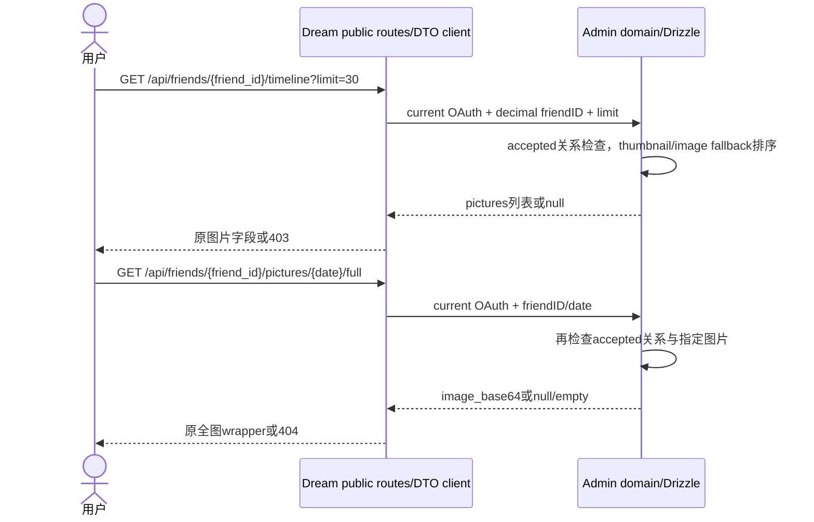

写unknown只查同operation原UUID的receipt，absent不证明rollback或触发新写；其它模块旧流程仍是明确迁移依赖。

---

## 10. 语音输入模块

基于 WebSocket 的实时语音识别（Dashscope ASR）。

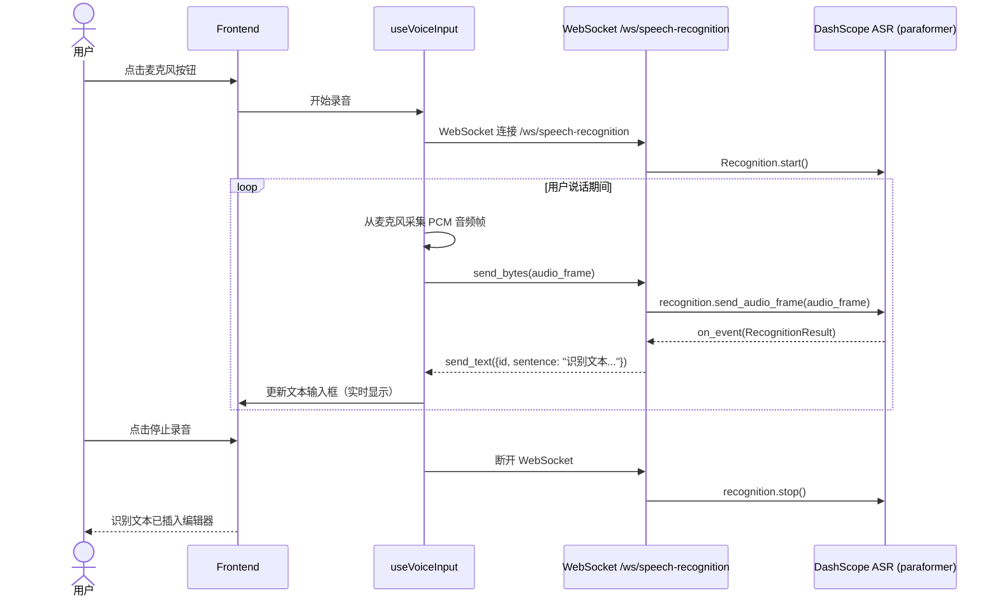

---

## 附录：系统架构概览

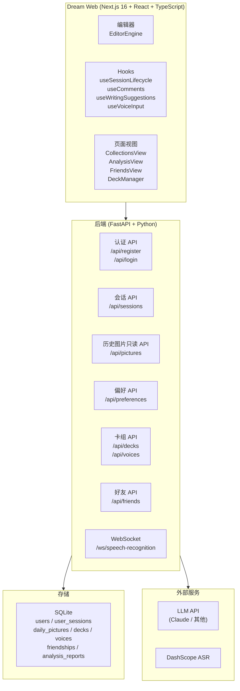
