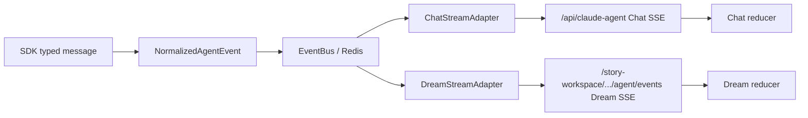
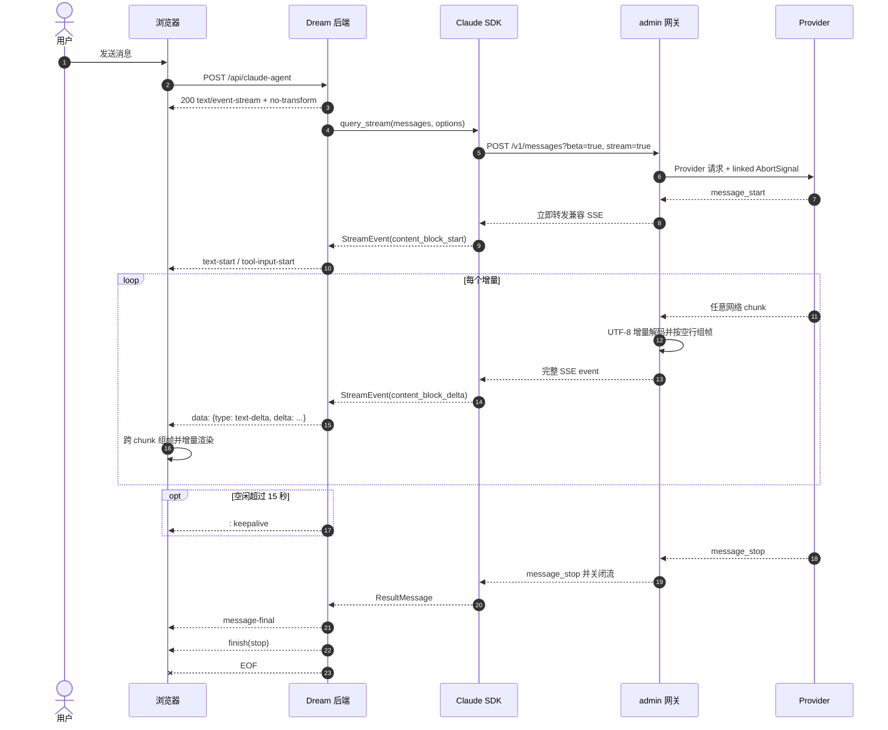
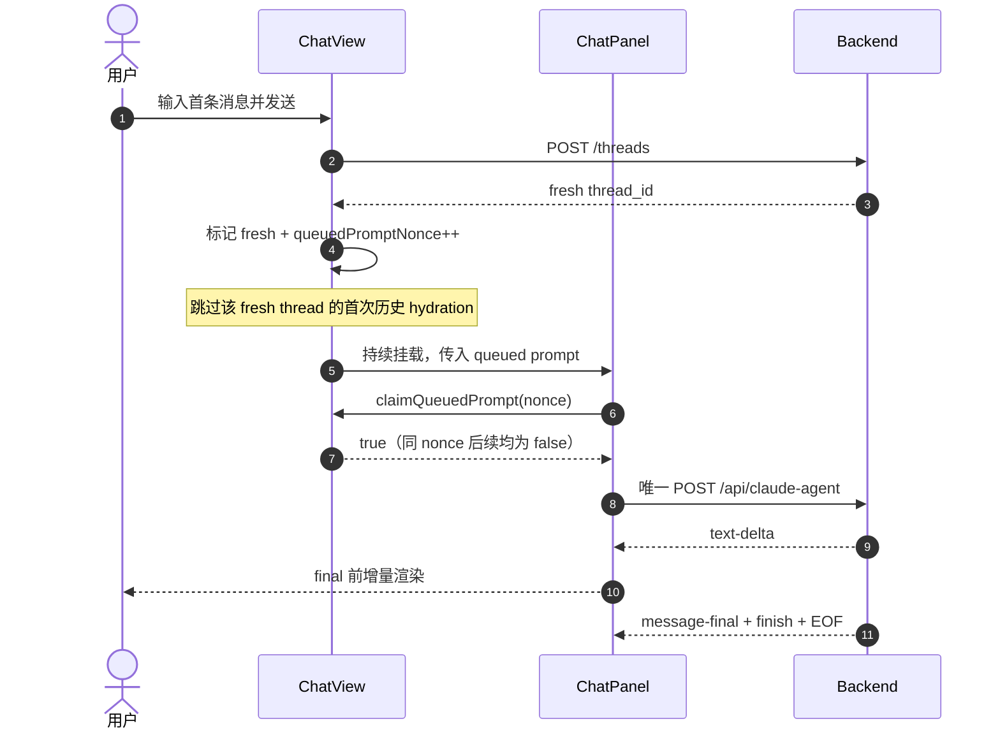
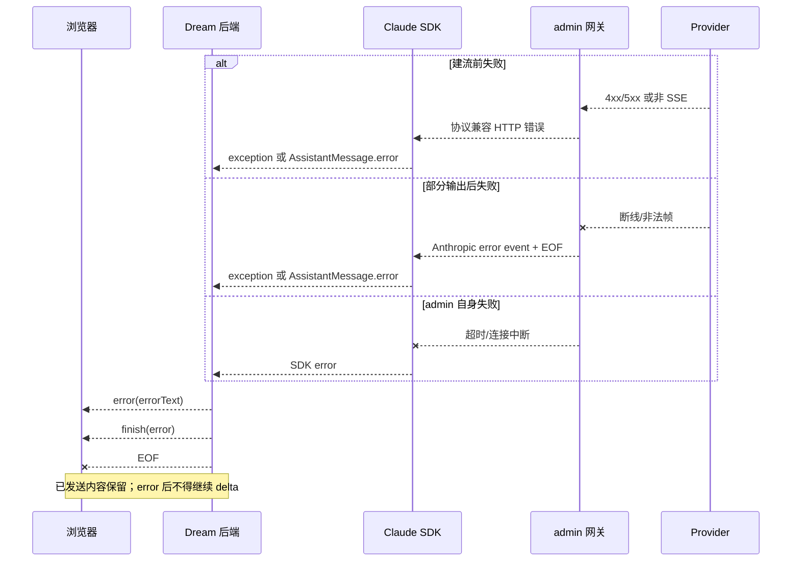
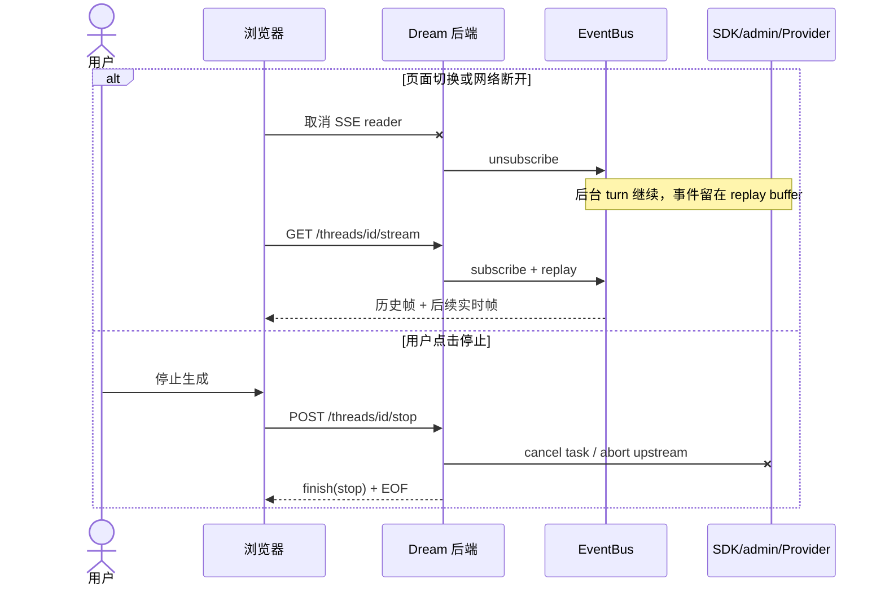
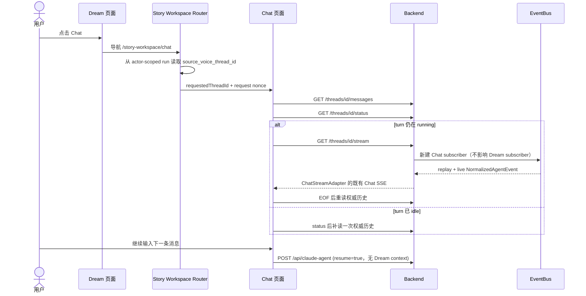
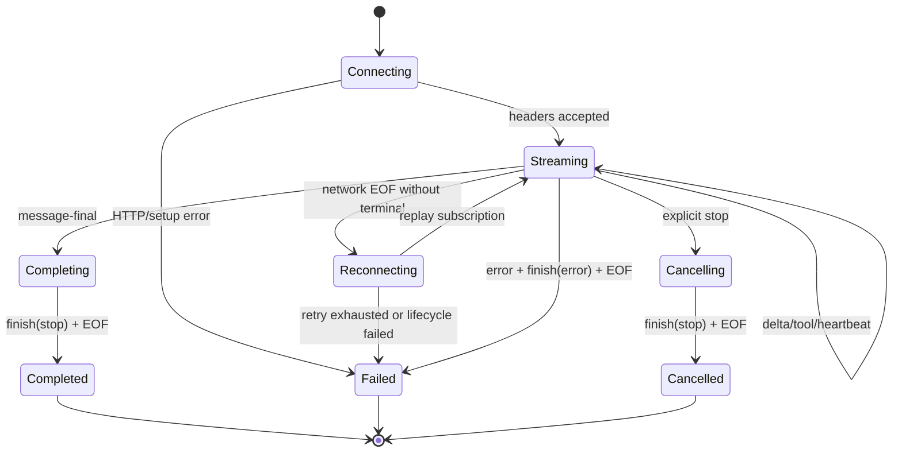

# SSE 流式交互与故障恢复设计

> 状态：代码与回归测试已完成，待生产环境直连/代理复测
> 日期：2026-08-11（Asia/Shanghai）
> 范围：Claude Agent SDK、Ink Dream 后端、浏览器客户端，以及
> `ink-admin-memory` 的 Anthropic 兼容 `/v1/messages` 网关

## 1. 背景、证据与目标

Dream 后端通过 `claude-agent-sdk==0.2.128` 调用 `query_stream()`。SDK 进程的
`ANTHROPIC_BASE_URL` 指向 admin 网关；admin 再代理 Provider 的 Anthropic 或
OpenAI 流。后端把 SDK 类型消息转换为既有 Pawkeyland 风格业务事件，并以
`data: {"type": ...}\n\n` 发送给浏览器。

本次故障包含五个层次：

1. **当前 Chat 现象的主因（用户浏览器现象与代码路径一致，修复后回归已通过）**：2026-06-01 的 lazy-thread
   改造把首条消息暂存在 `ChatView`，再由新挂载的 `ChatPanel` effect 调用
   `sendMessage()`。同一轮 `activeThreadId` effect 随即把 `threadMessages` 设为
   `null` 以加载历史，导致第一个 `ChatPanel` 及其 SSE reader 被卸载；历史加载完成后
   第二个 `ChatPanel` 用同一 queued prompt 再发一次 `POST /api/claude-agent`。后端的
   thread lock 让第二个请求等待第一个 runner 完成，所以它恰好在
   `full_text = "".join(text_parts)` 之后才开始出现内容。
2. **已验证的代理缓冲问题**：admin 的流响应曾只有 `Cache-Control: no-cache`。
   Next 16 将可压缩的 `text/event-stream` gzip 后，小事件被压缩器缓存到更多数据
   或流结束。admin 提交 `1b8f890` 加入 `no-transform` 后，同一实验的首事件从约
   327 ms（随流结束）恢复到约 2 ms。
3. **客户端组帧缺陷**：`claude-agent-transport.ts` 曾按单个网络 chunk 调用 SSE
   parser，没有保存不完整帧。TCP、HTTP/2 或代理只要把一个事件拆成多个 chunk，
   JSON 就会被静默丢弃。
4. **防御缺口**：Dream 后端的 Claude Agent `StreamingResponse` 没有统一声明
   `no-transform`、`X-Accel-Buffering: no` 和长连接语义，部署中间件仍可能复现
   admin 的缓冲问题。
5. **Dream → Chat 交接缺口（本轮已修复）**：`8c34d48` 把普通 Chat 嵌入
   `/story-workspace/chat` 时只复用了 `requestedChatThreadId`，但 Dream 路由没有把
   actor-scoped run 的 `source_voice_thread_id` 交给该 Chat 实例。结果是 Dream turn
   虽然仍在 EventBus 中正常广播，Chat 却打开空白或旧线程，因而不会查询正确线程的
   lifecycle，也不会调用 GET reconnect。另有一个结束竞态：turn 可能在首次历史读取
   与 status 读取之间完成，Chat 读到 `idle` 后跳过重连，但保留了终态前的旧历史。

SDK 的异步迭代不是主因。当前 runner 已识别 `StreamEvent`、`AssistantMessage`、
`SystemMessage` 和 `ResultMessage`，并将 `AssistantMessage.error` 转入现有错误通道。

### 1.1 目标

- 上游完整 SSE 事件到达后立即向下一层交付，不等待流结束。
- Chat 的一次用户提交只创建一次 agent POST；拥有该 POST 的 `ChatPanel` 在终态前
  保持挂载，不能通过重挂载“恢复”首条消息。
- 从 Dream 进入 Chat 时恢复同一 `source_voice_thread_id`；运行中使用 Chat adapter
  重连，结束后收敛持久化历史，下一轮仍走普通 Chat POST。
- 网络 chunk 边界对事件语义透明。
- 复用现有 `data: {"type": ...}` 公共协议，不要求现有客户端迁移。
- 正常、失败和取消都只有一个终态；错误后不再产生业务增量。
- 浏览器断开只取消订阅；显式“停止生成”才取消后台 agent turn。
- 日志、指标和审计数据不进入 SSE 正文。

### 1.2 非目标

- 不在本次变更中把现有事件全面改名为 `message_start/message_delta/done`。
- 不承诺跨进程持久重放；当前 in-memory bus 只支持进程内重放，Redis adapter 的
  跨进程行为需要独立生产验证。
- 不把 admin 的 Provider 密钥、内部模型名或账务信息暴露给 Dream/浏览器。

## 2. 角色与端到端链路

| 组件 | 责任 | 不应承担的责任 |
|---|---|---|
| Claude Agent SDK | 启动 CLI、解析 Anthropic SSE、产出类型消息 | 业务 SSE 编码 |
| Agent runner | SDK 类型分发、增量聚合、异常/取消归一化 | HTTP 头与代理 |
| Agent service | SDK 回调转成 `NormalizedAgentEvent`、保证单终态 | 选择 Chat 或 Dream 公共协议 |
| EventBus | 标准事件广播、keepalive、进程内重放 | 携带或解析 SSE 字符串 |
| Chat adapter | 标准事件无损编码为既有 Chat SSE | 执行 Dream 脱敏/过滤策略 |
| Dream adapter | 标准事件投影为 Dream allowlist SSE 和稳定 cursor | 复用或反向解析 Chat SSE |
| FastAPI route | 真正的流式响应和防缓冲响应头 | 聚合完整响应 |
| admin gateway | Provider 协议适配、逐事件转发、取消传播、账务审计 | gzip、JSON 包裹或整流读取 |
| nginx/Next/网关 | 透明传输，禁用缓冲/转换 | 合并或压缩 SSE |
| 浏览器 transport | 增量 UTF-8 解码、跨 chunk 组帧、事件 reducer | 假设一次 read 等于一次 event |

Chat 首条消息还遵循明确的请求所有权规则：`ChatView` 创建空线程后直接把该线程标记为
fresh，不执行无意义的空历史 hydration；同一个 `queuedPromptNonce` 必须先通过
`ChatView` 的父级 claim gate，之后才能由 `ChatPanel` 调用 transport。子组件本地
`useRef` 只用于减少重复 effect，不能承担跨 remount 的幂等性。

```text
Provider SSE
  → admin request-local parser / protocol adapter
  → Anthropic-compatible SSE
  → Claude SDK typed messages
  → ClaudeAgentRunner._process_message（保留完整业务分派）
  → AgentStreamingCallbacks
  → NormalizedAgentEvent
  → EventBus
       ├─ ChatStreamAdapter → Chat SSE → buffered Chat parser → UIMessage reducer
       └─ DreamStreamAdapter → Dream allowlist SSE → Dream reducer/state machine
```

### 2.1 三个明确模块与隔离规则

1. `NormalizedAgentEvent`：唯一内部事件模型。SDK/service 在生产者边界验证 JSON
   可序列化性；EventBus 和 Redis 只传输该模型，不传输任何页面的 SSE 报文。
2. `ChatStreamAdapter`：Chat 专用、无过滤。每个内部 `text-delta` 必须恰好产生一个
   既有 `data: {"type":"text-delta",...}\n\n` 帧，保持公共 Chat API 兼容。
3. `DreamStreamAdapter`：Dream 专用、有状态。只输出 Dream allowlist 事件，负责文本
   防泄露投影、cursor、重连和终态；不得调用 Chat adapter，也不得解析 Chat SSE。

生产路径必须在 EventBus 之后分叉。为滚动部署读取旧 Redis stream 和兼容旧测试桩，
允许 `dream_stream_adapter.py` 在单一兼容入口调用 `agent_stream_events.py` 的 legacy
Chat-frame decoder；新生产者、Dream service 和 Dream HTTP route 均不得直接调用该
decoder。Chat 请求没有 Dream context 时，不得注册 Dream runtime 初始化回调。



## 3. 交互时序



### 3.1 Chat lazy-thread 首次发送



如果同一个 `ChatPanel` effect 重跑，组件内 nonce guard 拦截；如果子组件意外 remount，
父级 claim gate 拦截。二者都不能通过再发一次业务请求来恢复流。普通历史线程仍执行
REST hydration；运行中的历史线程再使用专用 GET reconnect stream。

### 3.2 上游异常与代理异常



### 3.3 取消、断线和重连



客户端重连先查询 lifecycle。只有 `running` 才订阅；`idle` 时从持久化消息恢复。
浏览器不能把普通断线解释为“停止生成”。

### 3.4 Dream 线程切换到 Chat



Dream 和 Chat 只共享线程、标准事件与 runner 会话，不共享页面协议。Router 只传递已经
由 actor-scoped run read 证明的线程标识；所有 Chat history/status/stream 端点仍重复
执行线程所有权校验。重复打开同一线程必须提升 request nonce，不能因 thread id 未变化
而跳过 lifecycle 刷新。

## 4. 事件契约

为兼容现有前端，HTTP SSE 的 `event` 字段省略，事件名保存在 JSON 的 `type`。
完整帧如下：

```text
data: {"type":"text-delta","id":"text-1","delta":"你好\nworld"}

```

JSON 中的换行会被转义，因此一个业务事件仍是单行 `data:`。解析器也必须接受标准
SSE 的多行 `data:`，按 `\n` 拼接后再解析 JSON。UTF-8 字节可任意拆分，必须用
streaming `TextDecoder`。

| `type` | 必填字段 | 语义 | 前端行为 | 重放 |
|---|---|---|---|---|
| `message-metadata` | `sessionId`, `turnIndex` | turn 开始元数据 | 建立 turn 上下文 | 是 |
| `text-start` | `id` | 文本块开始 | 创建 streaming part | 是 |
| `text-delta` | `id`, `delta` | 文本增量 | 原样追加，不重复解码 | 是 |
| `text-end` | `id` | 文本块结束 | 标记 part 完成 | 是 |
| `reasoning-start/delta/end` | `id`，delta 事件另含 `delta` | 思考块 | 更新 reasoning part | 是 |
| `tool-input-start` | `toolCallId`, `toolName` | 工具输入开始 | 创建工具 part | 是 |
| `tool-input-delta` | `toolCallId`, `delta` | JSON 输入增量 | 仅用于预览，最终输入为准 | 是 |
| `tool-input-available` | `toolCallId`, `toolName`, `input` | 完整工具输入 | 覆盖预览 | 是 |
| `tool-output-available` | `toolCallId`, `output`, `isError` | 工具结果 | 完成工具 part | 是 |
| `tool-approval-request` | `toolCallId`, `toolName`, `input` | 人工确认 | 显示确认 UI | 是，按 call id 去重 |
| `plan-updated` / `todo-updated` | 现有各自字段 | side channel | 更新对应 store | 是 |
| `message-final` | `text`, `usage`, `sessionId` | 完整结果快照 | 校验/收敛显示 | 是 |
| `error` | `errorText` | 终止错误详情 | 保留部分内容并提示 | 是 |
| `finish` | `finishReason` | 唯一终态：`stop`/`error` | 停止流式 UI，等待 EOF | 是 |
| comment heartbeat | `: keepalive` | 保活，不是业务事件 | 忽略 | 否 |

### 4.1 事件 ID 与兼容策略

- 当前 Chat 协议不发送 SSE `id:`，因为 EventBus 没有稳定、持久的序列号。
- 文本块和工具调用继续使用 JSON 内的 `id` / `toolCallId` 去重。
- Redis/持久重放若以后对外承诺，可增加单调 `id:`；客户端必须允许该字段出现但不
  依赖它。加入 `event:` 或 `id:` 不得改变 JSON `type`。
- 未知 `type` 必须忽略并记录开发期遥测，不能终止整个流。

### 4.2 Dream 公共事件契约

Dream 不直接暴露 Chat 的 `type` JSON。事件名使用标准 SSE `event:` 字段，并用
`id: <turn-id>:<normalized-event-ordinal>[:<subevent>]` 支持同一活跃 turn 的重连：

| `event` | 必填 data | 语义 | 终态 |
|---|---|---|---|
| `status` | `lifecycle` | `streaming`/`idle` 生命周期 | 否 |
| `assistant_text_delta` | `turnId`, `delta` | 已通过 Dream 安全投影的公开文本 | 否 |
| `assistant_message_committed` | `turnId` | 当前 Dream 回复已提交 | 是 |
| `agent_activity_started` | `turnId`, `activity` | allowlist 工具活动开始 | 否 |
| `agent_activity_finished` | `turnId`, `activity` | allowlist 工具活动完成 | 否 |
| `tool_confirmation_requested` | `turnId`, `confirmation` | 安全确认请求 | 否 |
| `tool_confirmation_resolved` | `turnId`, `toolCallId` | 确认已解决 | 否 |
| comment heartbeat | 无 | 连接保活 | 否 |

`reasoning-*`、原始工具输入/输出、凭据、路径和 Chat 的 `message-final` payload 不得进入
Dream SSE。Dream 未知内部事件默认忽略；Chat 对未知内部事件保持既有 JSON 透传语义。

## 5. 状态机与单终态约束



后端 turn 维护 `terminal`/等价门闩：

- 成功：`message-final? → finish(stop) → sentinel`；
- 失败：`error → finish(error) → sentinel`；
- 取消：`finish(stop) → sentinel`；
- `error` 去重，`finish` 和 sentinel 各一次；
- terminal 后的 publish 是 no-op；未知 SDK 控制消息不创建终态。

## 6. 异常与降级

| 场景 | 行为 |
|---|---|
| SDK 在首事件前抛错 | 发送 `error`、`finish(error)`、EOF |
| SDK 部分输出后抛错 | 保留已发内容，同样发送结构化终态 |
| `AssistantMessage.error` | 按 SDK 异常处理，不等待 query_stream 再抛错 |
| 未知 SDK 消息 | 原始 `on_message` 可观测；runner 忽略业务转换，不中断 |
| JSON 序列化失败 | 服务日志记录 request/turn/type；转为通用 error 终态 |
| admin 建连失败/非 SSE | 建流前返回协议兼容非 200 JSON 错误 |
| admin 流内非法事件 | 发送 Provider 协议 error event，取消 reader 并结算失败 |
| admin 超时 | linked AbortSignal 取消 Provider；不得留下 reader lock |
| 浏览器断开 | 释放订阅 reader；后台 turn 不取消 |
| fresh ChatPanel 意外 remount | queued nonce claim 返回 false；不得重发 POST；按运行状态走 GET reconnect |
| 显式停止 | 取消后台 task，向 Provider 传播 abort，持久化部分输出 |
| 服务重启 | in-memory turn 丢失；客户端转 REST 历史并提示中断 |
| 心跳超时 | 客户端进入 reconnecting；心跳不进入消息 reducer |

## 7. admin 与部署代理约束

admin 对流式 `/v1/messages` 必须：

- 上游使用 `Accept: text/event-stream`，保留受限 `beta` query 和兼容 headers；
- 使用增量 `TextDecoder`，支持事件跨 chunk、多个事件同 chunk、CRLF 和 EOF 尾帧；
- 每得到一个完整事件立即写入下游 `ReadableStream`，不能调用 `text()`/`json()`
  聚合整个流；
- 同协议保持 Anthropic `event:` 与 JSON `type` 语义；跨协议只通过显式 adapter；
- 下游 cancel 和 request abort 必须取消上游 reader/fetch；
- 审计写入使用有界队列，不能让无限 Promise chain 占用内存；
- 200 流响应至少包含：

```http
Content-Type: text/event-stream; charset=utf-8
Cache-Control: no-cache, no-transform
Connection: keep-alive
X-Accel-Buffering: no
```

不得设置 `Content-Length`，不得设置 `Content-Encoding`，不得 JSON 包装、响应缓存、
代理缓冲或把多个事件攒成批次。nginx 的 SSE location 必须使用 HTTP/1.1、
`proxy_buffering off`、`proxy_cache off` 和足够长的 read/send timeout。

## 8. 可观测性

所有观测写入结构化日志、指标或 admin 审计表，不能 `yield` 到 SSE 正文：

- `request_id`、Dream `thread_id`、`turn_id`、admin `x-request-id`；
- Gateway 建连耗时、TTFB、首完整事件耗时、首 token 耗时；
- 上下游事件数、字节数、流持续时间、终态；
- SDK 消息类与未知类计数；
- Provider/SDK/序列化/代理异常分类；
- 客户端 unsubscribe、显式 cancel、上游 abort；
- `Content-Encoding` 非空、首事件接近 EOF、多个事件同时突发等缓冲迹象。

日志需脱敏：不得记录 Gateway Key、Provider Secret、完整 system prompt 或未授权的
用户内容。错误 SSE 只返回用户可行动的摘要和可关联 request id。

## 9. 验收标准

1. 单条和连续 Unicode/中文/引号/换行增量可正确解析。
2. 一个事件拆成任意多个字节 chunk、多个事件位于同一 chunk，语义序列一致。
3. CRLF、多行 `data:`、comment heartbeat 和 EOF 尾帧均正确处理。
4. `error`、`finish`、sentinel 各自至多一次；错误后没有 delta。
5. FastAPI 三个 Claude Agent 流入口均返回 `text/event-stream; charset=utf-8`、
   `no-cache, no-transform` 和 `X-Accel-Buffering: no`，无 `Content-Length`。
6. admin 直连 Provider 与经 admin 的兼容事件序列一致（允许 request/model id 改写）。
7. admin 首个完整事件在上游事件到达后 100 ms 内可由本地测试客户端读到，且发生在
   Provider 完成之前。
8. admin 响应无 `Content-Encoding`，下游取消会在限定时间内 abort 上游。
9. SDK 首事件前/部分输出后失败均转为浏览器可消费的结构化错误终态。
10. 前端 UI 在流完成前可观察到至少一个增量渲染，而不是 EOF 后一次性显示。
11. 连续 334 个标准 `text-delta` 经 Chat adapter、任意网络分片和 Chat reducer 后数量、
    顺序、Unicode 内容完全一致；Dream adapter 的同类测试独立通过。
12. Dream 的 production factory 同时提供 `run_events` 与 `run_streaming` 时只能调用
    `run_events`；Chat 方法被设为抛错也不影响 Dream 流。
13. Chat 首次发送创建 fresh thread 后只能产生一个 `POST /api/claude-agent`，请求体的
    `id` 与刚创建的 thread id 一致。
14. 浏览器测试必须先收到并渲染 `text-delta`，再由测试上游发送
    `message-final/finish`；该过程不得依赖第二个 POST，也不得触发空历史 hydration
    卸载当前 SSE reader。
15. Dream 页面进入 Chat 时必须选择 run 的 `source_voice_thread_id`；非 Dream 页面不得
    改写当前 Chat 线程，空或缺失 source thread 时安全降级。
16. Dream turn 运行中进入 Chat，必须通过 GET reconnect 显示 Chat 协议增量；EOF 后
    输入框恢复，下一条消息只发送一次普通 Chat POST，且不携带 Dream context。
17. turn 在 history 与 status 读取之间完成时，Chat 必须在观察到 `idle` 后补读一次
    持久化历史，不得漏掉刚提交的终态 assistant message。

## 10. 验证矩阵

| 层 | 单元/集成验证 | 现场验证 |
|---|---|---|
| SDK runner | 类型消息、Assistant error、取消、未知消息 | CLI stderr + request id |
| SSE encoder/EventBus | Unicode、特殊字符、keepalive、单终态 | `curl -N` 原始字节 |
| FastAPI | 头部、无 Content-Length、逐帧 yield | 直连后端 TTFB |
| admin | parser chunk fuzz、协议 adapter、no-transform、abort | Provider 直连 vs admin `curl -N` |
| 浏览器 | 分片/合并 chunk、CRLF、多行 data、EOF | DevTools timing + 渐进渲染 |

推荐复测：

```bash
curl --no-buffer --raw -D direct.headers -o direct.sse "$BACKEND_URL/api/claude-agent/..."
curl --no-buffer --raw -D admin.headers -o admin.sse "$ADMIN_URL/v1/messages?beta=true" ...
```

比较时区分语义事件与传输 chunk；HTTP chunk 边界不要求一致，解析后的事件类型、顺序、
终态和到达时机才是契约。

## 11. 历史变更核对清单

以下结论来自 `platform` 可达历史和 admin `main` 历史；它区分“确定导致丢帧”、
“导致延迟”和“仅形成架构耦合”，避免把 Dream 的所有变更笼统归为 Chat 故障。

| 仓库/提交 | 变更 | 判断 |
|---|---|---|
| Dream `bb30325`（2026-05-24） | 首次加入自定义 Chat transport，直接对每个 `ReadableStream` chunk 调用 `parseSSEChunk` | **确定的丢帧缺陷引入点**：事件跨 chunk 时半截 JSON 被 catch 后永久丢弃 |
| Dream `88cc60f`（2026-05-24） | 对齐 Pawkeyland Chat 事件协议 | 保留上述按 chunk 解析策略，未修复组帧 |
| Dream `f2774b9`（2026-06-09） | EventBus/reconnect | EventBus 开始把 Chat SSE 字符串当内部消息；形成协议耦合，但没有证据表明它主动丢弃 Chat delta |
| Dream `e3f8fd0`（2026-08-02） | Chat 成功后尝试 Story Workspace 结构化输出 | 没有改变 SSE 编码/前端解析；不是本次丢帧引入点 |
| Dream `61f70fc`（2026-08-05） | Dream Agent 页面接入 | Dream 通过 `_parse_sse` 反向解析 Chat SSE，并把 Dream turn 状态加入共享 factory；**隔离错误**，但现有 diff 未显示其过滤 Chat 公共输出 |
| Dream `8c34d48`（2026-08-05） | 将 legacy Chat 嵌入 `/story-workspace/chat` | **Dream → Chat 交接缺陷引入点**：Chat 节点读取全局 `requestedChatThreadId`，但路由未从 Dream run 传入 `source_voice_thread_id` |
| Dream `a219ea1`（2026-08-09） | platform 模型/admin catalog 接入 | 改模型选择/API，不改 Chat SSE parser；把请求置于 admin 链路后放大了代理缓冲问题 |
| Admin `c6a7c88`（2026-08-08） | 初始 Gateway streaming proxy | 流响应只有 `Cache-Control: no-cache`，Next 可对 SSE gzip/transform；**确定的整流延迟风险** |
| Admin `1b8f890`（2026-08-11） | `no-transform`、`X-Accel-Buffering: no`、增量/取消测试 | 已修复 admin 侧已复现的缓冲，并加入首事件在上游结束前到达的测试 |

用户提供的 debugger 附件进一步证明 SDK 不是空流：其中有 1 个 init、334 个
`text_delta`、592 个 `thinking_delta`、5 个 `AssistantMessage` 和 1 个成功
`ResultMessage`。因此故障定位在 SDK 之后的编码/传输/消费链路；本实现用 334 条增量
作为 Chat 与 Dream 两条独立回归测试的基准。
