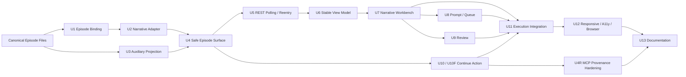

# drama-forge 第一集完整工作流接入：任务三实施与验收记录

> 日期：2026-08-06
> 阶段：任务三（Subagent-Driven、TDD、双阶段评审与真实浏览器验收）
> 上游裁决：`2026-08-05-drama-forge-ep01-task1-problem-decision-record.md`
> canonical 设计：`design_009_drama-forge-first-episode-storyline-storyboard-workbench.md`
> 任务二评审：`2026-08-05-drama-forge-ep01-task2-design-review-record.md`
> 实现基线：`eec96a9..38cb29a` 的 49 个生产实现 commits
> 结论：代码与确定性 UI 质量门通过；真实第一集 artifact 和浏览器工作台通过；真实 Dream Agent runtime 串行派发与真实 render media 仍有诚实遗留

## 0. 本轮规划前置器

### 0.1 Optimized Prompt

以当前 `story-workspace` HEAD、Task1/Task2 canonical 文档、U1—U12/U4R 提交和最新真实证据为唯一事实源，编写可审计的 Task3 实施与验收记录。逐单元记录 Red、Green、独立评审和 commit；保存真实 run、Deck、技术 thread、不透明 Episode、六类 artifact、workflow facts revision、关联完整率、before/after manifest、浏览器 result/截图/trace 与 SQLite 证据。所有哈希现场复核；无法由证据证明的外部模型、agent session、真实媒体和服务关闭不得推断成功。只在 `docs/design/story-workspace/` 回写文档，不改变 Task1/Task2 裁决。

### 0.2 Optional Enhancers

- 用“设计条款 → 实现单元 → commit → 测试/浏览器证据”建立闭环。
- 将真实 artifact 文件摘要与 API 目录 aggregate revision 分列，避免把目录摘要误当单文件哈希。
- 将“按设计实现”与“诚实遗留”并列表达，尤其区分 render guide/pending queue 与真实媒体。

### 0.3 执行计划

1. 读取 Task1、`design_009`、Task2 独立评审记录，冻结本轮输入。
2. 用 `git cat-file` 与 `git log` 核对 U1—U12/U4R 的全部提交。
3. 重算 manifests、artifact file list、SQLite、浏览器 result、截图和 trace 的 SHA-256。
4. 新增本记录并在三份上游文档末尾添加实现回链。
5. 做无上下文读者检验、`git diff --check` 和仅 docs 提交边界检查。

### 0.4 验收标准

- U1—U12、U4R 和 U13 均有 Red/Green/评审/commit 记录；历史瞬时测试计数未持久化时明确说明，不补造数字。
- 六类 artifact 的相对路径、revision、大小、producer、consumer 与页面消费事实完整。
- before/after manifest、真实浏览器和数据库事实均附路径与 SHA-256。
- 精确记录 workflow `/events` 404 与 REST fallback，不把期望路径当实现成功。
- run `queued`、`agent_session` 缺失、无真实 render media 等遗留不被 mock 或 UI 成功掩盖。
- 本轮 commit 只包含 `docs/design/story-workspace/` 文档；不执行归档。

## 1. Task1 与 Task2 的不可回退输入

本轮没有重新裁决产品边界，直接继承以下结论：

1. `.dream` 三 stage 是宿主投影；第一集内容 owner 仍是 canonical episode 文件。
2. 同一 Dream Agent/run/thread 按 vendor 的最早缺失依赖推进；Episode stage dispatch 不是第二次 Dream confirmation，也不形成新的业务状态机。
3. `episode.json` 只拥有 run↔story↔EP01 身份物理映射；浏览器不提交 story/path/episode/root。
4. `episode-outline.md`、`script.md`、`storyboard.yaml`、`prompts/`、`renders/`、`review-report.md` 分别拥有故事线、剧本、镜头、Prompt、render guide/显式 queue、审阅事实。
5. 主层级是 Episode → Arc → Beat → Scene → Shot；Prompt、Render Queue、Review 是上下文辅助层。
6. Shot→Prompt 与 Shot→Render Queue 分别以显式 `shot_id` 关联；没有 `prompt_ref` 时不得建立 Prompt→Render。
7. artifact REST surface/ETag 是恢复事实，SSE 只负责失效提示；localStorage 与 Dream Agent messages 均不是 artifact owner。
8. 本期不消费真实 render media，不挂载 `ChatView`，不展示隐藏推理/raw tool args，不增加失败、驳回、人工重试或归档业务流程。

上游证据：Task1 第 4—11 节；`design_009` 第 0、4—7、14—16、20—24 节；Task2 第 5—7 节。

## 2. 实现总览

生产实现没有修改 `backend/database.py`，没有建立第二套 Episode 内容 owner，也没有把 Dream/Execution 改成通用 Chat 页面。

## 3. U1—U13 Red / Green / 评审 / commit 台账

### 3.1 记录口径

- U1—U10 均由负责代理先运行新增测试得到 Red，再提交实现/返工得到 Green，最后由独立评审确认 PASS。旧轮 Red/Green 的瞬时精确计数没有落盘；本记录不推断数字，以测试文件、commit 边界和最终总回归作为可复核证据。
- U11 最终独立评审为 PASS，P0/P1/P2 均为 0；历史聚焦计数未持久化。
- U12 与 U4R 有保留下来的精确计数，按原始代理回报记录。
- 下列短哈希均已在本轮对 `38cb29a` 的祖先链执行 `git cat-file -e <hash>^{commit}`；Task2 清单中的 `7b40be3` 是笔误，仓库唯一实际相近提交为 `7c40be3`。

| 单元 | Red | Green / 返工 | 独立评审 | commits |
| --- | --- | --- | --- | --- |
| U1 Episode binding | `test_story_workspace_episode_binding.py` 先覆盖首次绑定、幂等和篡改边界；瞬时计数未持久化 | binding contract 与安全收紧进入 Green | PASS；P0/P1/P2=0 | `acf0f77`, `f2b4fa4` |
| U2 outline/script/storyboard adapter | narrative adapter 测试先覆盖 canonical ancestry、Markdown/YAML redaction；瞬时计数未持久化 | adapter、storyboard 语义与公共文本边界进入 Green | PASS；P0/P1/P2=0 | `edf8421`, `a598133`, `7c40be3`, `c715a90`, `7ce50ce` |
| U3 prompts/renders/review projection | auxiliary adapter 测试先覆盖显式 shot 关系、redaction 和路径文本；瞬时计数未持久化 | 辅助产物投影及多轮安全返工进入 Green | PASS；P0/P1/P2=0 | `938bc73`, `33b4ec1`, `38b1052`, `03108d0`, `32cdd3c`, `1a684cc` |
| U4 safe aggregation/auth/path | API 测试先覆盖 actor/run/binding、目录 allowlist、非法路径、invalid snapshot；瞬时计数未持久化 | Episode surface、trust boundary 和 invalid revision 进入 Green | PASS；P0/P1/P2=0 | `622b506`, `7a79f87`, `b599946` |
| U5 REST polling/reentry | hook/parser 测试先覆盖 ETag、304、last-good 与 lifecycle；瞬时计数未持久化 | polling、session-only last-good、lifecycle 与 string classification 进入 Green | PASS；P0/P1/P2=0 | `0d6b208`, `463f673`, `d28db96`, `a52b443` |
| U6 stable view model | view-model 测试先覆盖 hierarchy、selection ancestry、unlinked/orphan；瞬时计数未持久化 | storyline view model 与导航语义进入 Green | PASS；P0/P1/P2=0 | `584690f`, `cca2bd9`, `5d998d7`, `3f0ddea`; test corrections `2d3d779`, `25ef836` |
| U7 narrative workbench | browser component seam 先覆盖 tree/keyboard/Escape/焦点；瞬时计数未持久化 | workbench、语义和 focus 稳定性进入 Green | PASS；P0/P1/P2=0 | `753be86`, `3b42c03`, `74ffdda` |
| U8 Prompt/Render Queue auxiliary | shot auxiliary seam 先覆盖分别关联和未关联展示；瞬时计数未持久化 | Prompt 与 queue 辅助视图进入 Green | PASS；P0/P1/P2=0 | `c4fa686` |
| U9 Review | review seam 先覆盖 scope、定位与只读边界；瞬时计数未持久化 | Review panel、scope 边界与 prompt 分类进入 Green | PASS；P0/P1/P2=0 | `4bcbee6`, `dbe805d`, `ae845f5` |
| U10 backend action | action tests 先覆盖 derived action、CAS/idempotency、busy/provenance；瞬时计数未持久化 | action dispatch、facts、trust gate 进入 Green | PASS；P0/P1/P2=0 | `4ff4fa4`, `eb1d6f5`, `1880bdf`, `a7848fc`, `43b5df2` |
| U10F frontend action | hook/contract seam 先覆盖 If-Match、stale response 和 wire schema；瞬时计数未持久化 | 前端 action wiring 进入 Green | PASS；P0/P1/P2=0 | `96f68c2`, `a3deaee` |
| U11 page integration/revision stability | Execution integration seam 先覆盖 artifact arrival、confirmation 与 stale action；历史计数未持久化 | Episode 工作台接入页面并忽略 stale action | PASS；P0/P1/P2=0 | `3575b34`, `77c8f07`, `129756a` |
| U12 responsive/a11y/browser | 最终返工 Red：`2 failed, 17 passed`，分别暴露日期漂移与断点焦点丢失 | Green：`19 passed`；真实 deterministic Chromium：`1 passed` | 复评 PASS，P0/P1/P2=0；复评聚焦 `19 passed`，Chromium 重复 `2 passed (8.3s)` | `c5aa0fb`, `84c6f52`, `026f80d` |
| U4R MCP provenance | forged/decoy/current/legacy 聚焦矩阵 | `6 passed, 11 deselected, 9 subtests passed`；组合 `148 passed, 19 subtests passed`；真实 launch/API `24 passed, 11 subtests passed` | PASS；P0/P1/P2=0 | `e2b87c8`, `a1dd5c7`, `38cb29a` |
| U13 docs/record | 文档缺口是没有统一 commit、真实证据与诚实遗留台账 | 本记录与三份上游回链；`git diff --check` 作为 Green 门 | 读者检验见第 11 节 | 本次 `docs(story-workspace): record first episode delivery` 提交；哈希由 `git log` 外部引用，文档不自引用可变 commit hash |

### 3.2 commit 主题核对

以下清单与第 3.1 节一一对应，覆盖 `eec96a9..38cb29a` 的 49 个生产实现 commits；随后 `4860aac` 与 `f2fa498` 两个 U13 docs-only commits 完成交付记录，因此冻结的专项交付基线为 **49 + 2 = 51 个 commits**。该计数不自包含之后用于修正计数文字的文档 commit。

- U1：`acf0f77 feat ... add episode binding contract`；`f2b4fa4 fix ... harden episode binding contract`。
- U2：`edf8421 feat ... adapt episode narrative artifacts`；`a598133 fix ... preserve canonical storyboard semantics`；`7c40be3 fix ... redact narrative artifact text`；`c715a90 fix ... close narrative redaction gaps`；`7ce50ce test ... supply episode authority to surface probe`。
- U3：`938bc73 feat ... project episode auxiliary artifacts`；`33b4ec1 fix ... harden auxiliary artifact projection`；`38b1052`、`03108d0`、`32cdd3c`、`1a684cc` 四个 public-text/path redaction 返工。
- U4：`622b506 feat ... aggregate episode artifacts safely`；`7a79f87 fix ... enforce episode artifact trust boundaries`；`b599946 fix ... version invalid artifact snapshots`。
- U5：`0d6b208 feat ... poll episode artifact surfaces`；`463f673 fix ... preserve artifact last-good revisions`；`d28db96 fix ... harden episode artifact lifecycle`；`a52b443 fix ... enforce artifact string classifications`。
- U6：`584690f feat ... build episode storyline view model`；`cca2bd9`、`5d998d7`、`3f0ddea` 三个 navigation/ancestry 返工；`2d3d779`、`25ef836` 两个测试修正。
- U7：`753be86 feat ... add episode narrative workbench`；`3b42c03 fix ... complete narrative workbench semantics`；`74ffdda fix ... stabilize narrative workbench focus`。
- U8：`c4fa686 feat ... add shot auxiliary views`。
- U9：`4bcbee6 feat ... add episode review panel`；`dbe805d fix ... enforce review scope boundaries`；`ae845f5 fix ... classify prompt review artifacts`。
- U10/U10F：`4ff4fa4`, `eb1d6f5`, `1880bdf`, `a7848fc`, `43b5df2`, `96f68c2`, `a3deaee`。
- U11：`3575b34 feat ... integrate episode execution workbench`；`77c8f07 fix ... confirm episode continuation`；`129756a fix ... ignore stale episode actions`。
- U12：`c5aa0fb feat ... polish episode execution workbench`；`84c6f52 fix ... refine episode responsive navigation`；`026f80d fix ... stabilize episode responsive qa`。
- U4R：`e2b87c8 fix ... validate dream agent provenance`；`a1dd5c7 fix ... close MCP agent provenance`；`38cb29a fix ... bind MCP launch source identity`。

## 4. 真实 run / Deck / thread / Episode 身份

| 对象 | 实际值 | 证据 |
| --- | --- | --- |
| workflow run | `run_76e88cac66354df884cf359ad885186c` | `manifest-after.json:85` |
| Deck | `3275d139-05b5-4d08-a2b6-4e492e46aae9` | `qa.db` 中 `workflow_runs.deck_plugin_binding_id` 联结 `deck_plugin_bindings.deck_id` |
| Deck plugin | `ink.dream.story-workflow@1.0.0` | `qa.db.workflow_runs`；不是把 UI 文案臆写成名为 `drama-forge` 的 release |
| 技术 thread | `b8fb8f02-4101-5fb2-9ef1-805f9e97c2a8` | `manifest-after.json:86`；只在本技术记录出现 |
| story | `last-subway` | `manifest-before.json:7` 与可信 workspace artifact root |
| episode code | `EP01` | `manifest-before.json:8` |
| opaque Episode | `31482d76c627407e86e5cc247b66c5db` | `manifest-after.json:76` |
| binding | `bound` | `manifest-after.json:70` |
| workflow facts | revision `13`；`nextAction=none_in_scope`；`legacyPartial=false` | `manifest-after.json:87-95` |

SQLite 快照是 `output/story-workspace-ep01-qa/2026-08-05-real-chain/qa.db`，SHA-256 为 `7702caf0495400e7fa4ccf09b7ab43f3a5dee88c59dfe4b8b3e17c660b961ff6`。直接查询结果：该 run `status=queued`、`status_version=2`、`agent_session_id=NULL`；`agent_sessions WHERE workflow_run_id=...` 的数量为 0。after manifest 中 `chat_message=2318`、`chat_thread=1148`、`workflow_runs=19` 是整个 QA 数据库快照计数，不是该 run 的专属消息数（`manifest-after.json:72,97`）。

## 5. before / after Episode artifact manifest

### 5.1 证据摘要

| 阶段 | 路径 | SHA-256 | 事实 |
| --- | --- | --- | --- |
| before | `output/story-workspace-ep01-qa/2026-08-05-real-chain/manifest-before.json` | `4e8dfa762776f68382640e4c890f308d454684a12b4e56242f824c59e4d5af19` | binding 还表现为 `unbound_http_404`；只有 legacy storyboard 可用，其余五类未生成 |
| after | `output/story-workspace-ep01-qa/2026-08-05-real-chain/manifest-after.json` | `af2dcadc3bf24271fada322bc57fb2f855f464e385dbf205d54a16ece4de20d9` | binding=bound；六类 artifact 均 available；facts revision 13 |
| 实际文件清单 | `output/story-workspace-ep01-qa/2026-08-05-real-chain/artifact-file-list.txt` | `813af45f40ab40ff1aa5a5381b6c3cca56f0050d92f787c5c1aa348d28f884e4` | 六个真实文件、大小和单文件 SHA-256；明确 renders 无媒体 |

after aggregate：

- `manifestRevision=sha256:e99f72daed8b9d31825336771bb46afc9dc591c474004731f5c31ff6515ffd19`
- `ETag=sha256:a8fc913cf1fcc5f51eced9e88b028338ecd5765b73b36081ea0b6fb71b93ae0e`

### 5.2 六类真实 artifact

| artifact | availability / producer | API contentRevision | bytes | 实际文件 SHA-256 | 页面消费者 |
| --- | --- | --- | ---: | --- | --- |
| `episode-outline.md` | available / `plan_episode` | `sha256:3d8d9734...67ae` | 41047 | `3d8d97345997a43e8324fa2fb137495f8419235e1c9a6e387b7cd4b581e767ae` | overview/storyline/workbench |
| `script.md` | available / `write_script` | `sha256:f683f92f...912c` | 12661 | `f683f92f0aac380a07bdbfa5707965c003eddacd346e5cc5bc425920fa8e912c` | workbench/shot inspector |
| `storyboard.yaml` | available / `regenerate_storyboard` | `sha256:f56ffb88...8263` | 23921 | `f56ffb8842e5e8c24394dc5614d1e9193b747cfbd892cb1b1be9ce53c3c38263` | workbench/shot inspector |
| `prompts/ep001-prompts.yml` | directory available / `generate_prompts` | directory aggregate `sha256:e0f94c0e...65d0` | 15509 | `4346d1819f73a5abcd873cc67cd597973791bf2162a58cc282da6076f0ba0ed2` | shot inspector/prompt view |
| `renders/render-guide.md` | directory available / `prepare_render_guide` | directory aggregate `sha256:4a2d6235...66ef` | 6791 | `426f2691de1bab028ca8fc950b6d24fc261d41bb9546144ab923f42bd2babf75` | shot inspector/render view |
| `review-report.md` | available / `review_full_chain` | `sha256:8c73f0ed...7ae0` | 5139 | `8c73f0ed5a5a889b874d749312f1ead45ded1cb478a2a5336545e30055e67ae0` | review view/shot inspector |

目录 `contentRevision` 是受控目录 aggregate，因此不会等于其中唯一文件的单文件 SHA-256；本记录分列两者，避免错误比较。

### 5.3 叙事与关联质量门

after surface 的机器统计（`manifest-after.json:58-75`）：

- Narrative Beat 3、Scene 3、Shot 27。
- `missingLinks=0`、`orphanArtifacts=0`。
- Prompt 27；Shot→Prompt `linked=27/total=27/ratio=1.0`。
- Render Queue 27；Shot→Render Queue `linked=27/total=27/ratio=1.0`。
- `orphanPrompts=0`、`orphanQueueEntries=0`。
- Review `scope=full-chain`、`verdict=APPROVED`，声明 4 个 reviewed artifacts 和 4 个 reviewed revisions。
- render guide 的 27 个 queue entry 全部是 pending；没有 `prompt_ref`，没有真实媒体，故 Prompt→Render 关联仍未建立。

## 6. 真实浏览器验收

### 6.1 最终结果

最终结果文件：`output/story-workspace-ep01-qa/2026-08-05-real-chain/real-browser/result.json`，SHA-256 `44815690e596cce7999f547d24ad8881d877bb355c7591b784a78bf0c15182ec`。

`result.json:2-35` 证明：

- `passed=true`；桌面工作台显示六类 artifact 均已生成。
- 故事树 32 个 treeitem；选中 `S01-E01-001` 后 Prompt 和 Render Queue 均能关联。
- Review Report 实际可见、只读且显示 `APPROVED`。
- 桌面与 390×844 均无横向溢出。
- 窄屏 sheet 打开后 treeitem 获得焦点，Escape 关闭并把焦点还给 toggle。
- 刷新后 Episode REST 再次读取且 artifact progress 恢复；从 canonical reentry 再进入后 tree/progress 恢复。
- Episode Artifact API 共 3 次 HTTP 200。

### 6.2 Workflow SSE 精确 404 与 REST fallback

浏览器没有把未实现的 writer event 当成功：

- `GET /api/story-workspace/workflow-runs/run_76e88cac66354df884cf359ad885186c/events` 精确返回 3 次 404（`result.json:449-461`）。
- 同期 canonical workflow run REST snapshot 返回 9 次 HTTP 200，页面仍完成刷新/重入恢复（`result.json:474-476`）。
- 这验证了 `design_009` 的 fallback：writer event 尚不完整时，文件事实继续由 REST polling 驱动。它不是 SSE 已实现的证明。

### 6.3 截图与 trace

| 证据 | 路径 | SHA-256 | 用途 |
| --- | --- | --- | --- |
| desktop | `.../real-browser/desktop-real-1440x1000.png` | `3728ea1380e2fd38acfbfecab1f6bca2ef4b7c621712b9b59daa874bb0af2085` | 1440×1000 故事线、shot、Prompt/Queue/Review |
| narrow | `.../real-browser/narrow-real-390x844.png` | `25079da0cd045a71cd550d85cc6a8d3189f5d66cd6d2c228010f194fba8a466c` | 390×844 单列与无溢出 |
| narrow storyline | `.../real-browser/narrow-storyline-real-390x844.png` | `fbe8d42b084af30fcda908d1c03aec77bcbc06999fe7c531727d3fc1acb2e26c` | 故事线 sheet 与焦点 |
| trace | `.../real-browser/trace.zip` | `c83fb28e107c2963b682c5193f6007cbe4bc7676de614c946dbb8611e2ec2f0e` | Playwright trace；`unzip -t` 无错误 |
| 历史失败截图 | `.../real-browser/failure.png` | `5a80b0971b50e806ebccee0ae06cc5ec3806150211263880c920b57f39a9f427` | 保留早期失败现场，不作为最终 PASS 截图 |

表中 `...` 的共同前缀是 `output/story-workspace-ep01-qa/2026-08-05-real-chain`。补齐 Review 断言后的验收脚本 `real-browser-acceptance.mjs` SHA-256 是 `126acda4c13e769b8f078b45421c8f422347e1682eaaa03b79b0c625fee2110a`。

## 7. 最终测试与工程质量门

| 质量门 | 最终结果 | 说明 |
| --- | --- | --- |
| Backend Story Workspace pytest | `662 passed + 255 subtests`，11.51s | root 最终回归输出 |
| Frontend Story Workspace Playwright Node seam | `261 passed`，6.4s | 沿用 Playwright Node seam，没有引入 Vitest |
| 真实 CLI 回归 | `5 passed`，11.16s | 真实 CLI 测试，不等于外部 renderer 生成真实媒体 |
| TypeScript | `npx tsc -b` 通过 | 无类型错误 |
| ESLint | 全部改动前端文件通过 | U12 目标文件与 root 最终改动集 |
| U12 deterministic Chromium | Green `1 passed`；复评重复 `2 passed (8.3s)` | mock REST 只作为确定性 UI 验证 |
| U4R authority | 聚焦、组合、真实 launch/API 三组均通过 | 见第 3.1 节精确计数 |
| Plugin validate | 不适用 | 本专项没有修改插件制品 |
| `git diff --check` | U13 提交前执行 | 结果见提交前终端输出 |

历史单元测试的 Red 瞬时输出没有被保存成仓库 artifact；最终总回归证明当前 HEAD 的 Green，但不反向伪造历史计数。

## 8. 按设计实现 vs 诚实遗留

| 设计要求 | 当前证据 | 结论 |
| --- | --- | --- |
| actor-scoped Episode binding/surface | U1/U4 commits、六类 after manifest、真实 API 3×200 | 已按设计实现 |
| outline→beat→scene→shot | 3 beats/3 scenes/27 shots，missing/orphan=0；浏览器 tree 32 items | 已按设计实现并验证 |
| Prompt/Queue 显式关联 | 两组 27/27、ratio 1.0；浏览器 `promptLinked/renderQueueLinked=true` | 已按设计实现并验证 |
| Review 只读辅助层 | full-chain/APPROVED；浏览器 `reviewVisible/readOnly/Approved=true` | 已按设计实现并验证 |
| revision/refresh/reentry | manifest revision/ETag；刷新与 canonical reentry 均恢复 | 已按设计实现并验证 |
| SSE hint + REST fallback | workflow `/events` 3×404，REST snapshot 9×200 | fallback 已验证；workflow SSE 本身未实现 |
| 同一真实 Dream Agent runtime 连续派发 | run 仍 `queued`、`agent_session_id=NULL`、该 run agent session 数为 0 | **未完成真实 runtime 闭环**；现有文件/UI 成功不能证明 live Agent stage dispatch |
| “带 drama-forge 插件”的 Deck | 真实 Deck 绑定 `ink.dream.story-workflow@1.0.0` 并承载 drama-forge canonical files | host plugin 链路可用；不能声称 DB release id 就是 `drama-forge` |
| render 展示 | `renders/render-guide.md` + 27 pending queue；浏览器 queue 关联成功 | guide/queue 已实现；**没有真实 render media**，也无受审媒体 schema |
| 外部模型/renderer 全链路 | 六类文件真实存在，但 run 无 agent session，renders 无媒体 | 只证明可控 artifact/workbench 链路，不宣称外部模型/renderer 端到端成功 |
| localStorage 非 owner | 刷新/重入通过 REST 恢复；artifact API 重新读取 | 已验证 |
| 无 ChatView/隐藏信息 | 浏览器 forbiddenText 四项均 false；U2/U3/U4R redaction tests | 已验证 |
| 新业务状态机/归档 | Episode capability 由 facts 推导；本轮无归档操作 | 已遵守 |

## 9. 变更文件与 owner

本专项生产实现的主要 owner：

- Backend：`episode_binding_service.py`、`episode_artifact_adapter.py`、`episode_auxiliary_artifact_adapter.py`、`episode_artifact_service.py`、`episode_action_service.py`、Story Workspace contracts/router/gateway 及对应 pytest。
- Frontend：Episode artifact hook/contracts、`episodeExecutionViewModel.ts`、Episode workbench/auxiliary/review components、`StoryWorkspaceExecutionPage.tsx/.css`、Playwright Node seam 与 deterministic E2E。
- U4R：Dream reentry 与 Story Workspace MCP tool 的 source-message provenance 校验及对应 pytest。
- U13：仅本记录、Task1 回链、`design_009` 回链和 Task2 review 回链。

完整逐 commit 文件边界可由第 3 节哈希执行 `git show --name-only <hash>` 复核。

## 10. 服务、终端、工作区与归档

- 本轮隔离 QA backend `127.0.0.1:8877`（PID 66199）已优雅关闭。
- 本轮测试 Vite `127.0.0.1:4177` 已关闭。
- 用户原有服务 `5173`（PID 29200）、`5174`（PID 11923）、`8765`（PID 23800）保持运行，本轮没有关闭。
- 既有 Playwright MCP 保持运行，本轮没有关闭。
- 本轮临时测试终端均已退出。
- 其他工作线/前序文档的未提交修改被保留；U13 不覆盖、不回滚、不格式化生产代码。
- 本专项和 U13 均未执行归档操作。

## 11. 读者检验

文档完成后以无上下文读者检查以下问题：

1. canonical 内容 owner 与 `.dream` 绑定 owner 是否能被正确区分？
2. 哪些关联是 100%，哪些关系明确不存在？
3. 浏览器验收是否证明 workflow SSE 已实现？
4. 六类 artifact 完整是否等于真实 renderer/Agent runtime 全链路成功？
5. run/Deck/thread/Episode 与数据库状态能否从一处查到？
6. 是否能定位 before/after manifest、实际文件、截图与 trace，并复核 SHA-256？
7. U1—U12/U4R 是否都有 Red/Green/评审/commit 记录？
8. root 最终仍需补什么？

通过标准：读者必须回答“文件 REST fallback 已验证但 workflow SSE 未实现”“run 仍 queued 且无 agent session”“render 只有 guide/pending queue、无媒体”，不能把 UI PASS 误读成外部 runtime/render 成功。

## 12. Task3 验收结论

1. `design_009` 的安全 Episode surface、叙事层级、Prompt/Queue/Review 辅助层、revision 恢复、continue action、响应式和无障碍均已有生产代码与测试。
2. 真实 run 的六类第一集 artifact 已形成，facts revision 13，Shot→Prompt 和 Shot→Render Queue 均为 27/27。
3. 真实浏览器完成桌面、窄屏、详细镜头、Prompt/Queue、Review、刷新和重新进入；trace/截图/result 可复核。
4. workflow event endpoint 精确 404，REST fallback 仍恢复，符合“event 不完整时文件事实继续 polling”的设计。
5. 真实 run 仍 queued 且没有 agent session；render 目录没有媒体。因此最终结论是：**第一集 artifact 与 Story Workspace 工作台接入通过，真实 Dream Agent runtime 串行派发和真实 renderer 媒体链路未验证/未实现，不得宣称完整外部链路成功。**
6. 本轮启动的隔离 backend、测试 Vite 和临时终端均已关闭；用户原有服务与既有 Playwright MCP 保持运行；未执行归档。
