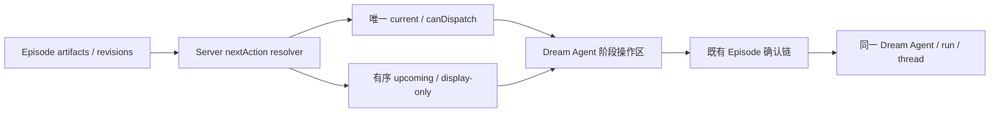
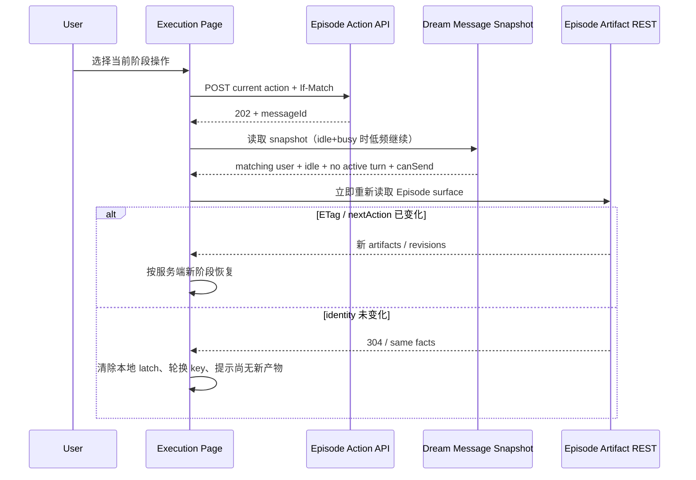

# drama-forge 第一集真实 Run 与 Dream Agent 阶段操作返工记录

> 日期：2026-08-06
> 性质：真实验收问题判定、设计修订与实现证据 owner
> 上游：`design_009_drama-forge-first-episode-storyline-storyboard-workbench.md`
> 约束：不修改 `backend/database.py`，不写入或迁移真实用户数据库/Agent workspace，不执行归档

## 0. 本轮规划前置器

### 0.1 Optimized Prompt

基于用户截图、真实 Run 的只读数据库/文件事实、vendor README 与现有 Story Workspace 合同，复现“202 accepted 后页面无产物且永久锁定”的确定性原因。先修订 canonical 设计，再用独立 TDD 单元修复 canonical project 启动与恢复指令、Dream Agent 公共消息安全投影，以及对话框的后端阶段操作菜单和 accepted message 归并。所有派发授权继续由服务端 Episode facts 拥有；不放宽 binding/path 权限，不用浏览器超时冒充服务端完成，不用 mock 冒充真实 drama-forge 产物。

### 0.2 Optional Enhancers

- 把“Agent 技术轮次结束”和“Episode artifact 到达”拆成两个可机器验证的事实。
- 对 action menu 同时验证 vendor 顺序、唯一当前授权和公共显示命令安全性。
- 对现有显示名目录只提供 fail-closed 的受控整理指令，不在 binder 中静默迁移。

### 0.3 执行计划

1. 只读核对真实 run/thread/Deck binding、Agent source metadata、Episode binding 文件和 artifact 清单。
2. 对照 vendor `drama-init → drama-plan → drama-script → …` 与 binding project identity 合同，确定真实阻断点。
3. 修订 `design_009`，固定产品操作名、安全边界、两项直显/更多折叠和 messageId 归并规则。
4. R1/R2/R3 分别执行 Red、Green、聚焦回归和独立 commit。
5. 交叉评审合同、权限、恢复、无障碍与回归；在隔离 QA 环境做浏览器验收。

### 0.4 验收标准

- 真实根因有 DB、workspace 文件和生产代码行号证据，不能把 Deck `binding_revision` 当 Episode binding。
- launch/recovery 不再允许显示名目录与 `project_id` 漂移；binder 继续 fail-closed。
- Dialog 只消费服务端 `actionOptions`，前 2 项直显，第 3 项起折叠，当前项复用既有受控派发。
- accepted latch 只能按相同 `messageId` 的持久 user message与服务端 idle/no-active-turn/canSend 事实归并；Agent 技术轮次结束但无 artifact 时可再次操作。
- 内部诊断不进入公共消息；`/drama-plan` 与 `/drama-script (EP01)` 作为审定产品入口仍可显示。
- pytest、Playwright Node seam、`npx tsc -b` 与改动前端 ESLint 通过；真实外部链路未跑通时诚实记录。

## 1. 真实现场与问题判定

### 1.1 安全只读事实

用户截图对应 Run `run_b81d3731b56b4703868b66af76e7b656`。只读核对证明：

- run 与技术 thread、Deck、Dream Agent provenance 一致，`agent_id` 不是已证明的根因；
- `.dream` 三个 stage 已存在，但 `episode.json` 与 Episode workflow facts 不存在，因此页面应为 unbound；
- story 物理目录使用显示名“浮世行路”，其后补写的 `project.yaml` 却声明 `project_id/project_slug=fleeting-world-walk`；
- Episode 目录只有提前生成且格式无效的 `storyboard.yaml`，没有 `episode-outline.md`、`script.md`、`prompts/`、`renders/`、`review-report.md`；
- 用户手动输入 `/drama-script (EP01)` 后，Dream Agent 也确认上游 outline 缺失并要求先执行 `/drama-plan`。

本记录不复制用户原始创作文本、绝对 workspace 路径、凭证或 Agent 工具参数。

#### 真实 Run 只读查询摘要

| 事实 | 只读结果 | 判定 |
| --- | --- | --- |
| workflow run | `status=queued`、`status_version=2`、`created_by=28`、`agent_session_id=NULL` | 不能把 queued 或 NULL agent session 解释为 Episode binding |
| source thread | `30396299-54b3-5227-bcc1-7c9a60dd05d8` | 与 run source 一致 |
| Dream Agent | source metadata 的 Agent ID 与 thread voice `b35f4e69-a2fd-4542-88bb-fbd7bef7634a` 一致 | provenance 已证明，截图中的 `agent_id=null` 是 Agent 文本误判 |
| agent session count | 当前 run 为 `0` | 外部 runtime session 未持久化；不是 canonical project discovery 的拒绝原因 |
| Episode binding | `.dream/runtime/runs/<run>/episode.json` 不存在 | `bindingAvailability=unbound` 是诚实事实 |
| workflow facts | `.dream/runtime/runs/<run>/episode-workflow.json` 不存在 | 不能从本地 UI 或 Agent 消息推导 next action |

查询只读取 `workflow_runs`、`chat_thread`、`chat_message.metadata` 与 `agent_sessions`；没有执行 UPDATE/INSERT/DELETE。

#### 真实 artifact 清单

| 相对事实 | 存在性 |
| --- | --- |
| `.dream/runtime/runs/run_b81d3731b56b4703868b66af76e7b656/run.json` | 存在 |
| `.dream/runtime/runs/run_b81d3731b56b4703868b66af76e7b656/stages/{characters,scenes,storyboards}.json` | 三个 stage 均存在 |
| `stories/浮世行路/project.yaml` | 后补写；`project_id/project_slug=fleeting-world-walk`，与目录漂移 |
| `stories/浮世行路/episodes/EP01/storyboard.yaml` | 存在，但内容是 Markdown 结构，不符合受审 storyboard YAML |
| `episode-outline.md` | 不存在 |
| `script.md` | 不存在 |
| `prompts/` | 不存在 |
| `renders/` | 不存在 |
| `review-report.md` | 不存在 |

### 1.2 问题 A：绑定恢复被拒绝

问题
→ 页面提交恢复后仍保持 unbound。

现状证据
→ `backend/services/story_workspace/episode_binding_service.py:34-45,390-451` 的 canonical project discovery 只接受 ASCII slug 目录，并要求目录名与 `project_id` 相同；`backend/libs/claude_agent_kit/server/story_workspace_tool.py:453-456` 在无法发现唯一 canonical project 时拒绝绑定。真实目录名与 `project_id` 漂移。

根因
→ 基线 `425f8a1` 的 `backend/services/story_workspace/dream_launch_gateway.py:679-690` 只约束 run→characters→scenes→storyboards，没有把 vendor `drama-init` 与 canonical project identity 设为 Episode 前置条件；Dream Agent 把中文显示名当成 story 物理目录。

可选方案
→ 放宽 binder 接受任意目录；backend 静默 rename；共享 canonical instruction + 同一 Agent 的 fail-closed 受控整理。

最终决策
→ 保留 binder 的 ASCII、目录同名、可信根目录与 fail-closed 边界，同时兼容 vendor `project.yaml` 实际写出的唯一根级 quoted/unquoted ASCII `project_id`。launch 与私有 Dream context 共享 project identity 约束；纯中文显示名的 fallback 唯一固定为 `proj-` + 原始 UTF-8 bytes 的 SHA-256 前 8 位，不做 Unicode normalization。恢复时只有唯一目录、唯一合法 `project_id`、目标不存在且无符号链接时，才允许同一 Dream Agent 整理目录并刷新 stage；否则继续 unbound。

影响范围
→ launch instruction、Dream context builder、Episode recovery envelope；不改数据库 schema 和 artifact owner。

风险
→ 当前真实 Run 仍需再次执行恢复操作才能由新指令处理；本轮不直接改写用户 workspace。`vendor/` 是 `.gitignore` 排除的只读参考副本，其 `init_project.py` 使用 Python Unicode `\w`，纯中文名称不会进入脚本自带的 MD5 fallback；本轮没有 force-track 或伪称修复该上游制品，tracked production 侧通过唯一 canonical 指令规避。

验收方式
→ launch/context/recovery 固定中文 golden 与 no-normalization pytest；binder quoted/unquoted、LF/CRLF、跨行、VT、FF、多声明、越权、目录漂移与符号链接测试继续 Green。

### 1.3 问题 B：202 accepted 后永久锁定

问题
→ 按钮长期显示“已提交关联恢复”，刷新前不能再次操作。

现状证据
→ 基线 `425f8a1` 的 `frontend/src/pages/story-workspace/StoryWorkspaceExecutionPage.tsx:480-488,540-546,659-719` 只在 Episode surface identity 改变时清除 `episodeDispatchedIdentity`；真实 Agent 技术轮次结束但没有生成 canonical artifact，identity 不变。基线 Dream Agent hook 只在 lifecycle=streaming 时连接 SSE，对 `idle + busy` snapshot 没有后续 REST reconcile。

根因
→ 浏览器只保存 action identity，没有保存 202 返回的 `messageId`；“消息已接受”“Agent 本轮结束”“artifact revision 到达”三个事实被合并成一个本地 latch。

可选方案
→ 固定超时解锁；只看未关联的 `canSend`；使用 `matching messageId user → idle + activeTurnId=null + canSend` 的持久 claim 事实，并继续读取 Episode REST facts。

最终决策
→ 采用第三种。时间只触发低频读取，不形成完成事实；服务端 `pending/dispatching` claim 会保持 `canSend=false`。只有相同 `messageId` 的 user message 已持久化、lifecycle idle、无 active turn 且 `canSend=true` 时，才能清除本地 latch并轮换幂等键。公共 assistant 文本是可选输出，不作为终止必要条件，避免 tool-only 轮次再次锁死。

影响范围
→ Dream Agent snapshot hook、Execution Page action session、Dialog action busy/disabled copy。

风险
→ 如果服务端 claim 永久保持 pending，页面仍诚实显示 busy；本期不增加 Episode 失败/人工重试状态机。

验收方式
→ hook pure test、Execution Page deferred browser seam 和相同 revision 无产物测试。

### 1.4 问题 C：内部诊断进入公共 Dream Agent 消息

问题
→ 截图出现 `agent_id`、`binding_revision`、内部绑定动作和拒绝码分析。

现状证据
→ 基线 `425f8a1` 的 `backend/services/story_workspace/dream_agent_message_service.py:371-378` 只检查通用敏感词、绝对用户路径、明确 secret 与高熵 token；Agent 把内部诊断写入普通 text 后不会被阻断。

根因
→ text projection 的 fail-closed 规则只覆盖路径、凭证、隐藏推理和高熵 token。

最终决策
→ snapshot 与 SSE 统一增加内部 Dream diagnostic 标记；匹配时输出固定安全投影。受审 vendor `/drama-*` 产品操作名不在该 denylist。

验收方式
→ persisted parts 与跨 SSE frame Red/Green；安全 vendor action 反例。

## 2. 交互修订

### 2.1 服务端菜单事实



### 2.2 对话框线框

```text
┌ Dream Agent ─────────────────── 收起 ┐
│ ◌ Dream Agent 正在处理上一条消息     │
│                                      │
│ 第一集后续操作                       │
│ [ /drama-plan      规划第一集 ]       │
│ [ /drama-script…   随后可用   ]       │
│ [ 更多工作流操作（7） ▾ ]             │
│                                      │
│ 给 Dream Agent 留言                   │
│ …                                    │
└──────────────────────────────────────┘
```

前两项直接显示不代表两项同时授权；当前项可操作，下一项用于解释顺序且不可越级。更多项不抢占故事线主层级。

### 2.3 接受与恢复时序



## 3. 实现台账

设计独立评审首轮为 FAIL：发现公共 assistant 不能作为技术 claim 终止必要条件、后续 disabled 与桌面 Escape 语义不完整。修订为 matching `messageId` user + idle/no-active-turn/canSend，并补齐 desktop+narrow Escape 与 disabled accessible name 后，`design_009` §27 复评为 **PASS，P0/P1/P2 均为 0**。

### 3.1 Subagent-Driven + TDD + 双阶段评审

| 单元 | Red | Green / 回归 | 独立评审 | commits |
| --- | --- | --- | --- | --- |
| R1 canonical project、binding 与 action options | action options `9 failed`；vendor probe `2 failed`、quoted binding `3 failed`、fallback `1 failed`、歧义声明 `2 subtests failed`；算法/单行 parser 复评返工 `14 failed, 3 passed, 14 subtests passed` | 聚焦最终 `7 passed, 24 subtests passed`；七组最终 `244 passed, 97 subtests passed in 41.14s`；plugin validate 通过（drama-forge 保留一个既有 root `CLAUDE.md` warning） | 首轮发现 vendor quoted/中文 slug 缺口；二轮发现算法不唯一与 `\s*` 跨行；修订后 PASS，P0/P1/P2=`0/0/0` | `fdc583c`、`05cfd2b`、`436732e` |
| R2 Dream Agent 公共消息安全投影 | 首轮 `6 failed, 1 passed`；camel/snake 与普通“命令”反例 `20 failed, 3 passed, 31 deselected, 38 subtests passed`；completion 叶名/AskUser 路径 `5 failed, 3 passed, 67 subtests passed` | 完整消息适配器最终 `35 passed, 78 subtests passed` | 两轮分别发现 camel/snake 误漏与普通文本误杀、裸 `record_episode_workflow_completion`/AskUser 路径；修订后 PASS，P0/P1/P2=`0/0/0` | `32f8dfe`、`89f9adf`、`61f92bc` |
| R3 Dialog actions + message-bound reconcile | 合同/菜单/settle 首轮失败；复评返工明确复现内部 marker/错配 display command 与 390px Shift+Tab 逃逸；追加 disabled+`tabindex=0` 对抗项 | 改动 6 个 Node seam 文件最终 `79 passed (7.5s)`；复评聚焦 `44 passed` + `12 passed`；`npx tsc -b` 与 11 个 TS/TSX/e2e 文件 ESLint 均 exit 0 | 首轮 FAIL，P1=2；补固定 action→display command、安全字符串策略、可见 focus candidate 过滤后 PASS，P0/P1/P2=`0/0/0` | `10411b9` |

所有 commit 只包含各实现单元 owner；文档在实现评审后独立提交。`backend/database.py` 未修改。

### 3.2 最终生产证据

- canonical fallback helper 与公共/私有/恢复约束：`backend/services/story_workspace/canonical_project_instruction.py:8-57`；固定 golden 为 `郑州暴雨夜 → proj-396e4c1b`，`é` 与 `e\u0301` 不归一化。
- quoted/unquoted 单行 project identity reader：`backend/services/story_workspace/episode_binding_service.py:37-45,388-404`；安全 openat、`O_NOFOLLOW`、inode pin 与大小限制仍在同文件 `:87-220,327-404`。
- vendor 顺序与受审显示入口：`backend/services/story_workspace/episode_action_service.py:81-155`；`actionOptions` 从当前 action 派生有序后缀见同文件 `:654-679`。
- Dream 公共诊断 denylist 与 AskUser 路径投影：`backend/services/story_workspace/dream_agent_message_service.py:147-160,390-413,632-652`；snapshot/SSE 共用该投影，Agent message 不拥有 artifact。
- 前端固定 action→display command 合同与 internal marker 策略：`frontend/src/hooks/story-workspace/contracts.ts:497-507,1018-1020,1428-1500`。
- accepted message 归并与 idle+busy polling：`frontend/src/hooks/story-workspace/useStoryWorkspaceDreamAgent.ts:38-60,693-707`；Execution Page 保存 `messageId`、清除本地 latch 并继续 REST revisions：`frontend/src/pages/story-workspace/StoryWorkspaceExecutionPage.tsx:564-586,709-816`。
- 前两项直显、其余折叠、双层 Escape 与 focus candidate：`frontend/src/components/story-workspace/dream/StoryWorkspaceDreamAgentDialog.tsx:40-83,136-157,203-315`；操作区位于“正在处理”提示与留言输入之间。

### 3.3 最终验证

| 门 | 结果 | 说明 |
| --- | --- | --- |
| 直接相关后端 6 组 | `217 passed, 175 subtests passed in 65.09s` | 最终代码上的 canonical、binding、actions、messages、launch、context |
| R1 独立最终 7 组 | `244 passed, 97 subtests passed in 41.14s` | 含真实 MCP bind 拒绝、权限与 artifact API |
| Story Workspace pytest 全组 | `731 passed, 325 subtests passed, 2 failed` | 两个未被本轮修改的并发时序用例失败；单独重跑仍失败：confirmation manual-clock heartbeat 与 cross-process CAS 5 秒 ready timeout。本轮不把它们伪报为 Green，也不越界改其 owner。 |
| 前端改动 Node seam | `79 passed (7.5s)` | 6 个改动测试文件，单 worker |
| TypeScript / ESLint | exit 0 / exit 0 | `npx tsc -b`；11 个改动 TS/TSX/e2e 文件 |
| 新菜单隔离 Chromium | `1 passed (2.0s)` | 390px + 1024px、前二/折叠、disabled、Tab/Shift+Tab、Escape、无横向溢出；trace 含截图 |
| 完整 Execution mock E2E 重跑 | 未形成新 Green | 独立 4177 Vite 已就绪，但两次 Chromium `page` fixture 启动均未进入产品断言；第一次 30 秒 setup timeout，第二次 180 秒仍卡在浏览器启动后人工终止。06:42 的旧完整页截图/trace 只作为任务三既有确定性 UI 证据，不冒充本次菜单重跑。 |

本次菜单证据：

- 截图：`output/playwright/story-workspace-dream-agent-actions-r3/dream-agent-workflow-actions-390.jpeg`（10,887 bytes，SHA-256 `7c96a96d16cc84cba662e80933f651745064a6c380396370f08dc03e6757d0ae`）
- trace：`output/playwright/story-workspace-dream-agent-actions-r3/trace.zip`（124,499 bytes，SHA-256 `4512c5337e42f488c18e1907deb5dbc6f7847687f920bcb875f173ee2f09fde8`）
- 既有完整页证据：`output/playwright/story-workspace-episode-execution-u12/`（2026-08-06 06:42，桌面/窄屏/故事线/确认弹窗截图与 trace）

### 3.4 服务与工作区收尾

- 本轮启动的隔离 `127.0.0.1:4177` Vite 与失败 Chromium/Playwright 进程均已关闭；4177 无监听。
- 用户原有 Vite 5173（PID 29200）、Vite 5174（PID 11923）与 backend 8765（PID 77765）仍在运行，未关闭或重启。
- 测试生成的 `frontend/test-results` 改动和错误目录已清理；未提交其他工作线文件。

## 4. 诚实边界

- 没有直接修改真实 Run 的 story 目录、Episode binding、artifact 或数据库行；真实只读 run/thread/Deck/Agent provenance 和 artifact 缺失清单仍是第 1.1 节事实。
- 当前真实 Run 仍需要在部署新代码后再次执行“恢复第一集关联”；其 Episode artifact revisions 目前没有新证据，不能宣称已恢复或已完成第一集。
- ignored vendor `slugify` 的纯中文缺陷仍是上游遗留；tracked canonical 指令可以规避，但本仓库没有可提交的 vendor patch owner。
- 外部 Dream Agent 模型、渲染服务、凭证与长耗时 `/drama-render + /drama-voice` 没有在本轮重跑；确定性 fixture 不能冒充真实媒体成功。
- Story Workspace 全组 pytest 的两个既有并发时序失败和完整页 Chromium setup 阻断均已在第 3.3 节列出，不以预期行为推断通过。
- 本轮不执行归档操作。
