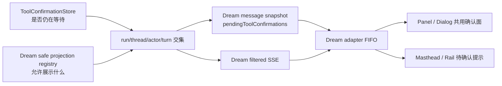
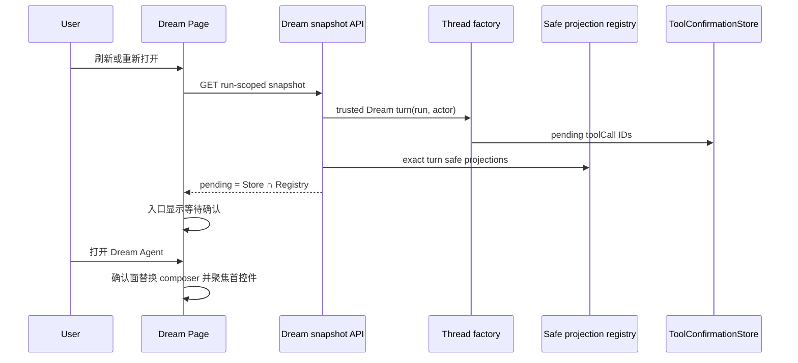

# Dream Agent 工具确认恢复与 Panel 可见性返工记录

> 日期：2026-08-06  
> 性质：真实阻塞问题判定、设计修订、实现与验收证据 owner  
> 上游：`design_008_dream-reentry-and-agent-workbench.md`  
> 约束：不挂载通用 Chat，不公开 thread/Deck/raw tool input/绝对路径，不修改 `backend/database.py`，不执行归档

## 0. 本轮规划前置器

### 0.1 Optimized Prompt

复现并修复“Dream Agent 已请求工具确认，但 Story Workspace Dream Agent Panel 仍显示正在处理和留言表单，实际 Write 工具确认只在通用 Chat 的 `ToolConfirmationDock` 出现并阻塞”的真实链路问题。先从真实 thread factory、Dream snapshot/SSE adapter、确认 registry、Panel/Dialog 与通用 Chat 恢复机制取得证据，再修订 canonical 设计。实现必须让安全的待确认投影可由 run-scoped Dream snapshot 恢复，在 Panel/Dialog 的原输入区内显示同一 Dream 专属确认面，并在 Panel 隐藏时给出明确入口提示；不得复用 `ChatView`、`ChatPanel` 或 `ToolConfirmationDock`，不得向 Dream DOM/API 复制绝对路径、原始工具参数、凭证、隐藏推理和调试事件。

### 0.2 Optional Enhancers

- 用真实 runtime `ToolConfirmationStore` 判定“仍在等待”，用 Dream safe projection 判定“允许展示什么”，两者取交集，避免陈旧确认。
- 对首次订阅、晚订阅、SSE 断开重连、页面刷新、通用 Chat 代为解决、turn 终止分别建立确定性测试。
- Panel 关闭时不抢占用户编辑焦点，只在 masthead/rail 宣告待确认；用户打开 Panel 后聚焦第一个确认控件。

### 0.3 执行计划

1. 核对真实 factory snapshot 与测试桩差异，复现 SSE 因 turn ID 缺失而提前 idle。
2. 固定 tool confirmation 的 runtime truth、safe display truth、snapshot/SSE 与 UI owner。
3. 独立评审设计裁决；不通过先修订。
4. 后端 Red/Green：trusted Dream turn accessor、snapshot pending projection、registry 断线恢复与清理。
5. 前端 Red/Green：snapshot hydration、Panel/Dialog 共用确认面、隐藏 Panel 提示、焦点与窄屏。
6. 独立代码评审，运行 pytest、Playwright Node seam、TypeScript、ESLint 与隔离浏览器验收。

### 0.4 验收标准

- 真实 thread factory 不再让 Dream SSE 因空 turn ID 退回 idle；run/thread/actor/turn 绑定仍 fail closed。
- snapshot 仅返回仍在 runtime 等待且已有安全投影的确认；刷新或断线重连不丢确认，resolve/terminal/turn replacement 不留陈旧确认。
- Panel/Dialog 继续只挂 `StoryWorkspaceDreamToolConfirmation`；源码和运行时没有 `ToolConfirmationDock`、`ChatView`、`ChatPanel`。
- Dream API/DOM 不含用户绝对路径、raw input、凭证、隐藏推理、MCP 参数和调试事件。
- Panel 隐藏时入口显示“等待你确认”；不自动切走内容编辑区；打开后焦点进入确认控件，解决后恢复留言表单。
- 后端 actor/run 越权、路径/参数泄漏、FIFO 与清理测试通过；前端 snapshot/reconnect/focus/390px 测试通过；`npx tsc -b` 与改动文件 ESLint 通过。

## 1. 问题判定与产品裁决

### 1.1 问题：源码已经挂载确认面，真实窗口仍不显示

问题  
→ 用户在 Dream Agent 中触发 Write 后，Panel 长期显示“Dream Agent 正在处理上一条消息”，通用 Chat 却出现带绝对 `script.md` 路径的 `ToolConfirmationDock`。

现状证据  
→ Panel 已在 `frontend/src/components/story-workspace/dream/StoryWorkspaceDreamAgentPanel.tsx:113-120` 用 `agent.pendingToolConfirmation` 替换留言 form；Dialog 在 `StoryWorkspaceDreamAgentDialog.tsx:292-299` 使用同一组件。通用 Chat 则从已加载 message tool parts 推导 pending，并把 raw `input` 交给 Dock（`frontend/src/components/chat/ChatPanel.tsx:508-529,644-652`、`frontend/src/components/chat/toolConfirmation.ts:24-36,103-112`）。

根因  
→ 缺口不在 JSX 挂载，而在真实 turn 发现与确认恢复链路。

补充真实 provenance 证据  
→ 对用户指出的那一次 `EP01/script.md` Write 做只读数据库核对后，对应 assistant 的 `story_workspace_dream_source.kind` 为空，其用户消息也没有 `story-workspace-dream-agent-user` metadata；它是同一 thread 上的 generic Chat turn，不是 Dream form 的可信 run-scoped turn。`ClaudeAgentThreadFactory.is_expected_story_workspace_dream_turn` 只接受 `story-workspace-dream-launch`、`story-workspace-dream-confirmation`、`story-workspace-dream-agent-user`（`backend/claude_agent/thread_factory.py:255-297`）。最近由真实 Panel 发出的消息则具有 `story-workspace-dream-agent-user` source。

可选方案  
→ 直接把通用 Dock 挂进 Dream；只改 Panel 条件；修复 Dream 专属 trusted turn + safe snapshot/SSE 恢复。

最终决策  
→ 采用第三种。通用 Dock 以 thread/raw input 为合同，会破坏 Dream 的安全与模块边界；现有 Dream 专属确认面是唯一 UI owner。不得仅凭共用 thread 把 generic Chat pending 接管到 Dream。只有从 Dream 阶段操作或 Panel form 经服务端 claim 形成可信 Dream provenance 的新 turn，才能在 Dream snapshot/SSE 中显示确认；既有 generic Chat pending 留在原发起工作面解决。

影响范围  
→ Dream thread factory 内部 accessor、message snapshot/SSE adapter、hook reconciliation、Panel 入口与焦点；不改变 artifact truth ownership。

风险  
→ 若只增加前端样式，真实 Dream turn 的确认仍不可达；若直接公开通用 session snapshot，又会扩大 turn 元数据暴露面。历史 generic Chat turn 可能继续占用同一 thread，用户需要在原工作面解决一次后，再从 Dream 的受控操作继续。

验收方式  
→ 源码 import graph、API payload、运行时 DOM 与真实 factory seam 四类证据联合验证。

### 1.2 问题：真实 factory 与测试桩合同漂移，SSE 直接退回 idle

问题  
→ Dream snapshot 显示 streaming/busy，但事件适配器拿不到真实 active turn。

现状证据  
→ Dream service 从 `session_snapshot()` 读取 `current_turn_id`（`backend/services/story_workspace/dream_agent_message_service.py:1134-1136,1313-1328`）；真实 `AgentRunState.snapshot()` 只返回通用诊断字段，没有 `current_turn_id`（`backend/claude_agent/thread_pool.py:261-278`）；现有 `_Factory` 测试桩却额外返回该字段（`backend/tests/test_story_workspace_dream_agent_messages.py:57-62`）。

根因  
→ Dream adapter 依赖了通用 diagnostic snapshot 未承诺的私有字段，测试 double 把不存在的生产合同伪装成存在。

可选方案  
→ 给通用 snapshot 加 turn ID；让 Dream service 直接访问 pool/state；由 thread factory 增加 run/actor 绑定的 Dream 专属只读 accessor。

最终决策  
→ 采用专属 accessor。factory 在内部同时校验 session、current turn、Dream context、message metadata 与 actor/run，再只向 Dream service 返回当前 turn ID 和 runtime pending toolCall IDs；不修改通用状态 API。

影响范围  
→ `backend/claude_agent/thread_factory.py`、Dream message service 和对应 fake factory。

风险  
→ accessor 与 `is_expected_story_workspace_dream_turn` 若各自复制校验会漂移；实现应共用一个私有 trusted-state resolver。

验收方式  
→ 使用真实 `ClaudeAgentThreadFactory`/pool state 的聚焦 pytest，而非只用自定义 dict fake。

### 1.3 问题：待确认只存在于瞬时 SSE，刷新/断开即丢

问题  
→ Hook 只有收到 `tool_confirmation_requested` 才有 pending；刷新 snapshot 后无法恢复，最后一个 Dream SSE subscriber 离开还会删除确认 projection。

现状证据  
→ snapshot 合同没有 pending 字段（`backend/story_workspace/contracts.py:369-380`、`frontend/src/hooks/story-workspace/contracts.ts:275-284`）；Hook 仅在 SSE 分支入队（`frontend/src/hooks/story-workspace/useStoryWorkspaceDreamAgent.ts:754-767`），`reconcile()` 不恢复 pending（同文件 `:659-670`）；registry 在最后订阅释放时清除（`backend/services/story_workspace/dream_agent_message_service.py:982-1003`）。

根因  
→ 旧设计把 browser subscription lease 错当成 pending display projection 的生命周期 owner；但 runtime Future 仍可能等待用户决定。

可选方案  
→ localStorage 保存；持久化 raw tool args；snapshot 返回安全投影并以 runtime pending store 过滤。

最终决策  
→ 采用第三种。runtime `ToolConfirmationStore` 是“是否仍等待”的唯一技术 truth，Dream registry 只拥有 allowlisted display projection；snapshot 返回二者交集。非 terminal 的订阅释放不再删除仍等待的 projection，resolve、terminal、turn replacement 或 runtime 不再 pending 时清理。

清理 owner 与触发机制  
→ safe projection registry 归 thread factory 的 turn-scoped 基础设施持有，Dream message service 仍唯一负责把 raw approval 变成 allowlisted projection。factory 在新 turn 建立前和 `_run_turn_task` finally 中按旧 turn 清理全部 projection；Dream confirm 在 POST 时重新取得 exact trusted turn 与 runtime pending IDs，先 prune 已不 pending 的 projection，再要求目标同时存在于 runtime pending 与 safe registry，任一不成立即 fail closed 409 并同步删除陈旧 exact key；resolve 成功立即删除 exact key。snapshot 读取时同样按 runtime pending IDs opportunistic prune 后才返回交集。tool output 由在线 adapter 提前删除只是低延迟优化，不再是 terminal/timeout 清理的唯一 owner。

影响范围  
→ snapshot contract、registry lifecycle、frontend parser/reconcile/FIFO；不新增 DDL，不用 localStorage。

风险  
→ 页面从未订阅过时 registry 尚无 projection；snapshot 后连接 EventBus replay 仍负责首次安全投影。后端进程重启会终止 in-memory Agent turn，因此不能伪称跨进程恢复同一 runtime Future。

验收方式  
→ 晚订阅、断开后 snapshot、resolve、timeout/terminal、新 turn 与 actor/run 隔离测试。

### 1.4 问题：Panel 关闭时没有待确认提示，打开后焦点不进入确认面

问题  
→ 即使 pending 已到达，Dream Page 默认仍显示内容区，masthead preview 没有确认状态；Panel 也没有 Dialog 已有的首控件聚焦。

现状证据  
→ Dream Page 默认 `rightSection='content'`，只在用户点击后打开 Agent（`frontend/src/pages/story-workspace/StoryWorkspaceDreamPage.tsx:127-133,327-333,367-378`）；Dialog 有 pending focus effect（`StoryWorkspaceDreamAgentDialog.tsx:120-127`），Panel 无对应逻辑。

根因  
→ confirmation 只进入展开工作面，没有进入折叠入口的信息层级；Panel/Dialog 的无障碍行为不一致。

可选方案  
→ pending 自动切到 Agent；保持内容焦点但入口宣告；只改变颜色。

最终决策  
→ 保持内容焦点并显式宣告。masthead/rail 显示“Dream Agent 等待你确认一项操作”并提供清晰 accessible name；不自动切走正在编辑的内容。用户主动打开 Panel 后，焦点进入第一个可操作确认控件；解决后恢复原留言 form。

焦点与播报状态机  
→ Panel 关闭时 pending 只更新入口，不移动焦点；用户主动打开且已有 pending 时聚焦队首第一个可操作控件。Panel 已打开且新 pending 到达时，若焦点原在 composer 或因 composer 被替换而落到 document/body，则聚焦队首；若用户正在消息历史、返回按钮或其他导航控件上阅读/操作，只做 polite announcement，不抢焦。队首解决且 FIFO 仍有下一项时聚焦下一项首控件；最后一项解决且 Panel 仍打开时聚焦恢复后的 textarea；Panel 已关闭则不迁移焦点。入口与 Panel 内使用 `role="status"`、`aria-live="polite"`，按 `toolCallId` 记录已播报身份；同一 confirmation 的 snapshot hydration 与 SSE replay 只播报一次，队首身份变化才产生新播报。

影响范围  
→ Dream Page、Rail、Panel、CSS 与浏览器测试；Execution Dialog 沿用现有焦点模型。

风险  
→ 过强 `alertdialog` 会把 inline 工作面误建模为模态框；继续使用命名 `region`，由入口状态与 live announcement 通知。

验收方式  
→ 键盘、读屏 name、焦点、内容区不被抢焦与 390px 无溢出测试。

## 2. 修订后的合同与时序

### 2.1 truth ownership



- runtime store 不拥有可见文案；safe projection 不拥有工具是否仍 pending 的事实。
- snapshot 与 SSE 都只输出安全 projection；raw input 永不进入 Story Workspace 合同。
- 浏览器本地队列只是 snapshot/SSE 的视图状态，不是恢复 truth。

### 2.2 刷新与断线恢复时序



### 2.3 UI 线框

```text
Dream 内容区（不抢焦）                    Masthead
┌──────────────────────────────┐       ● Dream Agent 等待你确认一项操作
│ 用户仍可阅读当前人物/场景内容 │       （点击打开）
└──────────────────────────────┘

展开 Dream Agent Panel
┌────────────────────────────────────┐
│ ← 返回 Dream 内容                  │
│ …安全消息历史…                     │
├────────────────────────────────────┤
│ 待你确认                           │
│ 允许 Dream Agent 使用 Write        │
│ 本窗口不展示原始工具参数或运行路径 │
│                      拒绝  允许本次 │
└────────────────────────────────────┘
```

## 3. 本期不做

- 不把 `ToolConfirmationDock`、`ChatPanel`、`ChatView` 挂进 Dream。
- 不显示用户绝对路径、raw input/output、命令参数、凭证、隐藏推理或调试事件。
- 不把 runtime Future 或 tool args 写入 localStorage。
- 不新增数据库 DDL，也不修改 `backend/database.py`。
- 不把技术 timeout、断线或确认拒绝扩展为 Episode 业务失败/人工重试/归档状态。
- 不执行归档操作。

## 4. 实现与验收台账

### 4.1 设计独立评审

- 首轮：FAIL（P0=0 / P1=1 / P2=2）。遗漏为无 subscriber 时 terminal/timeout 清理 owner、FIFO/Panel 完整焦点迁移，以及 snapshot+SSE 的 live announcement 去重。
- 返工：按本轮 Prompt Architect 补 factory turn lifecycle 清理、snapshot/confirm prune、exact-key resolve、五种焦点路径和按 `toolCallId` polite 播报去重。
- 复评：PASS（P0=0 / P1=0 / P2=0），允许进入实现。

### 4.2 实现台账

待回写 Red / Green / 代码评审 / commit、测试输出、浏览器截图与 trace。
