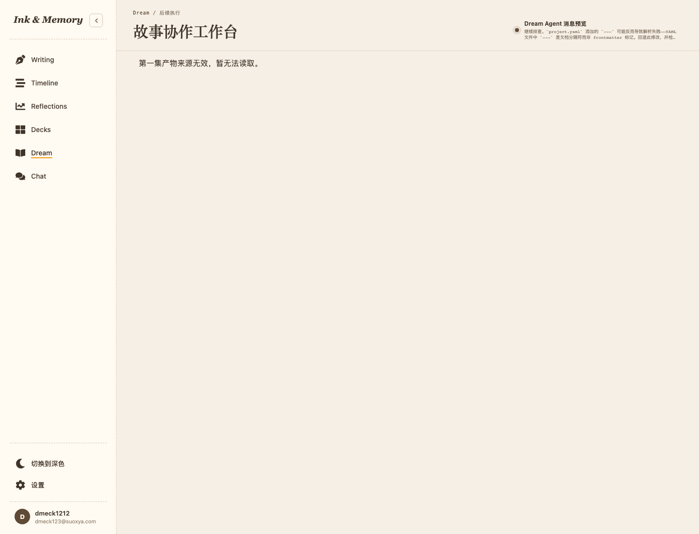
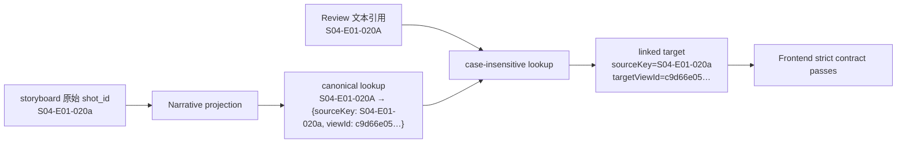

# Episode 产物来源无效：任务一问题判定与实施记录

> 日期：2026-08-06  
> 页面：`/story-workspace/runs/run_b81d3731b56b4703868b66af76e7b656/execution`  
> 范围：只调查、判定与裁决；未修改生产代码、真实 Episode 文件或数据库事实。  
> 账户：`dmeck123@suoxya.com`。本轮用该真实数据库账户的 actor 生成短时本地访问令牌并注入 `auth_token`，没有验证登录表单本身。

## 1. 工作区与安全前置审计

| 检查项 | 证据 | 判定 |
| --- | --- | --- |
| `git status --short` | 命令无输出 | 调查开始时工作区干净，没有需归属的未提交文件 |
| 当前分支 | `story-workspace` | 在既有工作线内调查 |
| 最近提交 | `d4e1253`，`2026-08-06T15:53:03+08:00` | 基线固定 |
| 5173 | PID `87690`，用户 `dmeck`，既有 Vite，cwd 为仓库 `frontend/` | 只读复用，不停止、不重启 |
| 8765 | PID `14009`，用户 `dmeck`，既有 FastAPI/debugpy，cwd 为仓库 `backend/` | 只读复用，不停止、不重启 |
| QA preflight | 项目文件、Node/npm、`@playwright/test 1.62.1`、两端口均通过 | 可进行真实 Chromium 取证 |
| 数据保护 | 所有 DB 查询使用只读 SQLite URI；API 仅 GET | 未修改数据库事实 |

本轮没有输出密码、JWT、内部 actor 数值、绝对业务产物路径、原始请求体或完整业务产物内容。浏览器在 `finally` 中关闭；没有启动或停止开发服务；没有执行归档。

## 2. 真实账户、权限与绑定证据

### 2.1 账户与 run 所有权

短时令牌对应真实 DB 行而非 mock：

```text
GET /api/me -> 200, email=dmeck123@suoxya.com
GET /api/story-workspace/workflow-runs/{run} -> 200, status=queued
authorized relational join count=1
workspace owner matches actor=true
Deck owner/enabled=true
Deck runtime provenance valid=true
同库另一真实 actor GET episode-artifacts -> 404
```

授权不是仅比较 run ID。服务端先联合 workspace、preflight、Deck binding/release、runtime lock/snapshot、Deck、thread 与 source message，并同时约束 `run.created_by`、workspace owner、Deck owner 和 thread user（`backend/services/story_workspace/dream_reentry_service.py:134-209`）；随后再次逐字段核对 launch metadata 中的 actor、workspace、Deck、run 与 thread（`backend/services/story_workspace/dream_reentry_service.py:407-497`）。本次真实 actor 恰好得到一个一致候选，错误 actor 得到 404。

### 2.2 run、Deck、story、Episode 绑定

只读绑定核验摘要：

```text
story authority present=true
canonical story matches authority=true
episode binding JSON contract valid=true
binding run matches=true
binding story matches=true
binding Episode UID matches=true
binding episode code=EP01
```

绑定文件合同强制 run、opaque Episode UID、story slug、`EP01` 与 server-derived Episode root 一致（`backend/story_workspace/contracts.py:1174-1193`）。API gateway 又将 source metadata 的 story authority、canonical project story、持久化 binding 三方比对后才读取产物（`backend/services/deck/story_workflow_gateway.py:1483-1564`）。因此本案不是 run/Deck/story/Episode 绑定失效，也不是权限问题。

### 2.3 workflow 与六类 artifact manifest

真实 API：

```json
{
  "workflow_run_http": 200,
  "workflow_run_status": "queued",
  "episode_artifacts_http": 200,
  "etag_present": true,
  "bindingAvailability": "bound",
  "manifest": {
    "episode-outline.md": "available",
    "script.md": "available",
    "storyboard.yaml": "available",
    "prompts/": "not_generated",
    "renders/": "not_generated",
    "review-report.md": "available"
  },
  "narrative_counts": { "beats": 0, "scenes": 4, "shots": 22 },
  "review_target_count": 4
}
```

`queued` 是旧 `WorkflowRun.status` 事实，不影响已经通过 Dream files、binding 与 Episode artifact REST 证明的可读性。本案文件没有缺失：四个核心/审阅文件均为 `available`；Prompts 和 Renders 是诚实的 `not_generated`，不是 `invalid`、`unavailable` 或 HTTP error。

## 3. 浏览器复现证据

真实 Chromium、1440×1100：

- 页面可见邮箱：`dmeck123@suoxya.com`；
- URL 保持指定 run；
- 全局提示可见：`第一集产物来源无效，暂无法读取。`；
- 同页主动执行 strict parser：`auxiliary.review contains an unknown targetViewId.`；
- `episode-artifacts`：200、ETag 存在、binding 为 `bound`；
- page error：0；
- 应用 console error：1 个 404 资源错误，对应 `/workflow-runs/{run}/events`；
- 两个重复 effect 请求在生命周期清理时 `ERR_ABORTED`，对应资源随后均有成功响应，不是本次错误根因。



截图显示账户邮箱、指定 Execution 页面与全局错误同时存在。浏览器脚本已删除，Chromium 已关闭。

## 4. 问题一：stable source key 被大小写变换后重新生成 view ID

**问题**  
→ review 对 storyboard 中同一个镜头生成了另一个 `targetViewId`。

**现状证据**  
→ storyboard parser 直接读取 `shot_id`，不强制大写，并用原值生成 narrative shot UUID5（`backend/services/story_workspace/episode_artifact_adapter.py:527-544,594-618`）。  
→ auxiliary adapter 将 narrative 提供的已知 key 全部 `.upper()`（`backend/services/story_workspace/episode_auxiliary_artifact_adapter.py:221-231,796-804`）。  
→ review `_ordered_matches` 也把匹配结果 `.upper()`（`backend/services/story_workspace/episode_auxiliary_artifact_adapter.py:1499-1507`）。  
→ linked 后 adapter 没有复用 narrative ID，而是以大写后的 key 再次调用 UUID5（`backend/services/story_workspace/episode_auxiliary_artifact_adapter.py:590-638`）。  
→ service 只传 `shot_ids`、beat keys、scene keys，没有传 canonical view ID 映射（`backend/services/story_workspace/episode_artifact_service.py:893-925`）。  
→ 真实响应中的唯一冲突样本：storyboard `S04-E01-020a` 对 review `S04-E01-020A`；两者都被标记为同一 linked 镜头，但 UUID 前缀分别为 `c9d66e05` 与 `52ceb757`，`target_matches_narrative=false`。`S04-E01-020b` 没有在当前 review 的四个 target 中出现，因此本轮不虚构其运行时冲突。

**根因**  
→ lookup normalization 与实体 identity 混为一体；auxiliary adapter 在 normalization 之后重新拥有了 narrative view ID 的生成权。当前不存在可传递/复用的 canonical `sourceKey → viewId` 映射，只有已经投影出的实体 ID 和被降格成 set 的 source keys。

**可选方案**

1. 修改真实 storyboard 或 review-report 大小写：拒绝。它篡改真实产物，只能掩盖 adapter 缺陷。
2. 前端忽略未知 `targetViewId`：拒绝。它削弱跨引用安全合同并允许虚假 linked 状态。
3. auxiliary 继续自行重算 ID：拒绝。任何大小写或未来 normalization 漂移都会再次分叉。
4. auxiliary 复用 narrative canonical source-key-to-view-ID 映射：采用。
5. 引入统一 source key normalization：采用，但只作为 lookup key；不得拿 normalized 文本重新生成既有 narrative entity ID。

**最终决策**  
→ narrative projection 是 beat/scene/shot view ID 的唯一 owner。Episode service 从已经投影的 narrative 实体构建三类 canonical 映射，并传给 auxiliary adapter。adapter 用统一的大小写不敏感 lookup key 查找，命中后返回 canonical source key 与 canonical view ID；prompt、render queue 与 review target 都复用该 ID。真实不存在的引用继续为 `orphan` 且 `targetViewId=null`，不得按数组位置配对。linked review target 的稳定 identity 使用 canonical target key；文本中的大小写差异不产生新实体。

**影响范围**  
→ backend narrative/auxiliary adapter 接口、Episode service 调用点、prompt/render/review 关联测试、public surface contract 测试；不修改真实产物。

**风险**  
→ 规范化后可能出现两个 narrative source key 的大小写碰撞。必须 fail closed，拒绝构建映射；不能任选一个。orphan 引用必须保留可诊断文本但不可得到 view ID。

**验收方式**  
→ `S04-E01-020a`、`020b` 与 review 大小写变体均命中相同 canonical ID；不存在目标仍 orphan；前端 strict parser 通过；不出现数组下标关联。

## 5. 问题二：一个不一致的 auxiliary link 为什么清空整个首屏

**问题**  
→ API 明明为 200 且核心 narrative 可用，首次加载仍只显示全局错误。

**现状证据**  
→ 前端在解析完整 surface 后，用 narrative 的 beat/scene/shot ID 集合严格检查 prompts、render queue、review targets；未知 review `targetViewId` 立即抛错（`frontend/src/hooks/story-workspace/contracts.ts:2020-2037`）。  
→ fetch boundary 把任意 parser 异常统一转换为 `StoryWorkspaceEpisodeArtifactsContractError`（`frontend/src/hooks/story-workspace/useStoryWorkspaceEpisodeArtifacts.ts:397-444`）。  
→ 首次加载没有 last-good cache；reducer 只记录 `invalid_payload`，`data` 仍为 null（`frontend/src/hooks/story-workspace/useStoryWorkspaceEpisodeArtifacts.ts:571-619`）。  
→ component 在 `episodeSurface === null` 时显示全局“第一集产物来源无效”（`frontend/src/pages/story-workspace/StoryWorkspaceExecutionPage.tsx:1018-1027`）。  
→ 实际 strict parser 错误与上述静态链路一致。

**根因**  
→ 后端把自相矛盾的 `linked + unknown targetViewId` 作为“合法 200 surface”发出，越过了应由 adapter/service 完成的 artifact 隔离边界。前端 strict parser 正确拒绝了不可信的整体 envelope；问题不在安全校验本身，而在后端 truth owner 没有输出 canonical link。

**可选方案**

1. 前端对 review 做宽松 partial parse：拒绝。它让客户端猜测哪些字段还能信任，并掩盖后端错误。
2. 删除 strict cross-link 校验：拒绝。会接受虚假 linked、错误定位和潜在跨实体污染。
3. 后端修复 canonical map，并继续让 malformed auxiliary artifact 在服务端变成对应 manifest `invalid`：采用。
4. 对任何 auxiliary 问题继续全局阻断：拒绝，除非整个 envelope、身份、权限或核心 narrative 合同不可信。

**最终决策**  
→ 保留前端完整 strict parser。正常的 auxiliary 解析/关联失败必须由 backend truth owner 隔离为该 artifact 的 `invalid`，从响应中移除不可信 projection，同时保留可验证 narrative。只有 server envelope 自相矛盾、身份/权限/binding 无效、核心 narrative 无法建立可信边界时才阻断整个工作台。

**影响范围**  
→ 本次生产修复以 backend canonical map 为主；frontend 现有 per-artifact 展示和 strict gate 保留，通过补充回归测试证明行为，不用宽松解析生产代码。

**风险**  
→ 如果仅修当前 review 样本，prompts/renders 在未来生成后仍可能复现同类大小写冲突。因此映射必须覆盖所有 auxiliary-to-narrative link。

**验收方式**  
→ 同一真实 200 响应通过 strict parser；outline/script/storyboard 展示；review 定位到 lowercase narrative shot；单独 invalid review fixture 仍展示 narrative 和局部提示。

## 6. 问题三：artifact 隔离与交互降级边界

**问题**  
→ 需要区分尚未生成、未关联、内容无效、暂时同步失败，并决定哪些错误阻断整个工作台。

**现状证据**  
→ backend 已逐个隔离 narrative parser 失败并把对应 root 标为 invalid（`backend/services/story_workspace/episode_artifact_service.py:797-857`）；也逐个隔离 prompts/render/review parser 失败（`backend/services/story_workspace/episode_artifact_service.py:953-1031`）。  
→ frontend 已按 artifact 保存 mounted-session last-good，并只替换 invalid root（`frontend/src/hooks/story-workspace/useStoryWorkspaceEpisodeArtifacts.ts:497-568`）。  
→ Review panel 已分别呈现 `not_generated`、`invalid`、`unavailable`（`frontend/src/components/story-workspace/episode/StoryWorkspaceEpisodeReviewPanel.tsx:89-95`），并把未关联和孤立引用置于局部诊断区（`frontend/src/components/story-workspace/episode/StoryWorkspaceEpisodeReviewPanel.tsx:360-381`）。  
→ 页面已有四种 manifest 文案（`frontend/src/pages/story-workspace/StoryWorkspaceExecutionPage.tsx:78-93`）。

**根因**  
→ 本案没有走既有的“server-side per-artifact invalid”通道，而是生成了跨 artifact 自相矛盾的 surface，导致更外层 strict gate 生效。

**可选方案**

1. 所有异常都变成同一错误卡：拒绝。
2. 客户端尝试按数组位置补关联：拒绝。
3. 复用既有 manifest availability + association status，明确全局/局部分界：采用。

**最终决策**

| 事实 | 页面行为 | 可继续浏览 |
| --- | --- | --- |
| `not_generated` | 显示“尚未生成”，无内容占位，不伪装数据 | 是 |
| 合法 target 不存在 | target 为 orphan/unlinked，显示“尚未关联/孤立引用”，不提供定位按钮 | 是 |
| 单一 auxiliary `invalid` | 保留 narrative；对应 Review/Prompt/Render 局部显示“内容无效/来源无效” | 是 |
| 单一 artifact `unavailable` | 保留其他产物；显示“当前不可用/暂时无法同步” | 是 |
| GET 暂时性 HTTP error | 有 mounted-session last-good 时继续显示并标注同步失败；首次加载显示可恢复同步状态 | 视 last-good 而定 |
| 权限、run 或 binding 身份不可信 | 不展示可能属于其他主体的内容 | 否 |
| public envelope 自相矛盾 | strict parser 拒绝；不得从未知 payload 里挑字段 | 否 |
| 核心 narrative root invalid | 只移除依赖该 root 的层级；其他经后端重新投影后仍可信的层级可读 | 是 |

→ Review、Prompts、Renders 始终是 auxiliary 层，不抢夺 Outline/Script/Storyboard 主层级。revision 到达后由 ETag/REST poll 重新投影；只要 canonical ID 仍存在，选择 reducer保留当前叙事点/场景/镜头，已删除目标才回退到最近祖先。刷新后只从后端最新事实恢复，不把内存 last-good 冒充持久真相。

**影响范围**  
→ 任务二设计稿需固化状态层级与响应式线框；任务三主要补强测试，除非评审发现现有 UI 与该边界不一致。

**风险**  
→ “invalid”和“unavailable”文案若只出现在顶部汇总，会让用户误以为核心内容也失效；任务二需要把状态放到 artifact 所属位置并保持温和但清晰。

**验收方式**  
→ review invalid fixture、prompts/renders not-generated fixture、HTTP failure + last-good、revision 恢复、刷新与选择稳定性测试；桌面和窄屏可访问。

## 7. 问题四：`/events` 404 旁路异常

**问题**  
→ 浏览器请求 `/api/story-workspace/workflow-runs/{run}/events` 返回 404。

**现状证据**  
→ frontend 明确构造该 URL（`frontend/src/api/storyWorkspaceApi.ts:520-522`），`useWorkflowEvents` 用原生 EventSource 连接，并在 error 后转为每 5 秒轮询 run snapshot（`frontend/src/hooks/useWorkflowEvents.ts:57-87,89-123`）。  
→ backend Story Workspace router 只提供 `/dream-agent/messages` 与 `/dream-agent/events`（`backend/routers/story_workspace.py:1453-1498`），没有通用 `/workflow-runs/{run}/events` 路由。  
→ 真实浏览器网络证据：通用 `/events` 404；workflow run GET 200；episode-artifacts 200。  
→ Episode artifact hook 自己使用 REST + ETag 定时轮询和受控 output event invalidation，不依赖通用 run EventSource（`frontend/src/hooks/story-workspace/useStoryWorkspaceEpisodeArtifacts.ts:647-755`）。

**根因**  
→ 现有通用 Workflow Run SSE client 与 backend 路由不一致；fallback polling 随后接管。这是独立 transport 遗留，不是 Episode surface parser 失败的原因。

**可选方案**

1. 把 404 解释为 artifact API 失败：拒绝，网络证据相反。
2. 本期顺手新增通用 SSE backend：拒绝，会扩大为事件协议、鉴权、重连与游标语义项目。
3. 本期只记录；由独立 transport 工作线统一 backend route 或移除失效 EventSource：采用。

**最终决策**  
→ 不纳入任务三。保持 polling fallback；在最终验收中把该 404 作为诚实遗留单列，不能宣称零应用网络诊断，也不能把它混入本次 stable ID 修复。

**影响范围**  
→ 无生产代码变更；后续独立 Story Workspace event transport 任务。

**风险**  
→ 控制台持续出现 404，增加噪声；run snapshot 实时性退化到 polling。它不影响本次 Episode REST revision 自动恢复。

**验收方式**  
→ 本次修复后即使 `/events` 仍为 404，episode-artifacts 应 200 且 strict parser 通过；页面不再显示全局产物无效。两者分别记录。

## 8. 唯一推荐实施方案

### A. 数据与 adapter 修复

唯一方案：**不改真实文件、不放宽前端；由 narrative projection 成为 view ID 单一 truth owner，Episode service 将 canonical `sourceKey → viewId` 映射传给 auxiliary adapter，大小写规范化仅用于 lookup。**



映射必须覆盖 narrative beats、script scenes、storyboard shots 对 prompts、render queue 和 review targets 的引用。source key normalization 是显式、集中、可测试的查找规则；canonical source key 与 view ID 来自 narrative 实体，不由 auxiliary 重算。

### B. 交互降级

核心 narrative 可用时继续展示 Outline、Script 和 Storyboard。Review 关联不存在时局部显示“尚未关联/孤立引用”；Review artifact 无效时局部显示来源无效；Prompts/Renders `not_generated` 显示尚未生成。权限、身份/binding 或整个 public envelope 不可信时才全局阻断。HTTP error 与内容 invalid 不混用。

### C. `/events`

确认是 SSE client/backend route 不一致，依靠 polling fallback；与本次 parser 失败无因果关系，本期不修。

## 9. 任务一验收结论

| 验收项 | 结果 |
| --- | --- |
| 真实账户邮箱 | 通过：页面和 `/api/me` 均为 `dmeck123@suoxya.com` |
| run 所有权 | 通过：授权 join 唯一，错误 actor 为 404 |
| run/Deck/story/Episode 绑定 | 通过：relational provenance、canonical story、immutable binding 三方一致 |
| workflow run API | 200，status=`queued` |
| Episode artifact API | 200，ETag 存在，binding=`bound` |
| 六类 availability | 4 个 available；Prompts/Renders 为 not_generated |
| frontend strict parse | 失败，精确错误为 unknown `targetViewId` |
| 主根因 | auxiliary 大写 normalization 后独立重算 UUID5 |
| 权限/绑定/缺文件/API | 均排除 |
| stable ID 冲突 | 证实，当前响应 1 个 unknown shot target |
| 全局错误传播 | 证实：200 payload → strict gate → no last-good → global invalid |
| `/events` | 独立 404 + polling fallback，本期不修 |
| 生产代码/真实数据 | 未修改 |

任务一通过，可以进入任务二。任务二必须以本记录的 canonical mapping、server-side artifact isolation、frontend strict contract 保留和 `/events` 独立遗留四项裁决为不可回退输入。
