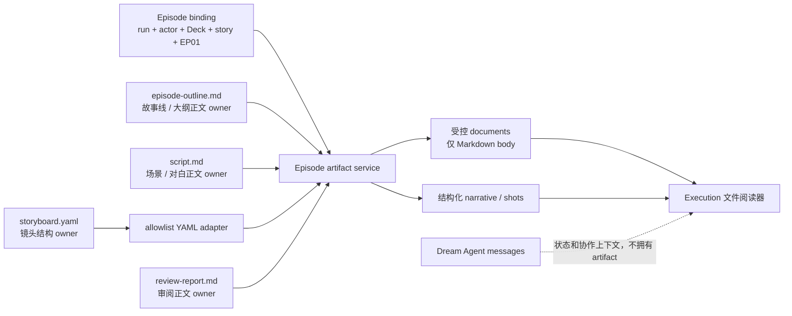
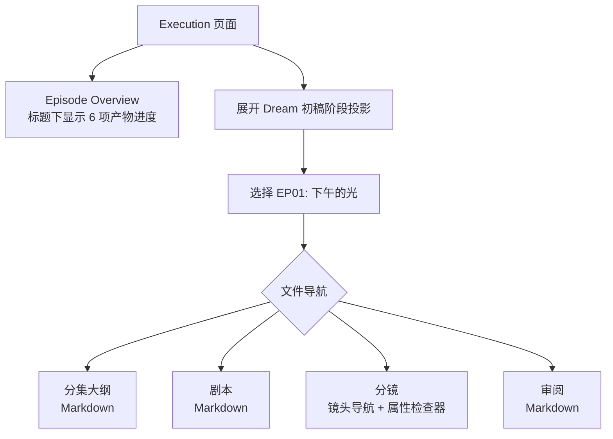

# Episode 产物阅读器与跨源恢复问题实施记录

> 日期：2026-08-06
>
> 范围：Story Workspace Execution / EP01 只读产物投影 / 真实浏览器恢复
>
> 结论：已按真实 Episode 绑定完成实现；未执行归档操作。

## 1. 本轮问题与裁决

### 问题 A：真实文件存在，但 Execution 只能消费摘要

问题

→ 现状证据：原聚合合同只有 manifest、narrative、auxiliary；页面无法取得 `episode-outline.md`、`script.md`、`review-report.md` 的正文。

→ 根因：后端只投影结构化摘要，没有受控 Markdown document DTO。

→ 最终决策：扩展既有 Episode artifact surface，增加最多三份只读 Markdown document；继续复用既有 actor / Deck / run / story / episode 绑定和路径校验，不新增任意路径读取 API。

→ 实现证据：`backend/story_workspace/contracts.py:1979`、`backend/services/story_workspace/episode_artifact_service.py:1004`。

→ 验收：真实响应包含 `episode-outline.md`、`script.md`、`review-report.md` 三份正文，且 document revision 必须与 available manifest 条目一致。

### 问题 B：`.dream` 分镜入口与完整 Episode 产物脱节

问题

→ 现状证据：`storyboards:ep01_storyboard` 只能进入 stage 摘要层。

→ 根因：stage projection 和 Episode artifact surface 没有同一聚焦工作面的阅读适配层。

→ 最终决策：保留 `.dream` 条目作为导航入口；进入 storyboards focus 后显示“分集大纲 / 剧本 / 分镜 / 审阅”四个标签。Markdown 用安全 Markdown 渲染，YAML 不显示原文，只使用既有 allowlist adapter 生成的镜头属性。

→ 实现证据：`frontend/src/pages/story-workspace/StoryWorkspaceExecutionPage.tsx:997`、`frontend/src/components/story-workspace/episode/StoryWorkspaceEpisodeArtifactReader.tsx:257`。

→ 验收：真实 EP01 展示 22 个投影镜头，四个标签可鼠标和键盘切换。

### 问题 C：产物进度不属于 Episode 阅读层

问题

→ 现状证据：`第一集产物进度` 原位于 Execution 外层标题区，与 `Episode Overview` 标题分离。

→ 根因：manifest progress 与 Episode narrative component 的布局 owner 不一致。

→ 最终决策：进度由 `EpisodeOverviewContent` 渲染，位于 Episode `<h2>` 的直接下方；外层页面只传入 manifest facts。

→ 实现证据：`frontend/src/components/story-workspace/episode/StoryWorkspaceEpisodeNarrativeWorkbench.tsx:258`、`frontend/src/pages/story-workspace/StoryWorkspaceExecutionPage.tsx:1224`。

→ 验收：浏览器 DOM 断言 progress 的 `previousElementSibling.tagName === "H2"`。

### 问题 D：API 已返回 200，页面仍显示“第一集产物来源无效”

问题

→ 真实证据：同一浏览器中 API 返回 `bindingAvailability=bound`、3 份 Markdown、22 个镜头，但前端安全 fetch seam 判定为 invalid。

→ 根因一：真实 review 文档中的 `series/project/.../duration_estimate/...` 被前端通用高熵检测误识别为密钥；后端已经把它识别为合法的斜杠分隔 schema 标签。

→ 根因二：跨端口 `5173 → 8765` 时，CORS 只暴露 `X-New-Access-Token`，浏览器 JavaScript 无法读取 Episode 响应的 `ETag`；前端不能完成 header / payload ETag 一致性校验，因此按合同 fail-closed。

→ 最终决策：只放行“四段以上、至少含一个下划线、每段均为普通标识符”的斜杠标签列表，继续拒绝无前缀高熵 token、凭证和绝对路径；CORS 精确增加 `ETag` 暴露头。

→ 实现证据：`frontend/src/hooks/story-workspace/contracts.ts:1147`、`backend/server.py:744`。

→ 验收：前端 hostile-input 测试继续通过；跨源浏览器 fetch 可读带引号 ETag；真实页面不再进入 invalid 状态。

## 2. Truth ownership

- Markdown 文件仍是正文真相源；前端没有本地副本 owner。
- `storyboard.yaml` 仍是镜头真相源；前端不接收也不渲染原始 YAML。
- `.dream` stage 只负责导航和渐进状态，不覆盖 Episode artifact 内容。
- Dream Agent messages 只用于状态与协作提示，不覆盖文件 revisions。

## 3. 交互结果

- 默认进入 storyboards focus 时显示“分镜”。
- 标签采用 roving `tabIndex`，支持 `ArrowLeft`、`ArrowRight`、`Home`、`End`。
- Markdown 使用 `react-markdown + remark-gfm + skipHtml`；远程图片不加载，链接使用安全 renderer。
- 缺失产物显示 manifest 对应的“尚未生成 / 来源无效 / 当前不可用”，不虚构正文。
- 窄屏把文件导航改为两列，镜头导航与属性区纵向排列。

## 4. 安全与恢复边界

- 所有文件先经过可信 Episode root、固定相对键、文件类型、大小和正文审计；没有新增路径参数。
- frontmatter 不进入 document DTO，避免把内部路径或运行元数据带到页面。
- document 与 manifest revision 不一致时，前后端合同都会拒绝。
- REST ETag / revision 仍是刷新和重新进入的恢复事实；localStorage 只存认证信息，不拥有 run、Episode 或 artifact。
- last-good merge 分别缓存 outline / script / review 正文，不让单个新 revision 的暂时异常清空其它有效正文。

## 5. TDD 与验证证据

| 检查 | Red | Green / 结果 |
|---|---|---|
| Markdown document 合同 | `documents` 字段缺失 | 后端聚焦及扩大回归通过 |
| 文件阅读器 | 模块不存在 | 组件及布局 Node seam 通过 |
| review schema 标签 | `documents[2].markdown violates the public_text policy` | 新回归与 hostile-input 回归共同通过 |
| 跨源 ETag | CORS 测试缺少 `etag` | `ETag` 与 `X-New-Access-Token` 均暴露 |
| 后端相关回归 | — | 365 passed |
| 前端类型 | — | `npx tsc -b` 通过 |
| 前端 ESLint | — | 全部改动前端文件通过 |
| 真实浏览器 | 首轮复现“第一集产物来源无效” | 修复后 1 passed，0 个 Story Workspace API 4xx/5xx，0 个 page/console error |

真实验收身份与事实：

- actor：`dmeck123@suoxya.com`（用户 ID 28）
- run：`run_b81d3731b56b4703868b66af76e7b656`
- thread / workspace：`30396299-54b3-5227-bcc1-7c9a60dd05d8`
- story / episode：`proj-da1c690c / EP01`
- episode UID：`432d16772fea4c5489d3a65d8ff3a152`
- 实际投影：3 份 Markdown document、4 个 script scene、22 个 storyboard shot
- 未生成：`prompts/`、`renders/`；页面继续诚实显示“尚未生成”

浏览器证据：

- `output/playwright/story-workspace-real-episode-artifacts/episode-overview-progress-desktop-1440x1000.png`
- `output/playwright/story-workspace-real-episode-artifacts/episode-artifacts-desktop-1440x1000.png`
- `output/playwright/story-workspace-real-episode-artifacts/episode-artifacts-narrow-390x844.png`
- `output/playwright/story-workspace-real-episode-artifacts/episode-artifact-manifest.json`

真实认证浏览器验收不落盘 Playwright trace：trace 会持久化请求头中的短期认证凭证。本轮以无凭证的 manifest、截图、测试输出和浏览器错误/响应断言作为证据。

## 6. 本期未做

- 未把 Dream / Execution 改为 Chat 页面。
- 未新增编辑或回写 Markdown / YAML 的能力。
- 未增加业务失败、驳回、人工重试或归档状态。
- 未用 mock 宣称真实 Episode 链路成功。
- 未生成缺失的 prompts 或 renders。
- 未执行归档操作。
