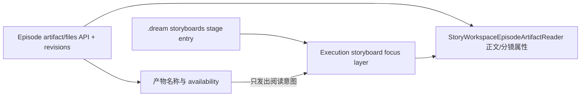

# Episode 产物进度到文件阅读器跳转实施记录

日期：2026-08-06

## 本轮范围

本轮只调整 `Episode Overview` 标题下方的“第一集产物进度”交互：保留原有产物名称与服务端 availability 文案，为已有文件阅读器页面的可阅读产物增加显式入口。未新增路由、文件副本、浏览器持久化 owner 或 Episode 业务状态。

## 问题判定与裁决

问题
→ 产物进度只显示名称与状态，用户必须先手动展开“Dream 初稿阶段投影”，再找到分镜条目，最后在阅读器里切换文件。

现状证据
→ 原进度列表只渲染 `strong + span`；现实现仍保留这两个节点，并在其后追加受控动作，见 `frontend/src/components/story-workspace/episode/StoryWorkspaceEpisodeNarrativeWorkbench.tsx:283`。

根因
→ `StoryWorkspaceEpisodeNarrativeWorkbench` 没有把“阅读某个 canonical artifact”的意图交给 Execution 页面；Execution 页面也没有统一执行展开、选择、滚动与焦点转移。

可选方案

1. 新增独立 artifact 路由：会制造第二套页面恢复与 selection owner。
2. 用 hash 或 DOM 文本查找目标：目标身份不稳定，且不能保证正确 stage 与 tab 状态。
3. 复用现有 `StoryWorkspaceEpisodeArtifactReader` 的 controlled artifact state，由 Execution 页面编排现有 storyboard focus layer。

最终决策
→ 采用方案 3。进度条只发出 allowlist artifact 意图；Execution 页面以 `.dream` storyboards 投影的稳定 entry key 打开既有 focus layer，再设置阅读器的 controlled tab。文件内容仍由 Episode artifact API 与 revisions 拥有。

影响范围
→ Episode Overview 进度列表、Execution 页面受控 focus 状态、阅读器 tab ID seam、桌面/窄屏动作样式和浏览器验收。

风险
→ 若 artifact 已生成但当前 Dream 文件没有 storyboards 投影，则没有可到达的阅读器宿主。当前实现不显示死链接，继续保留原名称与 availability 状态。

验收方式
→ SSR 语义测试、Execution 源码集成 seam、确定性 Chromium、真实账号与真实 run Chromium 验收。

## 交互合同

- `episode-outline.md`、`script.md`、`storyboard.yaml`、`review-report.md` 仅在 availability 为 `available` 且存在 storyboards 投影时显示“阅读”。映射 allowlist 见 `frontend/src/components/story-workspace/episode/StoryWorkspaceEpisodeNarrativeWorkbench.tsx:80`。
- `prompts/` 与 `renders/` 当前没有 `StoryWorkspaceEpisodeArtifactReader` 页签，只保留名称与状态，不显示伪跳转。
- 点击或键盘激活动作后：展开“Dream 初稿阶段投影” → 选择 storyboards entry → 切换目标 artifact → 滚动到阅读器 → 聚焦选中 tab。实现见 `frontend/src/pages/story-workspace/StoryWorkspaceExecutionPage.tsx:629`。
- tab 的 DOM ID 由一个类型受限函数统一生成，调用方不复制字符串拼装规则，见 `frontend/src/components/story-workspace/episode/StoryWorkspaceEpisodeArtifactReader.tsx:32`。
- 窄屏动作满足 `44 × 44px` 最小触控范围，见 `frontend/src/pages/story-workspace/StoryWorkspaceExecutionPage.css:1258`。

## Truth ownership

进度动作不携带正文，不读取任意路径，也不使用 Dream Agent 消息或 localStorage 恢复文件内容。

## TDD 与验证证据

### Red

首次运行两个聚焦文件共 24 项：22 通过、2 失败。失败分别证明：

- 进度列表不存在四个阅读动作；
- Execution 页面不存在 `handleEpisodeArtifactRead` 及其展开/聚焦编排。

### Green

- 聚焦组件、阅读器、页面集成与布局：`38 passed (3.9s)`。
- TypeScript：`npx tsc -b`，退出码 0。
- 确定性 Chromium 当前交互用例：`1 passed (5.2s)`；fixture 同时验证刷新、revision 与窄屏。
- 真实账号 Chromium：`1 passed (6.1s)`；账号 `dmeck123@suoxya.com`，run `run_b81d3731b56b4703868b66af76e7b656`。
- 真实 manifest：`output/playwright/story-workspace-real-episode-artifacts/episode-artifact-manifest.json`。
- 真实截图：
  - `output/playwright/story-workspace-real-episode-artifacts/episode-overview-progress-desktop-1440x1000.png`
  - `output/playwright/story-workspace-real-episode-artifacts/episode-artifacts-desktop-1440x1000.png`
  - `output/playwright/story-workspace-real-episode-artifacts/episode-artifacts-narrow-390x844.png`

真实 manifest 记录：outline、script、storyboard、review 均 available，prompts 与 renders 尚未生成，storyboard 投影出 22 个镜头；aggregate ETag 为 `sha256:0517247d6af6ec5fb68ea1fa74a02692eff0b9f0af079acf21ffc95c0cfeadc0`。

浏览器断言覆盖：四个动作数量、Prompts/Renders 无动作、原始名称/状态仍存在、键盘 Enter 激活、details 展开、剧本/分镜/审阅页签选中与聚焦、页签处于 viewport、Markdown 正文、22 个镜头、390px 无横向溢出、Story Workspace API 失败为零、控制台错误为零。

## 诚实遗留

- 真实 run 的 `prompts/` 与 `renders/` 仍是“尚未生成”，因此本轮没有为其提供文件阅读器入口。
- 本轮没有触发 Dream Agent 工作流，不修改数据库或 Episode 文件。
- 确定性 E2E 文件中的另一个 Dream Agent 工具确认用例仍会因 Vite dev 把绝对样式模块路径写入 `html.outerHTML` 而触发其全页面 `/Users/` 断言；该用例不属于本次产物跳转验收，未计作通过。
- 未执行归档操作。
