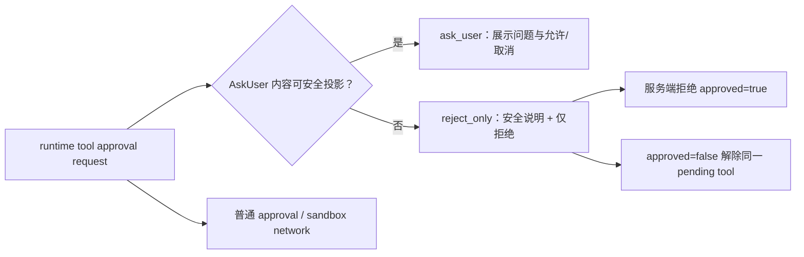

# Dream Agent 不可安全展示工具确认返工记录

> 日期：2026-08-07  
> 性质：问题判定、设计增量、TDD 实现与浏览器验收 owner  
> 上游：`design_008_dream-reentry-and-agent-workbench.md`、`2026-08-06-dream-agent-tool-confirmation-recovery-rework-record.md`  
> 约束：Dream 专属 adapter/component；不挂载 Chat；不公开原始工具参数；不新增业务驳回、失败、重试或归档状态

## 0. 本轮规划前置器

### 0.1 Optimized Prompt

诊断并修复 Story Workspace 的 Dream Agent 中“部分工具确认未像 Chat 页面一样显示”的问题。以通用 Chat 工具确认为交互覆盖参考，但保持 Dream 独立模块、安全投影与 run/thread 可信绑定。先判定确认请求在哪一层丢失，再采用 TDD 修复；任何无法安全投影的 AskUser 请求不得静默阻塞，也不得回退为可批准的通用确认或泄露 raw input，而应提供仅可拒绝的技术授权窗口。Panel 与 Dialog 必须继续共用同一个 Dream 专属确认组件，断线恢复和重复事件语义保持不变。

### 0.2 Optional Enhancers

- 同时校准前端 number input 与后端 `StrictInt` 合同。
- 浏览器验证窄屏下只有安全文案和拒绝动作，点击只产生一次 `approved=false`。
- 独立评审权限提升、敏感信息、runtime pending/registry 和可选回答语义。

### 0.3 执行计划

1. 只读检查 Chat 与 Dream 的确认渲染、Dream SSE 安全投影和运行时 pending registry。
2. 先写 Red：不可安全展示的 AskUser 必须产生 `reject_only`；批准必须被后端拒绝；拒绝可解除 runtime pending。
3. 最小 Green：扩展后端/前端局部合同、adapter parser 和 Dream 专属确认组件。
4. 运行后端、前端、TypeScript、ESLint 与 Chromium 验收。
5. 独立评审；发现问题则打回原实现单元补 Red/Green 后复评。

### 0.4 验收标准

- 安全 AskUser、普通 approval、sandbox network 仍按原合同显示。
- 不可安全展示的 AskUser 不再静默消失，只产生无 questions/network/raw input 的 `reject_only`。
- `reject_only` 前端没有批准按钮；伪造 `approved=true` 在调用 runtime 前返回 422；拒绝只派发一次。
- 敏感问题、placeholder、绝对路径、凭证与原始工具参数不进入 SSE、snapshot 或 DOM。
- Panel 与 Dialog 继续复用同一个 Dream 组件，不引入 `ChatView`、`ChatPanel` 或 `ToolConfirmationDock`。
- 数字回答只允许整数；可选空回答不进入提交 payload。

## 1. 问题判定

问题  
→ 一些工具确认在通用 Chat 能看到，Dream Agent Panel/Dialog 却没有对应窗口，Agent 因此持续等待。

现状证据  
→ Panel 与 Dialog 已经都挂载 `StoryWorkspaceDreamToolConfirmation`，因此不是 surface JSX 缺失；Dream 事件服务在 `_safe_ask_user_questions(...)` 返回空时直接丢弃整个 confirmation，运行时 pending 则仍存在。具体行号以本记录完成后的证据表为准。

根因  
→ Dream 的安全投影把“内容不能公开”与“确认请求不存在”合并成同一个 `None`。这能防泄漏，却让用户无法解除真实运行时等待。

可选方案  
→ 直接挂 Chat Dock；放宽 AskUser 文本过滤；把不安全 AskUser 当普通可批准操作；增加仅可拒绝的安全降级投影。

最终决策  
→ 采用最后一种。内部枚举 `reject_only` 只表示“本次工具授权内容无法安全公开，因此只能拒绝”，不是 Dream/Episode 的业务驳回状态。raw input 不进入 Story Workspace 合同；后端即使收到伪造批准也必须在 runtime dispatch 前拒绝。

影响范围  
→ Story Workspace 后端局部合同、Dream message 安全投影与确认校验、前端局部合同/parser、Dream 专属确认组件及测试。不修改数据库、不改变 `.dream`/Episode artifact truth ownership。

## 2. 增量交互设计

收起入口仍只显示“Dream Agent 等待你确认一项操作”。打开 Panel 或 Dialog 后：

- 可安全展示的 AskUser：显示公开问题和既有选择控件；
- 普通工具/网络：显示既有安全摘要与允许/拒绝；
- 不可安全展示的 AskUser：标题“此请求需要安全处理”，正文不复述原请求，只显示“拒绝并继续”；
- 解决后继续使用既有 turn-scoped tombstone、snapshot reconciliation 和 FIFO 队列，不创建 Chat 会话。

## 3. TDD 与评审证据

### 3.1 Red

- 后端新用例预期 1 个 `tool_confirmation_requested`，实际为 0：`1 failed, 43 deselected`。
- 前端两份聚焦套件：组件缺少 `reject_only` 分支、adapter 返回 `null`，结果 `2 failed, 17 passed`。

### 3.2 Green

- 后端新用例：`1 passed, 43 deselected`。
- 后端完整 Dream Agent message suite：`44 passed, 78 subtests passed`。
- 前端组件与 adapter：返工前 `19 passed`；可选答案净化返工后 `20 passed`。
- `npx tsc -b`：通过。
- 本轮五个前端文件 scoped ESLint：通过。

### 3.3 独立评审

- 首轮：P0=0、P1=0、P2=1。P2 是未填写的可选 number/select/multiSelect 仍进入 answers，可能被后端严格合同拒绝。
- 打回 Red：聚焦用例因缺少 `storyWorkspaceDreamSubmittedAnswers` 导出而失败。
- 打回 Green：新增提交前净化，只删除 optional 的空字符串、`null`、`undefined` 与空数组；required 值、数字 `0` 与布尔 `false` 保留。
- 最终复评：PASS，P0=0、P1=0、P2=0。确认 `reject_only` 不可批准、raw input 不泄露、runtime/registry/reconnect 不回归、Panel/Dialog 仍共用 Dream 组件、可选空答案不再触发后端严格合同错误。

### 3.4 文件证据

| 结论 | 文件:行号 |
|---|---|
| 后端局部合同只允许四种安全 projection，`reject_only` 不可携带 questions/network | `backend/story_workspace/contracts.py:414-443` |
| AskUser 公开投影失败时只生成无 raw input 的 `reject_only` | `backend/services/story_workspace/dream_agent_message_service.py:808-848` |
| 伪造 `approved=true` 在 runtime `confirm_tool` 前返回 422 | `backend/services/story_workspace/dream_agent_message_service.py:1094-1120,1814-1823` |
| 前端局部合同与严格 parser 同构，并拒绝 `reject_only` 携带 typed details | `frontend/src/hooks/story-workspace/contracts.ts:316-324`、`frontend/src/hooks/story-workspace/useStoryWorkspaceDreamAgent.ts:704-742` |
| 可选空答案提交前移除；整数校验仍生效 | `frontend/src/components/story-workspace/dream/StoryWorkspaceDreamToolConfirmation.tsx:36-72,120-126` |
| `reject_only` 只有安全说明和拒绝动作，没有批准按钮 | `frontend/src/components/story-workspace/dream/StoryWorkspaceDreamToolConfirmation.tsx:243-260` |
| Dream Page Panel 与 Execution Dialog 复用同一个 Dream 确认组件 | `frontend/src/components/story-workspace/dream/StoryWorkspaceDreamAgentPanel.tsx:195-201`、`frontend/src/components/story-workspace/dream/StoryWorkspaceDreamAgentDialog.tsx:357-363` |

## 4. 浏览器验收

- 既有完整 Dream Page mocked-browser 用例：`Dream Agent Panel restores a safe Write confirmation without exposing raw paths`，结果 `1 passed`；覆盖 Panel 打开、确认替换 composer、桌面/390px、焦点、无 raw path 和 run-scoped POST。
- 新 `reject_only` Chromium 隔离验收：390×844 下存在“此请求需要安全处理”和唯一“拒绝并继续”，不存在“允许本次操作”；点击得到且只得到 `[[false, "用户拒绝本次工具操作"]]`。
- 截图：`output/playwright/dream-agent-reject-only-2026-08-07/reject-only-390x844.png`。
- Trace：`output/playwright/dream-agent-reject-only-2026-08-07/trace.zip`。
- 第一次隔离挂载因模块来源错误超时，第二次因 React DOM CJS default export 调用错误失败，均未记为通过；最终同源挂载才作为通过证据。

## 5. 边界与残余风险

- 不把通用 Chat turn 的 pending confirmation 接管给 Dream；可信 Dream provenance 边界保持不变。
- 不在降级窗口展示“为什么被过滤”的原始内容，以免过滤器本身成为泄漏通道。
- 敏感文本识别依赖规则与熵检测，不能数学保证覆盖所有秘密格式；安全策略仍是无法证明可公开时只允许拒绝。
- safe projection registry 达容量上限时继续 fail closed；本轮不把容量问题扩展为业务失败/重试状态。
- 未执行归档操作。
